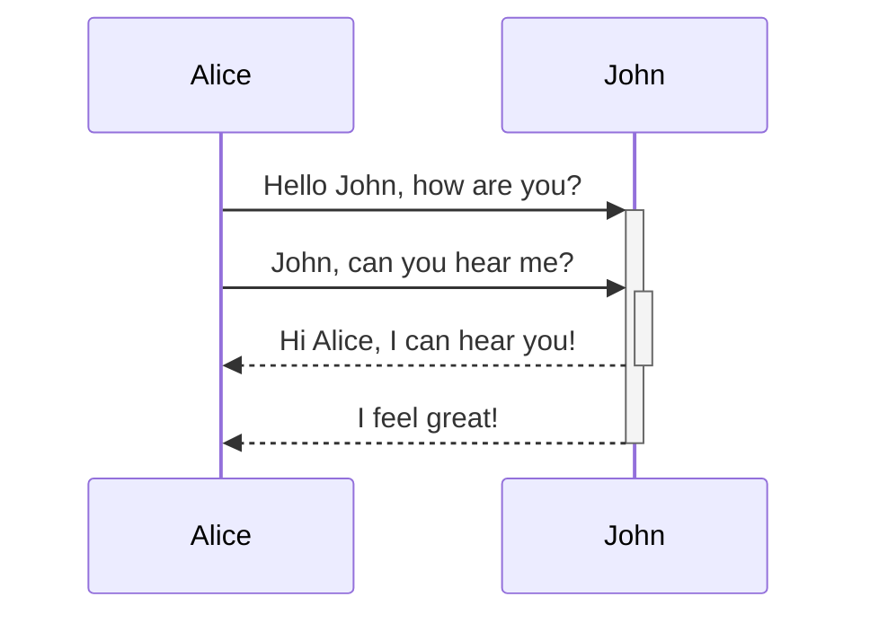
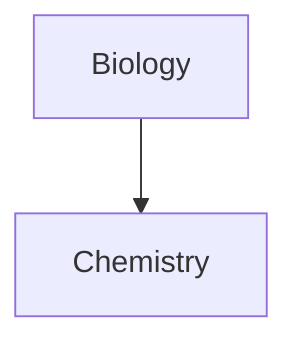

# Obsidian Complete Documentation

Downloaded from: https://help.obsidian.md/
Date: 2025-10-27 11:40:50
Total pages: 167

## Table of Contents

- [2-factor authentication](#2fa)
- [HTML content](#editing+and+formatting-html+content)
- [Example](#example)
- [Obsidian URI](#extending+obsidian-obsidian+uri)
- [Home](#home)
- [Live preview update](#live+preview+update)
- [Version history](#obsidian+sync-version+history)
- [Advanced formatting syntax](#advanced-syntax)
- [Aliases](#aliases)
- [Android app](#android)
- [Appearance](#appearance)
- [Attachments](#attachments)
- [Back up your Obsidian files](#backup)
- [Introduction to Bases](#bases)
- [Create a base](#bases-create-base)
- [Functions](#bases-functions)
- [Bases roadmap](#bases-roadmap)
- [Bases syntax](#bases-syntax)
- [Views](#bases-views)
- [Cards view](#bases-views-cards)
- [List view](#bases-views-list)
- [Map view](#bases-views-map)
- [Table view](#bases-views-table)
- [Callouts](#callouts)
- [Catalyst license](#catalyst)
- [Community code of conduct](#community-code-of-conduct)
- [Community plugins](#community-plugins)
- [Configuration folder](#configuration-folder)
- [Create your first note](#create-note)
- [Obsidian Credit](#credit)
- [Credits](#credits)
- [How Obsidian stores data](#data-storage)
- [Developers](#developers)
- [Education and non-profit discount](#discounts)
- [Drag and drop](#drag-and-drop)
- [Early access versions](#early-access)
- [Views and editing mode](#edit-and-read)
- [Editing shortcuts](#editing-shortcuts)
- [Embed web pages](#embed-web-pages)
- [Embed files](#embeds)
- [Accepted file formats](#file-formats)
- [Financial contributions](#financial-contributions)
- [Folding](#folding)
- [Glossary](#glossary)
- [Home](#home)
- [Hotkeys](#hotkeys)
- [Import notes](#import)
- [Import from Apple Notes](#import-apple-notes)
- [Import from Bear](#import-bear)
- [Import from Craft](#import-craft)
- [Import from Evernote](#import-evernote)
- [Import from Google Keep](#import-google-keep)
- [Import HTML files](#import-html)
- [Import Markdown files](#import-markdown)
- [Import from Notion](#import-notion)
- [Import from Microsoft OneNote](#import-onenote)
- [Import from Roam Research](#import-roam)
- [Import Textbundle files](#import-textbundle)
- [Import Zettelkasten notes](#import-zettelkasten)
- [Download and install Obsidian](#install)
- [iOS app](#ios)
- [Language settings](#language)
- [Link notes](#link-notes)
- [Internal links](#links)
- [Manage notes](#manage-notes)
- [Manage vaults](#manage-vaults)
- [Use the mobile app](#mobile)
- [Multiple cursors](#multiple-cursors)
- [Obsidian](#obsidian)
- [Obsidian Flavored Markdown](#obsidian-flavored-markdown)
- [Official website](#official-site)
- [Introduction to licenses and payment](#payment)
- [Plugin security](#plugin-security)
- [Core plugins](#plugins)
- [Audio recorder](#plugins-audio-recorder)
- [Backlinks](#plugins-backlinks)
- [Bookmarks](#plugins-bookmarks)
- [Canvas](#plugins-canvas)
- [Command palette](#plugins-command-palette)
- [Daily notes](#plugins-daily-notes)
- [File explorer](#plugins-file-explorer)
- [File recovery](#plugins-file-recovery)
- [Format converter](#plugins-format-converter)
- [Graph view](#plugins-graph)
- [Importer](#plugins-importer)
- [Note composer](#plugins-note-composer)
- [Outgoing links](#plugins-outgoing-links)
- [Outline](#plugins-outline)
- [Page preview](#plugins-page-preview)
- [Properties view](#plugins-properties)
- [Quick switcher](#plugins-quick-switcher)
- [Random note](#plugins-random-note)
- [Search](#plugins-search)
- [Slash commands](#plugins-slash-commands)
- [Slides](#plugins-slides)
- [Tags view](#plugins-tags)
- [Templates](#plugins-templates)
- [Unique note creator](#plugins-unique-note)
- [Web viewer](#plugins-web-viewer)
- [Word count](#plugins-word-count)
- [Workspaces](#plugins-workspaces)
- [Pop-out windows](#pop-out-windows)
- [Properties](#properties)
- [Introduction to Obsidian Publish](#publish)
- [Analytics](#publish-analytics)
- [Collaborate on a Publish site](#publish-collaborate)
- [Customize your site](#publish-customize)
- [Custom domains](#publish-domains)
- [Publish limitations](#publish-limitations)
- [Media files](#publish-media)
- [Permalinks](#publish-permalinks)
- [Publish your content](#publish-publish)
- [Security and privacy](#publish-security)
- [SEO](#publish-seo)
- [Set up Obsidian Publish](#publish-setup)
- [Manage sites](#publish-sites)
- [Social media link previews](#publish-social-share)
- [Troubleshoot Obsidian Publish](#publish-troubleshoot)
- [Refund policy](#refunds)
- [Help and support](#resources)
- [Ribbon](#ribbon)
- [Obsidian Help](#rss.xml)
- [Sales tax](#sales-tax)
- [Sandbox vault](#sandbox)
- [Sidebar](#sidebar)
- [sitemap.xml](#sitemap.xml)
- [CSS snippets](#snippets)
- [Status bar](#status-bar)
- [Style guide](#style-guide)
- [Symbolic links and junctions](#symlinks)
- [Introduction to Obsidian Sync](#sync)
- [Sync your notes across devices](#sync-notes)
- [Collaborate on a shared vault](#sync-collaborate)
- [Frequently asked questions](#sync-faq)
- [Status icon and messages](#sync-messages)
- [Upgrade Sync encryption](#sync-migrate)
- [Plans and storage limits](#sync-plans)
- [Sync regions](#sync-region)
- [Security and privacy](#sync-security)
- [Sync settings and selective syncing](#sync-settings)
- [Set up Obsidian Sync](#sync-setup)
- [Switch to Obsidian Sync](#sync-switch)
- [Troubleshoot Obsidian Sync](#sync-troubleshoot)
- [Local and remote vaults](#sync-vault-types)
- [Basic formatting syntax](#syntax)
- [Tabs](#tabs)
- [Tags](#tags)
- [Obsidian for teams](#teams)
- [Deploy Obsidian across your team](#teams-deploy)
- [Commercial license](#teams-license)
- [Publishing for teams](#teams-publish)
- [Security considerations for teams](#teams-security)
- [Syncing for teams](#teams-sync)
- [Themes](#themes)
- [Translations](#translations)
- [Update Obsidian](#updates)
- [Create a vault](#vault)
- [Introduction to Obsidian Web Clipper](#web-clipper)
- [Clip web pages](#web-clipper-capture)
- [Filters](#web-clipper-filters)
- [Highlight web pages](#web-clipper-highlight)
- [Interpret web pages](#web-clipper-interpreter)
- [Templates](#web-clipper-templates)
- [Troubleshoot Web Clipper](#web-clipper-troubleshoot)
- [Variables](#web-clipper-variables)
- [Workspace](#workspace)

---

## 2-factor authentication {#2fa}

**Source URL:** https://help.obsidian.md/2fa

[](https://help.obsidian.md/Home)[Obsidian Help](https://help.obsidian.md/Home)
Getting started
Import notes
User interface
Editing and formatting
Linking notes and files
Files and folders
Plugins
Bases
Obsidian Publish
Obsidian Sync
Obsidian Web Clipper
Extending Obsidian
Contributing to Obsidian
Licenses and payment
Teams
Obsidian
[2-factor authentication](https://help.obsidian.md/2fa)
[Android app](https://help.obsidian.md/android)
[Community code of conduct](https://help.obsidian.md/community-code-of-conduct)
[Credits](https://help.obsidian.md/credits)
[Early access versions](https://help.obsidian.md/early-access)
[iOS app](https://help.obsidian.md/ios)
[Obsidian](https://help.obsidian.md/obsidian)
[Official website](https://help.obsidian.md/official-site)
[Help and support](https://help.obsidian.md/resources)
[Home](https://help.obsidian.md/)
[](https://help.obsidian.md/Home)[Obsidian Help](https://help.obsidian.md/Home)
# 2-factor authentication
```
aliases:
  - 2FA
  - Recovery codes
permalink: 2fa
```

If you have an [Obsidian account](https://obsidian.md/account) you can enable two-factor authentication (2FA) to protect your account with a second verification step.
  * Log into [your Obsidian account](https://obsidian.md/account/profile) from your web browser.
  * In the **Profile** section, go to **2-factor authentication** and select **Enable**.
  * A popup window will appear to prompt you to connect an authenticator app with either a **QR code** or a **setup key**.


Popular authentication applications
  * [Authy](https://authy.com)
  * [Google Authenticator](https://play.google.com/store/apps/details?id=com.google.android.apps.authenticator2)
  * [Microsoft Authenticator](https://www.microsoft.com/en-us/security/mobile-authenticator-app)
  * [iCloud Keychain](https://support.apple.com/en-gb/guide/iphone/ipha6173c19f/ios)


  * Once connected, your authenticator app will provide you a six digit code. Enter that code below the **QR code/setup key** section, in step 3.
  * Finally, enter your current password.
  * Select **Complete set up**.
  * The popup window will be replaced with a confirmation window and your recovery codes. Please download your recovery codes, as you will need these to unlock your account.


Your 2FA is now set up.
QR code/setup key backups
If you decide to keep a backup of your **QR code** or **Setup key** in addition to your recovery codes, we strongly recommend keeping it in a password encrypted system.
If you enabled 2FA before recovery codes were available, or if you want to refresh your recovery codes, follow these steps:
  * Log into [your Obsidian account](https://obsidian.md/account/profile) from your web browser.
  * Next to 2-factor authentication, select **Refresh recovery codes**.
  * In the popup window, enter your **password** and **6-digit authenticator code**.
  *     * **Copy recovery codes** : Copy the codes to paste elsewhere.
    * **Download recovery codes** : Download a `obsidian-recovery-codes.txt` file containing your codes.
  * Select **Got it** to close the popup window.


You can use a recovery code **once** instead of your **6-digit authenticator code**. You can also refresh your recovery codes at any time.
  * Log into [your Obsidian account](https://obsidian.md/account/profile) from your web browser.
  * In the **Profile** section, go to **2-factor authentication** and select **Disable**.
  * Enter your Obsidian Password.
  * Enter the current six digit code from your authentication app.
  * Select **Disable 2FA**.
  * You will be brought back to the Account management screen.


The **2-factor authentication** setting will once again show an **Enable** button, indicating that 2FA has been disabled.
**I have enabled 2FA. Will I be logged out of my current Obsidian devices?**  
No. Enabling 2FA does not log you out everywhere for your convenience. If you need to, you can manually do that from your account page, and subsequently login again on each of your devices.
**I enabled, then disabled 2FA. I would like to set it up again. Can I use the original QR code or setup key?**  
No. You will be provided a new **QR code** and new **Setup key** every time you initiate a new setup of 2FA.
**I have enabled 2FA. I have yet to be asked for it after several log-out/log-in attempts. Is this working?**  
Your browser cache may be allowing you to appear as if you are making changes to the page (such as logging in or out) when in actuality you are accessing the stored data. Try using a private browsing window to log-in to confirm 2FA is working.
If you continue to experience this behavior, please [submit a bug report](https://forum.obsidian.md/c/bug-reports/7).
**I lost my recovery codes, authenticator, and everything needed to log into my account. What do I do?**
If you've lost your recovery codes and authenticator, please email support@obsidian.md for assistance in regaining access to your account.
2-factor authentication
Not found
This page does not exist
Interactive graph
On this page
Enable 2FA
Generate recovery codes
Disable 2FA
FAQ
[Powered by Obsidian Publish](https://publish.obsidian.md)


---

## HTML content {#editing+and+formatting-html+content}

**Source URL:** https://help.obsidian.md/Editing+and+formatting/HTML+content

[](https://help.obsidian.md/Home)[Obsidian Help](https://help.obsidian.md/Home)
Getting started
Import notes
User interface
Editing and formatting
[Basic formatting syntax](https://help.obsidian.md/syntax)
[Advanced formatting syntax](https://help.obsidian.md/advanced-syntax)
[Obsidian Flavored Markdown](https://help.obsidian.md/obsidian-flavored-markdown)
[Tags](https://help.obsidian.md/tags)
[Attachments](https://help.obsidian.md/attachments)
[Callouts](https://help.obsidian.md/callouts)
[Folding](https://help.obsidian.md/folding)
[Multiple cursors](https://help.obsidian.md/multiple-cursors)
[Properties](https://help.obsidian.md/properties)
[Views and editing mode](https://help.obsidian.md/edit-and-read)
[Editing shortcuts](https://help.obsidian.md/editing-shortcuts)
[Embed web pages](https://help.obsidian.md/embed-web-pages)
[HTML content](https://help.obsidian.md/Editing+and+formatting/HTML+content)
Linking notes and files
Files and folders
Plugins
Bases
Obsidian Publish
Obsidian Sync
Obsidian Web Clipper
Extending Obsidian
Contributing to Obsidian
Licenses and payment
Teams
Obsidian
[Help and support](https://help.obsidian.md/resources)
[Home](https://help.obsidian.md/)
[](https://help.obsidian.md/Home)[Obsidian Help](https://help.obsidian.md/Home)
# HTML content
```
aliases:
  - Advanced topics/HTML sanitization
  - Editing and formatting/Using HTML
```

Obsidian supports HTML to allow you to display your notes the way you want, or even [embed web pages](https://help.obsidian.md/embed-web-pages). Allowing HTML inside your notes comes with risks. To prevent malicious code from doing harm, Obsidian _sanitizes_ any HTML in your notes. 
Example
The `<script>` element normally lets you run JavaScript whenever it loads. If Obsidian didn't sanitize HTML, an attacker could convince you to paste a text containing JavaScript that extracts sensitive information from your computer and sends it back to them.
That said, since Markdown syntax does not support all forms of styling, using sanitized HTML can be yet another way of enhancing the quality of your notes. We've included some of the more common usages of HTML. 
More details on using `<iframe>` can be found in [Embed web pages](https://help.obsidian.md/embed-web-pages).
[Markdown comments](https://help.obsidian.md/syntax#Comments) are the preferred way of adding hidden comments within your notes. However some methods of converting Markdown notes, such as [Pandoc](https://pandoc.org), have limited support of Markdown comments. In those instances, you can use a `<!-- HTML Comment -->` instead!
If you need to quickly underline an item in your notes, you can use `<u>Example</u>` to create _your underlined text_.
Span and div tags can be used to apply custom classes from a [CSS snippet](https://help.obsidian.md/snippets), or custom defined styling, onto a selected area of text. For example, using `<span style="font-family: cursive">your text</span>` can allow you to quickly change your font.
Need to strike ~~some text~~? Use `<s>this</s>` to strike it out.
HTML content
Not found
This page does not exist
Interactive graph
On this page
Comments
Underline
Span/Div
Strikethrough
[Powered by Obsidian Publish](https://publish.obsidian.md)


---

## Example {#example}

**Source URL:** https://help.obsidian.md/Example

[](https://help.obsidian.md/Home)[Obsidian Help](https://help.obsidian.md/Home)
Getting started
Import notes
User interface
Editing and formatting
Linking notes and files
Files and folders
Plugins
Bases
Obsidian Publish
Obsidian Sync
Obsidian Web Clipper
Extending Obsidian
Contributing to Obsidian
Licenses and payment
Teams
Obsidian
[Help and support](https://help.obsidian.md/resources)
[Home](https://help.obsidian.md/)
[](https://help.obsidian.md/Home)[Obsidian Help](https://help.obsidian.md/Home)
Not found
This page does not exist
Interactive graph
On this page
[Powered by Obsidian Publish](https://publish.obsidian.md)


---

## Obsidian URI {#extending+obsidian-obsidian+uri}

**Source URL:** https://help.obsidian.md/Extending+Obsidian/Obsidian+URI

[](https://help.obsidian.md/Home)[Obsidian Help](https://help.obsidian.md/Home)
Getting started
Import notes
User interface
Editing and formatting
Linking notes and files
Files and folders
Plugins
Bases
Obsidian Publish
Obsidian Sync
Obsidian Web Clipper
Extending Obsidian
[Community plugins](https://help.obsidian.md/community-plugins)
[Themes](https://help.obsidian.md/themes)
[CSS snippets](https://help.obsidian.md/snippets)
[Plugin security](https://help.obsidian.md/plugin-security)
[Obsidian URI](https://help.obsidian.md/Extending+Obsidian/Obsidian+URI)
Contributing to Obsidian
Licenses and payment
Teams
Obsidian
[Help and support](https://help.obsidian.md/resources)
[Home](https://help.obsidian.md/)
[](https://help.obsidian.md/Home)[Obsidian Help](https://help.obsidian.md/Home)
# Obsidian URI
```
aliases:
  - Using Obsidian URI
  - Advanced topics/Using obsidian URI
  - Concepts/Obsidian URI
```

Obsidian URI is a custom URI protocol supported by Obsidian that lets you trigger various actions, such as opening a note or creating a note. Obsidian URI enables automation and cross-app workflows.
Obsidian URIs use the following format:
```
obsidian://action?param1=value&param2=value

```

The `action` parameter is the action that you would like to perform. Available actions include:
  * `open` to open a note.
  * `new` to create or add to an existing note.
  * `daily` to create or open your daily note.
  * `search` to open a search.


Encoding
Ensure that your values are properly URI encoded. For example, forward slash characters `/` must be encoded as `%2F` and space characters must be encoded as `%20`.
This is especially important because an improperly encoded "reserved" character may break the interpretation of the URI. [See here for details](https://en.wikipedia.org/wiki/Percent-encoding).
The `open` action opens an Obsidian vault, or opens a file within that vault.
  * `obsidian://open?vault=my%20vault`  
This opens the vault `my vault`. If the vault is already open, focus on the window.
  * `obsidian://open?vault=ef6ca3e3b524d22f`  
This opens the vault identified by the ID `ef6ca3e3b524d22f`.
  * `obsidian://open?vault=my%20vault&file=my%20note`  
This opens the note `my note.md` in the vault `my vault`, assuming the file exists.
  * `obsidian://open?path=%2Fhome%2Fuser%2Fmy%20vault%2Fpath%2Fto%2Fmy%20note`  
This will look for any vault that contains the path `/home/user/my vault/path/to/my note`. Then, the rest of the path is passed to the `file` parameter. For example, if a vault exists at `/home/user/my vault`, then this would be equivalent to `file` parameter set to `path/to/my note`.


Open a heading or block
With proper URI encoding, you can navigate to a heading or block within a note. `Note%23Heading` would navigate to the heading called "Heading", whereas `Note%23%5EBlock` would navigate to the block called "Block".
  * `vault` can be either the vault name or the vault ID[[1]](https://help.obsidian.md/Extending+Obsidian/Obsidian+URI#fn-1-82eaf6b8fcb7e1fb).
  * `file` can be either a file name, or a path from the vault root to the specified file. If the file extension is `md`, the extension can be omitted.
  * `path` an absolute file system path to a file. 
    * Using this parameter will override both `vault` and `file`.
    * This will cause the app to search for the most specific vault which contains the specified file path.
    * Then the rest of the path replaces the `file` parameter.
  * `prepend` will add to the top of the file and attempt to merge properties.
  * `append` will add to the end of the file and also attempt to merge properties.


The `new` action, creates a new note in the vault, optionally with some content.
  * `obsidian://new?vault=my%20vault&name=my%20note`  
This opens the vault `my vault`, and creates a new note called `my note`.
  * `obsidian://new?vault=my%20vault&file=path%2Fto%2Fmy%20note`  
This opens the vault `my vault`, and creates a new note at `path/to/my note`.


  * `vault` can be either the vault name, or the vault ID[[1-1]](https://help.obsidian.md/Extending+Obsidian/Obsidian+URI#fn-1-82eaf6b8fcb7e1fb). Same as action `open`.
  * `name` the file name to be created. If this is specified, the file location will be chosen based on your "Default location for new notes" preferences.
  * `file` a vault absolute path, including the name. Will override `name` if specified.
  * `path` a globally absolute path. Works similar to the `path` option in the `open` action, which will override both `vault` and `file`.
  * `content` (optional) the contents of the note.
  * `clipboard` (optional) use of the contents of the clipboard instead of specifying `content`.
  * `silent` (optional) include this parameter if you don't want to open the new note.
  * `append` (optional) include this parameter to append to an existing file if one exists.
  * `overwrite` (optional) overwrite an existing file if one exists, but only if `append` isn't set.
  * `x-success` (optional) see [Use x-callback-url parameters](https://help.obsidian.md/Extending+Obsidian/Obsidian+URI#Use%20x-callback-url%20parameters).


The `daily` action creates or opens your daily note. The [Daily notes](https://help.obsidian.md/plugins/daily-notes) plugin must be enabled.
  * `obsidian://daily?vault=my%20vault`  
This opens the vault `my vault`, and creates or opens the daily note.


The `daily` action accepts the same parameters as the `new` action.
The `search` action opens [Search](https://help.obsidian.md/plugins/search) in the specified vault, and optionally perform a search term.
  * `obsidian://search?vault=my%20vault`  
This opens the vault `my vault`, and opens [Search](https://help.obsidian.md/plugins/search).
  * `obsidian://search?vault=my%20vault&query=Obsidian`  
This opens the vault `my vault`, opens [Search](https://help.obsidian.md/plugins/search), and performs a search for `Obsidian`.


  * `vault` can be either the vault name, or the vault ID[[1-2]](https://help.obsidian.md/Extending+Obsidian/Obsidian+URI#fn-1-82eaf6b8fcb7e1fb). Same as action `open`.
  * `query` (optional) The search term to perform.


This Obsidian URI action is to be used with [Hook](https://hookproductivity.com/). 
`obsidian://hook-get-address`
  * `vault` (optional) can be either the vault name, or the vault ID[[1-3]](https://help.obsidian.md/Extending+Obsidian/Obsidian+URI#fn-1-82eaf6b8fcb7e1fb). If not provided, the current or last focused vault will be used.
  * `x-success` (optional) see [Use x-callback-url parameters](https://help.obsidian.md/Extending+Obsidian/Obsidian+URI#Use%20x-callback-url%20parameters).
  * `x-error` (optional) see [Use x-callback-url parameters](https://help.obsidian.md/Extending+Obsidian/Obsidian+URI#Use%20x-callback-url%20parameters).


If `x-success` is defined, this API will use it as the x-callback-url. Otherwise, it will copy a Markdown link of the current focused note to the clipboard, as an `obsidian://open` URL.
Some endpoints will accept the x-callback-url parameters `x-success` and `x-error`. When it's provided, Obsidian will provide the following to the `x-success` callback:
  * `name` the name of the file, without the file extension.
  * `url` the `obsidian://` URI for this file.
  * `file` (desktop only) the `file://` URL for this file.


For example, if Obsidian receives  
`obsidian://.....x-success=myapp://x-callback-url`, the response would be `myapp://x-callback-url?name=...&url=obsidian%3A%2F%2Fopen...&file=file%3A%2F%2F...`
In addition to the formats above, there are two more "shorthand" formats available to open vaults and files:
  1. `obsidian://vault/my vault/my note` is equivalent to `obsidian://open?vault=my%20vault&file=my%20note`.
  2. `obsidian:///absolute/path/to/my note` is equivalent to `obsidian://open?path=%2Fabsolute%2Fpath%2Fto%2Fmy%20note`.


On Windows and macOS, running the app once should be sufficient to register the Obsidian URI protocol on your computer.
On Linux, it is a much more involved process:
  1. Ensure you create a `obsidian.desktop` file. [See here for details](https://developer.gnome.org/documentation/guidelines/maintainer/integrating.html#desktop-files).
  2. Ensure that your desktop file specifies the `Exec` field as `Exec=executable %u`. The `%u` is used to pass the `obsidian://` URIs to the app.
  3. If you're using the AppImage installer, you may have to unpack it using `Obsidian-x.y.z.AppImage --appimage-extract`. Then make sure the `Exec` directive points to the unpacked executable.


* * *
  1. Vault ID is the random 16-character code assigned to the vault, for example `ef6ca3e3b524d22f`. This ID is unique per folder on your computer. The ID can be found by opening the vault switcher and clicking "Copy vault ID" in the context menu for the desired vault.[↩︎](https://help.obsidian.md/Extending+Obsidian/Obsidian+URI#fnref-1-82eaf6b8fcb7e1fb)[↩︎](https://help.obsidian.md/Extending+Obsidian/Obsidian+URI#fnref-1-1-82eaf6b8fcb7e1fb)[↩︎](https://help.obsidian.md/Extending+Obsidian/Obsidian+URI#fnref-1-2-82eaf6b8fcb7e1fb)[↩︎](https://help.obsidian.md/Extending+Obsidian/Obsidian+URI#fnref-1-3-82eaf6b8fcb7e1fb)


Links to this page
[Basic formatting syntax](https://help.obsidian.md/syntax)
[Introduction to Obsidian Web Clipper](https://help.obsidian.md/web-clipper)
[Set up Obsidian Sync](https://help.obsidian.md/sync/setup)
[Troubleshoot Web Clipper](https://help.obsidian.md/web-clipper/troubleshoot)
Obsidian URI
Not found
This page does not exist
Interactive graph
On this page
URI format
Open note
Examples
Parameters
Create note
Examples
Parameters
Create or open daily note
Examples
Parameters
Open search
Examples
Parameters
Integrate with Hook
Example
Parameters
Use x-callback-url parameters
Shorthand formats
Troubleshooting
Register Obsidian URI
[Powered by Obsidian Publish](https://publish.obsidian.md)


---

## Home {#home}

**Source URL:** https://help.obsidian.md/Home

[](https://help.obsidian.md/Home)[Obsidian Help](https://help.obsidian.md/Home)
Getting started
Import notes
User interface
Editing and formatting
Linking notes and files
Files and folders
Plugins
Bases
Obsidian Publish
Obsidian Sync
Obsidian Web Clipper
Extending Obsidian
Contributing to Obsidian
Licenses and payment
Teams
Obsidian
[Help and support](https://help.obsidian.md/resources)
[Home](https://help.obsidian.md/)
[](https://help.obsidian.md/Home)[Obsidian Help](https://help.obsidian.md/Home)
# Home
```
aliases:
  - Start here
  - Obsidian/Index
cssclasses:
  - list-cards
  - hide-title
  - list-cards-mobile-full
permalink: /
```

Welcome to the official Obsidian Help site, where you can find tips and guides on how to use [Obsidian](https://obsidian.md). For API documentation visit the [Obsidian Developer Docs](https://docs.obsidian.md/).
You can browse this site in several languages:
English العربية Dansk Español Italiano 日本語 Phéasa Khmêr 한국어 Português Русский Tiếng Việt 中文
Learn the basics of note-taking with Obsidian:
  1. [Download and install Obsidian](https://help.obsidian.md/install)
  2. [Create a vault](https://help.obsidian.md/vault)
  3. [Create your first note](https://help.obsidian.md/create-note)
  4. [Link notes](https://help.obsidian.md/link-notes)
  5. [Import notes](https://help.obsidian.md/import)
  6. [Sync your notes across devices](https://help.obsidian.md/sync-notes)


With thousands of plugins and themes, you can shape Obsidian to fit your way of thinking.
  * [Core plugins](https://help.obsidian.md/plugins)
    * Choose which built-in features of Obsidian you want to turn on or off.
  * [Community plugins](https://help.obsidian.md/community-plugins)
    * Enable more workflows and capabilities with features built by Obsidian users.
  * [Themes](https://help.obsidian.md/themes)
    * Customize the look and feel of Obsidian with community-made color schemes.
  * [CSS snippets](https://help.obsidian.md/snippets)
    * Make small changes to the interface on top of your Obsidian theme.
  * [Web Clipper](https://help.obsidian.md/web-clipper)
    * Highlight web pages and save content to Obsidian using our browser extension.


  * [Obsidian Sync](https://help.obsidian.md/sync)
    * A safe and secure way to synchronize your notes across any device and OS.
  * [Obsidian Publish](https://help.obsidian.md/publish)
    * Publish your notes as a wiki, knowledge base, documentation, or digital garden.


If you find any mistakes or missing information on this site, you can contribute improvements and translations via [the GitHub repo](https://github.com/obsidianmd/obsidian-docs/).
If you want to contribute to Obsidian financially, consider a [Catalyst license](https://help.obsidian.md/catalyst) which offers early access to beta versions, or a [Commercial license](https://help.obsidian.md/teams/license) to show your organization's support.
See the [Credits](https://help.obsidian.md/credits) to get to know all the amazing people who make Obsidian possible.
Home
Not found
This page does not exist
Interactive graph
On this page
Obsidian Help
Get started
Extend Obsidian
Add-on services
Contribute
[Powered by Obsidian Publish](https://publish.obsidian.md)


---

## Live preview update {#live+preview+update}

**Source URL:** https://help.obsidian.md/Live+preview+update

[](https://help.obsidian.md/Home)[Obsidian Help](https://help.obsidian.md/Home)
Getting started
Import notes
User interface
Editing and formatting
Linking notes and files
Files and folders
Plugins
Bases
Obsidian Publish
Obsidian Sync
Obsidian Web Clipper
Extending Obsidian
Contributing to Obsidian
Licenses and payment
Teams
Obsidian
[Help and support](https://help.obsidian.md/resources)
[Home](https://help.obsidian.md/)
[](https://help.obsidian.md/Home)[Obsidian Help](https://help.obsidian.md/Home)
# Live preview update
Live preview update
Not found
This page does not exist
Interactive graph
On this page
Edit notes using Live Preview or Source mode
Wait, I'm not ready to switch!
[Powered by Obsidian Publish](https://publish.obsidian.md)


---

## Version history {#obsidian+sync-version+history}

**Source URL:** https://help.obsidian.md/Obsidian+Sync/Version+history

[](https://help.obsidian.md/Home)[Obsidian Help](https://help.obsidian.md/Home)
Getting started
Import notes
User interface
Editing and formatting
Linking notes and files
Files and folders
Plugins
Bases
Obsidian Publish
Obsidian Sync
[Introduction to Obsidian Sync](https://help.obsidian.md/sync)
[Local and remote vaults](https://help.obsidian.md/sync/vault-types)
[Set up Obsidian Sync](https://help.obsidian.md/sync/setup)
[Switch to Obsidian Sync](https://help.obsidian.md/sync/switch)
[Sync settings and selective syncing](https://help.obsidian.md/sync/settings)
[Version history](https://help.obsidian.md/Obsidian+Sync/Version+history)
[Status icon and messages](https://help.obsidian.md/sync/messages)
[Plans and storage limits](https://help.obsidian.md/sync/plans)
[Security and privacy](https://help.obsidian.md/sync/security)
[Collaborate on a shared vault](https://help.obsidian.md/sync/collaborate)
[Troubleshoot Obsidian Sync](https://help.obsidian.md/sync/troubleshoot)
[Frequently asked questions](https://help.obsidian.md/sync/faq)
[Sync regions](https://help.obsidian.md/sync/region)
[Upgrade Sync encryption](https://help.obsidian.md/sync/migrate)
Obsidian Web Clipper
Extending Obsidian
Contributing to Obsidian
Licenses and payment
Teams
Obsidian
[Help and support](https://help.obsidian.md/resources)
[Home](https://help.obsidian.md/)
[](https://help.obsidian.md/Home)[Obsidian Help](https://help.obsidian.md/Home)
# Version history
```
aliases:
  - Sync history
  - Sync Sidebar
cssclasses:
  - soft-embed
description: Obsidian Sync keeps a record of all changes made to your notes and regularly checks for updates and creates new versions of your notes.
mobile: true
publish: true
```

[Obsidian Sync](https://help.obsidian.md/sync) regularly checks for updates to your [synced files](https://help.obsidian.md/sync/settings), keeping a record of any changes. These are stored as new entries in the [Version history](https://help.obsidian.md/Obsidian+Sync/Version+history#Version%20history). This information can be accessed in a few ways:
  * [Sync history](https://help.obsidian.md/Obsidian+Sync/Version+history#Sync%20history)
  * [Version history](https://help.obsidian.md/Obsidian+Sync/Version+history#Version%20history)


While not part of Obsidian Sync, a local version history is also available on each device if the [File recovery](https://help.obsidian.md/plugins/file-recovery) plugin is enabled.
The Sync history (or Sync sidebar) feature, introduced in Obsidian version 1.7, allows you to quickly view recently created or modified notes and attachments that have been synced. You can also think of it as an  _editing_ history.
In the sidebar, you can select an item to open its file in your active window. The items also have context menus, allowing you to perform actions such as moving the file or viewing its [Version history](https://help.obsidian.md/Obsidian+Sync/Version+history#Notes%20and%20attachments).
Desktop-only feature
When you hover over a synced file in the sidebar, you can see who last edited the file. This is especially useful if you are [collaborating](https://help.obsidian.md/sync/collaborate) on a shared vault.
Tip
Settings and deleted items will not appear in the Sync history sidebar. These can be found in the [Version history](https://help.obsidian.md/Obsidian+Sync/Version+history#Notes%20and%20attachments) instead.
When you enable the [Sync](https://help.obsidian.md/sync) core plugin, Sync history is automatically enabled but does not appear in the sidebar by default. You will need to manually add it using a command or a hotkey.
This option requires the [Command palette](https://help.obsidian.md/plugins/command-palette) core plugin to be enabled.
**Desktop/Tablet** 
  1. Open the **Command palette**. (  )
  2. Type "Sync".
  3. Select the "Sync: Show Sync history" option.


Sync history will then appear in the [right sidebar](https://help.obsidian.md/sidebar).
**Mobile** 
  1. Open the [Ribbon](https://help.obsidian.md/ribbon) (  ).
  2. Open the **Command palette**. (  )
  3. Type "Sync".
  4. Select the "Sync: Show Sync history" option.


Sync history will then appear as a dropdown option in the [right sidebar](https://help.obsidian.md/sidebar).
  1. Open **Settings**.
  2. In the **Options** category, select **Hotkeys**.
  3. In the hotkeys search bar, type "Sync".
  4. Next to "Sync: Show Sync history," assign your preferred hotkey.


In addition to the [Sync history](https://help.obsidian.md/Obsidian+Sync/Version+history#Sync%20history), Obsidian also maintains a version history for restoring notes and attachments. If you accidentally delete a note or want to revert to a previous version, you can restore it from the version history.
The retention period for your version history depends on your [Obsidian Sync plan](https://help.obsidian.md/sync/plans). On the Standard plan, notes are retained for 1 month, while on the Plus plan, they are kept for 12 months. After this period, older versions of your notes are deleted. 
For [attachments](https://help.obsidian.md/attachments), older versions are stored for _two weeks_.

The process for restoring both notes and attachments is the same. 
**Desktop/Tablet** 
  1. In the **File explorer** , select the note you want to restore.
  2. Select **Open version history**.
  3. Select the version of the note you want to view on the left. The contents will be displayed on the right. 


**Mobile** 
  1. In the **File explorer** , select the note you want to restore.
  2. Long press to bring up the context menu.
  3. Select **Open version history**.
  4. In the pop-up menu, select the version of the note you want to view. 
  5. Once selected, the contents of the note will be available to review.


  1. Open **Settings**.
  2. In the sidebar, under **Core plugins*** , select **Sync**.
  3. Next to **Deleted files** , select **View**.
  4. Select the note you want to view the version history for.
  5. In the version history pop-up, select the version of the note you want to view on the left. 


**Desktop/Tablet** 
  1. In the **File explorer** , select the note you want to restore.
  2. Select **Open version history**.
  3. Select the version of the note you want to restore on the left. The contents will be displayed on the right.
  4. Select the **Restore** button.
  5. The note contents will be replaced with the restored version.


**Mobile** 
  1. In the **File explorer** , select the note you want to restore.
  2. Long press to bring up the context menu.
  3. Select **Open version history**.
  4. In the pop-up menu, select the version of the note you want to restore.
  5. Once selected, the contents of the note will be available to review.
  6. Select the **Restore** button.
  7. The note contents will be replaced with the restored version.


  1. Open **Settings**.
  2. In the sidebar, under **Core plugins*** , select **Sync**.
  3. Next to **Deleted files** , select **View**.
  4. Choose the note you want to restore.
  5. In the list of versions to the left, select the version you want to restore.
  6. Select the **Restore** button on the right.
  7. The note will be restored to its original location in the filesystem.


You can select multiple notes with **bulk restore** by selecting the checkboxes, or using `shift+click`. These files will not be able to be reviewed in this menu. 
Obsidian Sync also keeps track of the changes made to your vault configuration settings. 
  1. Open **Settings**.
  2. In the sidebar, under **Core plugins*** , select **Sync**.
  3. Navigate down to **Vault configuration sync**. 
  4. Select the **View** button next to **Settings version history**.
  5. In the **Settings File** pop-up, choose a settings file you want to view. 


  1. Open **Settings**.
  2. In the sidebar, under **Core plugins** , select **Sync**.
  3. Navigate down to **Vault configuration sync**. 
  4. Select the **View** button next to **Settings version history**.
  5. In the **Settings File** pop-up, choose a settings file you want to view. 
  6. In the changes window, select the **Restore** button.
  7. Reload or restart Obsidian to have the setting take effect. For more details, refer to the instructions in [Adjust Obsidian Sync settings](https://help.obsidian.md/sync/setup#Adjust%20Obsidian%20Sync%20settings).


Version history
Not found
This page does not exist
Interactive graph
On this page
Sync history
Show Sync history
Enable via Command palette
Enable via Hotkey
Version history
Notes and attachments
View version history of a file
View version history of a deleted or renamed file
Restore a previous version of a file
Restore a deleted file
Settings history
View version history of a setting
Restore a previous version of a setting
[Powered by Obsidian Publish](https://publish.obsidian.md)


---

## Advanced formatting syntax {#advanced-syntax}

**Source URL:** https://help.obsidian.md/advanced-syntax

[](https://help.obsidian.md/Home)[Obsidian Help](https://help.obsidian.md/Home)
Getting started
Import notes
User interface
Editing and formatting
[Basic formatting syntax](https://help.obsidian.md/syntax)
[Advanced formatting syntax](https://help.obsidian.md/advanced-syntax)
[Obsidian Flavored Markdown](https://help.obsidian.md/obsidian-flavored-markdown)
[Tags](https://help.obsidian.md/tags)
[Attachments](https://help.obsidian.md/attachments)
[Callouts](https://help.obsidian.md/callouts)
[Folding](https://help.obsidian.md/folding)
[Multiple cursors](https://help.obsidian.md/multiple-cursors)
[Properties](https://help.obsidian.md/properties)
[Views and editing mode](https://help.obsidian.md/edit-and-read)
[Editing shortcuts](https://help.obsidian.md/editing-shortcuts)
[Embed web pages](https://help.obsidian.md/embed-web-pages)
[HTML content](https://help.obsidian.md/Editing+and+formatting/HTML+content)
Linking notes and files
Files and folders
Plugins
Bases
Obsidian Publish
Obsidian Sync
Obsidian Web Clipper
Extending Obsidian
Contributing to Obsidian
Licenses and payment
Teams
Obsidian
[Help and support](https://help.obsidian.md/resources)
[Home](https://help.obsidian.md/)
[](https://help.obsidian.md/Home)[Obsidian Help](https://help.obsidian.md/Home)
# Advanced formatting syntax
```
aliases:
  - Advanced Markdown
permalink: advanced-syntax
```

Learn how to add advanced formatting syntax to your notes.
You can create tables using vertical bars (`|`) to separate columns and hyphens (`-`) to define headers. Here's an example:
```
| First name | Last name |
| ---------- | --------- |
| Max        | Planck    |
| Marie      | Curie     |

```

First name | Last name  
---|---  
Max | Planck  
Marie | Curie  
While the vertical bars on either side of the table are optional, including them is recommended for readability.
In  _Live Preview_ , you can right-click a table to add or delete columns and rows. You can also sort and move them using the context menu.
You can insert a table using the **Insert Table** command from the [Command Palette](https://help.obsidian.md/plugins/command-palette) or by right-clicking and selecting  _Insert → Table_. This will give you a basic, editable table:
```
|     |     |
| --- | --- |
|     |     |

```

Note that cells don't need perfect alignment, but the header row must contain at least two hyphens:
```
First name | Last name
-- | --
Max | Planck
Marie | Curie

```

You can use [basic formatting syntax](https://help.obsidian.md/syntax) to style content within a table.
First column | Second column  
---|---  
[Internal links](https://help.obsidian.md/links) | Link to a file _within_ your **vault**.  
[Embed files](https://help.obsidian.md/embeds) |   
Vertical bars in tables
If you want to use [aliases](https://help.obsidian.md/aliases), or to [resize an image](https://help.obsidian.md/syntax#External%20images) in your table, you need to add a `\` before the vertical bar.
```
First column | Second column
-- | --
[[Basic formatting syntax\|Markdown syntax]] | ![[Engelbart.jpg\|200]]

```
First column | Second column  
---|---  
[Markdown syntax](https://help.obsidian.md/syntax) |   
Align text in columns by adding colons (`:`) to the header row. You can also align content in  _Live Preview_ via the context menu.
```
Left-aligned text | Center-aligned text | Right-aligned text
:-- | :--: | --:
Content | Content | Content

```

Left-aligned text | Center-aligned text | Right-aligned text  
---|---|---  
Content | Content | Content  
You can add diagrams and charts to your notes, using [Mermaid](https://mermaid-js.github.io/). Mermaid supports a range of diagrams, such as [flow charts](https://mermaid.js.org/syntax/flowchart.html), [sequence diagrams](https://mermaid.js.org/syntax/sequenceDiagram.html), and [timelines](https://mermaid.js.org/syntax/timeline.html).
Tip
You can also try Mermaid's [Live Editor](https://mermaid-js.github.io/mermaid-live-editor) to help you build diagrams before you include them in your notes.
To add a Mermaid diagram, create a `mermaid` [code block](https://help.obsidian.md/syntax#Code%20blocks).
```


```

```
sequenceDiagram
    Alice->>+John: Hello John, how are you?
    Alice->>+John: John, can you hear me?
    John-->>-Alice: Hi Alice, I can hear you!
    John-->>-Alice: I feel great!

```

```


```

```
graph TD

Biology --> Chemistry

```

You can create [internal links](https://help.obsidian.md/links) in your diagrams by attaching the `internal-link` [class](https://mermaid.js.org/syntax/flowchart.html#classes) to your nodes.
```


```

```
graph TD

Biology --> Chemistry

class Biology,Chemistry internal-link;

```

Note
Internal links from diagrams don't show up in the [Graph view](https://help.obsidian.md/plugins/graph).
If you have many nodes in your diagrams, you can use the following snippet.
```


```

This way, each letter node becomes an internal link, with the [node text](https://mermaid.js.org/syntax/flowchart.html#a-node-with-text) as the link text.
Note
If you use special characters in your note names, you need to put the note name in double quotes.
```
class "⨳ special character" internal-link

```

Or, `A["⨳ special character"]`.
For more information about creating diagrams, refer to the [official Mermaid docs](https://mermaid.js.org/intro/).
You can add math expressions to your notes using [MathJax](http://docs.mathjax.org/en/latest/basic/mathjax.html) and the LaTeX notation.
To add a MathJax expression to your note, surround it with double dollar signs (`$$`).
```
$$
\begin{vmatrix}a & b\\
c & d
\end{vmatrix}=ad-bc
$$

```

\begin{vmatrix}a & b\\\ c & d \end{vmatrix}=ad-bc
You can also inline math expressions by wrapping it in `$` symbols.
```
This is an inline math expression $e^{2i\pi} = 1$.

```

This is an inline math expression e^{2i\pi} = 1.
For more information about the syntax, refer to [MathJax basic tutorial and quick reference](https://math.meta.stackexchange.com/questions/5020/mathjax-basic-tutorial-and-quick-reference).
For a list of supported MathJax packages, refer to [The TeX/LaTeX Extension List](http://docs.mathjax.org/en/latest/input/tex/extensions/index.html).
Advanced formatting syntax
Not found
This page does not exist
Interactive graph
On this page
Tables
Format content within a table
Diagram
Linking files in a diagram
Math
[Powered by Obsidian Publish](https://publish.obsidian.md)


---

## Aliases {#aliases}

**Source URL:** https://help.obsidian.md/aliases

[](https://help.obsidian.md/Home)[Obsidian Help](https://help.obsidian.md/Home)
Getting started
Import notes
User interface
Editing and formatting
Linking notes and files
[Internal links](https://help.obsidian.md/links)
[Aliases](https://help.obsidian.md/aliases)
[Embed files](https://help.obsidian.md/embeds)
Files and folders
Plugins
Bases
Obsidian Publish
Obsidian Sync
Obsidian Web Clipper
Extending Obsidian
Contributing to Obsidian
Licenses and payment
Teams
Obsidian
[Help and support](https://help.obsidian.md/resources)
[Home](https://help.obsidian.md/)
[](https://help.obsidian.md/Home)[Obsidian Help](https://help.obsidian.md/Home)
# Aliases
```
aliases:
  - alias
  - aliases
  - How to/Add aliases to note
permalink: aliases
cssclasses:
  - soft-embed
```

If you want to reference a file using different names, consider adding _aliases_ to the note. An alias is an alternative name for a note.
Use aliases for things like acronyms, nicknames, or to refer to a note in a different language.
If you're only trying to change how a link looks in one place, see how to [Change the link display text](https://help.obsidian.md/links#Change%20the%20link%20display%20text) instead.
Tip
Use [link display text](https://help.obsidian.md/links#Change%20the%20link%20display%20text) when you want to customize how a link looks _in a specific place_. 
Use [aliases](https://help.obsidian.md/aliases) when you want to refer to the same note using _different names_ throughout your vault.  

To add an alias for a note, add `aliases` property in the note [Properties](https://help.obsidian.md/properties). Aliases should always be formatted as a list in YAML.
```
---
aliases:
  - Doggo
  - Woofer
  - Yapper
---

# Dog

```

To link to a note using an alias:
  1. Start typing the alias in an [internal link](https://help.obsidian.md/links). Any alias shows up in the list of suggestions, with a curved arrow icon next to it.
  2. Press `Enter` to select the alias.


Obsidian creates the link with the alias as its custom display text, for example `[[Artificial Intelligence|AI]]`.
Note
Rather than just using the alias as the link destination (`[[AI]]`), Obsidian uses the `[[Artificial Intelligence|AI]]` link format to ensure interoperability with other applications using the Wikilink format.
By using [Backlinks](https://help.obsidian.md/plugins/backlinks), you can find unlinked mentions of aliases.
For example, after setting "AI" as an alias for "Artificial intelligence", you can see mentions of "AI" in other notes.
If you link an unlinked mention to an alias, Obsidian turns the mention into an [internal link](https://help.obsidian.md/links) with the alias as its display text.
Aliases
Not found
This page does not exist
Interactive graph
On this page
Add an alias to a note
Link to a note using an alias
Find unlinked mentions for an alias
[Powered by Obsidian Publish](https://publish.obsidian.md)


---

## Android app {#android}

**Source URL:** https://help.obsidian.md/android

[](https://help.obsidian.md/Home)[Obsidian Help](https://help.obsidian.md/Home)
Getting started
Import notes
User interface
Editing and formatting
Linking notes and files
Files and folders
Plugins
Bases
Obsidian Publish
Obsidian Sync
Obsidian Web Clipper
Extending Obsidian
Contributing to Obsidian
Licenses and payment
Teams
Obsidian
[2-factor authentication](https://help.obsidian.md/2fa)
[Android app](https://help.obsidian.md/android)
[Community code of conduct](https://help.obsidian.md/community-code-of-conduct)
[Credits](https://help.obsidian.md/credits)
[Early access versions](https://help.obsidian.md/early-access)
[iOS app](https://help.obsidian.md/ios)
[Obsidian](https://help.obsidian.md/obsidian)
[Official website](https://help.obsidian.md/official-site)
[Help and support](https://help.obsidian.md/resources)
[Home](https://help.obsidian.md/)
[](https://help.obsidian.md/Home)[Obsidian Help](https://help.obsidian.md/Home)
# Android app
```
permalink: android
```

To Sync your notes with Obsidian on Android see [Sync your notes across devices](https://help.obsidian.md/sync-notes).
When you launch Obsidian on Android, you'll be asked to choose where your vault data should be stored. You can choose **device storage** (recommended) or **app storage**.
With the **device storage** option, your data is stored in a shared location on your device. This allows your Obsidian vault to be accessed by other apps and services, such as third-party [sync](https://help.obsidian.md/sync-notes) tools.
This is the recommended option because it offers better compatibility with sync tools and ensures your data persists even if you uninstall the app. However, this option requires additional permissions to access your device's files.
Due to limitations with Android, Obsidian will request "All files" access to function reliably. Google recommends this for apps like Obsidian which are considered "document management apps". [Learn more](https://developer.android.com/training/data-storage/manage-all-files).
The app only uses this permission to help you access your data on your device. Your data is never accessible to us. To learn more about how we protect your data and ensure your privacy, visit our [Security page](https://obsidian.md/security).
With the **app storage** option, your data is stored in Obsidian’s private app storage. This keeps your data isolated from other apps for added privacy.
This is a good option if you're not using any external sync tools and prefer tighter app-level sandboxing for your notes.
With this option you can use [Obsidian Sync](https://help.obsidian.md/sync) and third-party syncing plugins available through [Community plugins](https://help.obsidian.md/community-plugins), but you cannot use tools like Syncthing that rely on shared storage.
Uninstalling Obsidian will delete your local notes if you are using app storage
If you use the **App storage** option your local vault data will be deleted if you uninstall the app. Your Obsidian vault data on other devices will not be deleted.
Android app
Not found
This page does not exist
Interactive graph
On this page
Vault location
Device storage
App storage
[Powered by Obsidian Publish](https://publish.obsidian.md)


---

## Appearance {#appearance}

**Source URL:** https://help.obsidian.md/appearance

[](https://help.obsidian.md/Home)[Obsidian Help](https://help.obsidian.md/Home)
Getting started
Import notes
User interface
[Appearance](https://help.obsidian.md/appearance)
[Drag and drop](https://help.obsidian.md/drag-and-drop)
[Hotkeys](https://help.obsidian.md/hotkeys)
[Language settings](https://help.obsidian.md/language)
[Pop-out windows](https://help.obsidian.md/pop-out-windows)
[Ribbon](https://help.obsidian.md/ribbon)
[Sidebar](https://help.obsidian.md/sidebar)
[Status bar](https://help.obsidian.md/status-bar)
[Tabs](https://help.obsidian.md/tabs)
[Workspace](https://help.obsidian.md/workspace)
Editing and formatting
Linking notes and files
Files and folders
Plugins
Bases
Obsidian Publish
Obsidian Sync
Obsidian Web Clipper
Extending Obsidian
Contributing to Obsidian
Licenses and payment
Teams
Obsidian
[Help and support](https://help.obsidian.md/resources)
[Home](https://help.obsidian.md/)
[](https://help.obsidian.md/Home)[Obsidian Help](https://help.obsidian.md/Home)
# Appearance
```
aliases:
  - Customization/Appearance
permalink: appearance
```

Obsidian comes with two color schemes, light and dark. By default, the color scheme is set to adapt to your operating system. You can change this by going to **Settings → Appearance**.
You can change the appearance of Obsidian by using [custom themes](https://help.obsidian.md/themes). Browse hundreds of community-made themes by going to **Settings → Appearance** , then click **Manage** to view and install themes.
You can also tweak themes using [CSS snippets](https://help.obsidian.md/snippets) and [build your own theme](https://docs.obsidian.md/Themes/App+themes/Build+a+theme) .
You can change the Obsidian desktop app icon. Try the icon editor featured on [our blog](https://obsidian.md/blog/new-obsidian-icon/) to customize the icon colors to your liking.
To change the Obsidian app icon, follow these steps:
  1. Open **Settings**.
  2. Select **Appearance** on the left.
  3. Scroll down to the **Advanced** section.
  4. Under **Custom app icon** click **Choose** .
  5. Pick your desired icon from your filesystem. Accepted file formats are `.icns`, `.ico`, `.png`, and `.svg`.
  6. Click **Relaunch**.
  7. After Obsidian restarts, your new icon should appear in the taskbar on desktop and on your screen on mobile.


Custom app icon in the Windows taskbar 
For certain Windows operating systems, an extra step may be needed to adjust the custom app icon in the taskbar.
Follow these steps:
  * Right-click the Obsidian icon on your taskbar or desktop shortcut.
  * Right-click the name Obsidian (skip this step for the desktop icon).
  * Choose **Properties**.
  * Click **Change Icon**.
  * Locate the icon on your file system.
  * Click **OK**.


Afterward, you have the option to either restart `explorer.exe` within the task manager or restart your computer to apply the changes you made.
On MacOS you can make the Obsidian window translucent by enabling this option in the settings **Appearance** tab.
Windows and translucency
The Obsidian team removed translucency in Windows for version 1.15.11 due to Electron's removal of the feature.
Appearance
Not found
This page does not exist
Interactive graph
On this page
Color scheme
Custom themes
Custom app icon
Translucency
[Powered by Obsidian Publish](https://publish.obsidian.md)


---

## Attachments {#attachments}

**Source URL:** https://help.obsidian.md/attachments

[](https://help.obsidian.md/Home)[Obsidian Help](https://help.obsidian.md/Home)
Getting started
Import notes
User interface
Editing and formatting
[Basic formatting syntax](https://help.obsidian.md/syntax)
[Advanced formatting syntax](https://help.obsidian.md/advanced-syntax)
[Obsidian Flavored Markdown](https://help.obsidian.md/obsidian-flavored-markdown)
[Tags](https://help.obsidian.md/tags)
[Attachments](https://help.obsidian.md/attachments)
[Callouts](https://help.obsidian.md/callouts)
[Folding](https://help.obsidian.md/folding)
[Multiple cursors](https://help.obsidian.md/multiple-cursors)
[Properties](https://help.obsidian.md/properties)
[Views and editing mode](https://help.obsidian.md/edit-and-read)
[Editing shortcuts](https://help.obsidian.md/editing-shortcuts)
[Embed web pages](https://help.obsidian.md/embed-web-pages)
[HTML content](https://help.obsidian.md/Editing+and+formatting/HTML+content)
Linking notes and files
Files and folders
Plugins
Bases
Obsidian Publish
Obsidian Sync
Obsidian Web Clipper
Extending Obsidian
Contributing to Obsidian
Licenses and payment
Teams
Obsidian
[Help and support](https://help.obsidian.md/resources)
[Home](https://help.obsidian.md/)
[](https://help.obsidian.md/Home)[Obsidian Help](https://help.obsidian.md/Home)
# Attachments
```
aliases:
  - How to/Manage attachments
permalink: attachments
```

You can import [Accepted file formats](https://help.obsidian.md/file-formats), or _attachments_ , to your vault, such as images, audio files, or PDFs. Attachments are regular files that you can access using your file system. Attachments can be [embedded](https://help.obsidian.md/embeds).
You can add attachments to your vault in multiple ways. Only [Accepted file formats](https://help.obsidian.md/file-formats) can be added.
Copy and paste attachments
You can paste attachments directly into your notes. Obsidian creates a file with the pasted content in the default attachment location and [embeds](https://help.obsidian.md/embeds) it in the note.
Drag and drop attachments
If you drag a file from your file system into an open editor, Obsidian copies the file to the default attachment location and [embeds](https://help.obsidian.md/embeds) it in the note.
Download attachments to vault folder
You can download an attachment directly to your vault, for example if you [import from your browser](https://help.obsidian.md/import#More%20formats), or from other apps that saves files directly to your file system.
By default, attachments are added to the root of your vault.
You can change the default attachment location under **Settings → Files & Links → Default location for new attachments**.
  * **Vault folder** adds the attachment to the root of your vault.
  * **In the folder specified below** adds the attachment to a specified folder.
  * **Same folder as current file** adds the attachment to the same folder as the note you added it to.
  * **In subfolder under current folder** adds attachments to a specified folder next to the note you added the attachment to. If it doesn't exist, Obsidian creates it when you add an attachment.


Attachments
Not found
This page does not exist
Interactive graph
On this page
Add an attachment
Change default attachment location
[Powered by Obsidian Publish](https://publish.obsidian.md)


---

## Back up your Obsidian files {#backup}

**Source URL:** https://help.obsidian.md/backup

[](https://help.obsidian.md/Home)[Obsidian Help](https://help.obsidian.md/Home)
Getting started
[Download and install Obsidian](https://help.obsidian.md/install)
[Create a vault](https://help.obsidian.md/vault)
[Create your first note](https://help.obsidian.md/create-note)
[Link notes](https://help.obsidian.md/link-notes)
[Sandbox vault](https://help.obsidian.md/sandbox)
[Import notes](https://help.obsidian.md/import)
[Sync your notes across devices](https://help.obsidian.md/sync-notes)
[Back up your Obsidian files](https://help.obsidian.md/backup)
[Update Obsidian](https://help.obsidian.md/updates)
[Glossary](https://help.obsidian.md/glossary)
[Use the mobile app](https://help.obsidian.md/mobile)
Import notes
User interface
Editing and formatting
Linking notes and files
Files and folders
Plugins
Bases
Obsidian Publish
Obsidian Sync
Obsidian Web Clipper
Extending Obsidian
Contributing to Obsidian
Licenses and payment
Teams
Obsidian
[Help and support](https://help.obsidian.md/resources)
[Home](https://help.obsidian.md/)
[](https://help.obsidian.md/Home)[Obsidian Help](https://help.obsidian.md/Home)
# Back up your Obsidian files
```
aliases:
  - Obsidian Sync/Obsidian Sync and third-party services
  - Obsidian Sync/Back up your vault
  - backup
permalink: backup
```

If you haven't backed up your computer yet, start now! Obsidian's [File recovery](https://help.obsidian.md/plugins/file-recovery) plugin is useful but limited. It can only recover a certain amount of data, and it stores recovery information per device. For more robust protection, we recommend that you implement a proper backup system.
**Why back up your data?**
By default, Obsidian stores your notes **locally** on your device, not in the cloud. This means the [data is fully yours](https://obsidian.md/about), giving you control over it. However, local storage can be affected by issues like corruption or data loss. It is never a matter of if, but when. Backing up your data protects against these inevitabilities and ensures you maintain control of your notes.
Services like [Obsidian Sync](https://help.obsidian.md/sync), iCloud, OneDrive, and Dropbox help you sync your notes across different devices. While they may offer features like [note restoration](https://help.obsidian.md/Obsidian+Sync/Version+history), **they are not designed for backups**. Syncing keeps your notes updated, but it doesn’t protect against data loss.
  * **Sync:** Syncing ensures your files are the same on all devices. When you change a file on one device, it updates on all synced devices. Syncing services do not have a "primary" device.
  * **Backup:** A backup saves a copy of your data in a different location to help recover it in case of data loss or corruption. Backups are not meant for real-time updates or collaboration.


To properly back up your vault, use a dedicated backup tool that creates a one-way copy of your data. This tool will send your data to a safe backup location without changing the data on your device.
If you use multiple devices with syncing, choose **one device** to be your backup device. This is usually your main or "primary" device, the one you use the most. Note that most syncing services do not recognize any device as "primary"; this is just a concept to help you manage backups.
You use Obsidian Sync on your laptop, tablet, phone, and work desktop. You mostly use your vault on your work desktop, sometimes on your laptop, and rarely on your tablet or phone. In this case, your work desktop would be your "primary device" for backup.
While the Obsidian Team cannot officially endorse any specific plugin, we recognize two community plugins that have become popular among users for backing up their files:
  * **[Obsidian Git](https://obsidian.md/plugins?id=obsidian-git):** Use this plugin to back up your vault by committing its contents to a [Git Repository](https://git-scm.com/book/en/v2/Git-Basics-Getting-a-Git-Repository). It's an effective way to version control your notes and ensure their safety on a remote server. However, please be aware that your data may be stored on an [external hosting platform](https://help.obsidian.md/backup#Use%20cloud-based%20services) using this method.
  * **[Local Backup](https://obsidian.md/plugins?id=local-backup):** This plugin allows you to create local copies of your vault in a folder of your choice, with options for archival. You can even use a syncing folder, like a Dropbox folder, to combine local and cloud backups. This method **pairs well** with the backup options described below.


It is not recommended that you keep your vault location in your chosen backup service.
Keeping your backup in the cloud is an alternative and a complement to physical data storage, instead of an external hard drive or USB stick. An external hard drive or USB stick can be lost or damaged. The biggest advantage of storing files in the cloud is that they are available anytime, anywhere. The downside is, most backup services are owned by a private company.
In terms of security, you should always pay close attention to access and security with cloud backups. [Worldbackupday](https://www.worldbackupday.com/en) keeps an up-to-date list of online backup services to consider using.
**Hard drives and SSD drives**  
External hard drive backups are still valuable in an increasing cloud-based world, and are mainly used for data storage and computer backups. The biggest disadvantage of an external drive is that the drive can break down or get lost. The biggest advantage is that the storage space only needs to be purchased once. Using an external hard drive is often combined with a [computer backup](https://help.obsidian.md/backup#Use%20computer%20backups).
**USB flash drives**  
Flash drives (also called thumb drives, memory sticks, or pen drives) are a simple and effective method for quick backups.
  1. Insert the flash drive into your computer or laptop.
  2. Ensure the device is recognized and mounted in your file system. If necessary, format the flash drive to be compatible with your filesystem.
  3. Copy your vault folder from its current location onto the flash drive.
  4. Safely unmount the flash drive.
  5. Remove the flash drive from your device.


**NAS backup**  
For experienced users, backing up data on a NAS (Network Attached Storage) server is a good and secure method, as it has multiple hard drives and additional recovery mechanisms.
If your external drive contains sensitive information, it is recommended to keep the external drive secure, such as in a secured room.
Your operating system itself offer the ability to help create backups, whether online in the cloud, or in an external drive.
  * **[Windows](https://www.microsoft.com/en-us/windows/learning-center/back-up-files)** : Backup with OneDrive or an external drive.
  * **[Mac](https://support.apple.com/en-us/104984)** : Backup to an external device with Time Machine.
  * **[Linux](https://linuxize.com/post/how-to-use-rsync-for-local-and-remote-data-transfer-and-synchronization/)** : `rsync` to a directory or drive of choice.


This help page provides a brief overview of backup options, but it's not exhaustive. For more in-depth information, visit [Worldbackupday.com](https://www.worldbackupday.com/en) or ask other Obsidian users in [our community](https://obsidian.md/community) about their backup strategies!
Links to this page
[File recovery](https://help.obsidian.md/plugins/file-recovery)
[Format converter](https://help.obsidian.md/plugins/format-converter)
[Introduction to Obsidian Sync](https://help.obsidian.md/sync)
[Local and remote vaults](https://help.obsidian.md/sync/vault-types)
[Set up Obsidian Sync](https://help.obsidian.md/sync/setup)
[Switch to Obsidian Sync](https://help.obsidian.md/sync/switch)
[Sync regions](https://help.obsidian.md/sync/region)
[Sync your notes across devices](https://help.obsidian.md/sync-notes)
[Upgrade Sync encryption](https://help.obsidian.md/sync/migrate)
Back up your Obsidian files
Not found
This page does not exist
Interactive graph
On this page
Syncing is not a backup
Use community plugins
Use cloud-based services
Use external drives
Use computer backups
Next steps
[Powered by Obsidian Publish](https://publish.obsidian.md)


---

## Introduction to Bases {#bases}

**Source URL:** https://help.obsidian.md/bases

[](https://help.obsidian.md/Home)[Obsidian Help](https://help.obsidian.md/Home)
Getting started
Import notes
User interface
Editing and formatting
Linking notes and files
Files and folders
Plugins
Bases
[Introduction to Bases](https://help.obsidian.md/bases)
[Create a base](https://help.obsidian.md/bases/create-base)
[Views](https://help.obsidian.md/bases/views)
[Bases syntax](https://help.obsidian.md/bases/syntax)
[Functions](https://help.obsidian.md/bases/functions)
Layouts
Obsidian Publish
Obsidian Sync
Obsidian Web Clipper
Extending Obsidian
Contributing to Obsidian
Licenses and payment
Teams
Obsidian
[Help and support](https://help.obsidian.md/resources)
[Home](https://help.obsidian.md/)
[](https://help.obsidian.md/Home)[Obsidian Help](https://help.obsidian.md/Home)
# Introduction to Bases
```
permalink: bases
aliases:
  - Bases
  - Base
cssclasses:
  - list-cards
  - list-cards-mobile-full
description: Create database-like views of your notes, formatted as tables or cards. Edit, sort, and filter files using their properties.
```

Bases is a [core plugin](https://help.obsidian.md/plugins) that lets you create database-like views of your notes. Using a base you can view, edit, sort, and filter files and their [properties](https://help.obsidian.md/properties). Bases can help you organize everything from projects to travel plans, reading lists, and more.
Each base can have several [views](https://help.obsidian.md/bases/views) with different layouts such as tables and cards. Below is an example of table view where each row is a file, and each column is a property of that file.

All the data in Obsidian Bases is stored in your local [Markdown](https://help.obsidian.md/syntax) files and their [properties](https://help.obsidian.md/properties). The views are described by the [Bases syntax](https://help.obsidian.md/bases/syntax), which can be saved as a `.base` file or [embedded](https://help.obsidian.md/bases/create-base#Embed%20a%20base) in code blocks within your Markdown files.
  * [Create a base](https://help.obsidian.md/bases/create-base)
    * Learn how to create and embed a base.
  * [Views](https://help.obsidian.md/bases/views)
    * Explore layouts, filters, and properties.
  * [Functions](https://help.obsidian.md/bases/functions)
    * Functions you can use in formulas and filters.
  * [Bases syntax](https://help.obsidian.md/bases/syntax)
    * How base files are formatted.


View can be displayed with different layouts. Additional layouts can be added by [Community plugins](https://help.obsidian.md/community-plugins).
  * [Table](https://help.obsidian.md/bases/views/table)
    * Display files as rows with columns that show properties of those files.
  * [List](https://help.obsidian.md/bases/views/list)
    * Display files as a list with bulleted or numbered markers.
  * [Cards](https://help.obsidian.md/bases/views/cards)
    * Display files as a grid. Lets you create gallery-like views with images.
  * [Map](https://help.obsidian.md/bases/views/map)
    * Display files as pins on an interactive map.


Links to this page
[Bases roadmap](https://help.obsidian.md/bases/roadmap)
[Bases syntax](https://help.obsidian.md/bases/syntax)
[Cards view](https://help.obsidian.md/bases/views/cards)
[Core plugins](https://help.obsidian.md/plugins)
[Create a base](https://help.obsidian.md/bases/create-base)
[Functions](https://help.obsidian.md/bases/functions)
[List view](https://help.obsidian.md/bases/views/list)
[Map view](https://help.obsidian.md/bases/views/map)
[Table view](https://help.obsidian.md/bases/views/table)
[Tags](https://help.obsidian.md/tags)
[Views](https://help.obsidian.md/bases/views)
Introduction to Bases
Not found
This page does not exist
Interactive graph
On this page
How to use bases
View types
[Powered by Obsidian Publish](https://publish.obsidian.md)


---

## Create a base {#bases-create-base}

**Source URL:** https://help.obsidian.md/bases/create-base

[](https://help.obsidian.md/Home)[Obsidian Help](https://help.obsidian.md/Home)
Getting started
Import notes
User interface
Editing and formatting
Linking notes and files
Files and folders
Plugins
Bases
[Introduction to Bases](https://help.obsidian.md/bases)
[Create a base](https://help.obsidian.md/bases/create-base)
[Views](https://help.obsidian.md/bases/views)
[Bases syntax](https://help.obsidian.md/bases/syntax)
[Functions](https://help.obsidian.md/bases/functions)
Layouts
Obsidian Publish
Obsidian Sync
Obsidian Web Clipper
Extending Obsidian
Contributing to Obsidian
Licenses and payment
Teams
Obsidian
[Help and support](https://help.obsidian.md/resources)
[Home](https://help.obsidian.md/)
[](https://help.obsidian.md/Home)[Obsidian Help](https://help.obsidian.md/Home)
# Create a base
```
permalink: bases/create-base
```

[Bases](https://help.obsidian.md/bases) let you create database-like views of your notes. Here's how you can create a base and embed it in a note. Every base can have one or more [views](https://help.obsidian.md/bases/views) to display information in different ways.
**Command palette:**
  1. Open the **Command palette**.
  2.      * **Bases: Create new base** to create a base in the same folder as the active file.
     * **Bases: Insert new base** to create a base and embed it in the current file.


**File explorer:**
  1. In the File explorer, right-click the folder you want to create the base in.
  2. Select **New base**.


**Ribbon:**
  * In the vertical ribbon menu, select **Create new base** to create a base in the same folder as the active file.


You can embed base files in [any other file](https://help.obsidian.md/embeds) using the `![[File.base]]` syntax. To specify the default view use `![[File.base#View]]`.
Bases can also embedded directly into a note using a `base` code block and the [bases syntax](https://help.obsidian.md/bases/syntax). 
```
```base
filters:
  and:
    - file.hasTag("example")
views:
  - type: table
    name: Table
```

```

Create a base
Not found
This page does not exist
Interactive graph
On this page
Create a new base
Embed a base
Embed a base file
Embed a base as a code block
[Powered by Obsidian Publish](https://publish.obsidian.md)


---

## Functions {#bases-functions}

**Source URL:** https://help.obsidian.md/bases/functions

Obsidian Help
Obsidian Help
Not found
This page does not exist
Interactive graph
On this page
[Powered by Obsidian Publish](https://publish.obsidian.md)


---

## Bases roadmap {#bases-roadmap}

**Source URL:** https://help.obsidian.md/bases/roadmap

[](https://help.obsidian.md/Home)[Obsidian Help](https://help.obsidian.md/Home)
Getting started
Import notes
User interface
Editing and formatting
Linking notes and files
Files and folders
Plugins
Bases
Obsidian Publish
Obsidian Sync
Obsidian Web Clipper
Extending Obsidian
Contributing to Obsidian
Licenses and payment
Teams
Obsidian
[Help and support](https://help.obsidian.md/resources)
[Home](https://help.obsidian.md/)
[](https://help.obsidian.md/Home)[Obsidian Help](https://help.obsidian.md/Home)
# Bases roadmap
```
permalink: bases/roadmap
```

The [Bases](https://help.obsidian.md/bases) plugin is still in development. We expect many changes and improvements to Bases over the coming months, and longer than usual [early access](https://help.obsidian.md/early-access) phases. [See roadmap.](https://obsidian.md/roadmap/)
Bases roadmap
Not found
This page does not exist
Interactive graph
On this page
[Powered by Obsidian Publish](https://publish.obsidian.md)


---

## Bases syntax {#bases-syntax}

**Source URL:** https://help.obsidian.md/bases/syntax

[](https://help.obsidian.md/Home)[Obsidian Help](https://help.obsidian.md/Home)
Getting started
Import notes
User interface
Editing and formatting
Linking notes and files
Files and folders
Plugins
Bases
[Introduction to Bases](https://help.obsidian.md/bases)
[Create a base](https://help.obsidian.md/bases/create-base)
[Views](https://help.obsidian.md/bases/views)
[Bases syntax](https://help.obsidian.md/bases/syntax)
[Functions](https://help.obsidian.md/bases/functions)
Layouts
Obsidian Publish
Obsidian Sync
Obsidian Web Clipper
Extending Obsidian
Contributing to Obsidian
Licenses and payment
Teams
Obsidian
[Help and support](https://help.obsidian.md/resources)
[Home](https://help.obsidian.md/)
[](https://help.obsidian.md/Home)[Obsidian Help](https://help.obsidian.md/Home)
# Bases syntax
Bases syntax
Not found
This page does not exist
Interactive graph
On this page
Example
Filters
Formulas
Properties
Views
Properties
Note properties
File properties
Access properties of the current file
Operators
Arithmetic operators
Date arithmetic
Comparison operators
Boolean operators
Functions
Types
Strings, numbers, and booleans
Dates and durations
Objects and lists
Files and links
[Powered by Obsidian Publish](https://publish.obsidian.md)


---

## Views {#bases-views}

**Source URL:** https://help.obsidian.md/bases/views

[](https://help.obsidian.md/Home)[Obsidian Help](https://help.obsidian.md/Home)
Getting started
Import notes
User interface
Editing and formatting
Linking notes and files
Files and folders
Plugins
Bases
[Introduction to Bases](https://help.obsidian.md/bases)
[Create a base](https://help.obsidian.md/bases/create-base)
[Views](https://help.obsidian.md/bases/views)
[Bases syntax](https://help.obsidian.md/bases/syntax)
[Functions](https://help.obsidian.md/bases/functions)
Layouts
Obsidian Publish
Obsidian Sync
Obsidian Web Clipper
Extending Obsidian
Contributing to Obsidian
Licenses and payment
Teams
Obsidian
[Help and support](https://help.obsidian.md/resources)
[Home](https://help.obsidian.md/)
[](https://help.obsidian.md/Home)[Obsidian Help](https://help.obsidian.md/Home)
# Views
```
permalink: bases/views
```

Views allow you to organize the information in a [Base](https://help.obsidian.md/bases) in multiple ways. A base can contain several views, and each view can have a unique configuration to display, sort, and filter files.
For example, you may want to create a base called "Books" that has separate views for "Reading list" and "Recently finished". The first view in your list of views will load by default. Drag views by their icon to change their order.
There are two ways to add a view to a base:
  * Click the view name in the top left and select **Add view**.
  * Use the [command palette](https://help.obsidian.md/plugins/command-palette) and select **Bases: Add view**.


Each view has its own configuration options. To edit view settings:
  1. Click the view name in the top left.
  2. Click the right arrow next to the view you want to configure.


Alternatively _right-click_ the view name in the base's toolbar to quickly access the view settings.
Views can be displayed with different layouts such as **table** , **list** , and **cards**. Additional layouts can be added by [Community plugins](https://help.obsidian.md/community-plugins). Some layouts are still being developed and require [early access versions](https://help.obsidian.md/early-access) of Obsidian.
Layout | Description | App version  
---|---|---  
[Table](https://help.obsidian.md/bases/views/table) | Display files as rows in a table. Columns are populated from [properties](https://help.obsidian.md/properties) in your notes. | 1.9  
[Cards](https://help.obsidian.md/bases/views/cards) | Display files as a grid of cards. Lets you create gallery-like views with images. | 1.9  
[List](https://help.obsidian.md/bases/views/list) | Display files as a [list](https://help.obsidian.md/syntax#Lists) with bulleted or numbered markers. | 1.10  
[Map](https://help.obsidian.md/bases/views/map) | Display files as pins on an interactive map. | 1.10  
A base without filters shows all the files in your vault. Filters allow you to narrow down results to only show files that meet specific criteria. For example, you can use filters to only display files with a specific [tag](https://help.obsidian.md/tags) or within a specific folder. Many filter types are available.
Click the **Filters** button at the top of a base to add filters.
Filters can be applied to all views in a base, or just a single view by choosing from the two sections in the **Filters** menu.
  * **All views** applies filters to all views in the base.
  * **This view** applies filters to the active view.


Filters have three components:
  1. **Property** — lets you choose a [property](https://help.obsidian.md/properties) in your vault, including [file properties](https://help.obsidian.md/bases/syntax#File%20properties).
  2. **Operator** — lets you choose how to compare the conditions. The list of available operators depends on the property type (text, date, number, etc) 
  3. **Value** — lets you choose the value you are comparing to. Values can include math and [functions](https://help.obsidian.md/bases/functions).


  * **All the following are true** is an `and` statement — results will only be shown if _all_ conditions in the filter group are met.
  * **Any of the following are true** is an `or` statement — results will be shown if _any_ of the conditions in the filter group are met.
  * **None of the following are true** is a `not` statement — results will not be shown if _any_ of the conditions in the filter group are met.


Filter groups allow you to create more complex logic by creating combinations on conjunctions.
Click the code button  to use the **advanced filter** editor. This displays the raw [syntax](https://help.obsidian.md/bases/syntax) for the filter, and can be used with more complex [functions](https://help.obsidian.md/bases/functions) that cannot be displayed using the point-and-click interface.
The _results_ menu shows the number of results in view. Click the results button to limit the number of results, and access additional actions.
This action copies the view to your clipboard. Once in your clipboard you can paste it into a Markdown file, or into other document apps including spreadsheets like Google Sheets, Excel, and Numbers.
This action saves a CSV of your current view.
Links to this page
[Bases syntax](https://help.obsidian.md/bases/syntax)
[Cards view](https://help.obsidian.md/bases/views/cards)
[Create a base](https://help.obsidian.md/bases/create-base)
[Introduction to Bases](https://help.obsidian.md/bases)
[List view](https://help.obsidian.md/bases/views/list)
[Map view](https://help.obsidian.md/bases/views/map)
[Table view](https://help.obsidian.md/bases/views/table)
Views
Not found
This page does not exist
Interactive graph
On this page
Add and switch views
View settings
Layout
Filters
Components of a filter
Conjunctions
Filter groups
Advanced filter editor
Limit, copy, and export results
Limit results
Copy to clipboard
Export CSV
[Powered by Obsidian Publish](https://publish.obsidian.md)


---

## Cards view {#bases-views-cards}

**Source URL:** https://help.obsidian.md/bases/views/cards

[](https://help.obsidian.md/Home)[Obsidian Help](https://help.obsidian.md/Home)
Getting started
Import notes
User interface
Editing and formatting
Linking notes and files
Files and folders
Plugins
Bases
[Introduction to Bases](https://help.obsidian.md/bases)
[Create a base](https://help.obsidian.md/bases/create-base)
[Views](https://help.obsidian.md/bases/views)
[Bases syntax](https://help.obsidian.md/bases/syntax)
[Functions](https://help.obsidian.md/bases/functions)
Layouts
[Table view](https://help.obsidian.md/bases/views/table)
[List view](https://help.obsidian.md/bases/views/list)
[Cards view](https://help.obsidian.md/bases/views/cards)
[Map view](https://help.obsidian.md/bases/views/map)
Obsidian Publish
Obsidian Sync
Obsidian Web Clipper
Extending Obsidian
Contributing to Obsidian
Licenses and payment
Teams
Obsidian
[Help and support](https://help.obsidian.md/resources)
[Home](https://help.obsidian.md/)
[](https://help.obsidian.md/Home)[Obsidian Help](https://help.obsidian.md/Home)
# Cards view
```
permalink: bases/views/cards
```

Display files in a [Base](https://help.obsidian.md/bases) as a grid of cards. Card views let you create gallery-like layouts with images.
List view settings can be configured in [View settings](https://help.obsidian.md/bases/views#View%20settings).
  * Card size
  * Image property
  * Image fit
  * Image aspect ration


Defines the width of a card.
Cards support an optional cover image, which is [property](https://help.obsidian.md/properties) that's displayed as an image at the top of the card. The property can be any of the following:
  * A link to a local [attachment](https://help.obsidian.md/attachments) `"[[link/to/attachment.jpg]]"`
  * An external link (URL)
  * A hex color code (`#000000`)


If you have an image property configured, this option will determine how the image should be displayed in the card.
  * **Cover:** The image fills the card's content box. If it does not fit, the image will be cropped.
  * **Contain:** The image is scaled until it fits within the card's content box. The image will not be cropped.


The height of the cover image is determined by its aspect ratio. The default aspect ratio is 1:1 meaning all your images will be square. Adjust this option to make the image shorter or taller.
Cards view
Not found
This page does not exist
Interactive graph
On this page
Settings
Card size
Image property
Image fit
Image aspect ratio
[Powered by Obsidian Publish](https://publish.obsidian.md)


---

## List view {#bases-views-list}

**Source URL:** https://help.obsidian.md/bases/views/list

[](https://help.obsidian.md/Home)[Obsidian Help](https://help.obsidian.md/Home)
Getting started
Import notes
User interface
Editing and formatting
Linking notes and files
Files and folders
Plugins
Bases
[Introduction to Bases](https://help.obsidian.md/bases)
[Create a base](https://help.obsidian.md/bases/create-base)
[Views](https://help.obsidian.md/bases/views)
[Bases syntax](https://help.obsidian.md/bases/syntax)
[Functions](https://help.obsidian.md/bases/functions)
Layouts
[Table view](https://help.obsidian.md/bases/views/table)
[List view](https://help.obsidian.md/bases/views/list)
[Cards view](https://help.obsidian.md/bases/views/cards)
[Map view](https://help.obsidian.md/bases/views/map)
Obsidian Publish
Obsidian Sync
Obsidian Web Clipper
Extending Obsidian
Contributing to Obsidian
Licenses and payment
Teams
Obsidian
[Help and support](https://help.obsidian.md/resources)
[Home](https://help.obsidian.md/)
[](https://help.obsidian.md/Home)[Obsidian Help](https://help.obsidian.md/Home)
# List view
```
permalink: bases/views/list
```

Display files in a [Base](https://help.obsidian.md/bases) as a [list](https://help.obsidian.md/syntax#Lists) with bulleted or numbered markers.
Requires Obsidian 1.10
List views require Obsidian 1.10 which is currently in [early access](https://help.obsidian.md/early-access). 
List view settings can be configured in [View settings](https://help.obsidian.md/bases/views#View%20settings).
  * Markers: bullets, numbers or none
  * Nested list for properties
  * Separators for properties


Choose the type of list marker your want to use: bullets, numbers, or none.
When toggled on, any properties you select in the **Properties** menu will be displayed as nested items for the primary list item.
To change your primary list item, move a property in the **Properties** menu to the top, by dragging it or using the `Alt + Up/Down` shortcut.
When **nested properties** is toggled off, this setting defines a character to separate the properties for each list item. Defaults to a comma.
Links to this page
[Introduction to Bases](https://help.obsidian.md/bases)
[Views](https://help.obsidian.md/bases/views)
List view
Not found
This page does not exist
Interactive graph
On this page
Settings
Markers
Nested properties
Separators
[Powered by Obsidian Publish](https://publish.obsidian.md)


---

## Map view {#bases-views-map}

**Source URL:** https://help.obsidian.md/bases/views/map

[](https://help.obsidian.md/Home)[Obsidian Help](https://help.obsidian.md/Home)
Getting started
Import notes
User interface
Editing and formatting
Linking notes and files
Files and folders
Plugins
Bases
[Introduction to Bases](https://help.obsidian.md/bases)
[Create a base](https://help.obsidian.md/bases/create-base)
[Views](https://help.obsidian.md/bases/views)
[Bases syntax](https://help.obsidian.md/bases/syntax)
[Functions](https://help.obsidian.md/bases/functions)
Layouts
[Table view](https://help.obsidian.md/bases/views/table)
[List view](https://help.obsidian.md/bases/views/list)
[Cards view](https://help.obsidian.md/bases/views/cards)
[Map view](https://help.obsidian.md/bases/views/map)
Obsidian Publish
Obsidian Sync
Obsidian Web Clipper
Extending Obsidian
Contributing to Obsidian
Licenses and payment
Teams
Obsidian
[Help and support](https://help.obsidian.md/resources)
[Home](https://help.obsidian.md/)
[](https://help.obsidian.md/Home)[Obsidian Help](https://help.obsidian.md/Home)
# Map view
```
permalink: bases/views/map
```

Display files in a [Base](https://help.obsidian.md/bases) as an interactive map with markers for each file, and a preview that displays properties of that file.

Requires Obsidian 1.10 and the Maps plugin
Map views require Obsidian 1.10 which is currently in [early access](https://help.obsidian.md/early-access). The [Maps plugin](https://github.com/obsidianmd/obsidian-maps) is an official [community plugin](https://help.obsidian.md/community-plugins) that you can download separately.
To start, try creating a note called **Eiffel Tower** and copy the following properties into it:
```
---
coordinates:
  - "48.85837"
  - "2.294481"
icon: "landmark"
color: "red"
tags:
  - places
---

```

Here's what the code above means:
Property | Value |   
---|---|---  
`coordinates` |  `48.85837`  
`2.294481` | Coordinates are stored as `latitude, longitude`. You can get coordinates by right-clicking a location on the map and selecting **Copy coordinates**.  
`icon` | `landmark` | The name of an icon from the [Lucide library](https://lucide.dev/).  
`color` | `red` | A valid CSS value: hex, RGB, named color, etc.  
`tags` | `places` | The tag we'll use to find map markers in our base.  
Now create a map view with a filter for the tag `places` and set marker coordinates, icon, and color using the properties listed above. 
You can also open these [example files](https://github.com/obsidianmd/obsidian-maps/tree/master/examples) in Obsidian to see working map views with markers, icons, and colors already configured.
Map view settings can be configured in [View settings](https://help.obsidian.md/bases/views#View%20settings).
  * Embedded height
  * Center coordinates
  * Zoom constraints
  * Marker coordinates, color, and icon
  * Background


To display pins on the map go to the [view settings](https://help.obsidian.md/bases/views#View%20settings) and select a **marker coordinates** property. The property must contain latitude and longitude coordinates. The following formats are accepted:
```
# Text property
coordinates: "lat, lng"

# List property
coordinates:
  - "lat"
  - "lng"

```

If you store coordinates as separate `latitude` and `longitude` properties you can combine them with a [formula](https://help.obsidian.md/bases/syntax#Formulas) property by defining it as an array of coordinates using the following formula: `[latitude, longitude]`.
Add icons to markers by defining a **marker icons** property. For example, you can add a property called `icon` to your notes and give it values like `landmark` or `utensils` from Obsidian's built-in [Lucide library](https://lucide.dev/icons/).
Let's say you want all restaurants to have the same icon on the map:
  1. Create a note called **Restaurants** and add a property called `icon` with the value `utensils`. 
  2. Give restaurant notes a property called `type` that links to the `[[Restaurants]]` note.
  3. Add a formula property called `Type icon` to your base with the following code: ```
list(type)[0].asFile().properties.icon

```

  4. Choose the `Type icon` as your marker icon in the view settings.


Voilà! Now your map will display icons from the the _type_ of the place, not the place itself.
Set the color of markers. Accepts values as RGB `rgb(0,0,0)`, HEX `#000`, or CSS variables like `var(--color-blue)`. Like in the icon example above you can use a formula property to define colors dynamically.
Map tiles are a standard way to display digital maps. There are several services you can use to customize maps with unique styles, colors, and fonts. Maps support both raster and vector tiles, and accepts most tile URLs, including TileJSON URLs.
[OpenFreeMap](https://openfreemap.org/) offers a few styles you can use for free. Try using one of the following URLs in the **Map tiles** setting:
Name | URL  
---|---  
Dark | `https://tiles.openfreemap.org/styles/dark`  
Positron | `https://tiles.openfreemap.org/styles/positron`  
Liberty | `https://tiles.openfreemap.org/styles/liberty`  
  * [Maputnik](https://maputnik.github.io/) for customizing map tiles.
  * [Protomaps](https://protomaps.com/) for self-hosting map tiles.
  * Other hosted services with free tiers include [MapTiler](https://www.maptiler.com/) and [Mapbox](https://www.mapbox.com/).


Map view
Not found
This page does not exist
Interactive graph
On this page
Example
Settings
Markers
Coordinates
Icons
Use a formula to define icons
Colors
Background
Map tiles
Useful links
[Powered by Obsidian Publish](https://publish.obsidian.md)


---

## Table view {#bases-views-table}

**Source URL:** https://help.obsidian.md/bases/views/table

Not found
This page does not exist
Interactive graph
On this page
[Powered by Obsidian Publish](https://publish.obsidian.md)


---

## Callouts {#callouts}

**Source URL:** https://help.obsidian.md/callouts

[](https://help.obsidian.md/Home)[Obsidian Help](https://help.obsidian.md/Home)
Getting started
Import notes
User interface
Editing and formatting
[Basic formatting syntax](https://help.obsidian.md/syntax)
[Advanced formatting syntax](https://help.obsidian.md/advanced-syntax)
[Obsidian Flavored Markdown](https://help.obsidian.md/obsidian-flavored-markdown)
[Tags](https://help.obsidian.md/tags)
[Attachments](https://help.obsidian.md/attachments)
[Callouts](https://help.obsidian.md/callouts)
[Folding](https://help.obsidian.md/folding)
[Multiple cursors](https://help.obsidian.md/multiple-cursors)
[Properties](https://help.obsidian.md/properties)
[Views and editing mode](https://help.obsidian.md/edit-and-read)
[Editing shortcuts](https://help.obsidian.md/editing-shortcuts)
[Embed web pages](https://help.obsidian.md/embed-web-pages)
[HTML content](https://help.obsidian.md/Editing+and+formatting/HTML+content)
Linking notes and files
Files and folders
Plugins
Bases
Obsidian Publish
Obsidian Sync
Obsidian Web Clipper
Extending Obsidian
Contributing to Obsidian
Licenses and payment
Teams
Obsidian
[Help and support](https://help.obsidian.md/resources)
[Home](https://help.obsidian.md/)
[](https://help.obsidian.md/Home)[Obsidian Help](https://help.obsidian.md/Home)
# Callouts
```
aliases:
  - How to/Use callouts
description: This page details how to use callouts to include additional content without breaking the flow of your notes.
mobile: true
permalink: callouts
publish: true
```

Use callouts to include additional content without breaking the flow of your notes.
To create a callout, add `[!info]` to the first line of a blockquote, where `info` is the _type identifier_. The type identifier determines how the callout looks and feels. To see all available types, refer to [Supported types](https://help.obsidian.md/callouts#Supported%20types). Callouts are also supported natively on [Obsidian Publish](https://help.obsidian.md/publish).
```
> [!info] Here's a callout title
> Here's a callout block.
> It supports **Markdown**, [[Internal link|Wikilinks]], and [[Embed files|embeds]]!
> ![[Engelbart.jpg]]

```

Here's a callout title
Here's a callout block.  
It supports **Markdown** , [Wikilinks](https://help.obsidian.md/links) and [embeds](https://help.obsidian.md/embeds)!  

You can insert a default `![note]` callout using the `Insert callout` [command](https://help.obsidian.md/plugins/command-palette). The cursor automatically positions in the callout name field, letting you delete the default name and type a new one before editing the content.
To wrap existing content in a callout, select the text (including lists, code blocks, etc.) and run the `Insert callout` command. The selected content will be automatically enclosed in the callout.
In [Live Preview](https://help.obsidian.md/edit-and-read#Live%20Preview), you can also right-click the callout name to change the callout type.
By default, the title of the callout is its type identifier in title case. You can change it by adding text after the type identifier:
```
> [!tip] Callouts can have custom titles
> Like this one.

```

Callouts can have custom titles
Like this one.
You can even omit the body to create title-only callouts:
```
> [!tip] Title-only callout

```

Title-only callout
You can make a callout foldable by adding a plus (`+`) or a minus (`-`) directly after the type identifier.
A plus sign expands the callout by default, and a minus sign collapses it instead.
```
> [!faq]- Are callouts foldable?
> Yes! In a foldable callout, the contents are hidden when the callout is collapsed.

```

Are callouts foldable?
Yes! In a foldable callout, the contents are hidden when collapsed.
You can nest callouts in multiple levels.
```
> [!question] Can callouts be nested?
> > [!todo] Yes!, they can.
> > > [!example]  You can even use multiple layers of nesting.

```

Can callouts be nested?
Yes!, they can.
You can even use multiple layers of nesting.
[CSS snippets](https://help.obsidian.md/snippets) and [Community plugins](https://help.obsidian.md/community-plugins) can define custom callouts, or even overwrite the default configuration.
To define a custom callout, create the following CSS block:
```
.callout[data-callout="custom-question-type"] {
    --callout-color: 0, 0, 0;
    --callout-icon: lucide-alert-circle;
}

```

The value of the `data-callout` attribute is the type identifier you want to use, for example `[!custom-question-type]`.
  * `--callout-color` defines the background color using numbers (0–255) for red, green, and blue.
  * `--callout-icon` can be an icon ID from [lucide.dev](https://lucide.dev), or an SVG element. 


Note about lucide icon versions
Obsidian updates Lucide icons periodically. The current version included is shown below; use these or earlier icons in custom callouts.  

Version `0.446.0`  
ISC License  
Copyright (c) 2020, Lucide Contributors 
SVG icons
Instead of using a Lucide icon, you can also use a SVG element as the callout icon.
```
--callout-icon: '<svg>...custom svg...</svg>';

```

You can use several callout types and aliases. Each type comes with a different background color and icon.
To use these default styles, replace `info` in the examples with any of these types, such as `[!tip]` or `[!warning]`. Callout types can also be changed by right-clicking a callout in Live Preview mode.
Unless you [Customize callouts](https://help.obsidian.md/callouts#Customize%20callouts), any unsupported type defaults to the `note` type. The type identifier is case-insensitive.
Note
```
> [!note]
> Lorem ipsum dolor sit amet

```

* * *
Abstract
```
> [!abstract]
> Lorem ipsum dolor sit amet

```

Aliases: `summary`, `tldr`
* * *
Info
```
> [!info]
> Lorem ipsum dolor sit amet

```

* * *
Todo
```
> [!todo]
> Lorem ipsum dolor sit amet

```

* * *
Tip
```
> [!tip]
> Lorem ipsum dolor sit amet

```

Aliases: `hint`, `important`
* * *
Success
```
> [!success]
> Lorem ipsum dolor sit amet

```

Aliases: `check`, `done`
* * *
Question
```
> [!question]
> Lorem ipsum dolor sit amet

```

Aliases: `help`, `faq`
* * *
Warning
```
> [!warning]
> Lorem ipsum dolor sit amet

```

Aliases: `caution`, `attention`
* * *
Failure
```
> [!failure]
> Lorem ipsum dolor sit amet

```

Aliases: `fail`, `missing`
* * *
Danger
```
> [!danger]
> Lorem ipsum dolor sit amet

```

Alias: `error`
* * *
Bug
```
> [!bug]
> Lorem ipsum dolor sit amet

```

* * *
Example
```
> [!example]
> Lorem ipsum dolor sit amet

```

* * *
Quote
```
> [!quote]
> Lorem ipsum dolor sit amet

```

Alias: `cite`
Callouts
Not found
This page does not exist
Interactive graph
On this page
Change the title
Foldable callouts
Nested callouts
Customize callouts
Supported types
[Powered by Obsidian Publish](https://publish.obsidian.md)


---

## Catalyst license {#catalyst}

**Source URL:** https://help.obsidian.md/catalyst

[](https://help.obsidian.md/Home)[Obsidian Help](https://help.obsidian.md/Home)
Getting started
Import notes
User interface
Editing and formatting
Linking notes and files
Files and folders
Plugins
Bases
Obsidian Publish
Obsidian Sync
Obsidian Web Clipper
Extending Obsidian
Contributing to Obsidian
Licenses and payment
[Introduction to licenses and payment](https://help.obsidian.md/payment)
[Catalyst license](https://help.obsidian.md/catalyst)
[Education and non-profit discount](https://help.obsidian.md/discounts)
[Obsidian Credit](https://help.obsidian.md/credit)
[Refund policy](https://help.obsidian.md/refunds)
[Sales tax](https://help.obsidian.md/sales-tax)
Teams
Obsidian
[Help and support](https://help.obsidian.md/resources)
[Home](https://help.obsidian.md/)
[](https://help.obsidian.md/Home)[Obsidian Help](https://help.obsidian.md/Home)
# Catalyst license
```
aliases:
  - Licenses & Payment/Catalyst license
permalink: catalyst
```

The Catalyst license is a one-time purchase that gives you early access to beta versions and helps support continued development of Obsidian. You can support Obsidian by [purchasing a Catalyst license](https://obsidian.md/buy/catalyst). 
Benefits include:
  * Early access to [new versions](https://help.obsidian.md/catalyst#Enable%20early%20access%20versions) of Obsidian
  * Access to exclusive [Insider channels](https://help.obsidian.md/catalyst#Join%20our%20Insider%20channels).
  * Exclusive [forum badges](https://help.obsidian.md/catalyst#Get%20your%20forum%20badge) and [Discord badges](https://help.obsidian.md/catalyst#Get%20your%20Discord%20badge).


There are three tiers of Catalyst based on the amount you contribute: _Insider_ , _Supporter_ , and _VIP_.
Benefits | Insider | Supporter | VIP  
---|---|---|---  
Early access to new versions | ✓ | ✓ | ✓  
Access to exclusive development channels, `#insider-desktop` and `#insider-mobile` | ✓ | ✓ | ✓  
Access to exclusive lounge channel, `#vip-lounge` |  | ✓ | ✓  
Insider badge | ✓ |  |   
Supporter badge |  | ✓ |   
VIP badge |  |  | ✓  
**Contribution (USD)** | **$25** | **$50** | **$100**  
Upgrade your Catalyst tier
If you already own a Catalyst license, you can upgrade to a higher Catalyst tier by paying the price difference between your current and the new tier.
Once you've purchased a Catalyst license, you can access a range of benefits. Learn how to enable them here.
**Note:** To connect your Obsidian account and your forum account, you must use the same email address for both accounts.
  1. If you haven't already, join our [forum](https://forum.obsidian.md/).
  2. Go to your [Obsidian account dashboard](https://obsidian.md/account/catalyst).
  3. Under **Catalyst** , select **Get forum badge**.


  1. If you haven't already, join our [Discord server](https://discord.gg/veuWUTm).
  2. Go to your [Obsidian account dashboard](https://obsidian.md/account/catalyst).
  3. Under **Catalyst** , select **Get Discord badge**.


Insiders can chat with the Obsidian team and other Insiders in our exclusive Discord channels. You automatically join the Insider channels after you [Get your Discord badge](https://help.obsidian.md/catalyst#Get%20your%20Discord%20badge).
Learn how to receive [Early access versions](https://help.obsidian.md/early-access).
Catalyst license
Not found
This page does not exist
Interactive graph
On this page
Catalyst tiers
Access Catalyst benefits
Get your forum badge
Get your Discord badge
Join our Insider channels
Enable early access versions
[Powered by Obsidian Publish](https://publish.obsidian.md)


---

## Community code of conduct {#community-code-of-conduct}

**Source URL:** https://help.obsidian.md/community-code-of-conduct

[](https://help.obsidian.md/Home)[Obsidian Help](https://help.obsidian.md/Home)
Getting started
Import notes
User interface
Editing and formatting
Linking notes and files
Files and folders
Plugins
Bases
Obsidian Publish
Obsidian Sync
Obsidian Web Clipper
Extending Obsidian
Contributing to Obsidian
Licenses and payment
Teams
Obsidian
[2-factor authentication](https://help.obsidian.md/2fa)
[Android app](https://help.obsidian.md/android)
[Community code of conduct](https://help.obsidian.md/community-code-of-conduct)
[Credits](https://help.obsidian.md/credits)
[Early access versions](https://help.obsidian.md/early-access)
[iOS app](https://help.obsidian.md/ios)
[Obsidian](https://help.obsidian.md/obsidian)
[Official website](https://help.obsidian.md/official-site)
[Help and support](https://help.obsidian.md/resources)
[Home](https://help.obsidian.md/)
[](https://help.obsidian.md/Home)[Obsidian Help](https://help.obsidian.md/Home)
# Community code of conduct
Community code of conduct
Not found
This page does not exist
Interactive graph
On this page
The rules
Serious offenses
Harassment
Threats
Blatant -isms
Other offenses
Belligerence
Being especially unpleasant
Unsolicited messages to community members
Other behaviors
Sea-lioning
"Feed me"
Campaigning
Excessive self promotion
Spamming
Encouraged behaviors
Motivation
Report violations
Report on Discord
Report on the forum
Enforcement
Appealing a ban
Credits
[Powered by Obsidian Publish](https://publish.obsidian.md)


---

## Community plugins {#community-plugins}

**Source URL:** https://help.obsidian.md/community-plugins

[](https://help.obsidian.md/Home)[Obsidian Help](https://help.obsidian.md/Home)
Getting started
Import notes
User interface
Editing and formatting
Linking notes and files
Files and folders
Plugins
Bases
Obsidian Publish
Obsidian Sync
Obsidian Web Clipper
Extending Obsidian
[Community plugins](https://help.obsidian.md/community-plugins)
[Themes](https://help.obsidian.md/themes)
[CSS snippets](https://help.obsidian.md/snippets)
[Plugin security](https://help.obsidian.md/plugin-security)
[Obsidian URI](https://help.obsidian.md/Extending+Obsidian/Obsidian+URI)
Contributing to Obsidian
Licenses and payment
Teams
Obsidian
[Help and support](https://help.obsidian.md/resources)
[Home](https://help.obsidian.md/)
[](https://help.obsidian.md/Home)[Obsidian Help](https://help.obsidian.md/Home)
# Community plugins
```
aliases:
  - Community plugin
description: Learn how to extend Obsidian with plugins built by the community.
mobile: false
permalink: community-plugins
```

Learn how to extend Obsidian with plugins built by the community. Use plugins to adapt Obsidian to fit your specific needs, such as support for additional file formats or integrating with a third-party service.
Warning
Community plugins run third-party code on your behalf that could potentially do harm. To learn more about what the Obsidian team does to prevent harmful plugins, refer to [Plugin security](https://help.obsidian.md/plugin-security).
  1. Open **Settings**.
  2. Select **Turn on community plugins**. For more information, refer to [Restricted Mode](https://help.obsidian.md/plugin-security#Restricted%20mode).
  3. Select **Browse** to list all available community plugins.


Use the text box to filter plugins based on their name, author, and description.
You can also browse available plugins in your browser, by heading to [obsidian.md/plugins](https://obsidian.md/plugins).
To install a community plugin, you must first turn off [Restricted Mode](https://help.obsidian.md/plugin-security#Restricted%20mode).
  1. Open **Settings**.
  2. In the side menu, select **Community plugins**.
  3. Select **Browse** to explore available community plugins.
  4. Select the plugin you want to install.
  5. Select **Install**.


To use an installed plugin, you need to enable it.
Either select **Enable** directly after installing it, or enable it from the list of Community plugins under **Settings → Community plugins → Installed plugins**.
For security purposes, community plugins don't update automatically. You can either update all plugins at once, or update individual plugins.
To update all your plugins:
  1. Open **Settings**.
  2. Under **Community plugins → Current plugins** , select **Check for updates**.
  3. If updates are available, select **Update all**.


To update an individual plugin:
  1. Open **Settings**.
  2. Under **Community plugins → Current plugins** , select **Check for updates**.
  3. Under **Installed plugins** , select **Update** next to the plugin you want to update.


  1. Open **Settings**.
  2. In the side menu, select **Community plugins**.
  3. Under **Installed plugins** , select **Uninstall** (  ).
  4. Select **Uninstall** again to confirm.


Ready to build your own community plugin? Learn how to [Build a plugin](https://docs.obsidian.md/Plugins/Getting+started/Build+a+plugin).
Community plugins
Not found
This page does not exist
Interactive graph
On this page
Browse community plugins
Install a community plugin
Enable a community plugin
Update plugins
Uninstall a community plugin
Learn more
[Powered by Obsidian Publish](https://publish.obsidian.md)


---

## Configuration folder {#configuration-folder}

**Source URL:** https://help.obsidian.md/configuration-folder

[](https://help.obsidian.md/Home)[Obsidian Help](https://help.obsidian.md/Home)
Getting started
Import notes
User interface
Editing and formatting
Linking notes and files
Files and folders
[Accepted file formats](https://help.obsidian.md/file-formats)
[Configuration folder](https://help.obsidian.md/configuration-folder)
[How Obsidian stores data](https://help.obsidian.md/data-storage)
[Manage notes](https://help.obsidian.md/manage-notes)
[Manage vaults](https://help.obsidian.md/manage-vaults)
[Symbolic links and junctions](https://help.obsidian.md/symlinks)
Plugins
Bases
Obsidian Publish
Obsidian Sync
Obsidian Web Clipper
Extending Obsidian
Contributing to Obsidian
Licenses and payment
Teams
Obsidian
[Help and support](https://help.obsidian.md/resources)
[Home](https://help.obsidian.md/)
[](https://help.obsidian.md/Home)[Obsidian Help](https://help.obsidian.md/Home)
# Configuration folder
```
aliases:
  - .config
  - Config folders
  - Customization folder
permalink: configuration-folder
```

Obsidian's configuration folder contains all the settings files pertaining to your [vault](https://help.obsidian.md/manage-vaults).
By default, your configuration folder is named `.obsidian` and placed in the vault folder. When using a syncing service, or if you wish to test different profiles in the same vault, you may want to change your config folder. 
To set your config folder:
  1. Open **Settings → Files and Links**.
  2. In **Override config folder** , type the name of your profile, starting with a period (`.`). For example, `.obsidian-awesome`.
  3. Relaunch Obsidian to have the changes take effect. 


Any settings within your config folder will not transfer to your new config folder. However, your prior config folder will remain within your vault folder.
Links to this page
[CSS snippets](https://help.obsidian.md/snippets)
[Deploy Obsidian across your team](https://help.obsidian.md/teams/deploy)
[Frequently asked questions](https://help.obsidian.md/sync/faq)
[How Obsidian stores data](https://help.obsidian.md/data-storage)
[Manage vaults](https://help.obsidian.md/manage-vaults)
[Sync settings and selective syncing](https://help.obsidian.md/sync/settings)
[Sync your notes across devices](https://help.obsidian.md/sync-notes)
[Troubleshoot Obsidian Publish](https://help.obsidian.md/publish/troubleshoot)
Configuration folder
Not found
This page does not exist
Interactive graph
On this page
Change your configuration folder
[Powered by Obsidian Publish](https://publish.obsidian.md)


---

## Create your first note {#create-note}

**Source URL:** https://help.obsidian.md/create-note

[](https://help.obsidian.md/Home)[Obsidian Help](https://help.obsidian.md/Home)
Getting started
[Download and install Obsidian](https://help.obsidian.md/install)
[Create a vault](https://help.obsidian.md/vault)
[Create your first note](https://help.obsidian.md/create-note)
[Link notes](https://help.obsidian.md/link-notes)
[Sandbox vault](https://help.obsidian.md/sandbox)
[Import notes](https://help.obsidian.md/import)
[Sync your notes across devices](https://help.obsidian.md/sync-notes)
[Back up your Obsidian files](https://help.obsidian.md/backup)
[Update Obsidian](https://help.obsidian.md/updates)
[Glossary](https://help.obsidian.md/glossary)
[Use the mobile app](https://help.obsidian.md/mobile)
Import notes
User interface
Editing and formatting
Linking notes and files
Files and folders
Plugins
Bases
Obsidian Publish
Obsidian Sync
Obsidian Web Clipper
Extending Obsidian
Contributing to Obsidian
Licenses and payment
Teams
Obsidian
[Help and support](https://help.obsidian.md/resources)
[Home](https://help.obsidian.md/)
[](https://help.obsidian.md/Home)[Obsidian Help](https://help.obsidian.md/Home)
# Create your first note
```
aliases:
  - How to/Create notes
cssclasses:
  - soft-embed
description:
mobile: false
permalink: create-note
publish: true
```

Notes in Obsidian are stored as plain text files. This means your data is durable and not locked into a proprietary format. By writing your notes in plain text, they'll outlive any app—even Obsidian itself.
To create a new note:
  1. Press `Ctrl+N` (or `Cmd+N` on macOS) on your keyboard.
  2. Type "Obsidian" as the name of your note and press `Enter`.
  3. Copy and paste the following text into your note:


```
Obsidian is the private and flexible writing app that adapts to the way you think.

```

Obsidian supports [Markdown](https://help.obsidian.md/syntax) syntax to make text bold, italic, and add links and headings.
  1. Copy and paste the following text at the top of the Obsidian note:
> # Sharpen your thinking.
The hash symbol (`#`) turns a line of text into a heading.
  2. In your note, select any text and press `Ctrl+B` (or `Cmd+B` on macOS) to make it bold.


To learn more about how to format your notes using Markdown, refer to [Basic formatting syntax](https://help.obsidian.md/syntax).
Learn how to [link notes](https://help.obsidian.md/link-notes) to create a network of connected thoughts.
You may also want to check out the [Sandbox vault](https://help.obsidian.md/sandbox) to explore other features of the application.
Create your first note
Not found
This page does not exist
Interactive graph
On this page
Create a new note
Formatting text
Learn more
[Powered by Obsidian Publish](https://publish.obsidian.md)


---

## Obsidian Credit {#credit}

**Source URL:** https://help.obsidian.md/credit

[](https://help.obsidian.md/Home)[Obsidian Help](https://help.obsidian.md/Home)
Getting started
Import notes
User interface
Editing and formatting
Linking notes and files
Files and folders
Plugins
Bases
Obsidian Publish
Obsidian Sync
Obsidian Web Clipper
Extending Obsidian
Contributing to Obsidian
Licenses and payment
[Introduction to licenses and payment](https://help.obsidian.md/payment)
[Catalyst license](https://help.obsidian.md/catalyst)
[Education and non-profit discount](https://help.obsidian.md/discounts)
[Obsidian Credit](https://help.obsidian.md/credit)
[Refund policy](https://help.obsidian.md/refunds)
[Sales tax](https://help.obsidian.md/sales-tax)
Teams
Obsidian
[Help and support](https://help.obsidian.md/resources)
[Home](https://help.obsidian.md/)
[](https://help.obsidian.md/Home)[Obsidian Help](https://help.obsidian.md/Home)
# Obsidian Credit
```
aliases:
  - Licenses & Payment/Obsidian Credit
  - Gifting
  - Licenses & Payment/Gifting
  - Licenses and Payment/Gifting
permalink: credit
```

Obsidian Credit is a type of prepaid credit that can be bought in advance and applied toward purchases of any Obsidian service or license. Obsidian Credit can be [gifted](https://help.obsidian.md/credit#Gifting) to other Obsidian users, such as friends, family, and coworkers.
Obsidian Credit will be applied before any payment is due, including auto-renewals. Obsidian Credit **is not** eligible for a refund per our [Refund policy](https://help.obsidian.md/refunds).
  1. Log into [your Obsidian account](https://obsidian.md/account/billing).
  2. In the [Billing](https://obsidian.md/account/billing) section, go to **Obsidian Credit** and choose **Buy credit**.
  3. Enter the amount of Obsidian Credit you want to buy. The amount is in US dollars.
  4. Proceed to pay for the credit with any of the supported payment methods.


Sales tax
Any applicable [sales tax](https://help.obsidian.md/sales-tax) will be charged when you make a purchase of a product, such as Obsidian Sync, not when you buy Obsidian Credit.
If you plan to cover auto-renewals with your credit, please keep this factor in mind.
Although Obsidian is completely free to use, you can give the gift of Obsidian Credit to help someone get an add-on service like [Obsidian Sync](https://help.obsidian.md/sync) or a [Commercial license](https://help.obsidian.md/teams/license) for using Obsidian at work.
Please note that Obsidian Credit **cannot** be re-gifted once claimed. The original recipient will not be able to transfer or share it with others.
In Obsidian, you don't gift a particular product, but rather Obsidian Credit that can be used towards anything. It's like an Obsidian gift card.
  1. If you don't already have [Obsidian Credit](https://help.obsidian.md/credit), you must first [purchase credit](https://help.obsidian.md/credit#Add%20credit).
  2. Go to the [Billing](https://obsidian.md/account/billing) section of your account, and choose **Send credit**.
  3. Follow the instructions to either get a redeem link to send yourself, or have us send an anonymized email to the recipient.
  4. Click **Send gift** to complete the gifting. You will be sent an email confirmation.
  5. After you send out a gift, you can view it under **Billing → Gift history**. You can see the status of each gift, and cancel the ones that haven't been redeemed yet.


If you have received a redemption link or an anonymized email, follow these steps to redeem your Obsidian Credit:
  1. Log in or create [your Obsidian account](https://obsidian.md/account/billing).
  2. Open the redemption link or click the link in your email.
  3. Confirm that you want to receive the credits.
  4. The credits will be deposited within your account, ready to be used.


The purchaser will be notified that you have redeemed the Obsidian Credit.
Obsidian Credit
Not found
This page does not exist
Interactive graph
On this page
Add credit
Gifting
Give Obsidian Credit
Receiving Obsidian Credit
[Powered by Obsidian Publish](https://publish.obsidian.md)


---

## Credits {#credits}

**Source URL:** https://help.obsidian.md/credits

[](https://help.obsidian.md/Home)[Obsidian Help](https://help.obsidian.md/Home)
Getting started
Import notes
User interface
Editing and formatting
Linking notes and files
Files and folders
Plugins
Bases
Obsidian Publish
Obsidian Sync
Obsidian Web Clipper
Extending Obsidian
Contributing to Obsidian
Licenses and payment
Teams
Obsidian
[2-factor authentication](https://help.obsidian.md/2fa)
[Android app](https://help.obsidian.md/android)
[Community code of conduct](https://help.obsidian.md/community-code-of-conduct)
[Credits](https://help.obsidian.md/credits)
[Early access versions](https://help.obsidian.md/early-access)
[iOS app](https://help.obsidian.md/ios)
[Obsidian](https://help.obsidian.md/obsidian)
[Official website](https://help.obsidian.md/official-site)
[Help and support](https://help.obsidian.md/resources)
[Home](https://help.obsidian.md/)
[](https://help.obsidian.md/Home)[Obsidian Help](https://help.obsidian.md/Home)
# Credits
```
permalink: credits
```

Names aren't listed by amount of contribution, but alphabetically (or at least we try!).
  * Licat (Shida Li)Obsidian office cat
  * liam ([Liam Cain](https://liamca.in/)) Maker of Calendar Plugin API Master Volcano Veteran
  * joethei ([Johannes Theiner](https://joethei.xyz/)) Plugin API Master
  * tgrosinger ([Tony Grosinger](https://grosinger.net))
  * mgmeyers ([Matthew Meyers](https://matthewmeye.rs/))


  * Silver ([Erica Xu](https://ericaxu.com))Team Little Silvers
  * kepano ([Steph Ango](https://stephanango.com/))
  * Sigrunixia ([Rebbecca Bishop](https://tenebrousdragon.com/home))Sorcerous Support Dragon TTRPG Enthusiast


  * argentumTeam Little Silvers Linux master Zotero master
  * cotemaxime ([Maxime Côté](https://www.maximecote.me/))Linux master
  * koalaExtreme Bug Finder
  * Leah ([Leah Ferguson](http://leahferguson.com))Roll for initiative! Non-techy Apple geek
  * rigmarole ([Chris Lesage](http://rigmarolestudio.com))Forum master
  * ryanjamurphy ([Ryan](https://fulcra.design/) [J. A. Murphy](https://axle.design/))That funny guy Apple Fanboy Forum master
  * WhiteNoiseThink Tank Zotero master Bug report exterminator
  * CawlinTeffid ([Colin Tedford](https://colintedford.com/)) embedded-search ambassador
  * Trainbuffer  ferroequinologist Travels by rail
  * Roam ([Roman Soriano](https://leftovers.blog/)) Not _that_ one
  * Zachatoo ([Zach Young](https://zachyoung.dev/)) Templater TemplarBoard Gamer
  * Carl the TurtleOnline 24/7 Easily triggered Good and pure Go green or go home


  * Eleanor ([Eleanor Konik](https://eleanorkonik.com))Halp Obsidian turned me into a dev
  * mediapathic ([Steen Comer](http://mediapathic.net/))Bad Cop


Credits to these plugin developers for pioneering functionality that were adapted into Obsidian:
  * pjeby for the Hotkey Helper plugin
  * javalent for the Admonition plugin
  * NothingIsLost for CodeMirror 6 improvements
  * mgmeyers for the Indentation Guides plugin
  * blacksmithgu for Dataview


  * jstone for maintaining our builds on flathub
  * adamgibbins and ran-dall for maintaining our builds on homebrew


  * Andrea Brandi (Italian)
  * Anne-Katrin aka Mephi (German)
  * bongudth (Vietnamese)
  * canzi-teacher, 蚕子 (Simplified Chinese)
  * cor-bee, Ілля Пишняк (Ukrainian)
  * cvyl, Mikka (Dutch)
  * Daniel Mathiot (French)
  * Diego Tres (Brazilian Portuguese)
  * Haitham Mohamed (Arabic)
  * Henrik Falk (Danish)
  * Joffrey Schroeder (French) 
  * JxhnnyUt8h (Russian)
  * k-andzhanovskii, Константин Анджановский (Russian)
  * lisachev, Сергей Лисачев (Russian)
  * mafsi, Patrick Danilevici (Romanian)
  * Manuel Arias Almada (Spanish)
  * Muhammad Mauli Mubassari (Indonesian)
  * Olivier Anthonioz (French) 
  * Ryooo，睿悠ryooo (Chinese Simplified)
  * Sakvipubp Suy (Khmer)
  * smilorent, Silviu Lorenț (Romanian)
  * Solyta Teng (Khmer)
  * taksas, 中山 拓海 (Japanese)
  * VKondakoff, Валерий Кондаков (Russian)
  * yo-goto, ぱだわん (Japanese)
  * Zachary Shirmohammadli (Persian) 


The first version of the help vault was written by Silver. Later part of it was written by [@mediapathic](http://mediapathic.net), with a big help from Reggie. We also got corrections from the many pairs of eyes in the Discord and forum community.
The docs was maintained by [Marcus Olsson](https://marcus.se.net/) for a while. Currently it’s maintained by the Obsidian team.
We now accept pull requests to the help vault in [our docs repo](https://github.com/obsidianmd/obsidian-docs/). Issues are welcome.
If you're a translator, please make a pull request to add "Your Name (contributed language)" to the section above. Please keep the list of names alphabetical, thanks!
If your name isn't in English and can't be alphabetically listed, use this format: `your-github-username, [your name in your language] (Language name)`.
Obsidian uses the open source libraries below (in alphabetical order):
Version `5.x`  
MIT License  
Copyright (c) 2017-present Drifty Co.
Vim Version `6.0.0`  
MIT License  
Copyright (C) 2018 by Marijn Haverbeke marijnh@gmail.com, Adrian Heine mail@adrianheine.de, and others
<https://github.com/cure53/DOMPurify>  
Licensed under the [Mozilla Public License version 2.0](http://mozilla.org/MPL/2.0/)
Version `37.3.0`  
MIT License  
Copyright (c) Electron contributors  
Copyright (c) 2013-2020 GitHub Inc.
MIT License  
Copyright (c) 2022 i18next
MIT License  
Copyright (C) 2018-2021 by Marijn Haverbeke marijnh@gmail.com and others
Version `0.446.0`  
ISC License  
Copyright (c) 2020, Lucide Contributors 
Apache License 2.0
Version `11.4.1`  
MIT License  
Copyright (c) 2014 - 2022 Knut Sveidqvist
Version `2.29.4`  
MIT License  
Copyright (c) JS Foundation and other contributors
Apache License 2.0
MIT License  
Copyright (c) 2013-2017 Mathew Groves, Chad Engler
Version `1.29.0`  
MIT License  
Copyright (c) 2012 Lea Verou
MIT License  
Copyright (c) 2016 Vladimir Agafonkin
MIT License  
Copyright (c) 2014-2020 Titus Wormer tituswormer@gmail.com  
Copyright (c) 2011-2014, Christopher Jeffrey (<https://github.com/chjj/>)
Version `4.3.1`  
The MIT License  
Copyright (C) 2011-2022 Hakim El Hattab, <http://hakim.se>, and reveal.js contributors
Apache License 2.0
MIT License  
Copyright (c) 2017 Dom Christie
MIT License  
Copyright JS Foundation and other contributors
Version `2.7.0`  
ISC License  
Copyright Eemeli Aro eemeli@gmail.com
The Obsidian logo used before v1.3.5 was adapted from:
[Crystal shard icon](https://icon-icons.com/icon/Crystal-Shard/88819)  
By [Chanut is Industries](https://icon-icons.com/users/W52nHhY3W1VlvwyJTwS4d/icon-sets/ "Designer")  
License: Attribution 3.0 Unported (CC BY 3.0)
Links to this page
[Callouts](https://help.obsidian.md/callouts)
[Home](https://help.obsidian.md/)
[Language settings](https://help.obsidian.md/language)
[Live preview update](https://help.obsidian.md/Live+preview+update)
Credits
Not found
This page does not exist
Interactive graph
On this page
Team
Development
Product & Operations
Moderators
Retired
Plugin inspirations
Builds
Translators
Documentation
Add your name
Third party acknowledgements
Capacitor
CodeMirror
DOMPurify
Electron
i18next
Lezer
Lucide
MathJax
Mermaid
Moment.js
pdf.js
PixiJS
Prism
rbush
remark
reveal.js
scrypt
Turndown
Webpack
YAML
Previous logo
[Powered by Obsidian Publish](https://publish.obsidian.md)


---

## How Obsidian stores data {#data-storage}

**Source URL:** https://help.obsidian.md/data-storage

[](https://help.obsidian.md/Home)[Obsidian Help](https://help.obsidian.md/Home)
Getting started
Import notes
User interface
Editing and formatting
Linking notes and files
Files and folders
[Accepted file formats](https://help.obsidian.md/file-formats)
[Configuration folder](https://help.obsidian.md/configuration-folder)
[How Obsidian stores data](https://help.obsidian.md/data-storage)
[Manage notes](https://help.obsidian.md/manage-notes)
[Manage vaults](https://help.obsidian.md/manage-vaults)
[Symbolic links and junctions](https://help.obsidian.md/symlinks)
Plugins
Bases
Obsidian Publish
Obsidian Sync
Obsidian Web Clipper
Extending Obsidian
Contributing to Obsidian
Licenses and payment
Teams
Obsidian
[Help and support](https://help.obsidian.md/resources)
[Home](https://help.obsidian.md/)
[](https://help.obsidian.md/Home)[Obsidian Help](https://help.obsidian.md/Home)
# How Obsidian stores data
```
aliases:
  - Advanced topics/How Obsidian stores data
description: This page explains how Obsidian stores its data on your device.
mobile: true
permalink: data-storage
publish: true
```

Obsidian stores your notes as [Markdown-formatted](https://help.obsidian.md/syntax) plain text files in a _vault_. A vault is a folder on your local file system, including any subfolders.
Because notes are plain text files, you can use other text editors and file managers to edit and manage notes. Obsidian automatically refreshes your vault to keep up with any external changes.
You can create a vault anywhere your operating system allows. Obsidian syncs with [Obsidian Sync](https://help.obsidian.md/sync), Dropbox, iCloud, OneDrive, Git, and many other third-party services.
You can open multiple folders as individual vaults, for example to separate notes for work and school.
Vaults within vaults
Because [Internal links](https://help.obsidian.md/links) are local to a vault, we recommend that you don't create vaults within vaults. Links may not be updated correctly.
Obsidian creates an `.obsidian` [configuration folder](https://help.obsidian.md/configuration-folder) in the root folder of the vault, which contains preferences specific to that vault, such as [hotkeys](https://help.obsidian.md/hotkeys), [themes](https://help.obsidian.md/themes), and [community plugins](https://help.obsidian.md/community-plugins).
By default, most operating systems hide folders that start with a period (`.`), so you may need to update the settings for your file manager to see it.
  * **macOS** : In Finder, press `Cmd+Shift+.` (period) to show hidden files.
  * **Windows** : [Show hidden files](https://support.microsoft.com/en-us/windows/show-hidden-files-0320fe58-0117-fd59-6851-9b7f9840fdb2)


  * **GNU/Linux:** In most File Explorers, press `Ctrl + h` to show hidden files.


Adding `.obsidian` to Git
The `.obsidian/workspace.json` and `.obsidian/workspaces.json` files store the current workspace layout and update whenever you open a new file. If you use [Git](https://git-scm.com) to manage your vault, you might want to add these files to `.gitignore`.
Obsidian stores global settings in a system folder. The location of the system folder depends on the operating system you're using.
  * **macOS** : `/Users/yourusername/Library/Application Support/obsidian`
  * **Windows** : `%APPDATA%\Obsidian\`
  * **Linux** : `$XDG_CONFIG_HOME/obsidian/` or `~/.config/obsidian/`


Don't create a vault in the system folder. This may lead to corrupted data or data loss.
IndexedDB is a low-level, client-side database that Obsidian uses for backend storage. It helps maintain the state of [Obsidian Sync](https://help.obsidian.md/sync) connections, and preserves the [Metadata cache](https://help.obsidian.md/data-storage#Metadata%20cache) when the application is closed. 
If Apple's [Lockdown Mode](https://support.apple.com/en-us/105120) is enabled and Obsidian is not excluded, these database files will not save, requiring reindexing each time the app starts.
In order to provide a fast experience while using the app, Obsidian maintains a local record of metadata about the files in your vault called the **metadata cache**. This metadata powers many things across the app, from the Graph view to the Outline view.
Obsidian keeps this cache in sync with the files in your vault, but it is possible for the data to get out of sync with the underlying files. In the event that this happens to your vault, you can rebuild your metadata cache from the app settings in the _Files and links_ section.
Links to this page
[Create a vault](https://help.obsidian.md/vault)
[File recovery](https://help.obsidian.md/plugins/file-recovery)
[Glossary](https://help.obsidian.md/glossary)
[Manage vaults](https://help.obsidian.md/manage-vaults)
[Symbolic links and junctions](https://help.obsidian.md/symlinks)
[Sync settings and selective syncing](https://help.obsidian.md/sync/settings)
How Obsidian stores data
Not found
This page does not exist
Interactive graph
On this page
Vault settings
Global settings
IndexedDB
Metadata cache
[Powered by Obsidian Publish](https://publish.obsidian.md)


---

## Developers {#developers}

**Source URL:** https://help.obsidian.md/developers

[](https://help.obsidian.md/Home)[Obsidian Help](https://help.obsidian.md/Home)
Getting started
Import notes
User interface
Editing and formatting
Linking notes and files
Files and folders
Plugins
Bases
Obsidian Publish
Obsidian Sync
Obsidian Web Clipper
Extending Obsidian
Contributing to Obsidian
Licenses and payment
Teams
Obsidian
[Help and support](https://help.obsidian.md/resources)
[Home](https://help.obsidian.md/)
[](https://help.obsidian.md/Home)[Obsidian Help](https://help.obsidian.md/Home)
# Developers
Developers
Not found
This page does not exist
Interactive graph
On this page
Plugins and themes
Open source projects
Documentation
Community
[Powered by Obsidian Publish](https://publish.obsidian.md)


---

## Education and non-profit discount {#discounts}

**Source URL:** https://help.obsidian.md/discounts

[](https://help.obsidian.md/Home)[Obsidian Help](https://help.obsidian.md/Home)
Getting started
Import notes
User interface
Editing and formatting
Linking notes and files
Files and folders
Plugins
Bases
Obsidian Publish
Obsidian Sync
Obsidian Web Clipper
Extending Obsidian
Contributing to Obsidian
Licenses and payment
[Introduction to licenses and payment](https://help.obsidian.md/payment)
[Catalyst license](https://help.obsidian.md/catalyst)
[Education and non-profit discount](https://help.obsidian.md/discounts)
[Obsidian Credit](https://help.obsidian.md/credit)
[Refund policy](https://help.obsidian.md/refunds)
[Sales tax](https://help.obsidian.md/sales-tax)
Teams
Obsidian
[Help and support](https://help.obsidian.md/resources)
[Home](https://help.obsidian.md/)
[](https://help.obsidian.md/Home)[Obsidian Help](https://help.obsidian.md/Home)
# Education and non-profit discount
```
aliases:
  - Student and non-profit discount
  - Licenses & Payment/Education and non-profit discount
  - Discounts
cssclasses:
  - soft-embed
permalink: discounts
```

Obsidian currently offers two types of discounts: education and non-profit. They both give you 40% off our add-on services [Obsidian Sync](https://help.obsidian.md/sync) and [Obsidian Publish](https://help.obsidian.md/publish).
  1. Go to [your account dashboard](https://obsidian.md/account/billing).
  2. Under **Billing** , find the **Discount** section, and click on the **Apply** link.
  3. Select a discount type depending on your situation, fill out your **educational or organization email** (not your account email).
  4. Click **Send application**.
  5. In your school or organization email inbox, you should get an email from us to verify your email address. Click on the link to verify.
  6. You might get instantly approved for the discount. If not, our team will try to review your application within 3 business days.
  7. You’ll get an email when your discount gets approved.


Congratulations! Now you’ll see the discount when you try to purchase Obsidian Sync or Publish.
Once you have an active discount, you can see how it will expire under **Billing → Discount** of [your account](https://obsidian.md/account/billing).
A week before your discount expires, you will get an email reminder to renew it. You can follow the same steps in "[How to apply](https://help.obsidian.md/discounts#How%20to%20apply)" to renew the discount, if you still qualify for it.
**Who is eligible?**  
If you are a student or faculty member of an education organization like a university or a high school, you generally qualify for education discount. If you run or work at a non-profit organization, you generally qualify for non-profit discount.
**How long does the application process take?**  
If your application isn't approved instantly after verifying your email, our team will review it. It will take up to 3 business days. No need to check again, we will send an email when your account is approved. Thank you for your patience!
**Do these discounts work with early bird pricing?**  
Thanks for being an early bird! None of these discounts stack with the early bird pricing, as early bird is likely the highest discount we’ll ever give out.
If you’re already an early bird, there’s generally no point in applying for discounts. But keep in mind that early bird pricing is separate for Sync and Publish, so if you missed early bird pricing for one of them, you may still want to apply for a discount.
**What if my educational or non-profit organization doesn't provide an email address?**  
In that case, you can send other forms of verification such as student ID card, transcript, or employee ID card to the [Obsidian support](https://help.obsidian.md/resources#Contact%20Obsidian%20support). Be sure to include your Obsidian account email address too. Our team will review your application and get back to you. Thank you for your patience!
**If I qualify for a discount but have paid for my subscription in the past 7 days, what should I do?**  
Please contact [Obsidian support](https://help.obsidian.md/resources#Contact%20Obsidian%20support) so we can assess your options.  

Education and non-profit discount
Not found
This page does not exist
Interactive graph
On this page
How to apply
How to renew
Frequently asked questions
Refunds
[Powered by Obsidian Publish](https://publish.obsidian.md)


---

## Drag and drop {#drag-and-drop}

**Source URL:** https://help.obsidian.md/drag-and-drop

[](https://help.obsidian.md/Home)[Obsidian Help](https://help.obsidian.md/Home)
Getting started
Import notes
User interface
[Appearance](https://help.obsidian.md/appearance)
[Drag and drop](https://help.obsidian.md/drag-and-drop)
[Hotkeys](https://help.obsidian.md/hotkeys)
[Language settings](https://help.obsidian.md/language)
[Pop-out windows](https://help.obsidian.md/pop-out-windows)
[Ribbon](https://help.obsidian.md/ribbon)
[Sidebar](https://help.obsidian.md/sidebar)
[Status bar](https://help.obsidian.md/status-bar)
[Tabs](https://help.obsidian.md/tabs)
[Workspace](https://help.obsidian.md/workspace)
Editing and formatting
Linking notes and files
Files and folders
Plugins
Bases
Obsidian Publish
Obsidian Sync
Obsidian Web Clipper
Extending Obsidian
Contributing to Obsidian
Licenses and payment
Teams
Obsidian
[Help and support](https://help.obsidian.md/resources)
[Home](https://help.obsidian.md/)
[](https://help.obsidian.md/Home)[Obsidian Help](https://help.obsidian.md/Home)
# Drag and drop
```
permalink: drag-and-drop
```

There are many ways to drag and drop elements in Obsidian. This includes tabs, files, folders, and content.
  * You can [arrange tabs](https://help.obsidian.md/tabs#Arrange%20tabs) and split tab groups in the main content area and in [sidebars](https://help.obsidian.md/sidebar).


  * You can drag a file, or multiple files from the [file explorer](https://help.obsidian.md/plugins/file-explorer).
  * You can drag a file from a [search](https://help.obsidian.md/plugins/search) result.
  * You can drag a file from [backlinks](https://help.obsidian.md/plugins/backlinks) or unlinked references.
  * You can drag a file from a link inside the note, in preview mode.


  * You can drop a file on a tab header to open the file there. Hold `Alt` (or `Shift` on macOS) to drop anywhere in the tab.
  * You can drop a file on a folder in the [file explorer](https://help.obsidian.md/plugins/file-explorer) to move the file there.
  * You can drop a file into an editor to insert it as a link. The generated link also follows your preferences, such as relative paths, or using Markdown links.
  * You can drop a file on the [Bookmarks](https://help.obsidian.md/plugins/bookmarks) tab to bookmark it.


  * You can drag any HTML content from the browser into Obsidian to automatically convert them into Markdown
  * You can drag and drop any files from your native file explorer to have Obsidian import (make a copy of) those files in your vault's attachment folder and insert them as internal links. Hold `Ctrl` on Windows/Linux or `Option` on macOS to create `file:///` absolute links to those files instead of importing a copy.


  * This creates an `obsidian://` URL in the external application for the Obsidian note that you dragged.


Drag and drop
Not found
This page does not exist
Interactive graph
On this page
Drag tabs
Drag sources
Drop destinations
Dragging from outside Obsidian
Dropping files outside Obsidian
[Powered by Obsidian Publish](https://publish.obsidian.md)


---

## Early access versions {#early-access}

**Source URL:** https://help.obsidian.md/early-access

[](https://help.obsidian.md/Home)[Obsidian Help](https://help.obsidian.md/Home)
Getting started
Import notes
User interface
Editing and formatting
Linking notes and files
Files and folders
Plugins
Bases
Obsidian Publish
Obsidian Sync
Obsidian Web Clipper
Extending Obsidian
Contributing to Obsidian
Licenses and payment
Teams
Obsidian
[2-factor authentication](https://help.obsidian.md/2fa)
[Android app](https://help.obsidian.md/android)
[Community code of conduct](https://help.obsidian.md/community-code-of-conduct)
[Credits](https://help.obsidian.md/credits)
[Early access versions](https://help.obsidian.md/early-access)
[iOS app](https://help.obsidian.md/ios)
[Obsidian](https://help.obsidian.md/obsidian)
[Official website](https://help.obsidian.md/official-site)
[Help and support](https://help.obsidian.md/resources)
[Home](https://help.obsidian.md/)
[](https://help.obsidian.md/Home)[Obsidian Help](https://help.obsidian.md/Home)
# Early access versions
```
aliases:
  - Concepts/Insider builds
  - Insider builds
permalink: early-access
```

Get early access to upcoming releases by enabling _early access versions_. Early access versions are only available to users with a [Catalyst license](https://help.obsidian.md/catalyst).
Warning
Early access versions are beta releases. They include new features but may be less stable. Don't enable early access versions if you prefer a more reliable experience.
Be aware that community plugin and theme developers receive early access versions at the same time as everyone else. Be patient with developers who need to make updates to support new features.
To receive early access versions as soon as they're available, follow these steps:
  1. Open **Settings**.
  2. In the sidebar, select **General**.
  3. Under **Account → Your Account** , select **Log in**.
  4. In **Email** , enter your email.
  5. In **Password** , enter your password.
  6. Once signed in, return to **Settings**.
  7. In the sidebar, select **General**.
  8. Under **App** , enable **Receive early access versions**.
  9. Click **Check for updates** and then **Relaunch**.


To find instructions on how to install early access versions on your mobile device, follow these steps:
  1. Download and install [Discord](https://discord.com).
  2. Join the [Obsidian Discord server](https://discord.gg/obsidianmd).
  3. [Get your Discord badge](https://help.obsidian.md/catalyst#Get%20your%20Discord%20badge) to access insider channels.
  4. In the `#insider-welcome` channel, you will find instructions for accessing your download based on your device type.


If you discover an issue in an early access version, consider reporting it to the Obsidian team. Before you report an issue, search the [forum](https://forum.obsidian.md/) or Discord to see if someone has already reported it.
To report an issue, use one of the following channels:
  * On Discord, report the issue in the respective `#insider-release` channel.
  * In the forum, create a new topic under [Bug reports](https://forum.obsidian.md/c/bug-reports/7).


When you report an issue, include the build version and the OS you're running it on. You can find the build version under **Settings → About → App → Current version**.
To switch back to using public versions (not early access) on desktop:
  1.     1. Open **Settings**.
    2. In the sidebar, select **General**.
    3. Under **App** , disable **Receive early access versions**.
  2. Close Obsidian.
  3. `obsidian-VERSION.asar` file, where `VERSION` is the Obsidian version. 
     * Windows: `%APPDATA%\obsidian\obsidian-VERSION.asar`
     * Mac: `~/Library/Application Support/obsidian/obsidian-VERSION.asar`
     * Linux: `~/.config/obsidian/obsidian-VERSION.asar`
  4. Restart Obsidian.


To switch back to using public versions (not early access) on mobile:
  1. Back up your vault data
  2. Uninstall Obsidian
  3. Reinstall Obsidian either from the Play Store or Apple App store
  4. Restore your vault data from your backups
  5. Open Obsidian


Links to this page
[Bases roadmap](https://help.obsidian.md/bases/roadmap)
[Catalyst license](https://help.obsidian.md/catalyst)
[List view](https://help.obsidian.md/bases/views/list)
[Map view](https://help.obsidian.md/bases/views/map)
[Table view](https://help.obsidian.md/bases/views/table)
[Views](https://help.obsidian.md/bases/views)
Early access versions
Not found
This page does not exist
Interactive graph
On this page
Enable early access versions for desktop
Install early access versions on mobile devices
Report issues and other feedback
Switch back to public versions on desktop
Switch back to public versions on mobile
[Powered by Obsidian Publish](https://publish.obsidian.md)


---

## Views and editing mode {#edit-and-read}

**Source URL:** https://help.obsidian.md/edit-and-read

[](https://help.obsidian.md/Home)[Obsidian Help](https://help.obsidian.md/Home)
Getting started
Import notes
User interface
Editing and formatting
[Basic formatting syntax](https://help.obsidian.md/syntax)
[Advanced formatting syntax](https://help.obsidian.md/advanced-syntax)
[Obsidian Flavored Markdown](https://help.obsidian.md/obsidian-flavored-markdown)
[Tags](https://help.obsidian.md/tags)
[Attachments](https://help.obsidian.md/attachments)
[Callouts](https://help.obsidian.md/callouts)
[Folding](https://help.obsidian.md/folding)
[Multiple cursors](https://help.obsidian.md/multiple-cursors)
[Properties](https://help.obsidian.md/properties)
[Views and editing mode](https://help.obsidian.md/edit-and-read)
[Editing shortcuts](https://help.obsidian.md/editing-shortcuts)
[Embed web pages](https://help.obsidian.md/embed-web-pages)
[HTML content](https://help.obsidian.md/Editing+and+formatting/HTML+content)
Linking notes and files
Files and folders
Plugins
Bases
Obsidian Publish
Obsidian Sync
Obsidian Web Clipper
Extending Obsidian
Contributing to Obsidian
Licenses and payment
Teams
Obsidian
[Help and support](https://help.obsidian.md/resources)
[Home](https://help.obsidian.md/)
[](https://help.obsidian.md/Home)[Obsidian Help](https://help.obsidian.md/Home)
# Views and editing mode
```
aliases:
  - How to/Read and edit modes
  - Editing and formatting/Editing and previewing Markdown
  - Editing and formatting/Edit and previewing Markdown
  - Reading view
  - Live preview
  - Source mode
  - Editing view
  - Editing mode
permalink: edit-and-read
```

Obsidian lets you control how you read and edit notes written in Markdown using _views_ and _modes_.
  * **Views** toggle between reading and editing your notes.
  * **Modes** control how Markdown appears while you're editing.


Note
By default, Obsidian opens new tabs in editing mode. You can change this under **Settings → Editor → Default view for new tabs**.
_Reading view_ shows your note without Markdown syntax, offering a clean, readable format for focused review.
To switch to _Reading view_ :
  * Click the view switcher (  ) in the upper-right corner of the editor.
  * Or click the interactive status icon (  or  ) in the status bar and select **Reading view**.
  * Or press `Ctrl+E` (`Cmd+E` on macOS).


Note
Enable **Settings → Appearance → Show tab title bar** to see the view switcher icon. 
If that is disabled, turn on **Settings → Editor → Show editing mode in status bar** to toggle views from the status bar.
View side-by-side 
To open a note in both _Editing_ and _Reading view_ at the same time, hold `Ctrl` (or `Cmd` on macOS) and click the view switcher.
_Editing view_ lets you make changes to your note.
While in _Editing view_ , the _Editing mode_ defines, how Markdown is displayed. You can choose one of two _Editing modes_ : _Live Preview_ or _Source mode_.
_Live Preview_ shows formatted text inline while hiding most Markdown syntax. When your cursor enters formatted content, the underlying syntax becomes visible for editing.
To switch to _Live Preview_ :
  * Click the view switcher (  ) in the upper-right corner of the editor.
  * Or click the interactive status icon (  or  ) in the status bar and select **Live Preview**.
  * Or press `Ctrl+E` (`Cmd+E` on macOS).
  * Or use the [command](https://help.obsidian.md/plugins/command-palette) **Toggle Reading view**.


Note
By default, editing view is set to _Live Preview_. You can change this under **Settings → Editor → Default editing mode**.
In many cases, Live Preview can eliminate the need to switch to [Reading view](https://help.obsidian.md/edit-and-read#Reading%20view).
_Source mode_ displays all Markdown syntax exactly as written. Use it if you prefer plain text or need precise formatting control.
To switch to _Source mode_ :
  * Click the interactive status icon (  or  ) in the status bar and select **Source mode**.


Note
By default, editing view is set to _Live Preview_. Change this to _Source mode_ under **Settings → Editor → Default editing mode**.
To switch to _Source mode_ , now additionally you can:
  * Click the view switcher (  ) in the upper right corner of your note.
  * Or press `Ctrl+E` (`Cmd+E` on macOS).
  * Or use the [command](https://help.obsidian.md/plugins/command-palette) **Toggle Reading view**.


Toggle _Editing mode_
To toggle between _Live Preview_ and _Source mode_ quickly, you can set a [Hotkey](https://help.obsidian.md/hotkeys) for the [command](https://help.obsidian.md/plugins/command-palette) **Toggle Live Preview/Source mode**.
Links to this page
[Basic formatting syntax](https://help.obsidian.md/syntax)
[Callouts](https://help.obsidian.md/callouts)
[Daily notes](https://help.obsidian.md/plugins/daily-notes)
[Properties](https://help.obsidian.md/properties)
[Status bar](https://help.obsidian.md/status-bar)
[Troubleshoot Obsidian Publish](https://help.obsidian.md/publish/troubleshoot)
Views and editing mode
Not found
This page does not exist
Interactive graph
On this page
Reading view
Editing view
Live Preview
Source mode
[Powered by Obsidian Publish](https://publish.obsidian.md)


---

## Editing shortcuts {#editing-shortcuts}

**Source URL:** https://help.obsidian.md/editing-shortcuts

[](https://help.obsidian.md/Home)[Obsidian Help](https://help.obsidian.md/Home)
Getting started
Import notes
User interface
Editing and formatting
[Basic formatting syntax](https://help.obsidian.md/syntax)
[Advanced formatting syntax](https://help.obsidian.md/advanced-syntax)
[Obsidian Flavored Markdown](https://help.obsidian.md/obsidian-flavored-markdown)
[Tags](https://help.obsidian.md/tags)
[Attachments](https://help.obsidian.md/attachments)
[Callouts](https://help.obsidian.md/callouts)
[Folding](https://help.obsidian.md/folding)
[Multiple cursors](https://help.obsidian.md/multiple-cursors)
[Properties](https://help.obsidian.md/properties)
[Views and editing mode](https://help.obsidian.md/edit-and-read)
[Editing shortcuts](https://help.obsidian.md/editing-shortcuts)
[Embed web pages](https://help.obsidian.md/embed-web-pages)
[HTML content](https://help.obsidian.md/Editing+and+formatting/HTML+content)
Linking notes and files
Files and folders
Plugins
Bases
Obsidian Publish
Obsidian Sync
Obsidian Web Clipper
Extending Obsidian
Contributing to Obsidian
Licenses and payment
Teams
Obsidian
[Help and support](https://help.obsidian.md/resources)
[Home](https://help.obsidian.md/)
[](https://help.obsidian.md/Home)[Obsidian Help](https://help.obsidian.md/Home)
# Editing shortcuts
```
aliases:
  - Editing and formatting/Keyboard shortcuts for editing
permalink: editing-shortcuts
```

Learn how to use keyboard shortcuts to navigate and edit text in your notes. You can also define [custom hotkeys](https://help.obsidian.md/hotkeys).
Action | Shortcut  
---|---  
Copy | `Ctrl+C`  
Cut | `Ctrl+X`  
Paste | `Ctrl+V`  
Paste without formatting | `Ctrl+Shift+V`  
Undo | `Ctrl+Z`  
Redo |  `Ctrl+Shift+Z` or `Ctrl+Y`  
Copy paragraph |  `Ctrl+C` (with no selected text)  
Cut paragraph |  `Ctrl+X` (with no selected text)  
Action | Shortcut  
---|---  
Insert new line | `Enter`  
Delete the previous character | `Backspace`  
Delete the next character | `Delete`  
Delete the previous word | `Ctrl+Backspace`  
Delete the next word | `Ctrl+Delete`  
Delete the current line |  `Ctrl+Shift+K` (with no selected text)  
Action | Shortcut  
---|---  
Move the cursor one character | `Left/right arrow`  
Move the cursor to the beginning of the previous word | `Ctrl+Left arrow`  
Move the cursor to the end of the next word | `Ctrl+Right arrow`  
Move the cursor to the beginning of the current line | `Home`  
Move the cursor to the end of the current line | `End`  
Move the cursor to the previous line | `Up arrow`  
Move the cursor to the next line | `Down arrow`  
Move the cursor to the beginning of the note | `Ctrl+Home`  
Move the cursor to the end of the note | `Ctrl+End`  
Move the cursor up one page | `Page up`  
Move the cursor down one page | `Page down`  
Action | Shortcut  
---|---  
Simplify selection | `Escape`  
Select all | `Ctrl+A`  
Extend selection one character | `Shift+Left/right arrow`  
Extend selection to the beginning of the previous word | `Ctrl+Shift+Left arrow`  
Extend selection to the end of the next word | `Ctrl+Shift+Right arrow`  
Extend selection to the beginning of the current line | `Shift+Home`  
Extend selection to the end of the current line | `Shift+End`  
Extend selection to the beginning of the note | `Ctrl+Shift+Home`  
Extend selection to the end of the note | `Ctrl+Shift+End`  
Extend selection one page up | `Shift+Page up`  
Extend selection one page down | `Shift+Page down`  
Action | Shortcut  
---|---  
Copy | `Cmd+C`  
Cut | `Cmd+X`  
Paste | `Cmd+V`  
Paste without formatting | `Cmd+Shift+V`  
Undo | `Cmd+Z`  
Redo | `Cmd+Shift+Z`  
Copy paragraph |  `Cmd+C` (with no selected text)  
Cut paragraph |  `Cmd+X` (with no selected text)  
Action | Shortcut  
---|---  
Bold text | `Cmd+B`  
Italic text | `Cmd+I`  
Action | Shortcut  
---|---  
Insert new line | `Enter`  
Delete the previous character | `Backspace`  
Delete the next character | `Delete`  
Delete the previous word | `Option+Backspace`  
Delete the next word | `Option+Delete`  
Delete to the beginning of the current line | `Cmd+Backspace`  
Delete to the end of the current line | `Cmd+Delete`  
Delete the current line |  `Cmd+Shift+K` (with no selected text)  
Action | Shortcut  
---|---  
Move the cursor one character | `Left/right arrow`  
Move the cursor to the beginning of the previous word | `Option+Left arrow`  
Move the cursor to the end of the next word | `Option+Right arrow`  
Move the cursor to the beginning of the current line | `Cmd+Left arrow`  
Move the cursor to the end of the current line | `Cmd+Right arrow`  
Move the cursor to the previous line | `Up arrow`  
Move the cursor to the next line | `Down arrow`  
Move the cursor to the beginning of the note | `Cmd+Up arrow`  
Move the cursor to the end of the note | `Cmd+Down arrow`  
Move the cursor up one page | `Fn+Up arrow`  
Move the cursor down one page | `Fn+Down arrow`  
Action | Shortcut  
---|---  
Simplify selection | `Escape`  
Select all | `Cmd+A`  
Extend selection one character | `Shift+Left/right arrow`  
Extend selection to the beginning of the previous word | `Option+Shift+Left arrow`  
Extend selection to the end of the next word | `Option+Shift+Right arrow`  
Extend selection to the beginning of the current line | `Cmd+Shift+Left arrow`  
Extend selection to the end of the current line | `Cmd+Shift+Right arrow`  
Extend selection to the beginning of the note | `Cmd+Shift+Up arrow`  
Extend selection to the end of the note | `Cmd+Shift+Down arrow`  
Extend selection one page up | `Ctrl+Shift+Up arrow`  
Extend selection one page down | `Ctrl+Shift+Down arrow`  
Editing shortcuts
Not found
This page does not exist
Interactive graph
On this page
Windows and Linux shortcuts
Common actions
Text editing
Text navigation
Text selection
macOS shortcuts
Common actions
Text formatting
Text editing
Text navigation
Text selection
[Powered by Obsidian Publish](https://publish.obsidian.md)


---

## Embed web pages {#embed-web-pages}

**Source URL:** https://help.obsidian.md/embed-web-pages

[](https://help.obsidian.md/Home)[Obsidian Help](https://help.obsidian.md/Home)
Getting started
Import notes
User interface
Editing and formatting
[Basic formatting syntax](https://help.obsidian.md/syntax)
[Advanced formatting syntax](https://help.obsidian.md/advanced-syntax)
[Obsidian Flavored Markdown](https://help.obsidian.md/obsidian-flavored-markdown)
[Tags](https://help.obsidian.md/tags)
[Attachments](https://help.obsidian.md/attachments)
[Callouts](https://help.obsidian.md/callouts)
[Folding](https://help.obsidian.md/folding)
[Multiple cursors](https://help.obsidian.md/multiple-cursors)
[Properties](https://help.obsidian.md/properties)
[Views and editing mode](https://help.obsidian.md/edit-and-read)
[Editing shortcuts](https://help.obsidian.md/editing-shortcuts)
[Embed web pages](https://help.obsidian.md/embed-web-pages)
[HTML content](https://help.obsidian.md/Editing+and+formatting/HTML+content)
Linking notes and files
Files and folders
Plugins
Bases
Obsidian Publish
Obsidian Sync
Obsidian Web Clipper
Extending Obsidian
Contributing to Obsidian
Licenses and payment
Teams
Obsidian
[Help and support](https://help.obsidian.md/resources)
[Home](https://help.obsidian.md/)
[](https://help.obsidian.md/Home)[Obsidian Help](https://help.obsidian.md/Home)
# Embed web pages
```
aliases:
  - How to/Embedding web pages
  - Iframe
  - Editing and formatting/Embedding web pages
permalink: embed-web-pages
```

Learn how to use the [iframe](https://developer.mozilla.org/en-US/docs/Web/HTML/Element/iframe) HTML element to embed web pages in your notes.
To embed a web page, add the following in your note and replace the placeholder text with the URL of the web page you want to embed:
```
<iframe src="INSERT YOUR URL HERE"></iframe>

```

Note
Some websites don't allow you to embed them. Instead, they may provide URLs that are meant for embedding them. If the website doesn't support embedding, try searching for the name of the website followed by "embed iframe". For example, "youtube embed iframe".
Tip
If you're using [Canvas](https://help.obsidian.md/plugins/canvas), you can embed a web page in a card. For more information, refer to [Canvas > Add cards from web pages](https://help.obsidian.md/plugins/canvas#Add%20cards%20from%20web%20pages).
To embed a YouTube video, use the same Markdown syntax as [external images](https://help.obsidian.md/syntax#External%20images):
```


```

To embed a tweet, use the same Markdown syntax as [external images](https://help.obsidian.md/syntax#External%20images):
```


```

Links to this page
[HTML content](https://help.obsidian.md/Editing+and+formatting/HTML+content)
Embed web pages
Not found
This page does not exist
Interactive graph
On this page
Embed a YouTube video
Embed a tweet
[Powered by Obsidian Publish](https://publish.obsidian.md)


---

## Embed files {#embeds}

**Source URL:** https://help.obsidian.md/embeds

[](https://help.obsidian.md/Home)[Obsidian Help](https://help.obsidian.md/Home)
Getting started
Import notes
User interface
Editing and formatting
Linking notes and files
Files and folders
Plugins
Bases
Obsidian Publish
Obsidian Sync
Obsidian Web Clipper
Extending Obsidian
Contributing to Obsidian
Licenses and payment
Teams
Obsidian
[Help and support](https://help.obsidian.md/resources)
[Home](https://help.obsidian.md/)
[](https://help.obsidian.md/Home)[Obsidian Help](https://help.obsidian.md/Home)
# Embed files
Embed files
Not found
This page does not exist
Interactive graph
On this page
Embed a note in another note
Embed an image in a note
Embed an audio file in a note
Embed a PDF in a note
Embed a list in a note
Embed search results
[Powered by Obsidian Publish](https://publish.obsidian.md)


---

## Accepted file formats {#file-formats}

**Source URL:** https://help.obsidian.md/file-formats

[](https://help.obsidian.md/Home)[Obsidian Help](https://help.obsidian.md/Home)
Getting started
Import notes
User interface
Editing and formatting
Linking notes and files
Files and folders
[Accepted file formats](https://help.obsidian.md/file-formats)
[Configuration folder](https://help.obsidian.md/configuration-folder)
[How Obsidian stores data](https://help.obsidian.md/data-storage)
[Manage notes](https://help.obsidian.md/manage-notes)
[Manage vaults](https://help.obsidian.md/manage-vaults)
[Symbolic links and junctions](https://help.obsidian.md/symlinks)
Plugins
Bases
Obsidian Publish
Obsidian Sync
Obsidian Web Clipper
Extending Obsidian
Contributing to Obsidian
Licenses and payment
Teams
Obsidian
[Help and support](https://help.obsidian.md/resources)
[Home](https://help.obsidian.md/)
[](https://help.obsidian.md/Home)[Obsidian Help](https://help.obsidian.md/Home)
# Accepted file formats
```
aliases: File formats
description: This page describes the accepted file formats within Obsidian.
mobile: true
permalink: file-formats
publish: true
```

Obsidian supports the following file types:
  * **Markdown** : `.md`
  * **Bases:** `.base`
  * **JSON Canvas** : `.canvas` ([Learn more](https://jsoncanvas.org/)) 
  * **Images** : `.avif`, `.bmp`, `.gif`, `.jpeg`, `.jpg`, `.png`, `.svg`, `.webp`
  * **Audio** : `.flac`, `.m4a`, `.mp3`, `.ogg`, `.wav`, `.webm`, `.3gp`
  * **Video** : `.mkv`, `.mov`, `.mp4`, `.ogv`, `.webm`
  * **PDF** : `.pdf`


You can extend Obsidian to support other file formats using [Community plugins](https://help.obsidian.md/community-plugins).
Many file types — including images, audio, video, and PDFs — can be embedded directly into your notes.
  * On **Desktop** , drag and drop a supported file into a note to embed it automatically. 
  * On **Mobile** , use the attachment options to insert or link a file.


See [Embed files](https://help.obsidian.md/embeds) for more embedding options and syntax.
Note
Support for audio, video, and other files depends on the codecs available on your device.
Links to this page
[Attachments](https://help.obsidian.md/attachments)
[Bases syntax](https://help.obsidian.md/bases/syntax)
[Embed files](https://help.obsidian.md/embeds)
[File explorer](https://help.obsidian.md/plugins/file-explorer)
[Glossary](https://help.obsidian.md/glossary)
[Internal links](https://help.obsidian.md/links)
[Media files](https://help.obsidian.md/publish/media)
Accepted file formats
Not found
This page does not exist
Interactive graph
On this page
Embed files
[Powered by Obsidian Publish](https://publish.obsidian.md)


---

## Financial contributions {#financial-contributions}

**Source URL:** https://help.obsidian.md/financial-contributions

[](https://help.obsidian.md/Home)[Obsidian Help](https://help.obsidian.md/Home)
Getting started
Import notes
User interface
Editing and formatting
Linking notes and files
Files and folders
Plugins
Bases
Obsidian Publish
Obsidian Sync
Obsidian Web Clipper
Extending Obsidian
Contributing to Obsidian
[Developers](https://help.obsidian.md/developers)
[Financial contributions](https://help.obsidian.md/financial-contributions)
[Style guide](https://help.obsidian.md/style-guide)
[Translations](https://help.obsidian.md/translations)
Licenses and payment
Teams
Obsidian
[Help and support](https://help.obsidian.md/resources)
[Home](https://help.obsidian.md/)
[](https://help.obsidian.md/Home)[Obsidian Help](https://help.obsidian.md/Home)
# Financial contributions
```
permalink: financial-contributions
```

This page explains the ways you can support the development of Obsidian financially.
One of the best ways to support the team is through one or more of our paid products.
  * If you need to sync notes across your devices, consider a subscription for [Obsidian Sync](https://help.obsidian.md/sync).
  * If you want to publish your notes to the world, consider a subscription for [Obsidian Publish](https://help.obsidian.md/publish).
  * If you use Obsidian at work, consider supporting Obsidian by purchasing a [Commercial license](https://help.obsidian.md/teams/license).


We understand that you might not be interested in any of our other paid products right now, though we'd love to know how we can change that! If you still want to support Obsidian, consider getting a [Catalyst license](https://help.obsidian.md/catalyst).
Links to this page
[Help and support](https://help.obsidian.md/resources)
Financial contributions
Not found
This page does not exist
Interactive graph
On this page
[Powered by Obsidian Publish](https://publish.obsidian.md)


---

## Folding {#folding}

**Source URL:** https://help.obsidian.md/folding

[](https://help.obsidian.md/Home)[Obsidian Help](https://help.obsidian.md/Home)
Getting started
Import notes
User interface
Editing and formatting
[Basic formatting syntax](https://help.obsidian.md/syntax)
[Advanced formatting syntax](https://help.obsidian.md/advanced-syntax)
[Obsidian Flavored Markdown](https://help.obsidian.md/obsidian-flavored-markdown)
[Tags](https://help.obsidian.md/tags)
[Attachments](https://help.obsidian.md/attachments)
[Callouts](https://help.obsidian.md/callouts)
[Folding](https://help.obsidian.md/folding)
[Multiple cursors](https://help.obsidian.md/multiple-cursors)
[Properties](https://help.obsidian.md/properties)
[Views and editing mode](https://help.obsidian.md/edit-and-read)
[Editing shortcuts](https://help.obsidian.md/editing-shortcuts)
[Embed web pages](https://help.obsidian.md/embed-web-pages)
[HTML content](https://help.obsidian.md/Editing+and+formatting/HTML+content)
Linking notes and files
Files and folders
Plugins
Bases
Obsidian Publish
Obsidian Sync
Obsidian Web Clipper
Extending Obsidian
Contributing to Obsidian
Licenses and payment
Teams
Obsidian
[Help and support](https://help.obsidian.md/resources)
[Home](https://help.obsidian.md/)
[](https://help.obsidian.md/Home)[Obsidian Help](https://help.obsidian.md/Home)
# Folding
```
permalink: folding
```

Learn how to get a better overview of large notes by using _folding_ to hide parts of the note. Folding is useful when creating outlines for your notes and when you want to focus on what you're working on at the moment.
You can fold headings and indented lists by hovering the mouse cursor over the section you want to fold, and then selecting the arrow on the left. Folded sections show an arrow regardless of if you hover it or not.
Folding is turned on by default. To turn off folding, open **Settings** → **Editor** , and then turn off **Fold indent** or **Fold heading** , depending on your needs.
To toggle all sections at the same time, use the following commands:
  * To collapse all sections, open the [Command palette](https://help.obsidian.md/plugins/command-palette), and then select **Fold all headings and lists**.
  * To expand all sections, open the [Command palette](https://help.obsidian.md/plugins/command-palette), and then select **Unfold all headings and lists**.


Tip
If you prefer to fold using your keyboard, you can assign [hotkeys](https://help.obsidian.md/hotkeys) to the **Fold less** and **Fold more** commands.
  * **Fold less** unfolds the section at the text cursor.
  * **Fold more** folds the section or list that contains the text cursor.


Folding
Not found
This page does not exist
Interactive graph
On this page
[Powered by Obsidian Publish](https://publish.obsidian.md)


---

## Glossary {#glossary}

**Source URL:** https://help.obsidian.md/glossary

[](https://help.obsidian.md/Home)[Obsidian Help](https://help.obsidian.md/Home)
Getting started
[Download and install Obsidian](https://help.obsidian.md/install)
[Create a vault](https://help.obsidian.md/vault)
[Create your first note](https://help.obsidian.md/create-note)
[Link notes](https://help.obsidian.md/link-notes)
[Sandbox vault](https://help.obsidian.md/sandbox)
[Import notes](https://help.obsidian.md/import)
[Sync your notes across devices](https://help.obsidian.md/sync-notes)
[Back up your Obsidian files](https://help.obsidian.md/backup)
[Update Obsidian](https://help.obsidian.md/updates)
[Glossary](https://help.obsidian.md/glossary)
[Use the mobile app](https://help.obsidian.md/mobile)
Import notes
User interface
Editing and formatting
Linking notes and files
Files and folders
Plugins
Bases
Obsidian Publish
Obsidian Sync
Obsidian Web Clipper
Extending Obsidian
Contributing to Obsidian
Licenses and payment
Teams
Obsidian
[Help and support](https://help.obsidian.md/resources)
[Home](https://help.obsidian.md/)
[](https://help.obsidian.md/Home)[Obsidian Help](https://help.obsidian.md/Home)
# Glossary
```
permalink: glossary
```

This glossary includes common Obsidian terminology.
An **alias** is a type of [property](https://help.obsidian.md/glossary#property) that defines alternative names for a [note](https://help.obsidian.md/glossary#note).
An **attachment** is an [accepted file format](https://help.obsidian.md/file-formats) that was created outside of the vault and added later.
A **command** is an action that can be performed either by selecting it from the [Command palette](https://help.obsidian.md/plugins/command-palette) or by assigning it to a [hotkey](https://help.obsidian.md/glossary#hotkey).
**Embedding** means replacing a reference to external content with the content itself, for example to include an image in your note. See also [Embed files](https://help.obsidian.md/embeds).
Frontmatter is a way to define [properties](https://help.obsidian.md/glossary#property) by adding [YAML](https://yaml.org/) or [JSON](https://www.json.org/) at the top of the note. See also [Property format](https://help.obsidian.md/properties#Property%20format).
A **graph** is a visualization that highlights connections between [notes](https://help.obsidian.md/glossary#note). See also [Graph view](https://help.obsidian.md/plugins/graph).
A **hotkey** is a keyboard shortcut for a [command](https://help.obsidian.md/glossary#command). See also [Hotkeys](https://help.obsidian.md/hotkeys) and [How to/Use hotkeys](https://help.obsidian.md/hotkeys).
A **link** references another note or file. An [internal link](https://help.obsidian.md/links) points to a file located in the current vault. An [external link](https://help.obsidian.md/syntax#External%20links) points to a location outside the vault, typically a web page.
The **main area** is the central area of the Obsidian app, where you primarily edit [notes](https://help.obsidian.md/glossary#note).
Markdown is a markup language for formatting text and the primary file format used for notes in Obsidian, `.md` files. See also [Basic formatting syntax](https://help.obsidian.md/syntax).
A **note** is a Markdown file inside a [vault](https://help.obsidian.md/glossary#vault).
A **plugin** extends Obsidian with additional features.
  * [Core plugins](https://help.obsidian.md/plugins) are written by the Obsidian team and included by default.
  * [Community plugins](https://help.obsidian.md/community-plugins) are written by third-party plugin developers and need to be [installed](https://help.obsidian.md/community-plugins#Install%20a%20community%20plugin) before you can use them.


You can [build your own plugin](https://docs.obsidian.md/Plugins/Getting+started/Build+a+plugin).
By default, all notes within a vault opens in the same app window. A **pop-out window** lets you open notes from the same vault in separate windows, for example to display on a second screen.
See also [Pop-out windows](https://help.obsidian.md/pop-out-windows).
[Properties](https://help.obsidian.md/properties) define additional information about a note, such as a due date or author.
The **ribbon** functions as a container for frequently used action icons. 
In the desktop version, it's the vertical area situated on the far left. 
In the mobile version, it's represented by a menu button (  ) on the [status bar](https://help.obsidian.md/glossary#status%20bar).
An area that contains supporting [views](https://help.obsidian.md/glossary#view) organized as [tabs](https://help.obsidian.md/glossary#tab). A sidebar can be split into multiple [tab groups](https://help.obsidian.md/glossary#tab%20group). 
Obsidian desktop has two sidebars, one on each side of the [main area](https://help.obsidian.md/glossary#main%20area). Both sidebars can be accessed by icons in the upper-left and upper-right corners in the Obsidian app, in addition to swiping left or right. The upper-right icon must be held to open the window.
A **snippet** , or [CSS snippet](https://help.obsidian.md/snippets), changes the appearance of Obsidian, just like a [theme](https://help.obsidian.md/glossary#theme). Unlike themes, you can apply multiple snippets at the same time.
The **status bar** in the Obsidian application shows you essential statistics and statuses. In the desktop version, you'll find it in the bottom-right corner, while on mobile devices, it's positioned along the bottom of the app.
A **tab** contains a [view](https://help.obsidian.md/glossary#view). Tabs can be repositioned within the [main area](https://help.obsidian.md/glossary#main%20area) and the [sidebars](https://help.obsidian.md/glossary#sidebar). See also [Tabs](https://help.obsidian.md/tabs).
A **tab group** is a collection of [tabs](https://help.obsidian.md/glossary#tab) in the [main area](https://help.obsidian.md/glossary#main%20area). Tabs in a tab group can be stacked.
A **tag** is a word that starts with a hash (`#`), for example `#book`. Tags are primarily used to find related [notes](https://help.obsidian.md/glossary#note).
A **theme** changes the appearance of the Obsidian app using [CSS](https://developer.mozilla.org/en-US/docs/Web/CSS). You can override parts of a theme using [snippets](https://help.obsidian.md/glossary#snippet).
`Aliases: local vault, local data`
A **vault** is a folder on your file system which contains [notes](https://help.obsidian.md/glossary#note) and an `.obsidian` folder with Obsidian-specific configuration. See also [How Obsidian stores data](https://help.obsidian.md/data-storage).
`Aliases: Remote data`
A [remote vault](https://help.obsidian.md/sync/vault-types) is a copy of your local vault that is maintained with [Obsidian Sync](https://help.obsidian.md/sync). The remote vault data is updated based on changes to local data. 
A **view** displays information, for example the [Search view](https://help.obsidian.md/plugins/search).
Glossary
Not found
This page does not exist
Interactive graph
On this page
Alias
Attachment
Command
Embed
Frontmatter
Graph
Hotkey
Link
Main area
Markdown
Note
Plugin
Pop-out window
Property
Ribbon
Sidebar
Snippet
Status bar
Tab
Tab group
Tag
Theme
Vault
Remote vault
View
[Powered by Obsidian Publish](https://publish.obsidian.md)


---

## Home {#home}

**Source URL:** https://help.obsidian.md

[](https://help.obsidian.md/Home)[Obsidian Help](https://help.obsidian.md/Home)
Getting started
Import notes
User interface
Editing and formatting
Linking notes and files
Files and folders
Plugins
Bases
Obsidian Publish
Obsidian Sync
Obsidian Web Clipper
Extending Obsidian
Contributing to Obsidian
Licenses and payment
Teams
Obsidian
[Help and support](https://help.obsidian.md/resources)
[Home](https://help.obsidian.md/)
[](https://help.obsidian.md/Home)[Obsidian Help](https://help.obsidian.md/Home)
# Home
```
aliases:
  - Start here
  - Obsidian/Index
cssclasses:
  - list-cards
  - hide-title
  - list-cards-mobile-full
permalink: /
```

Welcome to the official Obsidian Help site, where you can find tips and guides on how to use [Obsidian](https://obsidian.md). For API documentation visit the [Obsidian Developer Docs](https://docs.obsidian.md/).
You can browse this site in several languages:
English العربية Dansk Español Italiano 日本語 Phéasa Khmêr 한국어 Português Русский Tiếng Việt 中文
Learn the basics of note-taking with Obsidian:
  1. [Download and install Obsidian](https://help.obsidian.md/install)
  2. [Create a vault](https://help.obsidian.md/vault)
  3. [Create your first note](https://help.obsidian.md/create-note)
  4. [Link notes](https://help.obsidian.md/link-notes)
  5. [Import notes](https://help.obsidian.md/import)
  6. [Sync your notes across devices](https://help.obsidian.md/sync-notes)


With thousands of plugins and themes, you can shape Obsidian to fit your way of thinking.
  * [Core plugins](https://help.obsidian.md/plugins)
    * Choose which built-in features of Obsidian you want to turn on or off.
  * [Community plugins](https://help.obsidian.md/community-plugins)
    * Enable more workflows and capabilities with features built by Obsidian users.
  * [Themes](https://help.obsidian.md/themes)
    * Customize the look and feel of Obsidian with community-made color schemes.
  * [CSS snippets](https://help.obsidian.md/snippets)
    * Make small changes to the interface on top of your Obsidian theme.
  * [Web Clipper](https://help.obsidian.md/web-clipper)
    * Highlight web pages and save content to Obsidian using our browser extension.


  * [Obsidian Sync](https://help.obsidian.md/sync)
    * A safe and secure way to synchronize your notes across any device and OS.
  * [Obsidian Publish](https://help.obsidian.md/publish)
    * Publish your notes as a wiki, knowledge base, documentation, or digital garden.


If you find any mistakes or missing information on this site, you can contribute improvements and translations via [the GitHub repo](https://github.com/obsidianmd/obsidian-docs/).
If you want to contribute to Obsidian financially, consider a [Catalyst license](https://help.obsidian.md/catalyst) which offers early access to beta versions, or a [Commercial license](https://help.obsidian.md/teams/license) to show your organization's support.
See the [Credits](https://help.obsidian.md/credits) to get to know all the amazing people who make Obsidian possible.
Home
Not found
This page does not exist
Interactive graph
On this page
Obsidian Help
Get started
Extend Obsidian
Add-on services
Contribute
[Powered by Obsidian Publish](https://publish.obsidian.md)


---

## Hotkeys {#hotkeys}

**Source URL:** https://help.obsidian.md/hotkeys

[](https://help.obsidian.md/Home)[Obsidian Help](https://help.obsidian.md/Home)
Getting started
Import notes
User interface
[Appearance](https://help.obsidian.md/appearance)
[Drag and drop](https://help.obsidian.md/drag-and-drop)
[Hotkeys](https://help.obsidian.md/hotkeys)
[Language settings](https://help.obsidian.md/language)
[Pop-out windows](https://help.obsidian.md/pop-out-windows)
[Ribbon](https://help.obsidian.md/ribbon)
[Sidebar](https://help.obsidian.md/sidebar)
[Status bar](https://help.obsidian.md/status-bar)
[Tabs](https://help.obsidian.md/tabs)
[Workspace](https://help.obsidian.md/workspace)
Editing and formatting
Linking notes and files
Files and folders
Plugins
Bases
Obsidian Publish
Obsidian Sync
Obsidian Web Clipper
Extending Obsidian
Contributing to Obsidian
Licenses and payment
Teams
Obsidian
[Help and support](https://help.obsidian.md/resources)
[Home](https://help.obsidian.md/)
[](https://help.obsidian.md/Home)[Obsidian Help](https://help.obsidian.md/Home)
# Hotkeys
```
aliases:
  - How to/Use hotkeys
  - Customization/Custom hotkeys
  - Keyboard shortcuts
permalink: hotkeys
```

Obsidian allows you to customize hotkeys, also known as keyboard shortcuts.
Default hotkeys are only defined for the most commonly used [commands](https://help.obsidian.md/plugins/command-palette). If you frequently use a command, you can define a hotkey for it. See also [Editing shortcuts](https://help.obsidian.md/editing-shortcuts).
The fastest way to see the hotkey set for a command is to find the command in [Command palette](https://help.obsidian.md/plugins/command-palette). If there's a hotkey listed for that command, it's set.
To add a hotkey, remove a hotkey, or restore hotkeys to default, go to Settings => Hotkeys. You can also filter the list, as the list of commands is quite long.
**Note for non-US users:** Even if the hotkey you type doesn't match on screen with what you would expect to see (given your keyboard layout), it will work fine following the actual buttons you pressed (as long as you don’t change layout).
The hotkey that appears on screen is the one that you would have to perform if you were using a US keyboard.
Hotkeys
Not found
This page does not exist
Interactive graph
On this page
Viewing hotkeys
Setting hotkeys
[Powered by Obsidian Publish](https://publish.obsidian.md)


---

## Import notes {#import}

**Source URL:** https://help.obsidian.md/import

[](https://help.obsidian.md/Home)[Obsidian Help](https://help.obsidian.md/Home)
Getting started
[Download and install Obsidian](https://help.obsidian.md/install)
[Create a vault](https://help.obsidian.md/vault)
[Create your first note](https://help.obsidian.md/create-note)
[Link notes](https://help.obsidian.md/link-notes)
[Sandbox vault](https://help.obsidian.md/sandbox)
[Import notes](https://help.obsidian.md/import)
[Sync your notes across devices](https://help.obsidian.md/sync-notes)
[Back up your Obsidian files](https://help.obsidian.md/backup)
[Update Obsidian](https://help.obsidian.md/updates)
[Glossary](https://help.obsidian.md/glossary)
[Use the mobile app](https://help.obsidian.md/mobile)
Import notes
User interface
Editing and formatting
Linking notes and files
Files and folders
Plugins
Bases
Obsidian Publish
Obsidian Sync
Obsidian Web Clipper
Extending Obsidian
Contributing to Obsidian
Licenses and payment
Teams
Obsidian
[Help and support](https://help.obsidian.md/resources)
[Home](https://help.obsidian.md/)
[](https://help.obsidian.md/Home)[Obsidian Help](https://help.obsidian.md/Home)
# Import notes
```
aliases:
  - How to/Import data
  - How to/Capture information
cssclasses:
  - list-cards
permalink: import
```

Apps come and go, but your data should last. Obsidian uses non-proprietary plain text Markdown files stored locally on your device. You have total control over your data, which means you can use Obsidian offline and switch to another app easily if you ever need to.
  * [Notion](https://help.obsidian.md/import/notion)
  * [Roam Research](https://help.obsidian.md/import/roam)
  * [Microsoft OneNote](https://help.obsidian.md/import/onenote)
  * [Evernote](https://help.obsidian.md/import/evernote)
  * [Apple Notes](https://help.obsidian.md/import/apple-notes)
  * [Google Keep](https://help.obsidian.md/import/google-keep)
  * [Bear](https://help.obsidian.md/import/bear)
  * [Craft](https://help.obsidian.md/import/craft)
  * [HTML files](https://help.obsidian.md/import/html)
  * [Markdown files](https://help.obsidian.md/import/markdown)
  * [Textbundle files](https://help.obsidian.md/import/textbundle)
  * [Zettelkasten notes](https://help.obsidian.md/import/zettelkasten)


Don't see your app? You can request it or contribute to the [open-source repository](https://github.com/obsidianmd/obsidian-importer) for the [Importer](https://help.obsidian.md/plugins/importer) plugin.
Additional guides have been shared by our community that may help you migrate to Obsidian: 
  * [Day One](https://github.com/obsidianmd/obsidian-importer/issues/55)
  * [Diaro](https://github.com/obsidianmd/obsidian-importer/issues/38)
  * [Logseq](https://github.com/obsidianmd/obsidian-importer/issues/47)
  * [Remnote](https://forum.obsidian.md/t/can-anybody-help-with-migrating-remnote-to-obsidian/40156/2)
  * [Samsung Notes](https://github.com/obsidianmd/obsidian-importer/issues/307)
  * [TiddlyWiki](https://forum.obsidian.md/t/import-from-tiddlywiki-5-to-obsidian/731)
  * [TheBrain](https://github.com/obsidianmd/obsidian-importer/issues/97)
  * [Ulysses](https://github.com/obsidianmd/obsidian-importer/issues/18)
  * [Zim](https://github.com/obsidianmd/obsidian-importer/issues/39)
  * [zkn3](https://forum.obsidian.md/t/migrating-from-zkn3-to-obsidian-without-losing-your-tags-and-internal-links-documentation/7457)


Links to this page
[Attachments](https://help.obsidian.md/attachments)
[Home](https://help.obsidian.md/)
[Importer](https://help.obsidian.md/plugins/importer)
Import notes
Not found
This page does not exist
Interactive graph
On this page
Import from other apps and file formats
More formats
[Powered by Obsidian Publish](https://publish.obsidian.md)


---

## Import from Apple Notes {#import-apple-notes}

**Source URL:** https://help.obsidian.md/import/apple-notes

[](https://help.obsidian.md/Home)[Obsidian Help](https://help.obsidian.md/Home)
Getting started
Import notes
[Importer](https://help.obsidian.md/plugins/importer)
[Import from Apple Notes](https://help.obsidian.md/import/apple-notes)
[Import from Bear](https://help.obsidian.md/import/bear)
[Import from Craft](https://help.obsidian.md/import/craft)
[Import from Evernote](https://help.obsidian.md/import/evernote)
[Import from Google Keep](https://help.obsidian.md/import/google-keep)
[Import from Microsoft OneNote](https://help.obsidian.md/import/onenote)
[Import from Notion](https://help.obsidian.md/import/notion)
[Import from Roam Research](https://help.obsidian.md/import/roam)
[Import HTML files](https://help.obsidian.md/import/html)
[Import Markdown files](https://help.obsidian.md/import/markdown)
[Import Textbundle files](https://help.obsidian.md/import/textbundle)
[Import Zettelkasten notes](https://help.obsidian.md/import/zettelkasten)
User interface
Editing and formatting
Linking notes and files
Files and folders
Plugins
Bases
Obsidian Publish
Obsidian Sync
Obsidian Web Clipper
Extending Obsidian
Contributing to Obsidian
Licenses and payment
Teams
Obsidian
[Help and support](https://help.obsidian.md/resources)
[Home](https://help.obsidian.md/)
[](https://help.obsidian.md/Home)[Obsidian Help](https://help.obsidian.md/Home)
# Import from Apple Notes
```
permalink: import/apple-notes
```

Obsidian allows you to easily migrate your notes from Apple Notes using the [Importer plugin](https://help.obsidian.md/plugins/importer). This will convert your Apple Notes data to durable Markdown files, that you can use with Obsidian and many other apps.
Currently, Importer only supports migrating from Apple Notes on macOS. It is not available on iOS yet.
You will need the official Obsidian [Importer](https://help.obsidian.md/plugins/importer) plugin, which you can [install here](obsidian://show-plugin?id=obsidian-importer).
  1. Open **Settings**.
  2. Go to **Community Plugins** and [install Importer](obsidian://show-plugin?id=obsidian-importer).
  3. Enable the Importer plugin.
  4. Open the **Importer** plugin using the command palette or ribbon icon.
  5. Under **File format** choose **Apple Notes**.
  6. Click **Import**.
  7. Click **Open** on the popup that appears titled `Select the "group.com.apple.notes" folder to allow Obsidian to read Apple Notes data`.
  8. Wait until import is complete. 
  9. You're done!


The Obsidian Importer plugin supports virtually all Apple Notes content types. This includes tables, images, drawings, scans, PDFs, and links introduced in iOS 17.
Warning
Password-protected notes are encrypted by Apple, so must be unlocked before importing them. Any locked notes will be skipped.
Apple stores scans in a variety of formats depending on how they were created. To preserve the original data, this means they'll be exported differently.
  * Scans created or viewed on older versions of macOS or iOS will be exported as a series of uncropped images.
  * Scans created or viewed on newer versions of macOS or iOS will usually be exported as cropped images.
  * Scans that have been edited using the features introduced in iOS 17 will usually be exported as PDFs.


Apple does not provide a native option to export your notes. However several third-party tools exist such as [Exporter](https://apps.apple.com/us/app/exporter/id1099120373) by Chintan Ghate. Please be aware that most tools are limited in what data they will export from Apple Notes and might not provide the most compatible output data. These tools work best if your Apple Notes are primarily text-only, and have few attachments or special features such as drawings and scans.
Depending on the tool you used, the export may be in Markdown format or HTML format. Follow instructions based on the file format you exported to: 
  * [Import HTML files](https://help.obsidian.md/import/html)
  * [Import Markdown files](https://help.obsidian.md/import/markdown)


Import from Apple Notes
Not found
This page does not exist
Interactive graph
On this page
Import Apple Notes data into Obsidian
Supported content
Scans
Alternate export methods
[Powered by Obsidian Publish](https://publish.obsidian.md)


---

## Import from Bear {#import-bear}

**Source URL:** https://help.obsidian.md/import/bear

[](https://help.obsidian.md/Home)[Obsidian Help](https://help.obsidian.md/Home)
Getting started
Import notes
[Importer](https://help.obsidian.md/plugins/importer)
[Import from Apple Notes](https://help.obsidian.md/import/apple-notes)
[Import from Bear](https://help.obsidian.md/import/bear)
[Import from Craft](https://help.obsidian.md/import/craft)
[Import from Evernote](https://help.obsidian.md/import/evernote)
[Import from Google Keep](https://help.obsidian.md/import/google-keep)
[Import from Microsoft OneNote](https://help.obsidian.md/import/onenote)
[Import from Notion](https://help.obsidian.md/import/notion)
[Import from Roam Research](https://help.obsidian.md/import/roam)
[Import HTML files](https://help.obsidian.md/import/html)
[Import Markdown files](https://help.obsidian.md/import/markdown)
[Import Textbundle files](https://help.obsidian.md/import/textbundle)
[Import Zettelkasten notes](https://help.obsidian.md/import/zettelkasten)
User interface
Editing and formatting
Linking notes and files
Files and folders
Plugins
Bases
Obsidian Publish
Obsidian Sync
Obsidian Web Clipper
Extending Obsidian
Contributing to Obsidian
Licenses and payment
Teams
Obsidian
[Help and support](https://help.obsidian.md/resources)
[Home](https://help.obsidian.md/)
[](https://help.obsidian.md/Home)[Obsidian Help](https://help.obsidian.md/Home)
# Import from Bear
```
permalink: import/bear
```

Obsidian allows you to easily migrate your notes from Bear using the [Importer plugin](https://help.obsidian.md/plugins/importer). This will convert your Bear data to durable Markdown files, that you can use with Obsidian and many other apps.
Obsidian uses Bear's backup format `.bear2bk` files. You can find Bear's instructions for creating the backup [on Bear's website](https://bear.app/faq/backup-restore/). 
  1. Open Bear.
  2.     1. On macOS: **File** → **Backup notes**.
    2. On iOS: click the more menu (⋮) at the top of the sidebar and choose **Backup all notes**.
  3. Choose a location for your backup file.
  4. Click **Export notes**.
  5. You should now have one `.bear2bk` file that contains all your notes.


You will need the official Obsidian [Importer](https://help.obsidian.md/plugins/importer) plugin, which you can [install here](obsidian://show-plugin?id=obsidian-importer).
  1. Open **Settings**.
  2. Go to **Community Plugins** and [install Importer](obsidian://show-plugin?id=obsidian-importer).
  3. Enable the Importer plugin.
  4. Open the **Importer** plugin using the command palette or ribbon icon.
  5. Under **File format** choose **Bear (.bear2bk)**.
  6. Select the location of your Bear backup file.
  7. Click **Import** and wait until import is complete.
  8. You're done!


Import from Bear
Not found
This page does not exist
Interactive graph
On this page
Export your data from Bear
Import your Bear data into Obsidian
[Powered by Obsidian Publish](https://publish.obsidian.md)


---

## Import from Craft {#import-craft}

**Source URL:** https://help.obsidian.md/import/craft

[](https://help.obsidian.md/Home)[Obsidian Help](https://help.obsidian.md/Home)
Getting started
Import notes
[Importer](https://help.obsidian.md/plugins/importer)
[Import from Apple Notes](https://help.obsidian.md/import/apple-notes)
[Import from Bear](https://help.obsidian.md/import/bear)
[Import from Craft](https://help.obsidian.md/import/craft)
[Import from Evernote](https://help.obsidian.md/import/evernote)
[Import from Google Keep](https://help.obsidian.md/import/google-keep)
[Import from Microsoft OneNote](https://help.obsidian.md/import/onenote)
[Import from Notion](https://help.obsidian.md/import/notion)
[Import from Roam Research](https://help.obsidian.md/import/roam)
[Import HTML files](https://help.obsidian.md/import/html)
[Import Markdown files](https://help.obsidian.md/import/markdown)
[Import Textbundle files](https://help.obsidian.md/import/textbundle)
[Import Zettelkasten notes](https://help.obsidian.md/import/zettelkasten)
User interface
Editing and formatting
Linking notes and files
Files and folders
Plugins
Bases
Obsidian Publish
Obsidian Sync
Obsidian Web Clipper
Extending Obsidian
Contributing to Obsidian
Licenses and payment
Teams
Obsidian
[Help and support](https://help.obsidian.md/resources)
[Home](https://help.obsidian.md/)
[](https://help.obsidian.md/Home)[Obsidian Help](https://help.obsidian.md/Home)
# Import from Craft
```
permalink: import/craft
```

Obsidian allows you to migrate your notes from Craft. This will convert your Craft data to durable Markdown files, that you can use with Obsidian and many other apps.
Open the Craft app on your desktop computer:
  1. Go to the "Organize", or "All Documents" view
  2. Click on the three-dot menu
  3. Select the Export option.
  4. Choose Markdown.


Depending on the number of notes you have in Craft, this process may take a while.
From here you can follow the [Import Markdown files](https://help.obsidian.md/import/markdown) instructions.
Craft Docs uses non-standard syntax for certain links. You can find resources to migrate those on the [Importer GitHub repo](https://github.com/obsidianmd/obsidian-importer/issues/27).
Import from Craft
Not found
This page does not exist
Interactive graph
On this page
Export your data from Craft
Import your Craft data into Obsidian
Troubleshooting
[Powered by Obsidian Publish](https://publish.obsidian.md)


---

## Import from Evernote {#import-evernote}

**Source URL:** https://help.obsidian.md/import/evernote

[](https://help.obsidian.md/Home)[Obsidian Help](https://help.obsidian.md/Home)
Getting started
Import notes
[Importer](https://help.obsidian.md/plugins/importer)
[Import from Apple Notes](https://help.obsidian.md/import/apple-notes)
[Import from Bear](https://help.obsidian.md/import/bear)
[Import from Craft](https://help.obsidian.md/import/craft)
[Import from Evernote](https://help.obsidian.md/import/evernote)
[Import from Google Keep](https://help.obsidian.md/import/google-keep)
[Import from Microsoft OneNote](https://help.obsidian.md/import/onenote)
[Import from Notion](https://help.obsidian.md/import/notion)
[Import from Roam Research](https://help.obsidian.md/import/roam)
[Import HTML files](https://help.obsidian.md/import/html)
[Import Markdown files](https://help.obsidian.md/import/markdown)
[Import Textbundle files](https://help.obsidian.md/import/textbundle)
[Import Zettelkasten notes](https://help.obsidian.md/import/zettelkasten)
User interface
Editing and formatting
Linking notes and files
Files and folders
Plugins
Bases
Obsidian Publish
Obsidian Sync
Obsidian Web Clipper
Extending Obsidian
Contributing to Obsidian
Licenses and payment
Teams
Obsidian
[Help and support](https://help.obsidian.md/resources)
[Home](https://help.obsidian.md/)
[](https://help.obsidian.md/Home)[Obsidian Help](https://help.obsidian.md/Home)
# Import from Evernote
```
permalink: import/evernote
```

Obsidian allows you to easily migrate your notes from Evernote using the [Importer plugin](https://help.obsidian.md/plugins/importer). This will convert your Evernote data to durable Markdown files, that you can use with Obsidian and many other apps.
Obsidian uses Evernote's export format `.enex` files.
You can find Evernote's instructions for exporting your data [on Evernote's website](https://help.evernote.com/hc/en-us/articles/209005557-Export-notes-and-notebooks-as-ENEX-or-HTML). This method allows you to export entire notebooks in the desktop client.
  1. Go to the Notebooks screen.
  2. Click on **More actions** ( `•••` ) and choose **Export Notebook...**
  3. Select **ENEX** as the file format.
  4. Choose a location for your exported `.enex` file.


You will need the official Obsidian [Importer](https://help.obsidian.md/plugins/importer) plugin, which you can [install here](obsidian://show-plugin?id=obsidian-importer).
  1. Open **Settings**.
  2. Go to **Community Plugins** and [install Importer](obsidian://show-plugin?id=obsidian-importer).
  3. Enable the Importer plugin.
  4. Open the **Importer** plugin using the command palette or ribbon icon.
  5. Under **File format** choose **Evernote (.enex)**.
  6. Select the location of your Evernote backup file.
  7. Click **Import** and wait until import is complete.
  8. You're done!


Evernote export does not keep the tag hierarchy. To keep your tag hierarchy, you can "flatten" tags separated by "/". For example, assuming that you have the following tag structure: 
```
ParentTag
    ChildTag

```

What you need to do to keep tags related in Obsidian is:
  1. Right-click on the ChildTag.
  2. Select "Rename."
  3. Rename it as `ParentTag/ChildTag`.


Since the export process is limited to single notebooks, the default export file lacks information about notebook stacks. However, the importer can recognize patterns in the enex file name to recreate notebook stacks as folders.
Assuming that you have a notebook called `NotebookA` in a stack called `Stack1`, you can recreate a notebook stack by renaming the enex file to `Stack1@@@NotebookA`.
This results in the converted notes being generated within the Stack1/NotebookA folder.
For more advanced import options from Evernote you can also try [importing via Yarle](https://github.com/akosbalasko/yarle).
Import from Evernote
Not found
This page does not exist
Interactive graph
On this page
Export your data from Evernote
Import your Evernote data into Obsidian
Advanced import options
Maintain tag hierarchy
Handling notebook stacks
More options
[Powered by Obsidian Publish](https://publish.obsidian.md)


---

## Import from Google Keep {#import-google-keep}

**Source URL:** https://help.obsidian.md/import/google-keep

[](https://help.obsidian.md/Home)[Obsidian Help](https://help.obsidian.md/Home)
Getting started
Import notes
[Importer](https://help.obsidian.md/plugins/importer)
[Import from Apple Notes](https://help.obsidian.md/import/apple-notes)
[Import from Bear](https://help.obsidian.md/import/bear)
[Import from Craft](https://help.obsidian.md/import/craft)
[Import from Evernote](https://help.obsidian.md/import/evernote)
[Import from Google Keep](https://help.obsidian.md/import/google-keep)
[Import from Microsoft OneNote](https://help.obsidian.md/import/onenote)
[Import from Notion](https://help.obsidian.md/import/notion)
[Import from Roam Research](https://help.obsidian.md/import/roam)
[Import HTML files](https://help.obsidian.md/import/html)
[Import Markdown files](https://help.obsidian.md/import/markdown)
[Import Textbundle files](https://help.obsidian.md/import/textbundle)
[Import Zettelkasten notes](https://help.obsidian.md/import/zettelkasten)
User interface
Editing and formatting
Linking notes and files
Files and folders
Plugins
Bases
Obsidian Publish
Obsidian Sync
Obsidian Web Clipper
Extending Obsidian
Contributing to Obsidian
Licenses and payment
Teams
Obsidian
[Help and support](https://help.obsidian.md/resources)
[Home](https://help.obsidian.md/)
[](https://help.obsidian.md/Home)[Obsidian Help](https://help.obsidian.md/Home)
# Import from Google Keep
```
permalink: import/google-keep
```

Obsidian allows you to easily migrate your notes from Google Keep using the [Importer plugin](https://help.obsidian.md/plugins/importer). This will convert your Google Keep data to durable Markdown files, that you can use with Obsidian and many other apps.
  1. Go to [Google Takeout](https://takeout.google.com/settings/takeout) and log into your Google account.
  2. Click **Deselect all** in the top right corner.
  3. Scroll down and select **Keep** from the list. 
  4. Scroll down to the bottom of the page and click **Next step**.
  5. On the next screen, click the **Create export** button.
  6. Download the `.zip` file once it is available.


You will need the official Obsidian [Importer](https://help.obsidian.md/plugins/importer) plugin, which you can [install here](obsidian://show-plugin?id=obsidian-importer).
  1. Open **Settings**.
  2. Go to **Community Plugins** and [install Importer](obsidian://show-plugin?id=obsidian-importer).
  3. Enable the Importer plugin.
  4. Open the **Importer** plugin using the command palette or ribbon icon.
  5. Under **File format** choose **Google Keep (.zip).**
  6. Select the location of your `.zip` file.
  7. Click **Import** and wait until import is complete.
  8. You're done!


  * All checklists will import as top-level items because Google Keep doesn't export indentation information.
  * Reminders and user assignments on notes will not be imported because these features are not supported by Obsidian.
  * All other information should import as a combination of content and tags.


Links to this page
[Import notes](https://help.obsidian.md/import)
Import from Google Keep
Not found
This page does not exist
Interactive graph
On this page
Export your data from Google Keep
Import your Google Keep data into Obsidian
Supported features
[Powered by Obsidian Publish](https://publish.obsidian.md)


---

## Import HTML files {#import-html}

**Source URL:** https://help.obsidian.md/import/html

[](https://help.obsidian.md/Home)[Obsidian Help](https://help.obsidian.md/Home)
Getting started
Import notes
[Importer](https://help.obsidian.md/plugins/importer)
[Import from Apple Notes](https://help.obsidian.md/import/apple-notes)
[Import from Bear](https://help.obsidian.md/import/bear)
[Import from Craft](https://help.obsidian.md/import/craft)
[Import from Evernote](https://help.obsidian.md/import/evernote)
[Import from Google Keep](https://help.obsidian.md/import/google-keep)
[Import from Microsoft OneNote](https://help.obsidian.md/import/onenote)
[Import from Notion](https://help.obsidian.md/import/notion)
[Import from Roam Research](https://help.obsidian.md/import/roam)
[Import HTML files](https://help.obsidian.md/import/html)
[Import Markdown files](https://help.obsidian.md/import/markdown)
[Import Textbundle files](https://help.obsidian.md/import/textbundle)
[Import Zettelkasten notes](https://help.obsidian.md/import/zettelkasten)
User interface
Editing and formatting
Linking notes and files
Files and folders
Plugins
Bases
Obsidian Publish
Obsidian Sync
Obsidian Web Clipper
Extending Obsidian
Contributing to Obsidian
Licenses and payment
Teams
Obsidian
[Help and support](https://help.obsidian.md/resources)
[Home](https://help.obsidian.md/)
[](https://help.obsidian.md/Home)[Obsidian Help](https://help.obsidian.md/Home)
# Import HTML files
```
permalink: import/html
```

Obsidian allows you to easily import individual HTML files and entire folders of HTML files using the official [Importer plugin](https://help.obsidian.md/plugins/importer). This is useful if you want to save whole websites to [Markdown](https://help.obsidian.md/obsidian-flavored-markdown) format, or if you want to import data from a tool that exports to HTML. 
If you are importing notes from a specific app, you may want to first review the list of apps supported by [Importer plugin](https://help.obsidian.md/plugins/importer) to check if there is a specific converter that will better preserve the data you are migrating.
You will need the official Obsidian [Importer](https://help.obsidian.md/plugins/importer) plugin, which you can [install here](obsidian://show-plugin?id=obsidian-importer).
  1. Open **Settings**.
  2. Go to **Community Plugins** and [install Importer](obsidian://show-plugin?id=obsidian-importer).
  3. Enable the Importer plugin.
  4. Open the **Importer** plugin using the command palette or ribbon icon.
  5. Under **File format** choose **HTML (.html).**
  6. Select the location of your HTML files or folders.
  7. Click **Import** and wait until import is complete.
  8. You're done!


  * **Attachment size limit** : Skip importing attachments larger than the specified size.
  * **Minimum image size** : Skip importing images smaller than the specified size in either dimension. Can be used to skip icons and logos.


Links to this page
[Import from Apple Notes](https://help.obsidian.md/import/apple-notes)
[Import notes](https://help.obsidian.md/import)
Import HTML files
Not found
This page does not exist
Interactive graph
On this page
Import HTML data into Obsidian
Import settings
[Powered by Obsidian Publish](https://publish.obsidian.md)


---

## Import Markdown files {#import-markdown}

**Source URL:** https://help.obsidian.md/import/markdown

[](https://help.obsidian.md/Home)[Obsidian Help](https://help.obsidian.md/Home)
Getting started
Import notes
[Importer](https://help.obsidian.md/plugins/importer)
[Import from Apple Notes](https://help.obsidian.md/import/apple-notes)
[Import from Bear](https://help.obsidian.md/import/bear)
[Import from Craft](https://help.obsidian.md/import/craft)
[Import from Evernote](https://help.obsidian.md/import/evernote)
[Import from Google Keep](https://help.obsidian.md/import/google-keep)
[Import from Microsoft OneNote](https://help.obsidian.md/import/onenote)
[Import from Notion](https://help.obsidian.md/import/notion)
[Import from Roam Research](https://help.obsidian.md/import/roam)
[Import HTML files](https://help.obsidian.md/import/html)
[Import Markdown files](https://help.obsidian.md/import/markdown)
[Import Textbundle files](https://help.obsidian.md/import/textbundle)
[Import Zettelkasten notes](https://help.obsidian.md/import/zettelkasten)
User interface
Editing and formatting
Linking notes and files
Files and folders
Plugins
Bases
Obsidian Publish
Obsidian Sync
Obsidian Web Clipper
Extending Obsidian
Contributing to Obsidian
Licenses and payment
Teams
Obsidian
[Help and support](https://help.obsidian.md/resources)
[Home](https://help.obsidian.md/)
[](https://help.obsidian.md/Home)[Obsidian Help](https://help.obsidian.md/Home)
# Import Markdown files
```
permalink: import/markdown
```

Obsidian uses Markdown `.md` files as the primary format for notes. This makes it easy to import Markdown files into Obsidian. Many apps can edit Markdown files or export to this format.
There are several ways to add Markdown files to your Obsidian vault:
  1. Drag and drop files or folders into the [File explorer](https://help.obsidian.md/plugins/file-explorer) window
  2. Use your system file browser (e.g. Windows Explorer or Finder on macOS), and move your files directly into the Obsidian vault folder.


Obsidian uses [Obsidian Flavored Markdown](https://help.obsidian.md/obsidian-flavored-markdown). Some apps use slightly different Markdown syntax. You can use [Format converter](https://help.obsidian.md/plugins/format-converter) to convert your files to Obsidian's Markdown syntax. 
Import Markdown files
Not found
This page does not exist
Interactive graph
On this page
Converting from other flavors of Markdown
[Powered by Obsidian Publish](https://publish.obsidian.md)


---

## Import from Notion {#import-notion}

**Source URL:** https://help.obsidian.md/import/notion

[](https://help.obsidian.md/Home)[Obsidian Help](https://help.obsidian.md/Home)
Getting started
Import notes
[Importer](https://help.obsidian.md/plugins/importer)
[Import from Apple Notes](https://help.obsidian.md/import/apple-notes)
[Import from Bear](https://help.obsidian.md/import/bear)
[Import from Craft](https://help.obsidian.md/import/craft)
[Import from Evernote](https://help.obsidian.md/import/evernote)
[Import from Google Keep](https://help.obsidian.md/import/google-keep)
[Import from Microsoft OneNote](https://help.obsidian.md/import/onenote)
[Import from Notion](https://help.obsidian.md/import/notion)
[Import from Roam Research](https://help.obsidian.md/import/roam)
[Import HTML files](https://help.obsidian.md/import/html)
[Import Markdown files](https://help.obsidian.md/import/markdown)
[Import Textbundle files](https://help.obsidian.md/import/textbundle)
[Import Zettelkasten notes](https://help.obsidian.md/import/zettelkasten)
User interface
Editing and formatting
Linking notes and files
Files and folders
Plugins
Bases
Obsidian Publish
Obsidian Sync
Obsidian Web Clipper
Extending Obsidian
Contributing to Obsidian
Licenses and payment
Teams
Obsidian
[Help and support](https://help.obsidian.md/resources)
[Home](https://help.obsidian.md/)
[](https://help.obsidian.md/Home)[Obsidian Help](https://help.obsidian.md/Home)
# Import from Notion
```
permalink: import/notion
```

Obsidian allows you to easily migrate your notes from Notion using the [Importer plugin](https://help.obsidian.md/plugins/importer). This will convert your Notion data to durable Markdown files, that you can use with Obsidian and many other apps.
To prepare your data for import, you will need to export your entire workspace using Notion's HTML export format. We recommend that you do not use Notion's Markdown export as it omits important data. You must have admin access to the Notion workspace to export all workspace content.
  1. Go to **Settings** at the top of the Notion sidebar.
  2. Under **Workspace** select **General**.
  3. Find and select **Export all workspace content**.
  4. Under **Export format** select **HTML**.
  5. Choose **Include everything**.
  6. Enable **Create folders for subpages**.
  7. You will receive a `.zip` file via email or directly in the browser.


You will need the official Obsidian [Importer](https://help.obsidian.md/plugins/importer) plugin, which you can [install here](obsidian://show-plugin?id=obsidian-importer).
  1. Open **Settings**.
  2. Go to **Community Plugins** and [install Importer](obsidian://show-plugin?id=obsidian-importer).
  3. Enable the Importer plugin.
  4. Open the **Importer** plugin using the command palette or ribbon icon.
  5. Under **File format** select **Notion (.zip)**
  6. Choose the `.zip` file with Notion files you want to import. _It's recommended to import all your Notion at once so internal links can be reconciled correctly._
  7. _Optionally_ , select a folder for the import Your Notion pages and databases will be nested inside this folder.
  8. Enable **Save parent pages in subfolders** to keep the Notion structure. _Note that in Notion you can write content in Folders, this is not possible in Obsidian and these pages will be added as a subpage under the folder._
  9. Select **Import** and wait until import is complete
  10. You're done!


If you run into issues while importing from Notion:
  * Make sure you use **HTML** as the export format in Notion, **not Markdown**.
  * If Obsidian appears to freeze during import, disable community plugins and try again.


Run into something else? Search [the Importer repository](https://github.com/obsidianmd/obsidian-importer/issues) to see if others have experienced it.
If you are importing a workspace with multiple gigabytes of data, the export from Notion may contain nested `.zip` files. In this case you may see an import error message that looks something like this:
```
Import failed {id}.zip/{id}-Part-1.zip undefined.

```

If you see this error, you can unzip the file from Notion, and then import the nested `Export-{id}-Part-1.zip` files.
Import from Notion
Not found
This page does not exist
Interactive graph
On this page
Export your data from Notion
Import your Notion data into Obsidian
Troubleshooting
Importing large workspaces
[Powered by Obsidian Publish](https://publish.obsidian.md)


---

## Import from Microsoft OneNote {#import-onenote}

**Source URL:** https://help.obsidian.md/import/onenote

[](https://help.obsidian.md/Home)[Obsidian Help](https://help.obsidian.md/Home)
Getting started
Import notes
[Importer](https://help.obsidian.md/plugins/importer)
[Import from Apple Notes](https://help.obsidian.md/import/apple-notes)
[Import from Bear](https://help.obsidian.md/import/bear)
[Import from Craft](https://help.obsidian.md/import/craft)
[Import from Evernote](https://help.obsidian.md/import/evernote)
[Import from Google Keep](https://help.obsidian.md/import/google-keep)
[Import from Microsoft OneNote](https://help.obsidian.md/import/onenote)
[Import from Notion](https://help.obsidian.md/import/notion)
[Import from Roam Research](https://help.obsidian.md/import/roam)
[Import HTML files](https://help.obsidian.md/import/html)
[Import Markdown files](https://help.obsidian.md/import/markdown)
[Import Textbundle files](https://help.obsidian.md/import/textbundle)
[Import Zettelkasten notes](https://help.obsidian.md/import/zettelkasten)
User interface
Editing and formatting
Linking notes and files
Files and folders
Plugins
Bases
Obsidian Publish
Obsidian Sync
Obsidian Web Clipper
Extending Obsidian
Contributing to Obsidian
Licenses and payment
Teams
Obsidian
[Help and support](https://help.obsidian.md/resources)
[Home](https://help.obsidian.md/)
[](https://help.obsidian.md/Home)[Obsidian Help](https://help.obsidian.md/Home)
# Import from Microsoft OneNote
```
permalink: import/onenote
```

Obsidian allows you to easily migrate your notes from Microsoft OneNote using the [Importer plugin](https://help.obsidian.md/plugins/importer). This will convert your OneNote data to durable Markdown files, that you can use with Obsidian and many other apps.
You will need the official Obsidian [Importer](https://help.obsidian.md/plugins/importer) plugin, which you can [install here](obsidian://show-plugin?id=obsidian-importer).
  1. Open **Settings**.
  2. Go to **Community Plugins** and [install Importer](obsidian://show-plugin?id=obsidian-importer).
  3. Enable the Importer plugin.
  4. Open the **Importer** plugin using the command palette or ribbon icon.
  5. Under **File format** choose **Microsoft OneNote**.
  6. Click **Sign in** to open your web browser to the Microsoft sign-in page. Enter the credentials for your Microsoft account which contains your OneNote Notebooks. More information about the Microsoft sign-in process is available below.
  7. Click **Accept** to grant Obsidian permission to view your OneNote Notebooks.
  8. Click **Open Link** to allow your browser to redirect you to the Obsidian app.
  9. In the Obsidian app, the Importer dialog will now display that you are signed in and list your OneNote Notebooks and Sections. Check the sections you wish to import.


  1. Click **Import** and wait until import is complete.
  2. You're done!


Make sure that the notebooks you're trying to import are synced to OneDrive and visible in OneNote Web. They must be owned by you (shared notebooks written by others are unsupported).
If a specific section is missing, make sure it's not a locked section — those are invisible without removing the lock first.
This issue may occur on notebooks that you rarely use. To solve the issue follow these steps:
  1. Open [OneNote Web](https://onenote.com/notebooks) in your browser.
  2. **Right click** on the Notebooks which are missing content.
  3. Select **Export Notebook** from the menu.
  4. **Unzip** the file you've just downloaded into a folder.
  5. Upload your OneNote notebooks [here](https://www.onenote.com/notebooks/exportimport?toImport=true).
  6. Open **Obsidian Importer** and try importing again


If you've followed these tips and your issue remains unresolved, it's possible that there is a temporary problem with Microsoft servers. If that's the case, wait a few minutes and try again. If the problem persists, please open an issue on the [Obsidian Importer GitHub repository](https://github.com/obsidianmd/obsidian-importer/issues).
The Obsidian Importer plugin uses [OAuth](https://learn.microsoft.com/en-us/azure/active-directory/develop/v2-oauth2-auth-code-flow) to authenticate with your Microsoft account and import your OneNote notebooks. This grants a short term access token to your account which is used only from your computer and is never stored. After the import completes you may optionally revoke the token from the [Microsoft apps & services page](https://account.live.com/consent/Manage). 
Import from Microsoft OneNote
Not found
This page does not exist
Interactive graph
On this page
Import your OneNote data into Obsidian
Troubleshooting
No sections or notebooks appear
Imported notes are empty or missing content
Privacy
[Powered by Obsidian Publish](https://publish.obsidian.md)


---

## Import from Roam Research {#import-roam}

**Source URL:** https://help.obsidian.md/import/roam

[](https://help.obsidian.md/Home)[Obsidian Help](https://help.obsidian.md/Home)
Getting started
Import notes
[Importer](https://help.obsidian.md/plugins/importer)
[Import from Apple Notes](https://help.obsidian.md/import/apple-notes)
[Import from Bear](https://help.obsidian.md/import/bear)
[Import from Craft](https://help.obsidian.md/import/craft)
[Import from Evernote](https://help.obsidian.md/import/evernote)
[Import from Google Keep](https://help.obsidian.md/import/google-keep)
[Import from Microsoft OneNote](https://help.obsidian.md/import/onenote)
[Import from Notion](https://help.obsidian.md/import/notion)
[Import from Roam Research](https://help.obsidian.md/import/roam)
[Import HTML files](https://help.obsidian.md/import/html)
[Import Markdown files](https://help.obsidian.md/import/markdown)
[Import Textbundle files](https://help.obsidian.md/import/textbundle)
[Import Zettelkasten notes](https://help.obsidian.md/import/zettelkasten)
User interface
Editing and formatting
Linking notes and files
Files and folders
Plugins
Bases
Obsidian Publish
Obsidian Sync
Obsidian Web Clipper
Extending Obsidian
Contributing to Obsidian
Licenses and payment
Teams
Obsidian
[Help and support](https://help.obsidian.md/resources)
[Home](https://help.obsidian.md/)
[](https://help.obsidian.md/Home)[Obsidian Help](https://help.obsidian.md/Home)
# Import from Roam Research
```
permalink: import/roam
```

Obsidian allows you to easily migrate your notes from Roam Research using the [Importer plugin](https://help.obsidian.md/plugins/importer). This will convert your Roam data to durable Markdown files, that you can use with Obsidian and many other apps.
  1. In Roam Research, click on **More actions** ( `•••` ) in the upper-right corner, and then select **Export All**.

  2. In **Export Format** , select "JSON", and then select **Export All** to download an archive with your notes.


You will need the official Obsidian [Importer](https://help.obsidian.md/plugins/importer) plugin, which you can [install here](obsidian://show-plugin?id=obsidian-importer).
  1. Open **Settings**.
  2. Go to **Community Plugins** and [install Importer](obsidian://show-plugin?id=obsidian-importer).
  3. Enable the Importer plugin.
  4. Open the **Importer** plugin using the command palette or ribbon icon.
  5. Under **File format** choose **Roam Research (.json).**
  6. Select the location of your `.json` file.
  7. Under **Output folder** , choose where your files should import.
  8. If you want to also import attachments, toggle **Download all attachments**.
  9. Click **Import** and wait until import is complete.
  10. You're done!


Import from Roam Research
Not found
This page does not exist
Interactive graph
On this page
Export your data from Roam Research
Import your Roam Research data into Obsidian
[Powered by Obsidian Publish](https://publish.obsidian.md)


---

## Import Textbundle files {#import-textbundle}

**Source URL:** https://help.obsidian.md/import/textbundle

[](https://help.obsidian.md/Home)[Obsidian Help](https://help.obsidian.md/Home)
Getting started
Import notes
[Importer](https://help.obsidian.md/plugins/importer)
[Import from Apple Notes](https://help.obsidian.md/import/apple-notes)
[Import from Bear](https://help.obsidian.md/import/bear)
[Import from Craft](https://help.obsidian.md/import/craft)
[Import from Evernote](https://help.obsidian.md/import/evernote)
[Import from Google Keep](https://help.obsidian.md/import/google-keep)
[Import from Microsoft OneNote](https://help.obsidian.md/import/onenote)
[Import from Notion](https://help.obsidian.md/import/notion)
[Import from Roam Research](https://help.obsidian.md/import/roam)
[Import HTML files](https://help.obsidian.md/import/html)
[Import Markdown files](https://help.obsidian.md/import/markdown)
[Import Textbundle files](https://help.obsidian.md/import/textbundle)
[Import Zettelkasten notes](https://help.obsidian.md/import/zettelkasten)
User interface
Editing and formatting
Linking notes and files
Files and folders
Plugins
Bases
Obsidian Publish
Obsidian Sync
Obsidian Web Clipper
Extending Obsidian
Contributing to Obsidian
Licenses and payment
Teams
Obsidian
[Help and support](https://help.obsidian.md/resources)
[Home](https://help.obsidian.md/)
[](https://help.obsidian.md/Home)[Obsidian Help](https://help.obsidian.md/Home)
# Import Textbundle files
```
permalink: import/textbundle
```

Obsidian allows you to easily import [Textbundle](https://textbundle.org/) files using the official [Importer plugin](https://help.obsidian.md/plugins/importer).
If you are importing notes from a specific app, you may want to first review the list of apps supported by [Importer plugin](https://help.obsidian.md/plugins/importer) to check if there is a specific converter that will better preserve the data you are migrating.
The Textbundle format bundles Markdown text and all referenced images into a single file, providing a more seamless way to move out of a sandboxed application. Textbundle export is supported by [many apps](https://textbundle.org/), including Agenda, Craft, Taio, Ulysses, Zettlr, and more.
You will need the official Obsidian [Importer](https://help.obsidian.md/plugins/importer) plugin, which you can [install here](obsidian://show-plugin?id=obsidian-importer).
  1. Open **Settings**.
  2. Go to **Community Plugins** and [install Importer](obsidian://show-plugin?id=obsidian-importer).
  3. Enable the Importer plugin.
  4. Open the **Importer** plugin using the command palette or ribbon icon.
  5. Under **File format** choose **Textbundle (.textbundle, .textpack).**
  6. Select the location of your Textbundle or Textpack files. Zip files are also supported.
  7. Click **Import** and wait until import is complete.
  8. You're done!


The Textbundle import can only import one Textbundle file at a time, and only on Mac devices. Instead, you may compress all of the Textbundle files you wish to import into a single .zip file and import this instead from any device.
Links to this page
[Import notes](https://help.obsidian.md/import)
Import Textbundle files
Not found
This page does not exist
Interactive graph
On this page
Import Textbundle files into Obsidian
Troubleshooting
No files are selected for import
[Powered by Obsidian Publish](https://publish.obsidian.md)


---

## Import Zettelkasten notes {#import-zettelkasten}

**Source URL:** https://help.obsidian.md/import/zettelkasten

[](https://help.obsidian.md/Home)[Obsidian Help](https://help.obsidian.md/Home)
Getting started
Import notes
User interface
Editing and formatting
Linking notes and files
Files and folders
Plugins
Bases
Obsidian Publish
Obsidian Sync
Obsidian Web Clipper
Extending Obsidian
Contributing to Obsidian
Licenses and payment
Teams
Obsidian
[Help and support](https://help.obsidian.md/resources)
[Home](https://help.obsidian.md/)
[](https://help.obsidian.md/Home)[Obsidian Help](https://help.obsidian.md/Home)
# Import Zettelkasten notes
Import Zettelkasten notes
Not found
This page does not exist
Interactive graph
On this page
[Powered by Obsidian Publish](https://publish.obsidian.md)


---

## Download and install Obsidian {#install}

**Source URL:** https://help.obsidian.md/install

[](https://help.obsidian.md/Home)[Obsidian Help](https://help.obsidian.md/Home)
Getting started
[Download and install Obsidian](https://help.obsidian.md/install)
[Create a vault](https://help.obsidian.md/vault)
[Create your first note](https://help.obsidian.md/create-note)
[Link notes](https://help.obsidian.md/link-notes)
[Sandbox vault](https://help.obsidian.md/sandbox)
[Import notes](https://help.obsidian.md/import)
[Sync your notes across devices](https://help.obsidian.md/sync-notes)
[Back up your Obsidian files](https://help.obsidian.md/backup)
[Update Obsidian](https://help.obsidian.md/updates)
[Glossary](https://help.obsidian.md/glossary)
[Use the mobile app](https://help.obsidian.md/mobile)
Import notes
User interface
Editing and formatting
Linking notes and files
Files and folders
Plugins
Bases
Obsidian Publish
Obsidian Sync
Obsidian Web Clipper
Extending Obsidian
Contributing to Obsidian
Licenses and payment
Teams
Obsidian
[Help and support](https://help.obsidian.md/resources)
[Home](https://help.obsidian.md/)
[](https://help.obsidian.md/Home)[Obsidian Help](https://help.obsidian.md/Home)
# Download and install Obsidian
```
permalink: install
```

Obsidian is available for all major desktop and mobile platforms. These are all the supported ways to download and install Obsidian.
  1. Open your browser and go to [Download Obsidian](https://obsidian.md/download).
  2. Under **Windows** , click **Universal** to download the installation file.
  3. Open the installation file and follow the instructions.
  4. Open Obsidian the same way you would open any other application.


  1. Open your browser and go to [Download Obsidian](https://obsidian.md/download).
  2. Under **macOS** , click **Universal** to download the installation file.
  3. Open the installation file.
  4. In the window that opens, drag Obsidian to the Applications folder.
  5. Open Obsidian the same way you would open any other application.


If you use Linux, you can install Obsidian in several ways. Follow the instructions for the packaging system that you're using.
  1. Open your browser and go to [Download Obsidian](https://obsidian.md/download).
  2. Under **Linux** , click **Snap** to download the installation file.
  3. Open a terminal and navigate to the folder where you downloaded the installation file.
  4. In the terminal, run the following command to install the Snap package: (the `--dangerous` flag is required because Canonical, the company who created Snap, didn't review our package, the `--classic` flag allows Obsidian to access outside of the sandbox, where your notes are stored)
```
snap install obsidian_<version>_<arch>.snap --dangerous --classic

```

  5. Open Obsidian the same way you would open any other application.


  1. Open your browser and go to [Download Obsidian](https://obsidian.md/download).
  2. Under **Linux** , click **AppImage** to download the installation file.
  3. Open a terminal and navigate to the folder where you downloaded the installation file.
  4. In the terminal, run the following command to open Obsidian:
```
chmod u+x Obsidian-<version>.AppImage
./Obsidian-<version>.AppImage --no-sandbox

```

Note: On Chromebooks, the `libnss3-dev` package must be installed or you may receive the error `error while loading shared libraries: libnss3.so: cannot open shared object file: No such file or directory`.


  1. In your terminal, run the following command to install Obsidian:
```
flatpak install flathub md.obsidian.Obsidian

```

  2. Open Obsidian by running the following command:
```
flatpak run md.obsidian.Obsidian

```


  1. Find Obsidian on the [Play Store](https://play.google.com/store/apps/details?id=md.obsidian).
  2. Tap **Install** to download the app.
  3. Open Obsidian the same way you would open any other app.


You can optionally download the APK for Android from the [Download Obsidian](https://obsidian.md/download) page.
  1. Find Obsidian on the [App Store](https://apps.apple.com/us/app/obsidian-connected-notes/id1557175442).
  2. Tap **Get** to download the app.
  3. Open Obsidian the same way you would open any other app.


Links to this page
[Home](https://help.obsidian.md/)
[Update Obsidian](https://help.obsidian.md/updates)
Download and install Obsidian
Not found
This page does not exist
Interactive graph
On this page
Install Obsidian on Windows
Install Obsidian on macOS
Install Obsidian on Linux
Install Obsidian using Snap
Install Obsidian using AppImage
Install Obsidian using Flatpak
Install Obsidian on Android
Install Obsidian on iPhone and iPad
[Powered by Obsidian Publish](https://publish.obsidian.md)


---

## iOS app {#ios}

**Source URL:** https://help.obsidian.md/ios

[](https://help.obsidian.md/Home)[Obsidian Help](https://help.obsidian.md/Home)
Getting started
Import notes
User interface
Editing and formatting
Linking notes and files
Files and folders
Plugins
Bases
Obsidian Publish
Obsidian Sync
Obsidian Web Clipper
Extending Obsidian
Contributing to Obsidian
Licenses and payment
Teams
Obsidian
[2-factor authentication](https://help.obsidian.md/2fa)
[Android app](https://help.obsidian.md/android)
[Community code of conduct](https://help.obsidian.md/community-code-of-conduct)
[Credits](https://help.obsidian.md/credits)
[Early access versions](https://help.obsidian.md/early-access)
[iOS app](https://help.obsidian.md/ios)
[Obsidian](https://help.obsidian.md/obsidian)
[Official website](https://help.obsidian.md/official-site)
[Help and support](https://help.obsidian.md/resources)
[Home](https://help.obsidian.md/)
[](https://help.obsidian.md/Home)[Obsidian Help](https://help.obsidian.md/Home)
# iOS app
```
permalink: ios
```

This help article is legacy and only serves as a bridge to avoid breaking links. For information on the mobile app, please see [Sync your notes across devices](https://help.obsidian.md/sync-notes).
For information on syncing on the iOS app, please see [Sync your notes across devices](https://help.obsidian.md/sync-notes).
iOS app
Not found
This page does not exist
Interactive graph
On this page
Sync
[Powered by Obsidian Publish](https://publish.obsidian.md)


---

## Language settings {#language}

**Source URL:** https://help.obsidian.md/language

[](https://help.obsidian.md/Home)[Obsidian Help](https://help.obsidian.md/Home)
Getting started
Import notes
User interface
[Appearance](https://help.obsidian.md/appearance)
[Drag and drop](https://help.obsidian.md/drag-and-drop)
[Hotkeys](https://help.obsidian.md/hotkeys)
[Language settings](https://help.obsidian.md/language)
[Pop-out windows](https://help.obsidian.md/pop-out-windows)
[Ribbon](https://help.obsidian.md/ribbon)
[Sidebar](https://help.obsidian.md/sidebar)
[Status bar](https://help.obsidian.md/status-bar)
[Tabs](https://help.obsidian.md/tabs)
[Workspace](https://help.obsidian.md/workspace)
Editing and formatting
Linking notes and files
Files and folders
Plugins
Bases
Obsidian Publish
Obsidian Sync
Obsidian Web Clipper
Extending Obsidian
Contributing to Obsidian
Licenses and payment
Teams
Obsidian
[Help and support](https://help.obsidian.md/resources)
[Home](https://help.obsidian.md/)
[](https://help.obsidian.md/Home)[Obsidian Help](https://help.obsidian.md/Home)
# Language settings
```
aliases:
  - Concepts/Interface language
permalink: language
```

The Obsidian interface has been translated to various languages by [our amazing volunteer translators](https://help.obsidian.md/credits#Translators). You can change the interface language either in **Settings** (  ) → **General** or when you create a new vault.
Is your language missing from the list? Are you seeing untranslated snippets of text? [Help us translate Obsidian into your language](https://help.obsidian.md/translations).
Language settings
Not found
This page does not exist
Interactive graph
On this page
[Powered by Obsidian Publish](https://publish.obsidian.md)


---

## Link notes {#link-notes}

**Source URL:** https://help.obsidian.md/link-notes

[](https://help.obsidian.md/Home)[Obsidian Help](https://help.obsidian.md/Home)
Getting started
[Download and install Obsidian](https://help.obsidian.md/install)
[Create a vault](https://help.obsidian.md/vault)
[Create your first note](https://help.obsidian.md/create-note)
[Link notes](https://help.obsidian.md/link-notes)
[Sandbox vault](https://help.obsidian.md/sandbox)
[Import notes](https://help.obsidian.md/import)
[Sync your notes across devices](https://help.obsidian.md/sync-notes)
[Back up your Obsidian files](https://help.obsidian.md/backup)
[Update Obsidian](https://help.obsidian.md/updates)
[Glossary](https://help.obsidian.md/glossary)
[Use the mobile app](https://help.obsidian.md/mobile)
Import notes
User interface
Editing and formatting
Linking notes and files
Files and folders
Plugins
Bases
Obsidian Publish
Obsidian Sync
Obsidian Web Clipper
Extending Obsidian
Contributing to Obsidian
Licenses and payment
Teams
Obsidian
[Help and support](https://help.obsidian.md/resources)
[Home](https://help.obsidian.md/)
[](https://help.obsidian.md/Home)[Obsidian Help](https://help.obsidian.md/Home)
# Link notes
```
aliases:
  - How to/Basic note taking
permalink: link-notes
```

While Obsidian is great for taking notes, the true power of Obsidian lies in being able to link your notes together. By understanding how one piece of information relates to another, you can improve your ability to remember them and to form deeper insights. In this guide, you'll learn how to create and navigate links in Obsidian.
In this step, you'll create two notes and link them together using the [[double bracket syntax]].
  1. [Create a note](https://help.obsidian.md/create-note) with the name "Three laws of motion":
> The laws of motion are three laws stated by Isaac Newton, that describe the relationship between the motion of an object, and the forces acting on it.
  2. Create another note with the name "Law of Inertia" with the following text:
> The Law of Inertia is one of the
  3. At the end of the sentence, press the left square bracket (`[`) twice on your keyboard.
  4. Type "three" to find the first note you created.
  5. Press `Enter` to create a link to the highlighted note.
> The Law of Inertia is one of the [[Three laws of motion]]


Open the "Three laws of motion" note by clicking on the link while pressing `Ctrl` (or `Cmd` on macOS).
You can create links to notes that don't exist yet, for when you want to dive into a topic at a later time.
  1. In your "Three laws of motion" note, select the text "Isaac Newton".
  2. Press the left square bracket (`[`) twice on your keyboard to create a link. The second link has a more muted color to indicate that the note doesn't exist yet.
  3. Create the note by clicking on the link while pressing `Ctrl` (or `Cmd` on macOS).


As you've seen in the previous steps, you can click a link while pressing `Ctrl` (or `Cmd` on macOS) to go to the linked note.
Another way to navigate between notes is through _backlinks_. A backlink lets you navigate in the opposite direction of an existing link.
  1. Open the "Isaac Newton" note.
  2. In the right sidebar, click the **Backlinks** tab.
  3. Under **Linked mentions** , click the mention in "Three laws of motion" to go to that note.


Another way to navigate between your notes is by using a visual representation of how your notes are connected.
**Desktop**
  1. In the upper-right corner of the note, click **More options** ().
  2. Select **Open linked view**.
  3. Select **Open local graph**.
  4. Click any of the nodes in the graph to navigate to that note.


**Mobile**
  1. In the top of the note, select **More options** ().
  2. Select **Open local graph**.
  3. Click any of the nodes in the graph to navigate to that note.


Understanding how your notes are connected becomes increasingly more difficult as your vault grows. Learn how to use the [graph view](https://help.obsidian.md/plugins/graph) to gain deeper insights from your knowledge base.
Links to this page
[Bases syntax](https://help.obsidian.md/bases/syntax)
[Create your first note](https://help.obsidian.md/create-note)
[Filters](https://help.obsidian.md/web-clipper/filters)
[Home](https://help.obsidian.md/)
Link notes
Not found
This page does not exist
Interactive graph
On this page
Create a link
Create a link to a non-existing note
Navigate between notes
Learn more
[Powered by Obsidian Publish](https://publish.obsidian.md)


---

## Internal links {#links}

**Source URL:** https://help.obsidian.md/links

[](https://help.obsidian.md/Home)[Obsidian Help](https://help.obsidian.md/Home)
Getting started
Import notes
User interface
Editing and formatting
Linking notes and files
[Internal links](https://help.obsidian.md/links)
[Aliases](https://help.obsidian.md/aliases)
[Embed files](https://help.obsidian.md/embeds)
Files and folders
Plugins
Bases
Obsidian Publish
Obsidian Sync
Obsidian Web Clipper
Extending Obsidian
Contributing to Obsidian
Licenses and payment
Teams
Obsidian
[Help and support](https://help.obsidian.md/resources)
[Home](https://help.obsidian.md/)
[](https://help.obsidian.md/Home)[Obsidian Help](https://help.obsidian.md/Home)
# Internal links
```
aliases:
  - How to/Internal link
  - How to/Link to blocks
cssclasses:
  - soft-embed
description: Learn how to link to notes, attachments, and other files from your notes, using internal links.
mobile: true
permalink: links
publish: true
```

Learn how to link to notes, attachments, and other files from your notes, using _internal links_. By linking notes, you can create a network of knowledge. 
Obsidian can automatically update internal links in your vault when you rename a file. If you want to be prompted instead, you can disable it under: 
**Settings** → **Files & Links** → **Automatically update internal links**.
Obsidian supports the following link formats:
  * Wikilink: `[[Three laws of motion]]`
  * Markdown: `[Three laws of motion](Three%20laws%20of%20motion.md)`


The examples above are equivalent—they appear the same way in the editor, and links to the same note.
Note
When using the Markdown format, make sure to [URL encode](https://en.wikipedia.org/wiki/Percent-encoding) the link destination. For example, blank spaces become `%20`.
By default, due to its more compact format, Obsidian generates links using the Wikilink format. If interoperability is important to you, you can disable Wikilinks and use Markdown links instead.
To use the Markdown format:
  1. Open **Settings**.
  2. Under **Files and Links** , disable **Use [[Wikilinks]]**.


Even if you disable the Wikilink format, you can still autocomplete links by typing two square brackets `[[`. When you select one of the suggested files, Obsidian instead generates a Markdown link.
Invalid characters
A string which contains the following characters may not work as a link: `# | ^ : %% [[ ]]`. 
We recommend avoiding using those characters and practicing [safe filename practices](https://stackoverflow.com/questions/1976007/what-characters-are-forbidden-in-windows-and-linux-directory-names). 
To create a link while in Editing view, use either of the following ways:
  * Type `[[` in the editor and then select the file you want to create a link to.
  * Select text in the editor and then type `[[`.
  * Open the [Command palette](https://help.obsidian.md/plugins/command-palette) and then select Add internal link.


Autocomplete functionality switches to a simpler result algorithm when the vault reaches 10,000 items to maintain optimal application performance. 
While you can link to any of the [Accepted file formats](https://help.obsidian.md/file-formats), links to file formats other than Markdown needs to include a file extension, such as `[[Figure 1.png]]`.
Prefixing an internal link with an exclamation mark (!) allows you to embed the linked content. For more details, see [Embed Files](https://help.obsidian.md/embeds).
You can link to specific headings in notes, also known as _anchor links_.
**Linking to a heading within the same note**
To link to a heading within the same note, type `[[#` to get a list of headings within the note to link to.
For example, `[[#Preview a linked file]]` will create a link to [Preview a linked file](https://help.obsidian.md/links#Preview%20a%20linked%20file).
**Linking to a heading in another note**
To link to a heading in another note, add a hash (`#`) at the end of the link destination, followed by the heading text.
For example, `[[Obsidian#Links are first-class citizens]]` will create a link to [Obsidian > Links are first-class citizens](https://help.obsidian.md/obsidian#Links%20are%20first-class%20citizens).
**Linking to subheadings**
You can add multiple hash symbols for each subheading.
For example, `[[Help and support#Questions and advice#Report bugs and request features]]` will create a link to [Help and support > Questions and advice > Report bugs and request features](https://help.obsidian.md/resources#Questions%20and%20advice#Report%20bugs%20and%20request%20features).
**Searching for headers across the vault**
To search for headers across the entire vault, use the `[[## header]]` syntax.
For example, `[[##` will search generically across the vault, whereas `[[## team]]` will search for all headers that contain the word  _team_.
Screenshot of searching for a heading link

A block is a unit of text in your note, such as a paragraph, block quote, or list item.
You can link to a block by adding `#^` at the end of your link destination, followed by a unique block identifier. For example: `[[2023-01-01#^37066d]]`. Fortunately, you don't need to manually find the identifier—when you type the caret (`^`), a list of suggestions will appear, allowing you to select the correct block.
For _simple paragraphs_ , place a blank space followed by a caret `^` and the block identifier at the end of the line:
```
The quick purple gem dashes through the paragraph with blazing speed. Pen in hand and a paperclip in the other, Gemmy works toward her goal of making the world of note-taking a happier place. ^37066d

```

For _structured blocks_ (lists, quotations, callouts, tables), the block identifier should be on a separate line, with a blank line before and after:
```
> The quick purple gem dashes through the paragraph with blazing speed. Pen in hand and a paperclip in the other, Gemmy works toward her goal of making the world of note-taking a happier place.

^37066f

This is the tale of Gemmy, the Unhelpful assistant.  

```

For _specific lines within a list_ , the block identifier can be placed directly on a bullet point:
```
- Gemmy
    $$Paperclip / Pen$$ 
    ^37006f
- Unhelpful assistant

```

We do not support links to specific parts of quotations, callouts, and tables.
**Searching for blocks across the vault**
You can also search for blocks to link to from across your vault using the `[[^^block]]` syntax. However, more items qualify as blocks compared to [heading links](https://help.obsidian.md/links#Link%20to%20a%20heading%20in%20a%20note), so this list will be much longer.
Screenshot of searching for a block link 

You can also create human-readable block identifiers by adding a blank space followed by a caret (`^`) and the identifier. Block identifiers can only consist of Latin letters, numbers, and dashes.
For example, add `^quote-of-the-day` at the end of a block:
```
"You do not rise to the level of your goals. You fall to the level of your systems." by James Clear ^quote-of-the-day

```

Now you can link to the block by typing `[[2023-01-01#^quote-of-the-day]]`.
Interoperability
Block references are specific to Obsidian and not part of the standard Markdown format. Links containing block references won't work outside of Obsidian.
By default, Obsidian will show the link text as it appears. For example: 
  * `[[Example]]` displays as [Example](https://help.obsidian.md/Example)
  * `[[Example#Details]]` displays as [Example > Details](https://help.obsidian.md/Example#Details)


You can change how a link is displayed by customizing its link text:
**Wikilink format** :  
Use a vertical bar (`|`) to change the display text.
  * `[[Example|Custom name]]` appears as [Custom name](https://help.obsidian.md/Example)
  * `[[Example#Details|Section name]]` appears as [Section name](https://help.obsidian.md/Example#Details)


**Markdown format** :  
Use `[Display text](Link URL)` to customize how the link appears.
  * `[Custom name](Example.md)` appears as [Custom name](https://help.obsidian.md/Example)
  * `[Section name](Example.md#Details)` appears as [Section name](https://help.obsidian.md/Example#Details)


This method is helpful for one-off situations where you want to change how a link looks in a specific context. If you want to set up an alternate link name that you can reuse throughout your vault, consider using an [alias](https://help.obsidian.md/aliases) instead. 
For example, if you regularly refer to `[[Three laws of motion]]` as `[[The 3 laws]]`, adding "3 laws" as an alias allows you to type just that—no need to add custom display text each time.
Tip
Use [link display text](https://help.obsidian.md/links#Change%20the%20link%20display%20text) when you want to customize how a link looks _in a specific place_. 
Use [aliases](https://help.obsidian.md/aliases) when you want to refer to the same note using _different names_ throughout your vault.  

Note
To preview linked files, you first need to enable [Page preview](https://help.obsidian.md/plugins/page-preview).
To preview a linked file, hover over an internal link. While in editing mode, press `Ctrl` (or `Cmd` on macOS) while hovering the cursor over the link. A preview of the file content appears next to the cursor.
Internal links
Not found
This page does not exist
Interactive graph
On this page
Supported formats for internal links
Link to a file
Link to a heading in a note
Link to a block in a note
Change the link display text
Preview a linked file
[Powered by Obsidian Publish](https://publish.obsidian.md)


---

## Manage notes {#manage-notes}

**Source URL:** https://help.obsidian.md/manage-notes

[](https://help.obsidian.md/Home)[Obsidian Help](https://help.obsidian.md/Home)
Getting started
Import notes
User interface
Editing and formatting
Linking notes and files
Files and folders
[Accepted file formats](https://help.obsidian.md/file-formats)
[Configuration folder](https://help.obsidian.md/configuration-folder)
[How Obsidian stores data](https://help.obsidian.md/data-storage)
[Manage notes](https://help.obsidian.md/manage-notes)
[Manage vaults](https://help.obsidian.md/manage-vaults)
[Symbolic links and junctions](https://help.obsidian.md/symlinks)
Plugins
Bases
Obsidian Publish
Obsidian Sync
Obsidian Web Clipper
Extending Obsidian
Contributing to Obsidian
Licenses and payment
Teams
Obsidian
[Help and support](https://help.obsidian.md/resources)
[Home](https://help.obsidian.md/)
[](https://help.obsidian.md/Home)[Obsidian Help](https://help.obsidian.md/Home)
# Manage notes
```
aliases:
  - Advanced topics/Deleting files
  - How to/Rename notes
description:
mobile: false
permalink: manage-notes
publish: true
```

You can manage files and folders in several ways, using [Hotkeys](https://help.obsidian.md/hotkeys), [commands](https://help.obsidian.md/plugins/command-palette), or [File explorer](https://help.obsidian.md/plugins/file-explorer).
To create a new file:
  1. Press `Ctrl+N` (or `Cmd+N` on macOS).
  2. Enter the name of the note and then press `Enter` to start editing the note.


You can also create notes using [File explorer](https://help.obsidian.md/plugins/file-explorer#Create%20a%20new%20note), or by selecting **Create new note** from the [Command palette](https://help.obsidian.md/plugins/command-palette).
System character limitation
Obsidian will respect the filename limitations of the operating system you create the note on. If you plan to [sync your notes across devices](https://help.obsidian.md/sync-notes), make sure your filenames are [safe for other operating systems](https://stackoverflow.com/q/1976007).  

To rename an active note:
  1. Select the name of the note at the top of the editor (or press `F2`).
  2. Enter the new name and then press `Enter`.


When you rename a file, Obsidian automatically updates all the links to that file.
You can rename a note or folder without opening it, by using [File explorer](https://help.obsidian.md/plugins/file-explorer#Rename%20a%20file%20or%20folder)
To delete a note, select **More options → Delete file** at the upper right of an active note.
Or, select **Delete current file** from the [Command palette](https://help.obsidian.md/plugins/command-palette).
You can also delete a note or folder, using the [File explorer](https://help.obsidian.md/plugins/file-explorer#Delete%20a%20file%20or%20folder).
What happens to files after I delete them?
To change what happens to deleted files, select one of the following options under **Settings → Files & Links**:
  * **System trash** : By default, deleted files end up in the system trash for your operating system. To restore a file, use your preferred file manager.
  * **Obsidian trash** : You can send deleted files to a `.trash` folder in your vault.
  * **Permanently delete** : Files are immediately deleted without any means to restore them.


Links to this page
[Create your first note](https://help.obsidian.md/create-note)
[File explorer](https://help.obsidian.md/plugins/file-explorer)
Manage notes
Not found
This page does not exist
Interactive graph
On this page
Create a new note
Rename a note
Delete a note
[Powered by Obsidian Publish](https://publish.obsidian.md)


---

## Manage vaults {#manage-vaults}

**Source URL:** https://help.obsidian.md/manage-vaults

[](https://help.obsidian.md/Home)[Obsidian Help](https://help.obsidian.md/Home)
Getting started
Import notes
User interface
Editing and formatting
Linking notes and files
Files and folders
[Accepted file formats](https://help.obsidian.md/file-formats)
[Configuration folder](https://help.obsidian.md/configuration-folder)
[How Obsidian stores data](https://help.obsidian.md/data-storage)
[Manage notes](https://help.obsidian.md/manage-notes)
[Manage vaults](https://help.obsidian.md/manage-vaults)
[Symbolic links and junctions](https://help.obsidian.md/symlinks)
Plugins
Bases
Obsidian Publish
Obsidian Sync
Obsidian Web Clipper
Extending Obsidian
Contributing to Obsidian
Licenses and payment
Teams
Obsidian
[Help and support](https://help.obsidian.md/resources)
[Home](https://help.obsidian.md/)
[](https://help.obsidian.md/Home)[Obsidian Help](https://help.obsidian.md/Home)
# Manage vaults
```
aliases:
  - User interface/Vault switcher
  - How to/Working with multiple vaults
  - Vault switcher
permalink: manage-vaults
```

A **vault** is a folder on your file system which contains your notes, [attachments](https://help.obsidian.md/attachments), and the [configuration folder](https://help.obsidian.md/configuration-folder) with Obsidian-specific settings. For more information on vaults, refer to [How Obsidian stores data](https://help.obsidian.md/data-storage).
You can manage your vaults using the **Vault switcher**. The _Vault profile_ opens the first time you open Obsidian.
To open the vault switcher from an existing vault, select **Vault profile** ( ) at the bottom of the [left sidebar](https://help.obsidian.md/sidebar). Or, select **Open another vault** from the [command palette](https://help.obsidian.md/plugins/command-palette).
  1. On your computer, open Obsidian.
  2. At the bottom left, select the **Vault profile** ( ).
  3. A context menu will pop up. Select **Manage Vaults...**.
  4. To the right of **Create new vault** , select **Create**.
  5. In **Vault name** , enter the name of your vault.
  6. Click **Browse** to select where your new vault will be created.
  7. Click **Create**.


  1. On your computer, open Obsidian.
  2. At the bottom left, select the **Vault profile** ( ).
  3. A context menu will pop up. Select **Manage Vaults...**.
  4. At the right of **Open folder as vault** , click **Open**.
  5. In the file browser, select the folder you want to use as your vault.
  6. Click **Open**.


Open vault from Obsidian Sync
If you want to open a remote vault using Obsidian Sync, refer to [Set up Obsidian Sync](https://help.obsidian.md/sync/setup).
Since the name of a vault and the underlying folder are the same, renaming a vault also renames the folder.
  1. On your computer, open Obsidian.
  2. At the bottom left, select the **Vault profile** ( ).
  3. A context menu will pop up. Select **Manage Vaults...**.
  4. In the vault list, select **More options** (  ) next to the vault you want to rename.
  5. Select **Rename vault**.
  6. Enter the new name for the vault, and press `Enter`.


  1. On your computer, open Obsidian.
  2. At the bottom left, select the **Vault profile** ( ).
  3. A context menu will pop up. Select **Manage Vaults...**.
  4. Close the current vault window, leaving the **Manage Vaults** window open.
  5. In the vault list, select **More options** (  ) next to the vault you want to move.
  6. Select **Move vault** , and then select the new location.


Some operating systems do not allow the vault to be moved with the Vault Switcher. In these cases, you will need to move your vault manually:
  1. Close Obsidian.
  2. Move your vault folder to a new location, avoiding folders synced by other services.
  3. Reopen Obsidian.
  4. Click the **Vault profile** icon at the bottom left ( ).
  5. From the pop-up menu, select **Manage Vaults...**.
  6. Next to **Open folder as vault** , click **Open**.
  7. Navigate to and select your new vault folder.
  8. Click **Open**.
  9. Verify that the vault contents are unchanged. If necessary, re-enable community plugins by navigating to **Settings → Community Plugins → Turn restricted mode off**.


Removing a vault only removes it from the vault list. 
  1. On your computer, open Obsidian.
  2. At the bottom left, select the **Vault profile** ( ).
  3. A context menu will pop up. Select **Manage Vaults...**.
  4. In the vault list, select **More options** ( ) next to the vault you want to move.
  5. Select **Remove from list**.


To use the same settings for another vault, use your preferred file manager (or terminal) to copy the `.obsidian` folder from the root of the source vault to the root of the destination vault.
You may need to restart Obsidian to apply the changes.
Where do I find the `.obsidian` folder?
By default, most operating systems hide folders starting with a period (`.`). For more information about the `.obsidian` folder and how to access it, refer to [vault settings](https://help.obsidian.md/data-storage#Vault%20settings) and [config folders](https://help.obsidian.md/configuration-folder).
Links to this page
[Configuration folder](https://help.obsidian.md/configuration-folder)
[File recovery](https://help.obsidian.md/plugins/file-recovery)
[Set up Obsidian Sync](https://help.obsidian.md/sync/setup)
[Switch to Obsidian Sync](https://help.obsidian.md/sync/switch)
[Sync your notes across devices](https://help.obsidian.md/sync-notes)
Manage vaults
Not found
This page does not exist
Interactive graph
On this page
Create new vault
Create vault from an existing folder
Rename vault
Move vault to a different folder
Remove vault
Transfer settings to another vault
[Powered by Obsidian Publish](https://publish.obsidian.md)


---

## Use the mobile app {#mobile}

**Source URL:** https://help.obsidian.md/mobile

[](https://help.obsidian.md/Home)[Obsidian Help](https://help.obsidian.md/Home)
Getting started
[Download and install Obsidian](https://help.obsidian.md/install)
[Create a vault](https://help.obsidian.md/vault)
[Create your first note](https://help.obsidian.md/create-note)
[Link notes](https://help.obsidian.md/link-notes)
[Sandbox vault](https://help.obsidian.md/sandbox)
[Import notes](https://help.obsidian.md/import)
[Sync your notes across devices](https://help.obsidian.md/sync-notes)
[Back up your Obsidian files](https://help.obsidian.md/backup)
[Update Obsidian](https://help.obsidian.md/updates)
[Glossary](https://help.obsidian.md/glossary)
[Use the mobile app](https://help.obsidian.md/mobile)
Import notes
User interface
Editing and formatting
Linking notes and files
Files and folders
Plugins
Bases
Obsidian Publish
Obsidian Sync
Obsidian Web Clipper
Extending Obsidian
Contributing to Obsidian
Licenses and payment
Teams
Obsidian
[Help and support](https://help.obsidian.md/resources)
[Home](https://help.obsidian.md/)
[](https://help.obsidian.md/Home)[Obsidian Help](https://help.obsidian.md/Home)
# Use the mobile app
```
permalink: mobile
```

The mobile app aims to provide a familiar user experience for those already using the desktop app.
That being said, there are a few features unique to the mobile app. In this guide, you’ll learn about them to get the most use out of the mobile app.
Mobile toolbar is a customization toolbar for editing notes.
When editing a note, you will notice a row of icons at the bottom of the app. The default arrangement of actions provides quick access to commonly used functionalities. You can customize them as well.
Scroll the toolbar
If you have lots of actions on the toolbar, you can swipe left and right on the toolbar to reveal more actions.
In the mobile toolbar, tap **Configure mobile toolbar** (  ) to open the interface to customize it.
Alternatively, you can do it in Settings.
  1. Open Settings.
  2. Choose **Mobile**.
  3. Under **Manage toolbar options** , add, remove, or reorder the available options.


By default, the options that are available to be added to the toolbar are editing options like "Add internal link" or "Add tag".
In addition to that, you can add global commands like "Change theme".
  1. Find **Manage toolbar options** under **Settings** → **Mobile**.
  2. Scroll to the very bottom, find **Add global command**.
  3. Type the name of the command you wish to add.
  4. Select the command you’ll like to add.
  5. The new command gets added to the end of the toolbar.


On the mobile app, you can define one action that gets invoked by pulling down from the top of the app, similar to how you would pull to refresh on social media apps.
Quick Action defaults to open [Command palette](https://help.obsidian.md/plugins/command-palette).
  1. Open Settings.
  2. Under **Options** , choose **Toolbar**.
  3. Under **Configure mobile Quick Action** , tap **Configure**.
  4. Type the name of the command.
  5. Select the command you’d like to set.
  6. Close the setting page.


Now, when you pull down from the top, the new Quick Action will be invoked.
The navigation bar on mobile helps you navigate the app. The navigation bar shows up when you’re not editing the app.
With the **Toggle keyboard** toolbar option, you can close the mobile toolbar and switch to the navigation bar instead.
On the navigation bar, the first two options helps you go back (  ) or forward (  ). If one of the options is not available, the icon is greyed out.
The middle plus in circle icon lets you create a new note or switch to an existing note. This is equivalent to opening [Quick switcher](https://help.obsidian.md/plugins/quick-switcher).
The second icon to the right shows you how many tabs are currently open. The icon looks like a number in a box. For example, the icon below indicates there are two tabs open.
2  
When you tap it, you’ll be able to switch to any open tab. You can also open a new tab.
The mobile app has no [Ribbon](https://help.obsidian.md/ribbon). Instead, the ribbon actions will be available when you tap **Open menu** (  ), the last option on the navigation bar.
The right sidebar can be accessed by swiping left either while editing the active note or in the Reading view by holding the triple-dot icon in the upper-right corner.
Use the mobile app
Not found
This page does not exist
Interactive graph
On this page
Mobile toolbar
Customize mobile toolbar
Add command to mobile toolbar
Quick Action
Customize Quick Action
Navigation bar
Go back or forward
Create or find note
Tab management
Ribbon actions
Right sidebar
[Powered by Obsidian Publish](https://publish.obsidian.md)


---

## Multiple cursors {#multiple-cursors}

**Source URL:** https://help.obsidian.md/multiple-cursors

[](https://help.obsidian.md/Home)[Obsidian Help](https://help.obsidian.md/Home)
Getting started
Import notes
User interface
Editing and formatting
[Basic formatting syntax](https://help.obsidian.md/syntax)
[Advanced formatting syntax](https://help.obsidian.md/advanced-syntax)
[Obsidian Flavored Markdown](https://help.obsidian.md/obsidian-flavored-markdown)
[Tags](https://help.obsidian.md/tags)
[Attachments](https://help.obsidian.md/attachments)
[Callouts](https://help.obsidian.md/callouts)
[Folding](https://help.obsidian.md/folding)
[Multiple cursors](https://help.obsidian.md/multiple-cursors)
[Properties](https://help.obsidian.md/properties)
[Views and editing mode](https://help.obsidian.md/edit-and-read)
[Editing shortcuts](https://help.obsidian.md/editing-shortcuts)
[Embed web pages](https://help.obsidian.md/embed-web-pages)
[HTML content](https://help.obsidian.md/Editing+and+formatting/HTML+content)
Linking notes and files
Files and folders
Plugins
Bases
Obsidian Publish
Obsidian Sync
Obsidian Web Clipper
Extending Obsidian
Contributing to Obsidian
Licenses and payment
Teams
Obsidian
[Help and support](https://help.obsidian.md/resources)
[Home](https://help.obsidian.md/)
[](https://help.obsidian.md/Home)[Obsidian Help](https://help.obsidian.md/Home)
# Multiple cursors
```
aliases:
  - How to/Working with multiple cursors
permalink: multiple-cursors
```

Obsidian lets you edit text in multiple places at the same time using multiple cursors. You can add additional cursors by holding `Alt` (or `Option` on macOS) and selecting another position in the note.
To remove a selection along with all additional cursors, click anywhere in the note without holding a key. You can also remove the selection by pressing `Escape`.
If you want to edit consecutive lines of text—for example, to turn paragraphs into list items—you can hold `Shift+Alt` (or `Shift+Option` on macOS) while dragging. You can also hold the middle mouse button while dragging.
Multiple cursors
Not found
This page does not exist
Interactive graph
On this page
Rectangular selection
[Powered by Obsidian Publish](https://publish.obsidian.md)


---

## Obsidian {#obsidian}

**Source URL:** https://help.obsidian.md/obsidian

[](https://help.obsidian.md/Home)[Obsidian Help](https://help.obsidian.md/Home)
Getting started
Import notes
User interface
Editing and formatting
Linking notes and files
Files and folders
Plugins
Bases
Obsidian Publish
Obsidian Sync
Obsidian Web Clipper
Extending Obsidian
Contributing to Obsidian
Licenses and payment
Teams
Obsidian
[2-factor authentication](https://help.obsidian.md/2fa)
[Android app](https://help.obsidian.md/android)
[Community code of conduct](https://help.obsidian.md/community-code-of-conduct)
[Credits](https://help.obsidian.md/credits)
[Early access versions](https://help.obsidian.md/early-access)
[iOS app](https://help.obsidian.md/ios)
[Obsidian](https://help.obsidian.md/obsidian)
[Official website](https://help.obsidian.md/official-site)
[Help and support](https://help.obsidian.md/resources)
[Home](https://help.obsidian.md/)
[](https://help.obsidian.md/Home)[Obsidian Help](https://help.obsidian.md/Home)
# Obsidian
```
permalink: obsidian
```

Obsidian is both a Markdown editor and a knowledge base app.
Used in the most basic way, you can edit and preview Markdown files. But its true power lies in managing a densely networked knowledge base.
How do we start creating a network, you ask? Let's first start making some [Internal links](https://help.obsidian.md/links)!
We believe in plain text for something as important as your knowledge base. You don't want to put your own brain over someone else's neck, do you? Treat your second brain the same way.
Sync is only a utility to facilitate working on multiple devices, the data will always primarily live on your hard disk.
When the file system replaces the cloud, you get flexible options to work with your files: you can back them up with Dropbox, use Git to do versioning, or encrypt your disk for security. Whatever works on your file system will work on your Obsidian knowledge base.
Links and connections are crucial to discovering the relations between what we know.
Obsidian greatly values this, and encourages it with [Internal links](https://help.obsidian.md/links) and [Graph view](https://help.obsidian.md/plugins/graph), among other things.
As John Locke puts it...
> The acts of the mind, wherein it exerts its power over simple ideas, are chiefly these three:
>   1. Combining several simple ideas into one compound one, and thus all complex ideas are made.
>   2. The second is bringing two ideas, whether simple or complex, together, and setting them by one another so as to take a view of them at once, without uniting them into one, by which it gets all its ideas of relations.
>   3. The third is separating them from all other ideas that accompany them in their real existence: this is called abstraction, and thus all its general ideas are made.
> 

- John Locke, An Essay Concerning Human Understanding (1690)
Hierarchy gives us No. 1, and linking gives us No. 2. We're still unsure what No. 3 entails in the context of note-taking, but it might have something to do with programming or macros.
Note-taking is a highly personal activity. Naturally there is no single all-encompassing solution for everyone.
Instead of providing you with an opinionated and assembled product, [Obsidian](https://help.obsidian.md/obsidian) gives you a foundation and numerous functional building blocks to discover and build your own solution.
The foundation is to be able to view files, edit them, and search them. For the minimalist, that's enough.
On top of that, you can add isolated, independent building blocks to add features to your note-taking:
  * If you're taking class notes, [Audio recorder](https://help.obsidian.md/plugins/audio-recorder) and LaTeX math might be useful;
  * If you're taking work notes, [Slides](https://help.obsidian.md/plugins/slides) and [Backlinks](https://help.obsidian.md/plugins/backlinks) may come in handy;
  * If you're a researcher, [Graph view](https://help.obsidian.md/plugins/graph) and [Word count](https://help.obsidian.md/plugins/word-count) might be essential to your toolkit.


We don't expect plugins to be the silver bullet to solve all the problems, but it does get us closer than a monolith solution, without all the features that you don't need cluttering the interface.
We support [CSS snippets](https://help.obsidian.md/snippets), [Themes](https://help.obsidian.md/themes), and [Community plugins](https://help.obsidian.md/community-plugins), which enable even more interface customization and support less common use cases.
Curious how we continue to make Obsidian the best and most refined tool for thought-processing? Check out our [roadmap](https://obsidian.md/roadmap/) to see what we're working on.
Our Twitter handle is [@obsdmd](https://twitter.com/obsdmd), feel free to follow. We mostly tweet about product updates.
Obsidian
Not found
This page does not exist
Interactive graph
On this page
What is Obsidian
How we're different
You own and control your data
Links are first-class citizens
Your own toolkit
Follow our development
[Powered by Obsidian Publish](https://publish.obsidian.md)


---

## Obsidian Flavored Markdown {#obsidian-flavored-markdown}

**Source URL:** https://help.obsidian.md/obsidian-flavored-markdown

[](https://help.obsidian.md/Home)[Obsidian Help](https://help.obsidian.md/Home)
Getting started
Import notes
User interface
Editing and formatting
[Basic formatting syntax](https://help.obsidian.md/syntax)
[Advanced formatting syntax](https://help.obsidian.md/advanced-syntax)
[Obsidian Flavored Markdown](https://help.obsidian.md/obsidian-flavored-markdown)
[Tags](https://help.obsidian.md/tags)
[Attachments](https://help.obsidian.md/attachments)
[Callouts](https://help.obsidian.md/callouts)
[Folding](https://help.obsidian.md/folding)
[Multiple cursors](https://help.obsidian.md/multiple-cursors)
[Properties](https://help.obsidian.md/properties)
[Views and editing mode](https://help.obsidian.md/edit-and-read)
[Editing shortcuts](https://help.obsidian.md/editing-shortcuts)
[Embed web pages](https://help.obsidian.md/embed-web-pages)
[HTML content](https://help.obsidian.md/Editing+and+formatting/HTML+content)
Linking notes and files
Files and folders
Plugins
Bases
Obsidian Publish
Obsidian Sync
Obsidian Web Clipper
Extending Obsidian
Contributing to Obsidian
Licenses and payment
Teams
Obsidian
[Help and support](https://help.obsidian.md/resources)
[Home](https://help.obsidian.md/)
[](https://help.obsidian.md/Home)[Obsidian Help](https://help.obsidian.md/Home)
# Obsidian Flavored Markdown
```
permalink: obsidian-flavored-markdown
```

Obsidian strives for maximum capability without breaking any existing formats. As a result, we use a combination of flavors of [Markdown](https://help.obsidian.md/syntax).
Obsidian supports [CommonMark](https://commonmark.org/), [GitHub Flavored Markdown](https://github.github.com/gfm/), and [LaTeX](https://www.latex-project.org/). Obsidian does not support using Markdown formatting or blank lines inside of HTML tags.
Syntax | Description  
---|---  
`[[Link]]` | [Internal links](https://help.obsidian.md/links)  
`![[Link]]` | [Embed files](https://help.obsidian.md/embeds)  
`![[Link#^id]]` | [Block references](https://help.obsidian.md/links#Link%20to%20a%20block%20in%20a%20note)  
`^id` | [Defining a block](https://help.obsidian.md/links#Link%20to%20a%20block%20in%20a%20note)  
`[^id]` | [Footnotes](https://help.obsidian.md/syntax#Footnotes)  
`%%Text%%` | [Comments](https://help.obsidian.md/syntax#Comments)  
`~~Text~~` | [Strikethroughs](https://help.obsidian.md/syntax#Bold,%20italics,%20highlights)  
`==Text==` | [Highlights](https://help.obsidian.md/syntax#Bold,%20italics,%20highlights)  
````` | [Code blocks](https://help.obsidian.md/syntax#Code%20blocks)  
`- [ ]` | [Incomplete task](https://help.obsidian.md/syntax#Task%20lists)  
`- [x]` | [Completed task](https://help.obsidian.md/syntax#Task%20lists)  
`> [!note]` | [Callouts](https://help.obsidian.md/callouts)  
(see link) | [Tables](https://help.obsidian.md/advanced-syntax#Tables)  
Obsidian Flavored Markdown
Not found
This page does not exist
Interactive graph
On this page
Supported Markdown extensions
[Powered by Obsidian Publish](https://publish.obsidian.md)


---

## Official website {#official-site}

**Source URL:** https://help.obsidian.md/official-site

[](https://help.obsidian.md/Home)[Obsidian Help](https://help.obsidian.md/Home)
Getting started
Import notes
User interface
Editing and formatting
Linking notes and files
Files and folders
Plugins
Bases
Obsidian Publish
Obsidian Sync
Obsidian Web Clipper
Extending Obsidian
Contributing to Obsidian
Licenses and payment
Teams
Obsidian
[2-factor authentication](https://help.obsidian.md/2fa)
[Android app](https://help.obsidian.md/android)
[Community code of conduct](https://help.obsidian.md/community-code-of-conduct)
[Credits](https://help.obsidian.md/credits)
[Early access versions](https://help.obsidian.md/early-access)
[iOS app](https://help.obsidian.md/ios)
[Obsidian](https://help.obsidian.md/obsidian)
[Official website](https://help.obsidian.md/official-site)
[Help and support](https://help.obsidian.md/resources)
[Home](https://help.obsidian.md/)
[](https://help.obsidian.md/Home)[Obsidian Help](https://help.obsidian.md/Home)
# Official website
```
permalink: official-site
```

Obsidian’s official website is at <https://obsidian.md>
There you can:
  * [Download](https://obsidian.md/download) the latest installer if your installer version is old.
  * Register an account, and access your [account dashboard](https://obsidian.md/account), if you want to purchase [Catalyst license](https://help.obsidian.md/catalyst), [Commercial license](https://help.obsidian.md/teams/license), [Obsidian Sync](https://help.obsidian.md/sync), or [Obsidian Publish](https://help.obsidian.md/publish).


Official website
Not found
This page does not exist
Interactive graph
On this page
[Powered by Obsidian Publish](https://publish.obsidian.md)


---

## Introduction to licenses and payment {#payment}

**Source URL:** https://help.obsidian.md/payment

[](https://help.obsidian.md/Home)[Obsidian Help](https://help.obsidian.md/Home)
Getting started
Import notes
User interface
Editing and formatting
Linking notes and files
Files and folders
Plugins
Bases
Obsidian Publish
Obsidian Sync
Obsidian Web Clipper
Extending Obsidian
Contributing to Obsidian
Licenses and payment
Teams
Obsidian
[Help and support](https://help.obsidian.md/resources)
[Home](https://help.obsidian.md/)
[](https://help.obsidian.md/Home)[Obsidian Help](https://help.obsidian.md/Home)
# Introduction to licenses and payment
Introduction to licenses and payment
Not found
This page does not exist
Interactive graph
On this page
Purchase a service or license
Generate an invoice
Editing an invoice
[Powered by Obsidian Publish](https://publish.obsidian.md)


---

## Plugin security {#plugin-security}

**Source URL:** https://help.obsidian.md/plugin-security

[](https://help.obsidian.md/Home)[Obsidian Help](https://help.obsidian.md/Home)
Getting started
Import notes
User interface
Editing and formatting
Linking notes and files
Files and folders
Plugins
Bases
Obsidian Publish
Obsidian Sync
Obsidian Web Clipper
Extending Obsidian
[Community plugins](https://help.obsidian.md/community-plugins)
[Themes](https://help.obsidian.md/themes)
[CSS snippets](https://help.obsidian.md/snippets)
[Plugin security](https://help.obsidian.md/plugin-security)
[Obsidian URI](https://help.obsidian.md/Extending+Obsidian/Obsidian+URI)
Contributing to Obsidian
Licenses and payment
Teams
Obsidian
[Help and support](https://help.obsidian.md/resources)
[Home](https://help.obsidian.md/)
[](https://help.obsidian.md/Home)[Obsidian Help](https://help.obsidian.md/Home)
# Plugin security
```
permalink: plugin-security
```

The Obsidian team takes security seriously. This page explains the risks involved when installing community plugins, and what the Obsidian team does to address them.
By default, Obsidian runs in Restricted Mode to prevent third-party code execution. Only disable Restricted mode if you trust the authors of the plugins that you install.
To turn off Restricted mode:
  1. Open **Settings**.
  2. In the side menu, select **Community plugins**.
  3. Select **Turn on community plugins**.


To turn on Restricted mode:
  1. Open **Settings**.
  2. In the side menu, select **Community plugins**.
  3. Next to **Restricted mode** , select **Turn on**.


Installed plugins remain in your vault even if you turn on Restricted mode, but are ignored by Obsidian.
Due to technical limitations, Obsidian cannot reliably restrict plugins to specific permissions or access levels. This means that plugins will inherit Obsidian's access levels. As a result, consider the following examples of what community plugins can do:
  * Community plugins can access files on your computer.
  * Community plugins can connect to internet.
  * Community plugins can install additional programs.


Tip
If you're working with sensitive data and wish to install a community plugin, we recommend that you perform an independent security audit on the plugin before using it.
Community plugins undergo an initial review when they're submitted to the plugin store. All plugins must adhere to [Obsidian Developer Policies](https://docs.obsidian.md/Developer+policies).
The Obsidian team is small and unable to manually review every new release of community plugins. Instead, we rely on the help of the community to identify and report issues with plugins.
  * If you discover any minor security vulnerabilities in a community plugin, refer to the plugin author's `security.md` or `readme.md` for how to report those. For Critical category flaws, please report the issue to [Obsidian support](https://help.obsidian.md/resources#Contact%20Obsidian%20support) as well. 
  * If you suspect that a community plugin is malicious, report it to [Obsidian support](https://help.obsidian.md/resources#Contact%20Obsidian%20support), or by sending a DM to our moderators.


Plugin security
Not found
This page does not exist
Interactive graph
On this page
Restricted mode
Plugin capabilities
Plugin review process
[Powered by Obsidian Publish](https://publish.obsidian.md)


---

## Core plugins {#plugins}

**Source URL:** https://help.obsidian.md/plugins

[](https://help.obsidian.md/Home)[Obsidian Help](https://help.obsidian.md/Home)
Getting started
Import notes
User interface
Editing and formatting
Linking notes and files
Files and folders
Plugins
[Core plugins](https://help.obsidian.md/plugins)
[Audio recorder](https://help.obsidian.md/plugins/audio-recorder)
[Backlinks](https://help.obsidian.md/plugins/backlinks)
[Bookmarks](https://help.obsidian.md/plugins/bookmarks)
[Canvas](https://help.obsidian.md/plugins/canvas)
[Command palette](https://help.obsidian.md/plugins/command-palette)
[Daily notes](https://help.obsidian.md/plugins/daily-notes)
[File explorer](https://help.obsidian.md/plugins/file-explorer)
[File recovery](https://help.obsidian.md/plugins/file-recovery)
[Format converter](https://help.obsidian.md/plugins/format-converter)
[Graph view](https://help.obsidian.md/plugins/graph)
[Note composer](https://help.obsidian.md/plugins/note-composer)
[Outgoing links](https://help.obsidian.md/plugins/outgoing-links)
[Outline](https://help.obsidian.md/plugins/outline)
[Page preview](https://help.obsidian.md/plugins/page-preview)
[Properties view](https://help.obsidian.md/plugins/properties)
[Quick switcher](https://help.obsidian.md/plugins/quick-switcher)
[Random note](https://help.obsidian.md/plugins/random-note)
[Search](https://help.obsidian.md/plugins/search)
[Slash commands](https://help.obsidian.md/plugins/slash-commands)
[Slides](https://help.obsidian.md/plugins/slides)
[Tags view](https://help.obsidian.md/plugins/tags)
[Templates](https://help.obsidian.md/plugins/templates)
[Unique note creator](https://help.obsidian.md/plugins/unique-note)
[Web viewer](https://help.obsidian.md/plugins/web-viewer)
[Word count](https://help.obsidian.md/plugins/word-count)
[Workspaces](https://help.obsidian.md/plugins/workspaces)
Bases
Obsidian Publish
Obsidian Sync
Obsidian Web Clipper
Extending Obsidian
Contributing to Obsidian
Licenses and payment
Teams
Obsidian
[Help and support](https://help.obsidian.md/resources)
[Home](https://help.obsidian.md/)
[](https://help.obsidian.md/Home)[Obsidian Help](https://help.obsidian.md/Home)
# Core plugins
```
cssclasses:
  - list-cards
  - list-cards-mobile-full
permalink: plugins
aliases:
  - core plugin
```

This page lists the core plugins that come installed with Obsidian. Core plugins are officially built and supported by the Obsidian team, and are included within the application.
Some core plugins are disabled by default. You can enable them under **Settings → Core plugins**.
Community plugins
If you can't find the plugin you're looking here, check out some of the [plugins built by the community](https://help.obsidian.md/community-plugins). You can also [Build a plugin](https://docs.obsidian.md/Plugins/Getting+started/Build+a+plugin) yourself.
  * [Audio recorder](https://help.obsidian.md/plugins/audio-recorder)
    * Record and save audio recordings directly in a note.
  * [Backlinks](https://help.obsidian.md/plugins/backlinks)
    * See all the links and unlinked mentions of a note.
  * [Bases](https://help.obsidian.md/bases)
    * Create custom views that let you edit, sort, and filter files using their properties.
  * [Bookmarks](https://help.obsidian.md/plugins/bookmarks)
    * Save links to notes, headings, searches, and more.
  * [Canvas](https://help.obsidian.md/plugins/canvas)
    * Organize notes visually with an infinite space to lay out ideas.
  * [Command palette](https://help.obsidian.md/plugins/command-palette)
    * Quickly access commands from your keyboard.
  * [Daily notes](https://help.obsidian.md/plugins/daily-notes)
    * Create and open notes based on the current date.
  * [File explorer](https://help.obsidian.md/plugins/file-explorer)
    * Browse files and folders inside your vault.
  * [File recovery](https://help.obsidian.md/plugins/file-recovery)
    * Recover your work from regular snapshots.
  * [Format converter](https://help.obsidian.md/plugins/format-converter)
    * Convert Markdown from other apps to Obsidian format.
  * [Graph view](https://help.obsidian.md/plugins/graph)
    * Visualize relationships between notes in your vault.
  * [Note composer](https://help.obsidian.md/plugins/note-composer)
    * Merge two notes or split one into two.
  * [Outgoing links](https://help.obsidian.md/plugins/outgoing-links)
    * Show all links for the active note.
  * [Outline](https://help.obsidian.md/plugins/outline)
    * Show the table of contents for the active note.
  * [Page preview](https://help.obsidian.md/plugins/page-preview)
    * Preview the contents of a note by hovering over links.
  * [Properties view](https://help.obsidian.md/plugins/properties)
    * List all the properties in your vault, and see properties for the active note.
  * [Publish](https://help.obsidian.md/publish)
    * Host your notes as a website, wiki or documentation.
  * [Quick switcher](https://help.obsidian.md/plugins/quick-switcher)
    * Search, create and open notes from your keyboard.
  * [Random note](https://help.obsidian.md/plugins/random-note)
    * Opens a random note in your vault.
  * [Search](https://help.obsidian.md/plugins/search)
    * Find files in your vault.
  * [Slash commands](https://help.obsidian.md/plugins/slash-commands)
    * Perform commands inside the editor using the `/` key.
  * [Slides](https://help.obsidian.md/plugins/slides)
    * Create a presentation from your notes.
  * [Sync](https://help.obsidian.md/sync)
    * Sync your notes across devices.
  * [Tags view](https://help.obsidian.md/plugins/tags)
    * List all the tags in your vault.
  * [Templates](https://help.obsidian.md/plugins/templates)
    * Insert pre-defined content into your notes.
  * [Unique note creator](https://help.obsidian.md/plugins/unique-note)
    * Create a unique note using a time-coded title.
  * [Web viewer](https://help.obsidian.md/plugins/web-viewer)
    * Open external links in Obsidian.
  * [Word count](https://help.obsidian.md/plugins/word-count)
    * Display the number of words and characters.
  * [Workspaces](https://help.obsidian.md/plugins/workspaces)
    * Save layouts and switch between them.


The Obsidian team also maintains plugins available through the Community plugin store:
  * [Importer](https://help.obsidian.md/plugins/importer)
    * Convert files from various apps and formats to Obsidian.


Core plugins
Not found
This page does not exist
Interactive graph
On this page
All core plugins
Other plugins
[Powered by Obsidian Publish](https://publish.obsidian.md)


---

## Audio recorder {#plugins-audio-recorder}

**Source URL:** https://help.obsidian.md/plugins/audio-recorder

[](https://help.obsidian.md/Home)[Obsidian Help](https://help.obsidian.md/Home)
Getting started
Import notes
User interface
Editing and formatting
Linking notes and files
Files and folders
Plugins
[Core plugins](https://help.obsidian.md/plugins)
[Audio recorder](https://help.obsidian.md/plugins/audio-recorder)
[Backlinks](https://help.obsidian.md/plugins/backlinks)
[Bookmarks](https://help.obsidian.md/plugins/bookmarks)
[Canvas](https://help.obsidian.md/plugins/canvas)
[Command palette](https://help.obsidian.md/plugins/command-palette)
[Daily notes](https://help.obsidian.md/plugins/daily-notes)
[File explorer](https://help.obsidian.md/plugins/file-explorer)
[File recovery](https://help.obsidian.md/plugins/file-recovery)
[Format converter](https://help.obsidian.md/plugins/format-converter)
[Graph view](https://help.obsidian.md/plugins/graph)
[Note composer](https://help.obsidian.md/plugins/note-composer)
[Outgoing links](https://help.obsidian.md/plugins/outgoing-links)
[Outline](https://help.obsidian.md/plugins/outline)
[Page preview](https://help.obsidian.md/plugins/page-preview)
[Properties view](https://help.obsidian.md/plugins/properties)
[Quick switcher](https://help.obsidian.md/plugins/quick-switcher)
[Random note](https://help.obsidian.md/plugins/random-note)
[Search](https://help.obsidian.md/plugins/search)
[Slash commands](https://help.obsidian.md/plugins/slash-commands)
[Slides](https://help.obsidian.md/plugins/slides)
[Tags view](https://help.obsidian.md/plugins/tags)
[Templates](https://help.obsidian.md/plugins/templates)
[Unique note creator](https://help.obsidian.md/plugins/unique-note)
[Web viewer](https://help.obsidian.md/plugins/web-viewer)
[Word count](https://help.obsidian.md/plugins/word-count)
[Workspaces](https://help.obsidian.md/plugins/workspaces)
Bases
Obsidian Publish
Obsidian Sync
Obsidian Web Clipper
Extending Obsidian
Contributing to Obsidian
Licenses and payment
Teams
Obsidian
[Help and support](https://help.obsidian.md/resources)
[Home](https://help.obsidian.md/)
[](https://help.obsidian.md/Home)[Obsidian Help](https://help.obsidian.md/Home)
# Audio recorder
```
permalink: plugins/audio-recorder
```

Audio recorder is a [core plugin](https://help.obsidian.md/plugins) that lets you record and save audio in an Obsidian note. With the Audio recorder plugin, you can record details from a lecture, meeting, or other important situations where you can't type fast enough.
Note
Before you get started, make sure that your computer has a microphone configured and ready to use.
  1. Create a new note or open an existing note.
  2. In the ribbon, click **Start/stop recording** (  ) to start recording. The recording starts as soon as the icon changes color.
  3. Click the icon again to stop the recording and add it to your note.


Obsidian saves the recorded audio file to your vault and [embeds](https://help.obsidian.md/embeds) it at the end of the active note.
Note
Audio recordings remain in your vault even after you remove them from your note. If you want to remove the recording from your computer, you can use the [File explorer](https://help.obsidian.md/plugins/file-explorer) to delete the file.
Links to this page
[Core plugins](https://help.obsidian.md/plugins)
[Obsidian](https://help.obsidian.md/obsidian)
Audio recorder
Not found
This page does not exist
Interactive graph
On this page
Record audio in a note
[Powered by Obsidian Publish](https://publish.obsidian.md)


---

## Backlinks {#plugins-backlinks}

**Source URL:** https://help.obsidian.md/plugins/backlinks

[](https://help.obsidian.md/Home)[Obsidian Help](https://help.obsidian.md/Home)
Getting started
Import notes
User interface
Editing and formatting
Linking notes and files
Files and folders
Plugins
[Core plugins](https://help.obsidian.md/plugins)
[Audio recorder](https://help.obsidian.md/plugins/audio-recorder)
[Backlinks](https://help.obsidian.md/plugins/backlinks)
[Bookmarks](https://help.obsidian.md/plugins/bookmarks)
[Canvas](https://help.obsidian.md/plugins/canvas)
[Command palette](https://help.obsidian.md/plugins/command-palette)
[Daily notes](https://help.obsidian.md/plugins/daily-notes)
[File explorer](https://help.obsidian.md/plugins/file-explorer)
[File recovery](https://help.obsidian.md/plugins/file-recovery)
[Format converter](https://help.obsidian.md/plugins/format-converter)
[Graph view](https://help.obsidian.md/plugins/graph)
[Note composer](https://help.obsidian.md/plugins/note-composer)
[Outgoing links](https://help.obsidian.md/plugins/outgoing-links)
[Outline](https://help.obsidian.md/plugins/outline)
[Page preview](https://help.obsidian.md/plugins/page-preview)
[Properties view](https://help.obsidian.md/plugins/properties)
[Quick switcher](https://help.obsidian.md/plugins/quick-switcher)
[Random note](https://help.obsidian.md/plugins/random-note)
[Search](https://help.obsidian.md/plugins/search)
[Slash commands](https://help.obsidian.md/plugins/slash-commands)
[Slides](https://help.obsidian.md/plugins/slides)
[Tags view](https://help.obsidian.md/plugins/tags)
[Templates](https://help.obsidian.md/plugins/templates)
[Unique note creator](https://help.obsidian.md/plugins/unique-note)
[Web viewer](https://help.obsidian.md/plugins/web-viewer)
[Word count](https://help.obsidian.md/plugins/word-count)
[Workspaces](https://help.obsidian.md/plugins/workspaces)
Bases
Obsidian Publish
Obsidian Sync
Obsidian Web Clipper
Extending Obsidian
Contributing to Obsidian
Licenses and payment
Teams
Obsidian
[Help and support](https://help.obsidian.md/resources)
[Home](https://help.obsidian.md/)
[](https://help.obsidian.md/Home)[Obsidian Help](https://help.obsidian.md/Home)
# Backlinks
```
aliases:
  - How to/Working with backlinks
permalink: plugins/backlinks
```

With the Backlinks [plugin](https://help.obsidian.md/plugins), you can see all the _backlinks_ for the active note.
A backlink for a note is a link from another note to that note. In the following example, the "Three laws of motion" note contains a link to the "Isaac Newton" note. The corresponding backlink would link from "Isaac Newton" back to "Three laws of motion".
```
flowchart LR
  laws((Three laws of motion))
  newton((Isaac Newton))

  laws --link--> newton
  newton --backlink--> laws

```

Backlinks can be useful to find notes that reference the note you're writing. Just imagine if you could list the backlinks for any website on the internet.
The Backlinks plugin displays the backlinks for the active tabs. There are two collapsible sections: **Linked mentions** and **Unlinked mentions**.
  * **Linked mentions** are backlinks to the notes that contain an internal link to the active note.
  * **Unlinked mentions** are backlinks to any unlinked occurrence of the name of the active note.


It provides the following options:
  * **Collapse results** toggles whether to expand each note to display the mentions in it.
  * **Show more context** toggles whether to truncate or display the full paragraph that contains the mention.
  * **Change sort order** determines how to sort the mentions.
  * **Show search filter** toggles a text field that lets you filter the mentions. For more information on how to build a search term, refer to [Search](https://help.obsidian.md/plugins/search).


To view the backlinks for the active note, click the **Backlinks** (  ) tab in the right sidebar.
Note
If you can't see the Backlinks tab, you can make it visible by opening the [Command palette](https://help.obsidian.md/plugins/command-palette) and running the **Backlinks: Show backlinks** command.
The backlinks tab lists backlinks for the active note and updates when you switch to a different note. If you want to see the backlinks for a specific note, regardless of whether it's active or note, you can open a _linked_ backlinks tab.
To open a linked backlinks tab:
  1. Open the [Command palette](https://help.obsidian.md/plugins/command-palette).
  2. Select **Backlinks: Open backlinks for the current note**.


A separate tab opens next to your active note. The tab shows a link icon to let you know it's linked to a note.
Instead of showing the backlinks in a separate tab, you can show the backlinks at the bottom of your note.
To show backlinks in a note:
  1. Open the [Command palette](https://help.obsidian.md/plugins/command-palette).
  2. Select **Backlinks: Toggle backlinks in document**.


Or, enable **Backlink in document** under the Backlinks plugin options to automatically toggle backlinks when you open a new note.
Backlinks
Not found
This page does not exist
Interactive graph
On this page
Show backlinks
View backlinks for a note
See backlinks of a specific note
Show backlinks in a note
[Powered by Obsidian Publish](https://publish.obsidian.md)


---

## Bookmarks {#plugins-bookmarks}

**Source URL:** https://help.obsidian.md/plugins/bookmarks

[](https://help.obsidian.md/Home)[Obsidian Help](https://help.obsidian.md/Home)
Getting started
Import notes
User interface
Editing and formatting
Linking notes and files
Files and folders
Plugins
[Core plugins](https://help.obsidian.md/plugins)
[Audio recorder](https://help.obsidian.md/plugins/audio-recorder)
[Backlinks](https://help.obsidian.md/plugins/backlinks)
[Bookmarks](https://help.obsidian.md/plugins/bookmarks)
[Canvas](https://help.obsidian.md/plugins/canvas)
[Command palette](https://help.obsidian.md/plugins/command-palette)
[Daily notes](https://help.obsidian.md/plugins/daily-notes)
[File explorer](https://help.obsidian.md/plugins/file-explorer)
[File recovery](https://help.obsidian.md/plugins/file-recovery)
[Format converter](https://help.obsidian.md/plugins/format-converter)
[Graph view](https://help.obsidian.md/plugins/graph)
[Note composer](https://help.obsidian.md/plugins/note-composer)
[Outgoing links](https://help.obsidian.md/plugins/outgoing-links)
[Outline](https://help.obsidian.md/plugins/outline)
[Page preview](https://help.obsidian.md/plugins/page-preview)
[Properties view](https://help.obsidian.md/plugins/properties)
[Quick switcher](https://help.obsidian.md/plugins/quick-switcher)
[Random note](https://help.obsidian.md/plugins/random-note)
[Search](https://help.obsidian.md/plugins/search)
[Slash commands](https://help.obsidian.md/plugins/slash-commands)
[Slides](https://help.obsidian.md/plugins/slides)
[Tags view](https://help.obsidian.md/plugins/tags)
[Templates](https://help.obsidian.md/plugins/templates)
[Unique note creator](https://help.obsidian.md/plugins/unique-note)
[Web viewer](https://help.obsidian.md/plugins/web-viewer)
[Word count](https://help.obsidian.md/plugins/word-count)
[Workspaces](https://help.obsidian.md/plugins/workspaces)
Bases
Obsidian Publish
Obsidian Sync
Obsidian Web Clipper
Extending Obsidian
Contributing to Obsidian
Licenses and payment
Teams
Obsidian
[Help and support](https://help.obsidian.md/resources)
[Home](https://help.obsidian.md/)
[](https://help.obsidian.md/Home)[Obsidian Help](https://help.obsidian.md/Home)
# Bookmarks
```
aliases:
  - Plugins/Starred
permalink: plugins/bookmarks
```

Bookmarks is a [core plugin](https://help.obsidian.md/plugins) that lets you quickly access items that you use often. A bookmark is a "shortcut" that immediately takes you the bookmarked item.
You can add bookmarks to the following:
  * Files
  * Folders
  * Graphs
  * Searches
  * Headings
  * Blocks


Open a bookmark by selecting it in the Bookmarks tab.
You can reorder bookmarks by selecting and dragging them.
You can bookmark items and organize them into _bookmark groups_ to find them easier. You can expand and collapse bookmark groups to show or hide the bookmarks in them.
Show bookmarks
You can find your bookmarked items by clicking **Bookmarks** (  ) in the left sidebar.
Or, open the Bookmarks tab by running **Bookmarks: Show bookmarks** from the [Command palette](https://help.obsidian.md/plugins/command-palette).
Adding a bookmark opens the **Add bookmark** dialog where you can set an optional title and assign it to a bookmark group.
When you bookmark an item, **Add bookmark** becomes **Edit bookmark** and instead lets you edit the bookmark.
Bookmark a file
**Bookmarks** :
  * Select **Bookmark the active tab** (  ) at the top of the Bookmarks tab.


**File explorer** :
  * Right-click a file in [File explorer](https://help.obsidian.md/plugins/file-explorer) and click **Bookmark**.


**Command palette** :
  1. Press `Ctrl+P` (or `Cmd+P` on macOS) to open the [Command palette](https://help.obsidian.md/plugins/command-palette).
  2. Search for the **Bookmark** command.
  3. Press `Enter` with the command selected to add a bookmark.


Bookmark a folder
**File explorer** :
  * Right-click a folder in [File explorer](https://help.obsidian.md/plugins/file-explorer) and click **Bookmark**.


Bookmark a search term
**Search** :
  1. Enter a [search term](https://help.obsidian.md/plugins/search#Search%20terms).
  2. Under the search field, select the three dots icon next to the number of results.
  3. Select **Bookmark**.


Bookmark a graph
To bookmark a graph, right-click the tab with the graph view and select **Bookmark**.
You can't bookmark local graphs.
Bookmark a heading
To bookmark a heading, right-click the heading and select **Bookmark this heading**.
**Command palette** :
  1. Press `Ctrl+P` (or `Cmd+P` on macOS) to open the [Command palette](https://help.obsidian.md/plugins/command-palette).
  2. Select the **Bookmark heading under cursor** command.


Bookmark a block
**Command palette** :
  1. Press `Ctrl+P` (or `Cmd+P` on macOS) to open the [Command palette](https://help.obsidian.md/plugins/command-palette).
  2. Select the **Bookmark block under cursor** command.


In the Bookmarks tab, right-click the bookmark and select **Remove**.
You can also remove a bookmark from the **Edit bookmark** dialog.
**Bookmarks** :
  * Select **New bookmark group** (  ) at the top of the Bookmarks tab.


To move a bookmark to another group, select and drag it to the group you want to move it to.
To remove a bookmark group and all bookmarks in it, right-click the bookmark group and select **Remove**.
You can add multiple bookmarks at the same time.
**File explorer** :
  1. Select multiple files by pressing `Alt` and selecting each file, or press `Shift` to select a range of files.
  2. Right-click one of the selected files and then select **Bookmark**.


**Tab group options** :
  1. In the upper-right corner of a tab group, select the down arrow.
  2. Select **Bookmark 3 tabs** , where 3 is the number of tabs in the tab group.


Bookmarks
Not found
This page does not exist
Interactive graph
On this page
Add a bookmark
Remove a bookmark
Add a bookmark group
Remove a bookmark group
Bookmark multiple files
[Powered by Obsidian Publish](https://publish.obsidian.md)


---

## Canvas {#plugins-canvas}

**Source URL:** https://help.obsidian.md/plugins/canvas

[](https://help.obsidian.md/Home)[Obsidian Help](https://help.obsidian.md/Home)
Getting started
Import notes
User interface
Editing and formatting
Linking notes and files
Files and folders
Plugins
[Core plugins](https://help.obsidian.md/plugins)
[Audio recorder](https://help.obsidian.md/plugins/audio-recorder)
[Backlinks](https://help.obsidian.md/plugins/backlinks)
[Bookmarks](https://help.obsidian.md/plugins/bookmarks)
[Canvas](https://help.obsidian.md/plugins/canvas)
[Command palette](https://help.obsidian.md/plugins/command-palette)
[Daily notes](https://help.obsidian.md/plugins/daily-notes)
[File explorer](https://help.obsidian.md/plugins/file-explorer)
[File recovery](https://help.obsidian.md/plugins/file-recovery)
[Format converter](https://help.obsidian.md/plugins/format-converter)
[Graph view](https://help.obsidian.md/plugins/graph)
[Note composer](https://help.obsidian.md/plugins/note-composer)
[Outgoing links](https://help.obsidian.md/plugins/outgoing-links)
[Outline](https://help.obsidian.md/plugins/outline)
[Page preview](https://help.obsidian.md/plugins/page-preview)
[Properties view](https://help.obsidian.md/plugins/properties)
[Quick switcher](https://help.obsidian.md/plugins/quick-switcher)
[Random note](https://help.obsidian.md/plugins/random-note)
[Search](https://help.obsidian.md/plugins/search)
[Slash commands](https://help.obsidian.md/plugins/slash-commands)
[Slides](https://help.obsidian.md/plugins/slides)
[Tags view](https://help.obsidian.md/plugins/tags)
[Templates](https://help.obsidian.md/plugins/templates)
[Unique note creator](https://help.obsidian.md/plugins/unique-note)
[Web viewer](https://help.obsidian.md/plugins/web-viewer)
[Word count](https://help.obsidian.md/plugins/word-count)
[Workspaces](https://help.obsidian.md/plugins/workspaces)
Bases
Obsidian Publish
Obsidian Sync
Obsidian Web Clipper
Extending Obsidian
Contributing to Obsidian
Licenses and payment
Teams
Obsidian
[Help and support](https://help.obsidian.md/resources)
[Home](https://help.obsidian.md/)
[](https://help.obsidian.md/Home)[Obsidian Help](https://help.obsidian.md/Home)
# Canvas
```
permalink: plugins/canvas
```

Canvas is a [core plugin](https://help.obsidian.md/plugins) for visual note-taking. It gives you infinite space to lay out notes and connect them to other notes, attachments, and web pages.
Visual note-taking helps you to make sense of your notes by organizing them in a 2D space. Connect notes with lines and group related notes together to better understand the relationship between them.
Canvas data you create in Obsidian is saved as `.canvas` files using the open file format [JSON Canvas](https://jsoncanvas.org/).
To start using Canvas, you first need to create a file to hold your canvas. You can create a new canvas using the following methods.
**Command palette:**
  1. Open the [Command palette](https://help.obsidian.md/plugins/command-palette).
  2. Select **Canvas: Create new canvas** to create a canvas in the same folder as the active file.


**File explorer:**
  * In the [File explorer](https://help.obsidian.md/plugins/file-explorer), right-click the folder you want to create the canvas in.
  * Select **New canvas**.


**Ribbon:**
  * In the vertical ribbon menu, select **Create new canvas** (  ) to create a canvas in the same folder as the active file.


The .canvas file extension
Obsidian stores your canvas data as `.canvas` files using an open file format called [JSON Canvas](https://jsoncanvas.org/).
You can drag files into your canvas from Obsidian or from other applications. For example, Markdown files, images, audio, PDFs, or even unrecognized file types.
You can add text-only cards that don't reference a file. You can use Markdown, links, and code blocks just like in a note.
To add a new text card to your canvas:
  * Select or drag the blank file icon at the bottom of the canvas.


You can also add text cards by double-clicking on the canvas.
To convert a text card to a file:
  1. Right-click the text card and then select **Convert to file...**.
  2. Enter the note name and then select **Save**.


Note
Text-only cards don't appear in [Backlinks](https://help.obsidian.md/plugins/backlinks). To make them appear, you need to convert them to a file.
To add a note from your vault to your canvas:
  1. Select or drag the document icon at the bottom of the canvas.
  2. Select the note you want to add.


You can also add notes from the canvas context menu:
  1. Right-click the canvas and then select **Add note from vault**.
  2. Select the note you want to add.


Or, you can add them to the canvas by dragging the file from the [File explorer](https://help.obsidian.md/plugins/file-explorer).
To add media from your vault to your canvas:
  1. Select or drag the image file icon at the bottom of the canvas.
  2. Select the media file you want to add.


You can also add media from the canvas context menu:
  1. Right-click the canvas and then select **Add media from vault**.
  2. Select the media file you want to add.


Or, you can add them to the canvas by dragging the file from the [File explorer](https://help.obsidian.md/plugins/file-explorer).
To embed a web page in your canvas:
  1. Right-click the canvas and then select **Add web page**.
  2. Enter the URL to the web page and then select **Save**.


You can also select a URL in your browser and then drag it into the canvas to embed it in a card.
To open the web page in your browser, press `Ctrl` (or `Cmd` on macOS) and select the card label. Or, right-click the card and select **Open in browser**.
Drag a folder from the file explorer to add all files in that folder to the canvas.
Double-click on a text or note card to start editing it. Click outside the card to stop editing it. You can also press `Escape` to stop editing a card.
You can also edit a card by right-clicking it and selecting **Edit**.
Remove selected cards by right-clicking any of them, and then selecting **Delete**. Or, press `Backspace` (or `Delete` on macOS).
You can also select **Remove** (  ) in the selection controls above your selection.
You can swap a note or media card for another card of the same type.
To swap a note card:
  1. Right-click the card you want to replace.
  2. Select **Swap file**.
  3. Select the note you want to replace with.


Select cards in the canvas by clicking on them. You can select multiple cards by dragging a selection around them.
You can also add and remove cards from an existing selection by pressing `Shift` and selecting them.
Press `Ctrl+a` (or `Cmd+a` on macOS) to select all cards in the canvas.
To scroll the content of a card, you first need to select it.
Drag a selected card to move it.
Press `Alt` (or `Option` on macOS) and drag to duplicate the selection.
You can press `Shift` while dragging to only move in one direction.
Press `Space` while moving a selection to disable snapping.
Selecting a card moves it to the front.
Drag any of a card's edges to resize it.
You can press `Space` while resizing to disable snapping.
To maintain the aspect ratio while resizing, press `Shift` while resizing.
Draw lines between cards to create relationships between them. Use colors and labels to describe how they relate to each other.
To connect two cards with a directed line:
  1. Hover the cursor over one of the edges of a card until you see a filled circle.
  2. Drag the circle to the edge of a different card to connect them.


Tip
If you drag the line without connecting it to another card, you can then add the card you want to connect it to.
To remove the connection between two cards:
  1. Hover the cursor over a connection line until two small circles appear on the line.
  2. Drag one of the circles from the card without connecting it to another.


You can also disconnect two cards by right-clicking the line between them, and then selecting **Remove**. Or, by selecting the line and then pressing `Backspace` (or `Delete` on macOS).
To move one of the ends of a connection line:
  1. Hover the cursor over a connection line until two small circles appear on the line.
  2. Drag the circle over the end you want to reconnect, to another card.


If two connected cards are far apart, you can navigate to the source or the target of the connection by right-clicking the line and then select **Go to target** or **Go to source**.
You can add a label to a line to describe the relationship between two cards.
To label a connection:
  1. Double-click the line.
  2. Enter the label and then press `Escape` or click anywhere on the canvas.


You can also label a connection by selecting it and then selecting **Edit label** from the selection controls.
To edit a connection label, double-click on the line, or right-click the line and then select **Edit label**.
  1. Select the cards or connections you want to color.
  2. In the selection controls, select **Set color** (  ).
  3. Select a color.


To create an empty group:
  * Right-click the canvas and then select **Create group**.


To group related cards:
  1. Select the cards.
  2. Right-click any of the selected cards and then select **Create group**.


**Rename group:** Double-click the name of the group to edit it, and then press `Enter` to save.
As you start adding more cards to your canvas, you want to understand how you can navigate the canvas to look at a part of it. Learn how to pan and zoom to move across the canvas with ease.
To move the canvas vertically and horizontally, also known as _panning_ , you can use any of the following approaches:
  * Press `Space` and drag the canvas.
  * Drag the canvas using the middle-mouse button.
  * Scroll the mouse to pan vertically, and press `Shift` while scrolling to pan horizontally.


To zoom the canvas, press `Space` or `Ctrl` (or `Cmd` on macOS) and scroll using the mouse wheel. Or, select **Zoom in** (  ) and **Zoom out** (  ) from the zoom controls in the upper-right corner.
To zoom the canvas so that every item is visible, select **Zoom to fit** (  ). Or, use the keyboard shortcut, `Shift+1`.
To zoom the canvas so that all selected items are visible, right-click a selected card and then select **Zoom to selection**. Or, use a keyboard shortcut by pressing `Shift+2`.
To change the zoom level back to the default, select **Reset zoom** in the zoom controls in the upper-right corner.
We have made some quick videos to demonstrate some advanced use cases of Canvas.
You can [check out all 72 tips here](https://obsidian.md/canvas#protips). Please note that the tip videos are only visible on desktop.
Canvas
Not found
This page does not exist
Interactive graph
On this page
Create a new canvas
Add cards
Add text cards
Add cards from notes
Add cards from media
Add cards from web pages
Add cards from folders
Edit a card
Delete a card
Swap cards
Select cards
Arrange cards
Resize a card
Connect cards
Connect two cards
Disconnect two cards
Connect a card to a different card
Navigate a connection
Add a label to a connection
Change the color of a card or connection
Group cards
Group selected cards
Navigate the canvas
Pan the canvas
Zoom the canvas
Zoom to fit
Zoom to selection
Reset zoom
Advanced tips
[Powered by Obsidian Publish](https://publish.obsidian.md)


---

## Command palette {#plugins-command-palette}

**Source URL:** https://help.obsidian.md/plugins/command-palette

[](https://help.obsidian.md/Home)[Obsidian Help](https://help.obsidian.md/Home)
Getting started
Import notes
User interface
Editing and formatting
Linking notes and files
Files and folders
Plugins
[Core plugins](https://help.obsidian.md/plugins)
[Audio recorder](https://help.obsidian.md/plugins/audio-recorder)
[Backlinks](https://help.obsidian.md/plugins/backlinks)
[Bookmarks](https://help.obsidian.md/plugins/bookmarks)
[Canvas](https://help.obsidian.md/plugins/canvas)
[Command palette](https://help.obsidian.md/plugins/command-palette)
[Daily notes](https://help.obsidian.md/plugins/daily-notes)
[File explorer](https://help.obsidian.md/plugins/file-explorer)
[File recovery](https://help.obsidian.md/plugins/file-recovery)
[Format converter](https://help.obsidian.md/plugins/format-converter)
[Graph view](https://help.obsidian.md/plugins/graph)
[Note composer](https://help.obsidian.md/plugins/note-composer)
[Outgoing links](https://help.obsidian.md/plugins/outgoing-links)
[Outline](https://help.obsidian.md/plugins/outline)
[Page preview](https://help.obsidian.md/plugins/page-preview)
[Properties view](https://help.obsidian.md/plugins/properties)
[Quick switcher](https://help.obsidian.md/plugins/quick-switcher)
[Random note](https://help.obsidian.md/plugins/random-note)
[Search](https://help.obsidian.md/plugins/search)
[Slash commands](https://help.obsidian.md/plugins/slash-commands)
[Slides](https://help.obsidian.md/plugins/slides)
[Tags view](https://help.obsidian.md/plugins/tags)
[Templates](https://help.obsidian.md/plugins/templates)
[Unique note creator](https://help.obsidian.md/plugins/unique-note)
[Web viewer](https://help.obsidian.md/plugins/web-viewer)
[Word count](https://help.obsidian.md/plugins/word-count)
[Workspaces](https://help.obsidian.md/plugins/workspaces)
Bases
Obsidian Publish
Obsidian Sync
Obsidian Web Clipper
Extending Obsidian
Contributing to Obsidian
Licenses and payment
Teams
Obsidian
[Help and support](https://help.obsidian.md/resources)
[Home](https://help.obsidian.md/)
[](https://help.obsidian.md/Home)[Obsidian Help](https://help.obsidian.md/Home)
# Command palette
```
permalink: plugins/command-palette
```

The Command palette [plugin](https://help.obsidian.md/plugins) lets you run any command directly from your keyboard. It also lets you explore all the available commands and their [keyboard shortcuts](https://help.obsidian.md/hotkeys).
To run a command from the Command palette:
  1. Press `Ctrl+P` (or `Cmd+P` on macOS) to open the Command palette. You can also open it from the [Ribbon](https://help.obsidian.md/ribbon) with Command palette icon (  ). 
  2. Type the name of the command you want to run.
  3. Navigate to the command using the arrow keys.
  4. Press `Enter`.


Tip
The Command palette supports _fuzzy matching_ , allowing you to search for commands even if you don't know their exact names. For example, typing "scf" will find the **S** ave **c** urrent **f** ile command.
As of **version 1.8.3** , recently used commands appear at the top of the Command palette. However, these recently used commands are still subject to the _fuzzy matching_ algorithm. When you start filtering, shorter commands will be prioritized over recently used ones.
You can pin frequently used commands at the top of the Command palette to quickly access them without having to type their name.
Tip
If you want to quickly run frequently used commands, you can also [set hotkeys](https://help.obsidian.md/hotkeys#Setting%20hotkeys) for them.
  1. Open **Settings**.
  2. In the sidebar, click **Command palette** under **Plugin options**.
  3. Next to **New pinned command** , click **Select a command**.
  4. Select the command you want to pin from the list.
  5. Press `Enter`.


  1. Open **Settings**.
  2. In the sidebar, click **Command palette** under **Plugin options**.
  3. Under **Pinned commands** , click the cross icon next to the command you want to unpin.


Command palette
Not found
This page does not exist
Interactive graph
On this page
Pinned commands
Pin a command
Unpin a command
[Powered by Obsidian Publish](https://publish.obsidian.md)


---

## Daily notes {#plugins-daily-notes}

**Source URL:** https://help.obsidian.md/plugins/daily-notes

[](https://help.obsidian.md/Home)[Obsidian Help](https://help.obsidian.md/Home)
Getting started
Import notes
User interface
Editing and formatting
Linking notes and files
Files and folders
Plugins
[Core plugins](https://help.obsidian.md/plugins)
[Audio recorder](https://help.obsidian.md/plugins/audio-recorder)
[Backlinks](https://help.obsidian.md/plugins/backlinks)
[Bookmarks](https://help.obsidian.md/plugins/bookmarks)
[Canvas](https://help.obsidian.md/plugins/canvas)
[Command palette](https://help.obsidian.md/plugins/command-palette)
[Daily notes](https://help.obsidian.md/plugins/daily-notes)
[File explorer](https://help.obsidian.md/plugins/file-explorer)
[File recovery](https://help.obsidian.md/plugins/file-recovery)
[Format converter](https://help.obsidian.md/plugins/format-converter)
[Graph view](https://help.obsidian.md/plugins/graph)
[Note composer](https://help.obsidian.md/plugins/note-composer)
[Outgoing links](https://help.obsidian.md/plugins/outgoing-links)
[Outline](https://help.obsidian.md/plugins/outline)
[Page preview](https://help.obsidian.md/plugins/page-preview)
[Properties view](https://help.obsidian.md/plugins/properties)
[Quick switcher](https://help.obsidian.md/plugins/quick-switcher)
[Random note](https://help.obsidian.md/plugins/random-note)
[Search](https://help.obsidian.md/plugins/search)
[Slash commands](https://help.obsidian.md/plugins/slash-commands)
[Slides](https://help.obsidian.md/plugins/slides)
[Tags view](https://help.obsidian.md/plugins/tags)
[Templates](https://help.obsidian.md/plugins/templates)
[Unique note creator](https://help.obsidian.md/plugins/unique-note)
[Web viewer](https://help.obsidian.md/plugins/web-viewer)
[Word count](https://help.obsidian.md/plugins/word-count)
[Workspaces](https://help.obsidian.md/plugins/workspaces)
Bases
Obsidian Publish
Obsidian Sync
Obsidian Web Clipper
Extending Obsidian
Contributing to Obsidian
Licenses and payment
Teams
Obsidian
[Help and support](https://help.obsidian.md/resources)
[Home](https://help.obsidian.md/)
[](https://help.obsidian.md/Home)[Obsidian Help](https://help.obsidian.md/Home)
# Daily notes
```
permalink: plugins/daily-notes
```

Daily notes is a [core plugin](https://help.obsidian.md/plugins) that opens a note based on today's date, or creates it if it doesn't exist. Use daily notes to create journals, to-do lists, or daily logs for things you discovered during the day.
To open today's daily note, either:
  * Click **Open today's daily note** (  ) in the [ribbon](https://help.obsidian.md/ribbon).
  * Run **Open today's daily note** from the [Command palette](https://help.obsidian.md/plugins/command-palette).
  * [Use a hotkey](https://help.obsidian.md/hotkeys#Setting%20hotkeys) for the **Open today's daily note** command.


By default, Obsidian creates a new empty note named after today's date in the YYYY-MM-DD format.
If you prefer to have your daily notes in a separate folder, you can set the _New file location_ under plugin options to change where Obsidian creates new daily notes.
Automatic subfolders
You can automatically organize your daily notes into folders using the **Date format** feature.
For instance, if you set the date format as `YYYY/MMMM/YYYY-MMM-DD`, your notes will be created as `2023/January/2023-Jan-01`. 
You can explore more formatting options on the [momentJS](https://momentjs.com/docs/#/displaying/format/) documentation site.
If your daily notes have the same structure, you can use a [template](https://help.obsidian.md/plugins/templates) to add pre-defined content to your daily notes when you create them.
  1. Create a new note named "Daily template" with the following text (or whatever makes sense to you!):
```
# {{date:YYYY-MM-DD}}

## Tasks

- [ ]

```

  2. Open **Settings**.
  3. In the sidebar, click **Daily notes** under **Plugin options**.
  4. In the text box next to **Template file location** , select the "Daily template" note.


Obsidian uses the template the next time you create a new daily note.
When the Daily notes plugin is activated and a date property is present within any note, Obsidian will automatically attempt to generate a link to the daily note for that specific day. For instance, if a note titled `example.md` includes a date property like `2023-01-01`, this date will transform into a clickable link in the [live preview](https://help.obsidian.md/edit-and-read#Live%20Preview) section.
  

Links to this page
[Core plugins](https://help.obsidian.md/plugins)
[Obsidian URI](https://help.obsidian.md/Extending+Obsidian/Obsidian+URI)
[Properties](https://help.obsidian.md/properties)
[Templates](https://help.obsidian.md/plugins/templates)
[Templates](https://help.obsidian.md/web-clipper/templates)
[Troubleshoot Obsidian Sync](https://help.obsidian.md/sync/troubleshoot)
Daily notes
Not found
This page does not exist
Interactive graph
On this page
Create a daily note from template
Daily notes and properties
[Powered by Obsidian Publish](https://publish.obsidian.md)


---

## File explorer {#plugins-file-explorer}

**Source URL:** https://help.obsidian.md/plugins/file-explorer

[](https://help.obsidian.md/Home)[Obsidian Help](https://help.obsidian.md/Home)
Getting started
Import notes
User interface
Editing and formatting
Linking notes and files
Files and folders
Plugins
[Core plugins](https://help.obsidian.md/plugins)
[Audio recorder](https://help.obsidian.md/plugins/audio-recorder)
[Backlinks](https://help.obsidian.md/plugins/backlinks)
[Bookmarks](https://help.obsidian.md/plugins/bookmarks)
[Canvas](https://help.obsidian.md/plugins/canvas)
[Command palette](https://help.obsidian.md/plugins/command-palette)
[Daily notes](https://help.obsidian.md/plugins/daily-notes)
[File explorer](https://help.obsidian.md/plugins/file-explorer)
[File recovery](https://help.obsidian.md/plugins/file-recovery)
[Format converter](https://help.obsidian.md/plugins/format-converter)
[Graph view](https://help.obsidian.md/plugins/graph)
[Note composer](https://help.obsidian.md/plugins/note-composer)
[Outgoing links](https://help.obsidian.md/plugins/outgoing-links)
[Outline](https://help.obsidian.md/plugins/outline)
[Page preview](https://help.obsidian.md/plugins/page-preview)
[Properties view](https://help.obsidian.md/plugins/properties)
[Quick switcher](https://help.obsidian.md/plugins/quick-switcher)
[Random note](https://help.obsidian.md/plugins/random-note)
[Search](https://help.obsidian.md/plugins/search)
[Slash commands](https://help.obsidian.md/plugins/slash-commands)
[Slides](https://help.obsidian.md/plugins/slides)
[Tags view](https://help.obsidian.md/plugins/tags)
[Templates](https://help.obsidian.md/plugins/templates)
[Unique note creator](https://help.obsidian.md/plugins/unique-note)
[Web viewer](https://help.obsidian.md/plugins/web-viewer)
[Word count](https://help.obsidian.md/plugins/word-count)
[Workspaces](https://help.obsidian.md/plugins/workspaces)
Bases
Obsidian Publish
Obsidian Sync
Obsidian Web Clipper
Extending Obsidian
Contributing to Obsidian
Licenses and payment
Teams
Obsidian
[Help and support](https://help.obsidian.md/resources)
[Home](https://help.obsidian.md/)
[](https://help.obsidian.md/Home)[Obsidian Help](https://help.obsidian.md/Home)
# File explorer
```
permalink: plugins/file-explorer
```

File explorer is a [core plugin](https://help.obsidian.md/plugins) that lets you manage files and folders inside your vault. You can browse notes and other [Accepted file formats](https://help.obsidian.md/file-formats) in your vault and perform many common file operations:
  * Create, delete, and rename files and folders.
  * Move files and folders with drag and drop.
  * Use the context menu to access all available operations.


Tip
You can drag a file from the File explorer into your note to create a link to it, or drag a file into a folder in the File explorer to copy it.
To create a new note in the default location for new notes:
  1. Click **New note** (  ) at the top of the File explorer.
  2. Type the name of the note, and then press Enter.


Tip
You can change the default location for new notes under **Settings → Files and links → Default location for new notes**.
To create a new note in a specific folder:
  1. Right-click the folder and then click **New note**.
  2. Type the name of the note, and then press Enter.


To create a new folder the root of your vault:
  1. Click **New folder** (  ) at the top of the File explorer.
  2. Type the name of the folder, and then press Enter.


To create a subfolder:
  1. Right-click the folder you want to create the subfolder in, and then click **New folder**.
  2. Type the name of the folder, and then press Enter.


  1. Right-click the file you want to delete, and then click **Delete**.
  2. If prompted to confirm that you want to delete the file, click **Delete**.


For more information, refer to [Delete a note](https://help.obsidian.md/manage-notes#Delete%20a%20note).
  1. Right-click the file you want to rename, and then click **Rename**.
  2. Type the new name, and the press Enter.


For more information, refer to [Rename a note](https://help.obsidian.md/manage-notes#Rename%20a%20note).
To move a file or folder, you can use drag-and-drop or the context menu.
**Drag and drop:**
  * Drag a file or folder to the folder you want to move it to.
  * With `Alt-Click` (Windows/Linux) or `Opt-Click` (macOS) you can select multiple individual files and drag them to another folder. If they're all in a row, you can use `Shift-Click` for it.


**Context menu:**
  1. Right-click a file, and then select **Move file to...**.
  2. Search for the name of the folder you want to move the file to, and then select it from the list.


File explorer
Not found
This page does not exist
Interactive graph
On this page
Create a new note
Create a new folder
Delete a file or folder
Rename a file or folder
Move a file or folder
[Powered by Obsidian Publish](https://publish.obsidian.md)


---

## File recovery {#plugins-file-recovery}

**Source URL:** https://help.obsidian.md/plugins/file-recovery

[](https://help.obsidian.md/Home)[Obsidian Help](https://help.obsidian.md/Home)
Getting started
Import notes
User interface
Editing and formatting
Linking notes and files
Files and folders
Plugins
[Core plugins](https://help.obsidian.md/plugins)
[Audio recorder](https://help.obsidian.md/plugins/audio-recorder)
[Backlinks](https://help.obsidian.md/plugins/backlinks)
[Bookmarks](https://help.obsidian.md/plugins/bookmarks)
[Canvas](https://help.obsidian.md/plugins/canvas)
[Command palette](https://help.obsidian.md/plugins/command-palette)
[Daily notes](https://help.obsidian.md/plugins/daily-notes)
[File explorer](https://help.obsidian.md/plugins/file-explorer)
[File recovery](https://help.obsidian.md/plugins/file-recovery)
[Format converter](https://help.obsidian.md/plugins/format-converter)
[Graph view](https://help.obsidian.md/plugins/graph)
[Note composer](https://help.obsidian.md/plugins/note-composer)
[Outgoing links](https://help.obsidian.md/plugins/outgoing-links)
[Outline](https://help.obsidian.md/plugins/outline)
[Page preview](https://help.obsidian.md/plugins/page-preview)
[Properties view](https://help.obsidian.md/plugins/properties)
[Quick switcher](https://help.obsidian.md/plugins/quick-switcher)
[Random note](https://help.obsidian.md/plugins/random-note)
[Search](https://help.obsidian.md/plugins/search)
[Slash commands](https://help.obsidian.md/plugins/slash-commands)
[Slides](https://help.obsidian.md/plugins/slides)
[Tags view](https://help.obsidian.md/plugins/tags)
[Templates](https://help.obsidian.md/plugins/templates)
[Unique note creator](https://help.obsidian.md/plugins/unique-note)
[Web viewer](https://help.obsidian.md/plugins/web-viewer)
[Word count](https://help.obsidian.md/plugins/word-count)
[Workspaces](https://help.obsidian.md/plugins/workspaces)
Bases
Obsidian Publish
Obsidian Sync
Obsidian Web Clipper
Extending Obsidian
Contributing to Obsidian
Licenses and payment
Teams
Obsidian
[Help and support](https://help.obsidian.md/resources)
[Home](https://help.obsidian.md/)
[](https://help.obsidian.md/Home)[Obsidian Help](https://help.obsidian.md/Home)
# File recovery
```
aliases:
description: File Recovery helps protect your work from unintentional data loss by automatically saving snapshots of your notes at regular intervals. 
mobile: true 
permalink: plugins/file-recovery
publish: true 
```

File recovery is a [core plugin](https://help.obsidian.md/plugins) that protects your work from accidental deletions, file corruption, or unwanted changes by automatically saving complete snapshots of your notes at regular intervals. File recovery is not a complete backup solution, and we recommend also [backing up](https://help.obsidian.md/backup) your Obsidian files separately.
To avoid taking up [too much space](https://help.obsidian.md/plugins/file-recovery#Storage%20and%20performance), Obsidian keeps snapshots for a certain number of days before deleting them. Snapshots capture the full content of your files, not just changes, allowing you to restore any previous version.
By default, snapshots are saved a minimum of 5 minutes from each other, and kept for 7 days. You can configure both intervals under **Settings → Core plugins → File recovery**.
Snapshots are kept in the [Global settings](https://help.obsidian.md/data-storage#Global%20settings), outside of the vault, to account for vault-related data loss. This means that snapshots are stored with the absolute path to the note. If you've moved your vault recently, you may need to move it back to the location where it was when the snapshot was taken.
If you are using [Obsidian Sync](https://help.obsidian.md/sync) or [other syncing services](https://help.obsidian.md/sync-notes), File recovery snapshots will not sync between devices. Snapshots are device-specific and remain local to each device.
  1. Open **Settings**.
  2. In the sidebar, select **File recovery** under **Core plugins**.
  3. Next to **Snapshots** , select **View**.
  4. In the file name field, start typing the name of the file you want to recover, and you will see a suggestion list.
  5. Select the file, press Enter, and you'll see a list of snapshots available.
  6.     1. If you wish to copy and paste into a new note, select the **Copy** button.
    2. If you wish to restore the file completely, select the **Restore** button.
  7. You can optionally show the differences between snapshots by toggling **Show changes**. This displays what content was added, removed, or modified between snapshot versions.


Clearing the snapshot history irreversibly deletes all snapshots in your vault.
  1. Open **Settings**.
  2. In the sidebar, select **File recovery** under **Core plugins**.
  3. Next to **Clear history** , select **Clear**.
  4. Confirm that you want to delete all snapshots, by clicking **Clear**.


File recovery snapshots typically use minimal disk space, as they only store changed files. However, in vaults with many large files or frequent edits, snapshots can accumulate over time. Monitor your storage usage and adjust the retention period if needed.
  * **Apple Lockdown mode** : This feature is unavailable on Apple devices with [Lockdown mode](https://support.apple.com/en-us/105120) enabled unless Obsidian is exempted.
  * **File types** : Only `.md` and `.canvas` files can be restored using File recovery.
  * **Vault location** : If you move your vault to a different location without using the [vault switcher](https://help.obsidian.md/manage-vaults#Move%20vault%20to%20a%20different%20folder), existing snapshots may not be accessible.


Links to this page
[Back up your Obsidian files](https://help.obsidian.md/backup)
[Core plugins](https://help.obsidian.md/plugins)
[Note composer](https://help.obsidian.md/plugins/note-composer)
[Status icon and messages](https://help.obsidian.md/sync/messages)
[Sync settings and selective syncing](https://help.obsidian.md/sync/settings)
[Troubleshoot Obsidian Sync](https://help.obsidian.md/sync/troubleshoot)
[Version history](https://help.obsidian.md/Obsidian+Sync/Version+history)
File recovery
Not found
This page does not exist
Interactive graph
On this page
Recover a snapshot
Clear snapshot history
Storage and performance
Limitations
[Powered by Obsidian Publish](https://publish.obsidian.md)


---

## Format converter {#plugins-format-converter}

**Source URL:** https://help.obsidian.md/plugins/format-converter

[](https://help.obsidian.md/Home)[Obsidian Help](https://help.obsidian.md/Home)
Getting started
Import notes
User interface
Editing and formatting
Linking notes and files
Files and folders
Plugins
[Core plugins](https://help.obsidian.md/plugins)
[Audio recorder](https://help.obsidian.md/plugins/audio-recorder)
[Backlinks](https://help.obsidian.md/plugins/backlinks)
[Bookmarks](https://help.obsidian.md/plugins/bookmarks)
[Canvas](https://help.obsidian.md/plugins/canvas)
[Command palette](https://help.obsidian.md/plugins/command-palette)
[Daily notes](https://help.obsidian.md/plugins/daily-notes)
[File explorer](https://help.obsidian.md/plugins/file-explorer)
[File recovery](https://help.obsidian.md/plugins/file-recovery)
[Format converter](https://help.obsidian.md/plugins/format-converter)
[Graph view](https://help.obsidian.md/plugins/graph)
[Note composer](https://help.obsidian.md/plugins/note-composer)
[Outgoing links](https://help.obsidian.md/plugins/outgoing-links)
[Outline](https://help.obsidian.md/plugins/outline)
[Page preview](https://help.obsidian.md/plugins/page-preview)
[Properties view](https://help.obsidian.md/plugins/properties)
[Quick switcher](https://help.obsidian.md/plugins/quick-switcher)
[Random note](https://help.obsidian.md/plugins/random-note)
[Search](https://help.obsidian.md/plugins/search)
[Slash commands](https://help.obsidian.md/plugins/slash-commands)
[Slides](https://help.obsidian.md/plugins/slides)
[Tags view](https://help.obsidian.md/plugins/tags)
[Templates](https://help.obsidian.md/plugins/templates)
[Unique note creator](https://help.obsidian.md/plugins/unique-note)
[Web viewer](https://help.obsidian.md/plugins/web-viewer)
[Word count](https://help.obsidian.md/plugins/word-count)
[Workspaces](https://help.obsidian.md/plugins/workspaces)
Bases
Obsidian Publish
Obsidian Sync
Obsidian Web Clipper
Extending Obsidian
Contributing to Obsidian
Licenses and payment
Teams
Obsidian
[Help and support](https://help.obsidian.md/resources)
[Home](https://help.obsidian.md/)
[](https://help.obsidian.md/Home)[Obsidian Help](https://help.obsidian.md/Home)
# Format converter
```
aliases:
description: Format converter is a core plugin that lets you convert Markdown from other applications to Obsidian format.
mobile: true
permalink: plugins/format-converter
publish: true
```

Format converter is a [core plugin](https://help.obsidian.md/plugins) that lets you convert Markdown from other applications to Obsidian format. It also allows you to convert certain [Properties](https://help.obsidian.md/properties) to new required formats. 
Warning
Format converter converts your entire vault based on your settings. [Back up your Obsidian files](https://help.obsidian.md/backup) before you perform the conversion.
To convert all notes in your vault:
  1. In [Command palette](https://help.obsidian.md/plugins/command-palette), select **Open format converter**. This can also be found in the [Ribbon](https://help.obsidian.md/ribbon) with the **Open format converter** (  ) icon.
  2. Enable the formats you want to convert.
  3. Click **Start conversion**.


For more information, refer to [Basic formatting syntax](https://help.obsidian.md/syntax).
The Format converter can convert the following Roam Research syntax:
  * **Tags** : Converts `#tag` and `#[[tag]]` to `[[tag]]`
  * **Highlights** : Converts `^^highlight^^` to `==highlight==`
  * **TODO items** : Converts `{{[[TODO]]}}` to `[ ]`


The Format converter can convert the following Bear syntax:
  * **Highlights** : Converts `::highlight::` to `==highlight==`


The Format converter can convert the following Zettelkasten syntax:
  * **Full links** : Converts `[[UID]]` to `[[UID File Name]]`
  * **Pretty links** : Converts `[[UID]]` to `[[UID File Name|File Name]]`


###  [Properties](https://help.obsidian.md/properties)
As of Obsidian `1.9.3`, the Format converter can convert [deprecated property](https://help.obsidian.md/properties#Deprecated%20properties) formats to the current format:
**Aliases**
```
# Before

alias: My Note Title

# After

aliases:
  - My Note Title

```

Format converter
Not found
This page does not exist
Interactive graph
On this page
Supported formats
Roam Research
Bear
Zettelkasten
Properties
[Powered by Obsidian Publish](https://publish.obsidian.md)


---

## Graph view {#plugins-graph}

**Source URL:** https://help.obsidian.md/plugins/graph

[](https://help.obsidian.md/Home)[Obsidian Help](https://help.obsidian.md/Home)
Getting started
Import notes
User interface
Editing and formatting
Linking notes and files
Files and folders
Plugins
[Core plugins](https://help.obsidian.md/plugins)
[Audio recorder](https://help.obsidian.md/plugins/audio-recorder)
[Backlinks](https://help.obsidian.md/plugins/backlinks)
[Bookmarks](https://help.obsidian.md/plugins/bookmarks)
[Canvas](https://help.obsidian.md/plugins/canvas)
[Command palette](https://help.obsidian.md/plugins/command-palette)
[Daily notes](https://help.obsidian.md/plugins/daily-notes)
[File explorer](https://help.obsidian.md/plugins/file-explorer)
[File recovery](https://help.obsidian.md/plugins/file-recovery)
[Format converter](https://help.obsidian.md/plugins/format-converter)
[Graph view](https://help.obsidian.md/plugins/graph)
[Note composer](https://help.obsidian.md/plugins/note-composer)
[Outgoing links](https://help.obsidian.md/plugins/outgoing-links)
[Outline](https://help.obsidian.md/plugins/outline)
[Page preview](https://help.obsidian.md/plugins/page-preview)
[Properties view](https://help.obsidian.md/plugins/properties)
[Quick switcher](https://help.obsidian.md/plugins/quick-switcher)
[Random note](https://help.obsidian.md/plugins/random-note)
[Search](https://help.obsidian.md/plugins/search)
[Slash commands](https://help.obsidian.md/plugins/slash-commands)
[Slides](https://help.obsidian.md/plugins/slides)
[Tags view](https://help.obsidian.md/plugins/tags)
[Templates](https://help.obsidian.md/plugins/templates)
[Unique note creator](https://help.obsidian.md/plugins/unique-note)
[Web viewer](https://help.obsidian.md/plugins/web-viewer)
[Word count](https://help.obsidian.md/plugins/word-count)
[Workspaces](https://help.obsidian.md/plugins/workspaces)
Bases
Obsidian Publish
Obsidian Sync
Obsidian Web Clipper
Extending Obsidian
Contributing to Obsidian
Licenses and payment
Teams
Obsidian
[Help and support](https://help.obsidian.md/resources)
[Home](https://help.obsidian.md/)
[](https://help.obsidian.md/Home)[Obsidian Help](https://help.obsidian.md/Home)
# Graph view
```
permalink: plugins/graph
```

Graph view is a [core plugin](https://help.obsidian.md/plugins) that lets you visualize the relationships between the notes in your vault.
To open the Graph view, click **Open graph view** in the [Ribbon](https://help.obsidian.md/ribbon).
  * Circles represent notes, or _nodes_.
  * Lines represent [Internal links](https://help.obsidian.md/links) between two nodes.


The more nodes that reference a given node, the bigger it gets.
To interact with notes in the graph:
  * Hover over each circle to highlight that note's connections.
  * Click a note in the graph to open that note.
  * Right-click a note to open a context menu with the actions available for that note.


To navigate around the graph:
  * Zoom in and out using the scroll wheel on your mouse, or using the `+` and `-` keys.
  * Move the graph around by dragging it with your mouse cursor, or using the arrow keys.


You can hold Shift while using the keyboard to speed up the movements.
To open the graph settings, click the cog icon in the upper-right corner of the graph view.
Click **Restore default settings** in the upper-right corner of the settings box to reset any changes you make.
This section controls what nodes to show in the graph.
  * **Search files** lets you filter notes based on a search term. To learn about how you can write more advanced search terms, refer to [Search](https://help.obsidian.md/plugins/search).
  * **Tags** toggles whether to show tags in the graph.
  * **Attachments** toggles whether to show attachments in the graph.
  * **Existing files only** toggles whether to show notes that exists in your vault. Since a note doesn't need to exist to link to it, this can help limit your graph to notes that you actually have in your vault.
  * **Orphans** toggles whether to show notes without any links.


Create groups of notes to distinguish them from each other using color.
To create a new group:
  1. Click **New group**.
  2. In the search box, type a search term for the notes you want to add to the group.
  3. Click the colored circle to give the group a color.


To learn about how you can write more advanced search terms, refer to [Search](https://help.obsidian.md/plugins/search).
This section controls how to visualize nodes and links in the graph.
  * **Arrows** toggles whether to show the direction of each link.
  * **Text fade threshold** controls the text transparency for the name of each note.
  * **Node size** controls the size of the circle representing each note.
  * **Link thickness** controls the line width for each link.
  * **Animate** starts a [time-lapse animation](https://help.obsidian.md/plugins/graph#Start%20a%20time-lapse%20animation).


This section controls the forces that act on each node in the graph.
  * **Center force** controls how compact the graph is. A higher value creates a more circular graph.
  * **Repel force** controls how much a node pushes other nodes away from it.
  * **Link force** controls the pull on each link. If the link was a rubber band, the link force controls how tight or loose the band is.
  * **Link distance** controls the length of the lines between each note.


Notes and attachments appear in chronological order based on their creation time.

To open a local Graph view, use the **Open local graph** command. While the Graph view shows all notes in your vault, a local Graph view shows you notes connected to the active note.
The local Graph view can use all of the [Settings](https://help.obsidian.md/plugins/graph#Settings) available to the global Graph view. Additionally, you can change the depth of the local graph. Each level of depth will show notes connected to the notes revealed at the previous depth. To control local Graph depth, use the slider at the top of the local Graph Filter Settings panel.
Graph view
Not found
This page does not exist
Interactive graph
On this page
Settings
Filters
Groups
Display
Forces
Start a time-lapse animation
Local Graph
[Powered by Obsidian Publish](https://publish.obsidian.md)


---

## Importer {#plugins-importer}

**Source URL:** https://help.obsidian.md/plugins/importer

[](https://help.obsidian.md/Home)[Obsidian Help](https://help.obsidian.md/Home)
Getting started
Import notes
[Importer](https://help.obsidian.md/plugins/importer)
[Import from Apple Notes](https://help.obsidian.md/import/apple-notes)
[Import from Bear](https://help.obsidian.md/import/bear)
[Import from Craft](https://help.obsidian.md/import/craft)
[Import from Evernote](https://help.obsidian.md/import/evernote)
[Import from Google Keep](https://help.obsidian.md/import/google-keep)
[Import from Microsoft OneNote](https://help.obsidian.md/import/onenote)
[Import from Notion](https://help.obsidian.md/import/notion)
[Import from Roam Research](https://help.obsidian.md/import/roam)
[Import HTML files](https://help.obsidian.md/import/html)
[Import Markdown files](https://help.obsidian.md/import/markdown)
[Import Textbundle files](https://help.obsidian.md/import/textbundle)
[Import Zettelkasten notes](https://help.obsidian.md/import/zettelkasten)
User interface
Editing and formatting
Linking notes and files
Files and folders
Plugins
Bases
Obsidian Publish
Obsidian Sync
Obsidian Web Clipper
Extending Obsidian
Contributing to Obsidian
Licenses and payment
Teams
Obsidian
[Help and support](https://help.obsidian.md/resources)
[Home](https://help.obsidian.md/)
[](https://help.obsidian.md/Home)[Obsidian Help](https://help.obsidian.md/Home)
# Importer
```
aliases:
  - Plugins/importer
description: Importer helps you migrate to Obsidian from various apps and formats.
mobile: true
permalink: plugins/importer
publish: true
```

Importer helps you migrate to Obsidian from various apps and formats. See the [Import notes](https://help.obsidian.md/import) guide for detail.
Importer is an official [Community plugin](https://help.obsidian.md/community-plugins) made by the Obsidian team, with contributions to [our open source code](https://github.com/obsidianmd/obsidian-importer). You can contribute by adding additional import formats. [See contribution guide.](https://github.com/obsidianmd/obsidian-importer/blob/master/CONTRIBUTING.md)
  1. Follow instructions in [Community plugins > Install a community plugin](https://help.obsidian.md/community-plugins#Install%20a%20community%20plugin)
  2. Download and enable [Importer](obsidian://show-plugin?id=obsidian-importer) from the list


Importer
Not found
This page does not exist
Interactive graph
On this page
Install Importer
[Powered by Obsidian Publish](https://publish.obsidian.md)


---

## Note composer {#plugins-note-composer}

**Source URL:** https://help.obsidian.md/plugins/note-composer

[](https://help.obsidian.md/Home)[Obsidian Help](https://help.obsidian.md/Home)
Getting started
Import notes
User interface
Editing and formatting
Linking notes and files
Files and folders
Plugins
[Core plugins](https://help.obsidian.md/plugins)
[Audio recorder](https://help.obsidian.md/plugins/audio-recorder)
[Backlinks](https://help.obsidian.md/plugins/backlinks)
[Bookmarks](https://help.obsidian.md/plugins/bookmarks)
[Canvas](https://help.obsidian.md/plugins/canvas)
[Command palette](https://help.obsidian.md/plugins/command-palette)
[Daily notes](https://help.obsidian.md/plugins/daily-notes)
[File explorer](https://help.obsidian.md/plugins/file-explorer)
[File recovery](https://help.obsidian.md/plugins/file-recovery)
[Format converter](https://help.obsidian.md/plugins/format-converter)
[Graph view](https://help.obsidian.md/plugins/graph)
[Note composer](https://help.obsidian.md/plugins/note-composer)
[Outgoing links](https://help.obsidian.md/plugins/outgoing-links)
[Outline](https://help.obsidian.md/plugins/outline)
[Page preview](https://help.obsidian.md/plugins/page-preview)
[Properties view](https://help.obsidian.md/plugins/properties)
[Quick switcher](https://help.obsidian.md/plugins/quick-switcher)
[Random note](https://help.obsidian.md/plugins/random-note)
[Search](https://help.obsidian.md/plugins/search)
[Slash commands](https://help.obsidian.md/plugins/slash-commands)
[Slides](https://help.obsidian.md/plugins/slides)
[Tags view](https://help.obsidian.md/plugins/tags)
[Templates](https://help.obsidian.md/plugins/templates)
[Unique note creator](https://help.obsidian.md/plugins/unique-note)
[Web viewer](https://help.obsidian.md/plugins/web-viewer)
[Word count](https://help.obsidian.md/plugins/word-count)
[Workspaces](https://help.obsidian.md/plugins/workspaces)
Bases
Obsidian Publish
Obsidian Sync
Obsidian Web Clipper
Extending Obsidian
Contributing to Obsidian
Licenses and payment
Teams
Obsidian
[Help and support](https://help.obsidian.md/resources)
[Home](https://help.obsidian.md/)
[](https://help.obsidian.md/Home)[Obsidian Help](https://help.obsidian.md/Home)
# Note composer
```
permalink: plugins/note-composer
```

Note composer is a [core plugin](https://help.obsidian.md/plugins) that lets you merge two notes or extract part of a note into a new note.
Merging notes adds a note to another and removes the first one. Note composer updates all links to reference the merged note.
When you select the note to merge into, you can choose between the following methods:
  * `Enter`: Adds the source note at the _end_ to the destination note.
  * `Shift+Enter`: Adds the source note at the _start_ of the destination note.
  * `Ctrl+Enter` (or `Cmd+Enter` on macOS): Creates a new note with the content of the source note.


To merge the active note with another note in your vault:
**File explorer**
  1. In the File explorer, right-click the note you want to merge.
  2. Click **Merge entire file with...**.
  3. Select the note you want to merge into.
  4. Click **Merge** to confirm.


**Command palette**
  1. Open the [Command palette](https://help.obsidian.md/plugins/command-palette).
  2. Select **Note composer: Merge current file with another file...**.
  3. Select the note you want to merge into.
  4. Click **Merge** to confirm.


Tip
By default, Note composer asks you to confirm when merging notes. If you disable the confirmation, and you merge a note by mistake, you can still recover it with the [File recovery](https://help.obsidian.md/plugins/file-recovery) plugin.
When you select the note to extract the selection into, you can choose between the following methods:
  * `Enter`: Adds the selected text at the _end_ to the destination note.
  * `Shift+Enter`: Adds the selected text at the _start_ of the destination note.
  * `Ctrl+Enter` (or `Cmd+Enter` on macOS): Creates a new note with the selected text.


To extract text into a new note:
**Editor**
  1. While in the **Editing view** , select the text you want to extract.
  2. Right-click the selected text.
  3. Click **Extract current selection...**.
  4. Select the note you want to extract into.


**Command palette**
  1. While in the **Editing view** , select the text you want to extract.
  2. Open the [Command palette](https://help.obsidian.md/plugins/command-palette).
  3. Select **Note composer: Extract current selection...**.
  4. Select the note you want to extract into.


Tip
By default, Note composer replaces the extracted text with a link to the destination note. Under settings, you can also change to instead [embed](https://help.obsidian.md/embeds) the destination note, or to leave nothing behind.
By configuring a template, you can customize the content before you add it to the new note. To use a template, enter a **Template file location** in the plugin settings.
The template can contain the following variables:
Variable | Description  
---|---  
`{{content}}` | The content to merge, or the extracted text selection. If you don't include this variable, Note composer adds the content at the bottom of the template.  
`{{fromTitle}}` | Name of the source note.  
`{{newTitle}}` | Name of the destination note. For example, to add the file name as a heading at the top of the file.  
`{{date:FORMAT}}` | Creation date of the new note. For example, `{{date:YYYY-MM-DD}}`.  
Links to this page
[Core plugins](https://help.obsidian.md/plugins)
Note composer
Not found
This page does not exist
Interactive graph
On this page
Merge notes
Extract note
Template file
[Powered by Obsidian Publish](https://publish.obsidian.md)


---

## Outgoing links {#plugins-outgoing-links}

**Source URL:** https://help.obsidian.md/plugins/outgoing-links

[](https://help.obsidian.md/Home)[Obsidian Help](https://help.obsidian.md/Home)
Getting started
Import notes
User interface
Editing and formatting
Linking notes and files
Files and folders
Plugins
[Core plugins](https://help.obsidian.md/plugins)
[Audio recorder](https://help.obsidian.md/plugins/audio-recorder)
[Backlinks](https://help.obsidian.md/plugins/backlinks)
[Bookmarks](https://help.obsidian.md/plugins/bookmarks)
[Canvas](https://help.obsidian.md/plugins/canvas)
[Command palette](https://help.obsidian.md/plugins/command-palette)
[Daily notes](https://help.obsidian.md/plugins/daily-notes)
[File explorer](https://help.obsidian.md/plugins/file-explorer)
[File recovery](https://help.obsidian.md/plugins/file-recovery)
[Format converter](https://help.obsidian.md/plugins/format-converter)
[Graph view](https://help.obsidian.md/plugins/graph)
[Note composer](https://help.obsidian.md/plugins/note-composer)
[Outgoing links](https://help.obsidian.md/plugins/outgoing-links)
[Outline](https://help.obsidian.md/plugins/outline)
[Page preview](https://help.obsidian.md/plugins/page-preview)
[Properties view](https://help.obsidian.md/plugins/properties)
[Quick switcher](https://help.obsidian.md/plugins/quick-switcher)
[Random note](https://help.obsidian.md/plugins/random-note)
[Search](https://help.obsidian.md/plugins/search)
[Slash commands](https://help.obsidian.md/plugins/slash-commands)
[Slides](https://help.obsidian.md/plugins/slides)
[Tags view](https://help.obsidian.md/plugins/tags)
[Templates](https://help.obsidian.md/plugins/templates)
[Unique note creator](https://help.obsidian.md/plugins/unique-note)
[Web viewer](https://help.obsidian.md/plugins/web-viewer)
[Word count](https://help.obsidian.md/plugins/word-count)
[Workspaces](https://help.obsidian.md/plugins/workspaces)
Bases
Obsidian Publish
Obsidian Sync
Obsidian Web Clipper
Extending Obsidian
Contributing to Obsidian
Licenses and payment
Teams
Obsidian
[Help and support](https://help.obsidian.md/resources)
[Home](https://help.obsidian.md/)
[](https://help.obsidian.md/Home)[Obsidian Help](https://help.obsidian.md/Home)
# Outgoing links
```
permalink: plugins/outgoing-links
```

Outgoing links is a [core plugin](https://help.obsidian.md/plugins) that shows links from the active note at a glance, as well as potential links to be made. It's similar to the [Backlinks](https://help.obsidian.md/plugins/backlinks) plugin, which instead shows you _incoming_ links to the active note.
The Outgoing links tab (  ) is available in the right sidebar and contains the following sections:
  * **Links** lists all links in the active note. Click a link to open the linked note.
  * **Unlinked mentions** lists any text in the active note that matches the name or [alias](https://help.obsidian.md/aliases) of another note in your vault. Unlinked mentions helps you discover links you aren't aware of yet.


To create a link from an unlinked mention, click the button with the note's name.
Tip
Unlinked mentions can refer to different notes with the same name. To show the full path of the note, hover over the button with the note's name.
Code blocks
While you can create a link from an unlinked mention inside a code block, due to the nature of code blocks, links don't show up under the Links section.
Links to this page
[Core plugins](https://help.obsidian.md/plugins)
Outgoing links
Not found
This page does not exist
Interactive graph
On this page
[Powered by Obsidian Publish](https://publish.obsidian.md)


---

## Outline {#plugins-outline}

**Source URL:** https://help.obsidian.md/plugins/outline

[](https://help.obsidian.md/Home)[Obsidian Help](https://help.obsidian.md/Home)
Getting started
Import notes
User interface
Editing and formatting
Linking notes and files
Files and folders
Plugins
[Core plugins](https://help.obsidian.md/plugins)
[Audio recorder](https://help.obsidian.md/plugins/audio-recorder)
[Backlinks](https://help.obsidian.md/plugins/backlinks)
[Bookmarks](https://help.obsidian.md/plugins/bookmarks)
[Canvas](https://help.obsidian.md/plugins/canvas)
[Command palette](https://help.obsidian.md/plugins/command-palette)
[Daily notes](https://help.obsidian.md/plugins/daily-notes)
[File explorer](https://help.obsidian.md/plugins/file-explorer)
[File recovery](https://help.obsidian.md/plugins/file-recovery)
[Format converter](https://help.obsidian.md/plugins/format-converter)
[Graph view](https://help.obsidian.md/plugins/graph)
[Note composer](https://help.obsidian.md/plugins/note-composer)
[Outgoing links](https://help.obsidian.md/plugins/outgoing-links)
[Outline](https://help.obsidian.md/plugins/outline)
[Page preview](https://help.obsidian.md/plugins/page-preview)
[Properties view](https://help.obsidian.md/plugins/properties)
[Quick switcher](https://help.obsidian.md/plugins/quick-switcher)
[Random note](https://help.obsidian.md/plugins/random-note)
[Search](https://help.obsidian.md/plugins/search)
[Slash commands](https://help.obsidian.md/plugins/slash-commands)
[Slides](https://help.obsidian.md/plugins/slides)
[Tags view](https://help.obsidian.md/plugins/tags)
[Templates](https://help.obsidian.md/plugins/templates)
[Unique note creator](https://help.obsidian.md/plugins/unique-note)
[Web viewer](https://help.obsidian.md/plugins/web-viewer)
[Word count](https://help.obsidian.md/plugins/word-count)
[Workspaces](https://help.obsidian.md/plugins/workspaces)
Bases
Obsidian Publish
Obsidian Sync
Obsidian Web Clipper
Extending Obsidian
Contributing to Obsidian
Licenses and payment
Teams
Obsidian
[Help and support](https://help.obsidian.md/resources)
[Home](https://help.obsidian.md/)
[](https://help.obsidian.md/Home)[Obsidian Help](https://help.obsidian.md/Home)
# Outline
```
permalink: plugins/outline
```

Outline is a [core plugin](https://help.obsidian.md/plugins) that lists the headings in the active note.
To navigate to that section in the note, click on the heading in the outline.
To rearrange sections in the note, click and drag the heading within the outline.
Links to this page
[Core plugins](https://help.obsidian.md/plugins)
[Manage sites](https://help.obsidian.md/publish/sites)
[Tabs](https://help.obsidian.md/tabs)
Outline
Not found
This page does not exist
Interactive graph
On this page
[Powered by Obsidian Publish](https://publish.obsidian.md)


---

## Page preview {#plugins-page-preview}

**Source URL:** https://help.obsidian.md/plugins/page-preview

[](https://help.obsidian.md/Home)[Obsidian Help](https://help.obsidian.md/Home)
Getting started
Import notes
User interface
Editing and formatting
Linking notes and files
Files and folders
Plugins
[Core plugins](https://help.obsidian.md/plugins)
[Audio recorder](https://help.obsidian.md/plugins/audio-recorder)
[Backlinks](https://help.obsidian.md/plugins/backlinks)
[Bookmarks](https://help.obsidian.md/plugins/bookmarks)
[Canvas](https://help.obsidian.md/plugins/canvas)
[Command palette](https://help.obsidian.md/plugins/command-palette)
[Daily notes](https://help.obsidian.md/plugins/daily-notes)
[File explorer](https://help.obsidian.md/plugins/file-explorer)
[File recovery](https://help.obsidian.md/plugins/file-recovery)
[Format converter](https://help.obsidian.md/plugins/format-converter)
[Graph view](https://help.obsidian.md/plugins/graph)
[Note composer](https://help.obsidian.md/plugins/note-composer)
[Outgoing links](https://help.obsidian.md/plugins/outgoing-links)
[Outline](https://help.obsidian.md/plugins/outline)
[Page preview](https://help.obsidian.md/plugins/page-preview)
[Properties view](https://help.obsidian.md/plugins/properties)
[Quick switcher](https://help.obsidian.md/plugins/quick-switcher)
[Random note](https://help.obsidian.md/plugins/random-note)
[Search](https://help.obsidian.md/plugins/search)
[Slash commands](https://help.obsidian.md/plugins/slash-commands)
[Slides](https://help.obsidian.md/plugins/slides)
[Tags view](https://help.obsidian.md/plugins/tags)
[Templates](https://help.obsidian.md/plugins/templates)
[Unique note creator](https://help.obsidian.md/plugins/unique-note)
[Web viewer](https://help.obsidian.md/plugins/web-viewer)
[Word count](https://help.obsidian.md/plugins/word-count)
[Workspaces](https://help.obsidian.md/plugins/workspaces)
Bases
Obsidian Publish
Obsidian Sync
Obsidian Web Clipper
Extending Obsidian
Contributing to Obsidian
Licenses and payment
Teams
Obsidian
[Help and support](https://help.obsidian.md/resources)
[Home](https://help.obsidian.md/)
[](https://help.obsidian.md/Home)[Obsidian Help](https://help.obsidian.md/Home)
# Page preview
```
permalink: plugins/page-preview
```

Page preview is a [core plugin](https://help.obsidian.md/plugins) that lets you preview a page when you hover the cursor over an internal link, without needing to navigate to that page.
By default, hovering over a link will preview that file in [File explorer](https://help.obsidian.md/plugins/file-explorer), [Search](https://help.obsidian.md/plugins/search), [Backlinks](https://help.obsidian.md/plugins/backlinks), and more. To preview a page while in Editing view, press `Ctrl` (or `Cmd` on macOS) while hovering the cursor over the link.
There is also an option to require `Ctrl` (or `Cmd` on macOS) while hovering to see the file. The settings for this option are under Core plugins > Page preview.
Hint
Preview is **on by default**. Toggling the plugin option will **turn the behavior off**.
Page preview
Not found
This page does not exist
Interactive graph
On this page
[Powered by Obsidian Publish](https://publish.obsidian.md)


---

## Properties view {#plugins-properties}

**Source URL:** https://help.obsidian.md/plugins/properties

[](https://help.obsidian.md/Home)[Obsidian Help](https://help.obsidian.md/Home)
Getting started
Import notes
User interface
Editing and formatting
Linking notes and files
Files and folders
Plugins
[Core plugins](https://help.obsidian.md/plugins)
[Audio recorder](https://help.obsidian.md/plugins/audio-recorder)
[Backlinks](https://help.obsidian.md/plugins/backlinks)
[Bookmarks](https://help.obsidian.md/plugins/bookmarks)
[Canvas](https://help.obsidian.md/plugins/canvas)
[Command palette](https://help.obsidian.md/plugins/command-palette)
[Daily notes](https://help.obsidian.md/plugins/daily-notes)
[File explorer](https://help.obsidian.md/plugins/file-explorer)
[File recovery](https://help.obsidian.md/plugins/file-recovery)
[Format converter](https://help.obsidian.md/plugins/format-converter)
[Graph view](https://help.obsidian.md/plugins/graph)
[Note composer](https://help.obsidian.md/plugins/note-composer)
[Outgoing links](https://help.obsidian.md/plugins/outgoing-links)
[Outline](https://help.obsidian.md/plugins/outline)
[Page preview](https://help.obsidian.md/plugins/page-preview)
[Properties view](https://help.obsidian.md/plugins/properties)
[Quick switcher](https://help.obsidian.md/plugins/quick-switcher)
[Random note](https://help.obsidian.md/plugins/random-note)
[Search](https://help.obsidian.md/plugins/search)
[Slash commands](https://help.obsidian.md/plugins/slash-commands)
[Slides](https://help.obsidian.md/plugins/slides)
[Tags view](https://help.obsidian.md/plugins/tags)
[Templates](https://help.obsidian.md/plugins/templates)
[Unique note creator](https://help.obsidian.md/plugins/unique-note)
[Web viewer](https://help.obsidian.md/plugins/web-viewer)
[Word count](https://help.obsidian.md/plugins/word-count)
[Workspaces](https://help.obsidian.md/plugins/workspaces)
Bases
Obsidian Publish
Obsidian Sync
Obsidian Web Clipper
Extending Obsidian
Contributing to Obsidian
Licenses and payment
Teams
Obsidian
[Help and support](https://help.obsidian.md/resources)
[Home](https://help.obsidian.md/)
[](https://help.obsidian.md/Home)[Obsidian Help](https://help.obsidian.md/Home)
# Properties view
```
aliases:
description: Properties view is a core plugin that adds two sidebar views that you can use to manage Properties.
mobile: true
permalink: plugins/properties
publish: true
```

Properties view is a [core plugin](https://help.obsidian.md/plugins) that adds two sidebar views that you can use to manage [Properties](https://help.obsidian.md/properties):
  * **File properties** shows a view of the properties for the active note.
  * **All properties** shows a list of all the properties in your vault and their type.


With the "All properties" view you can:
  * Sort properties by name or by frequency (total number of uses in your vault).
  * Click a property to open [Search](https://help.obsidian.md/plugins/search) view with the [property search](https://help.obsidian.md/plugins/search#Search%20properties) syntax pre-filled.
  * Right-click a property to rename it globally.


Links to this page
[Core plugins](https://help.obsidian.md/plugins)
[Properties](https://help.obsidian.md/properties)
Properties view
Not found
This page does not exist
Interactive graph
On this page
All properties view
[Powered by Obsidian Publish](https://publish.obsidian.md)


---

## Quick switcher {#plugins-quick-switcher}

**Source URL:** https://help.obsidian.md/plugins/quick-switcher

[](https://help.obsidian.md/Home)[Obsidian Help](https://help.obsidian.md/Home)
Getting started
Import notes
User interface
Editing and formatting
Linking notes and files
Files and folders
Plugins
[Core plugins](https://help.obsidian.md/plugins)
[Audio recorder](https://help.obsidian.md/plugins/audio-recorder)
[Backlinks](https://help.obsidian.md/plugins/backlinks)
[Bookmarks](https://help.obsidian.md/plugins/bookmarks)
[Canvas](https://help.obsidian.md/plugins/canvas)
[Command palette](https://help.obsidian.md/plugins/command-palette)
[Daily notes](https://help.obsidian.md/plugins/daily-notes)
[File explorer](https://help.obsidian.md/plugins/file-explorer)
[File recovery](https://help.obsidian.md/plugins/file-recovery)
[Format converter](https://help.obsidian.md/plugins/format-converter)
[Graph view](https://help.obsidian.md/plugins/graph)
[Note composer](https://help.obsidian.md/plugins/note-composer)
[Outgoing links](https://help.obsidian.md/plugins/outgoing-links)
[Outline](https://help.obsidian.md/plugins/outline)
[Page preview](https://help.obsidian.md/plugins/page-preview)
[Properties view](https://help.obsidian.md/plugins/properties)
[Quick switcher](https://help.obsidian.md/plugins/quick-switcher)
[Random note](https://help.obsidian.md/plugins/random-note)
[Search](https://help.obsidian.md/plugins/search)
[Slash commands](https://help.obsidian.md/plugins/slash-commands)
[Slides](https://help.obsidian.md/plugins/slides)
[Tags view](https://help.obsidian.md/plugins/tags)
[Templates](https://help.obsidian.md/plugins/templates)
[Unique note creator](https://help.obsidian.md/plugins/unique-note)
[Web viewer](https://help.obsidian.md/plugins/web-viewer)
[Word count](https://help.obsidian.md/plugins/word-count)
[Workspaces](https://help.obsidian.md/plugins/workspaces)
Bases
Obsidian Publish
Obsidian Sync
Obsidian Web Clipper
Extending Obsidian
Contributing to Obsidian
Licenses and payment
Teams
Obsidian
[Help and support](https://help.obsidian.md/resources)
[Home](https://help.obsidian.md/)
[](https://help.obsidian.md/Home)[Obsidian Help](https://help.obsidian.md/Home)
# Quick switcher
```
permalink: plugins/quick-switcher
```

Quick switcher is a [core plugin](https://help.obsidian.md/plugins) that lets you search and open notes using only your keyboard.
There are several ways to open Quick Switcher, when it's enabled:
  * Press `Ctrl+O` (or `Cmd+O` on macOS) to open the Quick switcher;
  * In the ribbon, click **Open Quick switcher** (  );
  * On mobile, when you're not editing a note, tap the plus icon at bottom center of the app.


  1. [Open Quick switcher](https://help.obsidian.md/plugins/quick-switcher#Open%20Quick%20switcher).
  2. Type to search for a note by name or alias.
  3. Navigate to the note using the arrow keys.
  4. Press `Enter` to open the selected note.


Autocomplete functionality switches to a simpler result algorithm when the vault reaches 10,000 items to maintain optimal application performance. 
If the text doesn't match any notes, you can press `Enter` to create a note with that name. Even if the text matches one or more similar notes, you can still create a note with the exact name by pressing `Shift+Enter`.
You can open the selected note in a new tab by pressing `Ctrl+Enter` (or `Cmd+Enter` on macOS).
Toggle between two notes
If the search term is empty, the Quick switcher shows the most recent notes. Toggle between two notes by opening the Quick switcher, pressing the `Down` arrow, and then pressing `Enter`.
Quick switcher
Not found
This page does not exist
Interactive graph
On this page
Open Quick switcher
Open a note with Quick switcher
[Powered by Obsidian Publish](https://publish.obsidian.md)


---

## Random note {#plugins-random-note}

**Source URL:** https://help.obsidian.md/plugins/random-note

[](https://help.obsidian.md/Home)[Obsidian Help](https://help.obsidian.md/Home)
Getting started
Import notes
User interface
Editing and formatting
Linking notes and files
Files and folders
Plugins
[Core plugins](https://help.obsidian.md/plugins)
[Audio recorder](https://help.obsidian.md/plugins/audio-recorder)
[Backlinks](https://help.obsidian.md/plugins/backlinks)
[Bookmarks](https://help.obsidian.md/plugins/bookmarks)
[Canvas](https://help.obsidian.md/plugins/canvas)
[Command palette](https://help.obsidian.md/plugins/command-palette)
[Daily notes](https://help.obsidian.md/plugins/daily-notes)
[File explorer](https://help.obsidian.md/plugins/file-explorer)
[File recovery](https://help.obsidian.md/plugins/file-recovery)
[Format converter](https://help.obsidian.md/plugins/format-converter)
[Graph view](https://help.obsidian.md/plugins/graph)
[Note composer](https://help.obsidian.md/plugins/note-composer)
[Outgoing links](https://help.obsidian.md/plugins/outgoing-links)
[Outline](https://help.obsidian.md/plugins/outline)
[Page preview](https://help.obsidian.md/plugins/page-preview)
[Properties view](https://help.obsidian.md/plugins/properties)
[Quick switcher](https://help.obsidian.md/plugins/quick-switcher)
[Random note](https://help.obsidian.md/plugins/random-note)
[Search](https://help.obsidian.md/plugins/search)
[Slash commands](https://help.obsidian.md/plugins/slash-commands)
[Slides](https://help.obsidian.md/plugins/slides)
[Tags view](https://help.obsidian.md/plugins/tags)
[Templates](https://help.obsidian.md/plugins/templates)
[Unique note creator](https://help.obsidian.md/plugins/unique-note)
[Web viewer](https://help.obsidian.md/plugins/web-viewer)
[Word count](https://help.obsidian.md/plugins/word-count)
[Workspaces](https://help.obsidian.md/plugins/workspaces)
Bases
Obsidian Publish
Obsidian Sync
Obsidian Web Clipper
Extending Obsidian
Contributing to Obsidian
Licenses and payment
Teams
Obsidian
[Help and support](https://help.obsidian.md/resources)
[Home](https://help.obsidian.md/)
[](https://help.obsidian.md/Home)[Obsidian Help](https://help.obsidian.md/Home)
# Random note
```
permalink: plugins/random-note
```

Random note is a [core plugin](https://help.obsidian.md/plugins) that opens a random note within your vault. Rediscover notes to add new insights, or link to recently added notes.
To open a random note, click **Open random note** (  ) in the [Ribbon](https://help.obsidian.md/ribbon).
Random note
Not found
This page does not exist
Interactive graph
On this page
[Powered by Obsidian Publish](https://publish.obsidian.md)


---

## Search {#plugins-search}

**Source URL:** https://help.obsidian.md/plugins/search

[](https://help.obsidian.md/Home)[Obsidian Help](https://help.obsidian.md/Home)
Getting started
Import notes
User interface
Editing and formatting
Linking notes and files
Files and folders
Plugins
[Core plugins](https://help.obsidian.md/plugins)
[Audio recorder](https://help.obsidian.md/plugins/audio-recorder)
[Backlinks](https://help.obsidian.md/plugins/backlinks)
[Bookmarks](https://help.obsidian.md/plugins/bookmarks)
[Canvas](https://help.obsidian.md/plugins/canvas)
[Command palette](https://help.obsidian.md/plugins/command-palette)
[Daily notes](https://help.obsidian.md/plugins/daily-notes)
[File explorer](https://help.obsidian.md/plugins/file-explorer)
[File recovery](https://help.obsidian.md/plugins/file-recovery)
[Format converter](https://help.obsidian.md/plugins/format-converter)
[Graph view](https://help.obsidian.md/plugins/graph)
[Note composer](https://help.obsidian.md/plugins/note-composer)
[Outgoing links](https://help.obsidian.md/plugins/outgoing-links)
[Outline](https://help.obsidian.md/plugins/outline)
[Page preview](https://help.obsidian.md/plugins/page-preview)
[Properties view](https://help.obsidian.md/plugins/properties)
[Quick switcher](https://help.obsidian.md/plugins/quick-switcher)
[Random note](https://help.obsidian.md/plugins/random-note)
[Search](https://help.obsidian.md/plugins/search)
[Slash commands](https://help.obsidian.md/plugins/slash-commands)
[Slides](https://help.obsidian.md/plugins/slides)
[Tags view](https://help.obsidian.md/plugins/tags)
[Templates](https://help.obsidian.md/plugins/templates)
[Unique note creator](https://help.obsidian.md/plugins/unique-note)
[Web viewer](https://help.obsidian.md/plugins/web-viewer)
[Word count](https://help.obsidian.md/plugins/word-count)
[Workspaces](https://help.obsidian.md/plugins/workspaces)
Bases
Obsidian Publish
Obsidian Sync
Obsidian Web Clipper
Extending Obsidian
Contributing to Obsidian
Licenses and payment
Teams
Obsidian
[Help and support](https://help.obsidian.md/resources)
[Home](https://help.obsidian.md/)
[](https://help.obsidian.md/Home)[Obsidian Help](https://help.obsidian.md/Home)
# Search
Search
Not found
This page does not exist
Interactive graph
On this page
Search terms
Search operators
Search properties
Change case sensitivity
Change result sort order
Copy search results
Use regular expressions
Configure search settings
Embed search results in a note
[Powered by Obsidian Publish](https://publish.obsidian.md)


---

## Slash commands {#plugins-slash-commands}

**Source URL:** https://help.obsidian.md/plugins/slash-commands

[](https://help.obsidian.md/Home)[Obsidian Help](https://help.obsidian.md/Home)
Getting started
Import notes
User interface
Editing and formatting
Linking notes and files
Files and folders
Plugins
Bases
Obsidian Publish
Obsidian Sync
Obsidian Web Clipper
Extending Obsidian
Contributing to Obsidian
Licenses and payment
Teams
Obsidian
[Help and support](https://help.obsidian.md/resources)
[Home](https://help.obsidian.md/)
[](https://help.obsidian.md/Home)[Obsidian Help](https://help.obsidian.md/Home)
# Slash commands
Slash commands
Not found
This page does not exist
Interactive graph
On this page
[Powered by Obsidian Publish](https://publish.obsidian.md)


---

## Slides {#plugins-slides}

**Source URL:** https://help.obsidian.md/plugins/slides

[](https://help.obsidian.md/Home)[Obsidian Help](https://help.obsidian.md/Home)
Getting started
Import notes
User interface
Editing and formatting
Linking notes and files
Files and folders
Plugins
[Core plugins](https://help.obsidian.md/plugins)
[Audio recorder](https://help.obsidian.md/plugins/audio-recorder)
[Backlinks](https://help.obsidian.md/plugins/backlinks)
[Bookmarks](https://help.obsidian.md/plugins/bookmarks)
[Canvas](https://help.obsidian.md/plugins/canvas)
[Command palette](https://help.obsidian.md/plugins/command-palette)
[Daily notes](https://help.obsidian.md/plugins/daily-notes)
[File explorer](https://help.obsidian.md/plugins/file-explorer)
[File recovery](https://help.obsidian.md/plugins/file-recovery)
[Format converter](https://help.obsidian.md/plugins/format-converter)
[Graph view](https://help.obsidian.md/plugins/graph)
[Note composer](https://help.obsidian.md/plugins/note-composer)
[Outgoing links](https://help.obsidian.md/plugins/outgoing-links)
[Outline](https://help.obsidian.md/plugins/outline)
[Page preview](https://help.obsidian.md/plugins/page-preview)
[Properties view](https://help.obsidian.md/plugins/properties)
[Quick switcher](https://help.obsidian.md/plugins/quick-switcher)
[Random note](https://help.obsidian.md/plugins/random-note)
[Search](https://help.obsidian.md/plugins/search)
[Slash commands](https://help.obsidian.md/plugins/slash-commands)
[Slides](https://help.obsidian.md/plugins/slides)
[Tags view](https://help.obsidian.md/plugins/tags)
[Templates](https://help.obsidian.md/plugins/templates)
[Unique note creator](https://help.obsidian.md/plugins/unique-note)
[Web viewer](https://help.obsidian.md/plugins/web-viewer)
[Word count](https://help.obsidian.md/plugins/word-count)
[Workspaces](https://help.obsidian.md/plugins/workspaces)
Bases
Obsidian Publish
Obsidian Sync
Obsidian Web Clipper
Extending Obsidian
Contributing to Obsidian
Licenses and payment
Teams
Obsidian
[Help and support](https://help.obsidian.md/resources)
[Home](https://help.obsidian.md/)
[](https://help.obsidian.md/Home)[Obsidian Help](https://help.obsidian.md/Home)
# Slides
```
permalink: plugins/slides
```

Slides is a [core plugin](https://help.obsidian.md/plugins) that lets you create presentations from your notes. To start a presentation:
**File menu:**
  * Right-click the tab of a note and click **Start presentation**.


**Command palette:**
  1. Press `Ctrl+P` (or `Cmd+P` on macOS) to open the [Command palette](https://help.obsidian.md/plugins/command-palette).
  2. Search for the **Start presentation** command.
  3. Press `Enter` with the command selected to start a presentation using the active note.


To navigate between slides, click the left and right arrows in the bottom-right corner, or press the left and right arrow keys on your keyboard.
You can also advance to the next slide by pressing Spacebar.
To stop the presentation, press `Escape` or click the cross in the upper-right corner of the presentation.
You can use any valid Markdown file as a presentation. To separate slides, enter `---` at the start of a line surrounded by newlines.
```
# Presentations using Slides

A demo on how to build presentations using Slides.

---

## Formatting

You can use regular Markdown formatting, like *emphasised* and **bold** text.

---

## Slides

Use `---` to separate slides.

```

Links to this page
[Core plugins](https://help.obsidian.md/plugins)
[Obsidian](https://help.obsidian.md/obsidian)
Slides
Not found
This page does not exist
Interactive graph
On this page
[Powered by Obsidian Publish](https://publish.obsidian.md)


---

## Tags view {#plugins-tags}

**Source URL:** https://help.obsidian.md/plugins/tags

[](https://help.obsidian.md/Home)[Obsidian Help](https://help.obsidian.md/Home)
Getting started
Import notes
User interface
Editing and formatting
Linking notes and files
Files and folders
Plugins
[Core plugins](https://help.obsidian.md/plugins)
[Audio recorder](https://help.obsidian.md/plugins/audio-recorder)
[Backlinks](https://help.obsidian.md/plugins/backlinks)
[Bookmarks](https://help.obsidian.md/plugins/bookmarks)
[Canvas](https://help.obsidian.md/plugins/canvas)
[Command palette](https://help.obsidian.md/plugins/command-palette)
[Daily notes](https://help.obsidian.md/plugins/daily-notes)
[File explorer](https://help.obsidian.md/plugins/file-explorer)
[File recovery](https://help.obsidian.md/plugins/file-recovery)
[Format converter](https://help.obsidian.md/plugins/format-converter)
[Graph view](https://help.obsidian.md/plugins/graph)
[Note composer](https://help.obsidian.md/plugins/note-composer)
[Outgoing links](https://help.obsidian.md/plugins/outgoing-links)
[Outline](https://help.obsidian.md/plugins/outline)
[Page preview](https://help.obsidian.md/plugins/page-preview)
[Properties view](https://help.obsidian.md/plugins/properties)
[Quick switcher](https://help.obsidian.md/plugins/quick-switcher)
[Random note](https://help.obsidian.md/plugins/random-note)
[Search](https://help.obsidian.md/plugins/search)
[Slash commands](https://help.obsidian.md/plugins/slash-commands)
[Slides](https://help.obsidian.md/plugins/slides)
[Tags view](https://help.obsidian.md/plugins/tags)
[Templates](https://help.obsidian.md/plugins/templates)
[Unique note creator](https://help.obsidian.md/plugins/unique-note)
[Web viewer](https://help.obsidian.md/plugins/web-viewer)
[Word count](https://help.obsidian.md/plugins/word-count)
[Workspaces](https://help.obsidian.md/plugins/workspaces)
Bases
Obsidian Publish
Obsidian Sync
Obsidian Web Clipper
Extending Obsidian
Contributing to Obsidian
Licenses and payment
Teams
Obsidian
[Help and support](https://help.obsidian.md/resources)
[Home](https://help.obsidian.md/)
[](https://help.obsidian.md/Home)[Obsidian Help](https://help.obsidian.md/Home)
# Tags view
```
aliases:
  - Plugins/Tags
permalink: plugins/tags
```

Tags view is a [core plugin](https://help.obsidian.md/plugins) that lists all tags in your vault and the number of notes for each tag.
Click a tag to search for it using [Search](https://help.obsidian.md/plugins/search).
To toggle a tag in the search term, click the tag while pressing `Ctrl` (or `Cmd` on macOS).
The plugin provides the following options:
  * **Change sort order** determines whether to sort the tags by **Tag name** or **Frequency**.
  * **Show nested tags** toggles whether to display nested tags as a tree or as a flat list.
  * **Expand all** and **Collapse all** expands and collapses the nested tags hierarchy.


You can choose to expand or collapse each nested level separately by clicking the arrow next to it.
Tags view
Not found
This page does not exist
Interactive graph
On this page
[Powered by Obsidian Publish](https://publish.obsidian.md)


---

## Templates {#plugins-templates}

**Source URL:** https://help.obsidian.md/plugins/templates

[](https://help.obsidian.md/Home)[Obsidian Help](https://help.obsidian.md/Home)
Getting started
Import notes
User interface
Editing and formatting
Linking notes and files
Files and folders
Plugins
[Core plugins](https://help.obsidian.md/plugins)
[Audio recorder](https://help.obsidian.md/plugins/audio-recorder)
[Backlinks](https://help.obsidian.md/plugins/backlinks)
[Bookmarks](https://help.obsidian.md/plugins/bookmarks)
[Canvas](https://help.obsidian.md/plugins/canvas)
[Command palette](https://help.obsidian.md/plugins/command-palette)
[Daily notes](https://help.obsidian.md/plugins/daily-notes)
[File explorer](https://help.obsidian.md/plugins/file-explorer)
[File recovery](https://help.obsidian.md/plugins/file-recovery)
[Format converter](https://help.obsidian.md/plugins/format-converter)
[Graph view](https://help.obsidian.md/plugins/graph)
[Note composer](https://help.obsidian.md/plugins/note-composer)
[Outgoing links](https://help.obsidian.md/plugins/outgoing-links)
[Outline](https://help.obsidian.md/plugins/outline)
[Page preview](https://help.obsidian.md/plugins/page-preview)
[Properties view](https://help.obsidian.md/plugins/properties)
[Quick switcher](https://help.obsidian.md/plugins/quick-switcher)
[Random note](https://help.obsidian.md/plugins/random-note)
[Search](https://help.obsidian.md/plugins/search)
[Slash commands](https://help.obsidian.md/plugins/slash-commands)
[Slides](https://help.obsidian.md/plugins/slides)
[Tags view](https://help.obsidian.md/plugins/tags)
[Templates](https://help.obsidian.md/plugins/templates)
[Unique note creator](https://help.obsidian.md/plugins/unique-note)
[Web viewer](https://help.obsidian.md/plugins/web-viewer)
[Word count](https://help.obsidian.md/plugins/word-count)
[Workspaces](https://help.obsidian.md/plugins/workspaces)
Bases
Obsidian Publish
Obsidian Sync
Obsidian Web Clipper
Extending Obsidian
Contributing to Obsidian
Licenses and payment
Teams
Obsidian
[Help and support](https://help.obsidian.md/resources)
[Home](https://help.obsidian.md/)
[](https://help.obsidian.md/Home)[Obsidian Help](https://help.obsidian.md/Home)
# Templates
```
aliases:
cssclasses:
  - soft-embed
description: Templates is a Core plugins|core plugin that lets you insert pre-defined snippets of text into your active note.
mobile: true
permalink: plugins/templates
publish: true
```

Templates is a [core plugin](https://help.obsidian.md/plugins) that lets you insert pre-defined snippets of text into your active note.
  1. In the bottom-left corner, click **Settings** (  ).
  2. Under **Core plugins → Templates → Template folder location** , enter the folder containing your templates.


**Important:** To insert a template, you need to first [Set your template folder](https://help.obsidian.md/plugins/templates#Set%20your%20template%20folder).
  1. In the ribbon, click **Insert template**.
  2. Select the template to insert at the cursor position in the active note.


You can add dynamic information to your templates, using _template variables_. When you insert a template containing a template variable, Templates replaces it with its corresponding value.
Variable | Description  
---|---  
`{{title}}` | Title of the active note.  
`{{date}}` | Today's date. **Default format:** `YYYY-MM-DD`.  
`{{time}}` | Current time. **Default format:** `HH:mm`.  
Both `{{date}}` and `{{time}}` allow you to change the default format using a _format string_.
To set a format string, add a colon (`:`) followed by a string of [Moment.js format tokens](https://momentjs.com/docs/#/displaying/format/), for example `{{date:YYYY-MM-DD}}`.
You can use `{{date}}` and `{{time}}` interchangeably with format strings, for example `{{time:YYYY-MM-DD}}`.
You can change the default date and time formats under **Settings → Templates → Date format** and **Settings → Templates → Time format**.
Tip
You can also use the `{{date}}` and `{{time}}` template variables in the [Daily notes](https://help.obsidian.md/plugins/daily-notes) and [Unique note creator](https://help.obsidian.md/plugins/unique-note) plugins.
When you insert a template into the active note, all the properties from the template will be added to the note. Obsidian will also merge any properties that exist in your note with properties in the template. 
Links to this page
[Core plugins](https://help.obsidian.md/plugins)
[Daily notes](https://help.obsidian.md/plugins/daily-notes)
[Properties](https://help.obsidian.md/properties)
[Unique note creator](https://help.obsidian.md/plugins/unique-note)
Templates
Not found
This page does not exist
Interactive graph
On this page
Set your template folder
Insert a template into the active note
Template variables
Template properties
[Powered by Obsidian Publish](https://publish.obsidian.md)


---

## Unique note creator {#plugins-unique-note}

**Source URL:** https://help.obsidian.md/plugins/unique-note

[](https://help.obsidian.md/Home)[Obsidian Help](https://help.obsidian.md/Home)
Getting started
Import notes
User interface
Editing and formatting
Linking notes and files
Files and folders
Plugins
[Core plugins](https://help.obsidian.md/plugins)
[Audio recorder](https://help.obsidian.md/plugins/audio-recorder)
[Backlinks](https://help.obsidian.md/plugins/backlinks)
[Bookmarks](https://help.obsidian.md/plugins/bookmarks)
[Canvas](https://help.obsidian.md/plugins/canvas)
[Command palette](https://help.obsidian.md/plugins/command-palette)
[Daily notes](https://help.obsidian.md/plugins/daily-notes)
[File explorer](https://help.obsidian.md/plugins/file-explorer)
[File recovery](https://help.obsidian.md/plugins/file-recovery)
[Format converter](https://help.obsidian.md/plugins/format-converter)
[Graph view](https://help.obsidian.md/plugins/graph)
[Note composer](https://help.obsidian.md/plugins/note-composer)
[Outgoing links](https://help.obsidian.md/plugins/outgoing-links)
[Outline](https://help.obsidian.md/plugins/outline)
[Page preview](https://help.obsidian.md/plugins/page-preview)
[Properties view](https://help.obsidian.md/plugins/properties)
[Quick switcher](https://help.obsidian.md/plugins/quick-switcher)
[Random note](https://help.obsidian.md/plugins/random-note)
[Search](https://help.obsidian.md/plugins/search)
[Slash commands](https://help.obsidian.md/plugins/slash-commands)
[Slides](https://help.obsidian.md/plugins/slides)
[Tags view](https://help.obsidian.md/plugins/tags)
[Templates](https://help.obsidian.md/plugins/templates)
[Unique note creator](https://help.obsidian.md/plugins/unique-note)
[Web viewer](https://help.obsidian.md/plugins/web-viewer)
[Word count](https://help.obsidian.md/plugins/word-count)
[Workspaces](https://help.obsidian.md/plugins/workspaces)
Bases
Obsidian Publish
Obsidian Sync
Obsidian Web Clipper
Extending Obsidian
Contributing to Obsidian
Licenses and payment
Teams
Obsidian
[Help and support](https://help.obsidian.md/resources)
[Home](https://help.obsidian.md/)
[](https://help.obsidian.md/Home)[Obsidian Help](https://help.obsidian.md/Home)
# Unique note creator
```
aliases:
  - Zettelkasten prefixer
permalink: plugins/unique-note
```

Unique note creator is a [core plugin](https://help.obsidian.md/plugins) that lets you create notes with time-based names, also known as Zettelkasten notes.
For example, if you create a new note at 09:45 on Jan 1st, 2024, Unique note creator creates a note with `202401010945` as its name. If a note with the same name exists, the new note uses the next available timestamp.
**Ribbon:**
  * In the ribbon, click **Create new unique note** (  ).


**Command palette:**
  1. Press `Ctrl+P` (or `Cmd+P` on macOS) to open the [Command palette](https://help.obsidian.md/plugins/command-palette).
  2. Search for the **Create new unique note** command.
  3. Press `Enter` with the command selected.


By default, new unique notes are empty. To use another file as a template:
  * Open **Settings**.
  * In the sidebar, click **Core plugins → Unique note creator**.
  * In **Template file location** , enter the file you want to use as template.


For more information about how to write templates, refer to [Plugins/Templates](https://help.obsidian.md/plugins/templates).
Links to this page
[Core plugins](https://help.obsidian.md/plugins)
[Import Zettelkasten notes](https://help.obsidian.md/import/zettelkasten)
[Templates](https://help.obsidian.md/plugins/templates)
Unique note creator
Not found
This page does not exist
Interactive graph
On this page
Create a unique note
Create unique notes from a template
[Powered by Obsidian Publish](https://publish.obsidian.md)


---

## Web viewer {#plugins-web-viewer}

**Source URL:** https://help.obsidian.md/plugins/web-viewer

[](https://help.obsidian.md/Home)[Obsidian Help](https://help.obsidian.md/Home)
Getting started
Import notes
User interface
Editing and formatting
Linking notes and files
Files and folders
Plugins
[Core plugins](https://help.obsidian.md/plugins)
[Audio recorder](https://help.obsidian.md/plugins/audio-recorder)
[Backlinks](https://help.obsidian.md/plugins/backlinks)
[Bookmarks](https://help.obsidian.md/plugins/bookmarks)
[Canvas](https://help.obsidian.md/plugins/canvas)
[Command palette](https://help.obsidian.md/plugins/command-palette)
[Daily notes](https://help.obsidian.md/plugins/daily-notes)
[File explorer](https://help.obsidian.md/plugins/file-explorer)
[File recovery](https://help.obsidian.md/plugins/file-recovery)
[Format converter](https://help.obsidian.md/plugins/format-converter)
[Graph view](https://help.obsidian.md/plugins/graph)
[Note composer](https://help.obsidian.md/plugins/note-composer)
[Outgoing links](https://help.obsidian.md/plugins/outgoing-links)
[Outline](https://help.obsidian.md/plugins/outline)
[Page preview](https://help.obsidian.md/plugins/page-preview)
[Properties view](https://help.obsidian.md/plugins/properties)
[Quick switcher](https://help.obsidian.md/plugins/quick-switcher)
[Random note](https://help.obsidian.md/plugins/random-note)
[Search](https://help.obsidian.md/plugins/search)
[Slash commands](https://help.obsidian.md/plugins/slash-commands)
[Slides](https://help.obsidian.md/plugins/slides)
[Tags view](https://help.obsidian.md/plugins/tags)
[Templates](https://help.obsidian.md/plugins/templates)
[Unique note creator](https://help.obsidian.md/plugins/unique-note)
[Web viewer](https://help.obsidian.md/plugins/web-viewer)
[Word count](https://help.obsidian.md/plugins/word-count)
[Workspaces](https://help.obsidian.md/plugins/workspaces)
Bases
Obsidian Publish
Obsidian Sync
Obsidian Web Clipper
Extending Obsidian
Contributing to Obsidian
Licenses and payment
Teams
Obsidian
[Help and support](https://help.obsidian.md/resources)
[Home](https://help.obsidian.md/)
[](https://help.obsidian.md/Home)[Obsidian Help](https://help.obsidian.md/Home)
# Web viewer
```
permalink: plugins/web-viewer
```

Web viewer is a [core plugin](https://help.obsidian.md/plugins) that lets you open external links within Obsidian on desktop. This lets you reading link content without leaving the app and makes multitasking on web research projects easier.
External links open as a [tab](https://help.obsidian.md/tabs) which you can rearrange, split, and open in a [pop-out window](https://help.obsidian.md/pop-out-windows). Any web page cards embedded in [canvas](https://help.obsidian.md/plugins/canvas) files can be opened as web viewer tabs.
Web viewer is not a replacement for your primary browser. Web viewer provides a quick way to access web pages for research within Obsidian. However, it does not offer the full functionality, security controls, or extensibility of a dedicated browser.
Click the glasses icon to view a plain text version of the web page. This feature works by cleaning the content using Mozilla's Readability library developed for Firefox.
Click the more actions icon to save a web page to your vault. You can customize the save page location by going to **Settings** → **Web viewer**.
Web viewer blocks ads by default. You can customize ad blocking rules by adding lists such as [Easylist](https://easylist.to/). 
If you use third-party Obsidian plugins, we recommend using your primary browser for sensitive tasks and password-protected websites instead of Web viewer.
Web viewer is based on the same [Chromium](https://developer.chrome.com/docs/apps/reference/webviewTag) feature that lets you embed web pages in [Canvas](https://help.obsidian.md/plugins/canvas). Web viewer has been [independently audited](https://obsidian.md/blog/cure53-second-client-audit/) to verify that it has been safely implemented.
Obsidian plugins [are not sandboxed](https://help.obsidian.md/plugin-security#Plugin%20capabilities) and have deep control over the app. This design enables powerful functionality but also comes with security trade-offs. While Obsidian is running, third-party plugins have full access to cookies in Web viewer.
Links to this page
[Core plugins](https://help.obsidian.md/plugins)
Web viewer
Not found
This page does not exist
Interactive graph
On this page
Reader view
Save to vault
Ad blocking
Security
[Powered by Obsidian Publish](https://publish.obsidian.md)


---

## Word count {#plugins-word-count}

**Source URL:** https://help.obsidian.md/plugins/word-count

[](https://help.obsidian.md/Home)[Obsidian Help](https://help.obsidian.md/Home)
Getting started
Import notes
User interface
Editing and formatting
Linking notes and files
Files and folders
Plugins
[Core plugins](https://help.obsidian.md/plugins)
[Audio recorder](https://help.obsidian.md/plugins/audio-recorder)
[Backlinks](https://help.obsidian.md/plugins/backlinks)
[Bookmarks](https://help.obsidian.md/plugins/bookmarks)
[Canvas](https://help.obsidian.md/plugins/canvas)
[Command palette](https://help.obsidian.md/plugins/command-palette)
[Daily notes](https://help.obsidian.md/plugins/daily-notes)
[File explorer](https://help.obsidian.md/plugins/file-explorer)
[File recovery](https://help.obsidian.md/plugins/file-recovery)
[Format converter](https://help.obsidian.md/plugins/format-converter)
[Graph view](https://help.obsidian.md/plugins/graph)
[Note composer](https://help.obsidian.md/plugins/note-composer)
[Outgoing links](https://help.obsidian.md/plugins/outgoing-links)
[Outline](https://help.obsidian.md/plugins/outline)
[Page preview](https://help.obsidian.md/plugins/page-preview)
[Properties view](https://help.obsidian.md/plugins/properties)
[Quick switcher](https://help.obsidian.md/plugins/quick-switcher)
[Random note](https://help.obsidian.md/plugins/random-note)
[Search](https://help.obsidian.md/plugins/search)
[Slash commands](https://help.obsidian.md/plugins/slash-commands)
[Slides](https://help.obsidian.md/plugins/slides)
[Tags view](https://help.obsidian.md/plugins/tags)
[Templates](https://help.obsidian.md/plugins/templates)
[Unique note creator](https://help.obsidian.md/plugins/unique-note)
[Web viewer](https://help.obsidian.md/plugins/web-viewer)
[Word count](https://help.obsidian.md/plugins/word-count)
[Workspaces](https://help.obsidian.md/plugins/workspaces)
Bases
Obsidian Publish
Obsidian Sync
Obsidian Web Clipper
Extending Obsidian
Contributing to Obsidian
Licenses and payment
Teams
Obsidian
[Help and support](https://help.obsidian.md/resources)
[Home](https://help.obsidian.md/)
[](https://help.obsidian.md/Home)[Obsidian Help](https://help.obsidian.md/Home)
# Word count
```
description: Learn about the Word Count core plugin.
permalink: plugins/word-count
```

Word count is a [core plugin](https://help.obsidian.md/plugins) that displays the number of words and characters of the active note.
On desktop word count appears in the [status bar](https://help.obsidian.md/status-bar). On mobile, word count appears at the top of the right sidebar.
Word count supports CJK languages (Chinese, Japanese, and Korean), which don't use spaces to separate words.
Word count
Not found
This page does not exist
Interactive graph
On this page
[Powered by Obsidian Publish](https://publish.obsidian.md)


---

## Workspaces {#plugins-workspaces}

**Source URL:** https://help.obsidian.md/plugins/workspaces

[](https://help.obsidian.md/Home)[Obsidian Help](https://help.obsidian.md/Home)
Getting started
Import notes
User interface
Editing and formatting
Linking notes and files
Files and folders
Plugins
[Core plugins](https://help.obsidian.md/plugins)
[Audio recorder](https://help.obsidian.md/plugins/audio-recorder)
[Backlinks](https://help.obsidian.md/plugins/backlinks)
[Bookmarks](https://help.obsidian.md/plugins/bookmarks)
[Canvas](https://help.obsidian.md/plugins/canvas)
[Command palette](https://help.obsidian.md/plugins/command-palette)
[Daily notes](https://help.obsidian.md/plugins/daily-notes)
[File explorer](https://help.obsidian.md/plugins/file-explorer)
[File recovery](https://help.obsidian.md/plugins/file-recovery)
[Format converter](https://help.obsidian.md/plugins/format-converter)
[Graph view](https://help.obsidian.md/plugins/graph)
[Note composer](https://help.obsidian.md/plugins/note-composer)
[Outgoing links](https://help.obsidian.md/plugins/outgoing-links)
[Outline](https://help.obsidian.md/plugins/outline)
[Page preview](https://help.obsidian.md/plugins/page-preview)
[Properties view](https://help.obsidian.md/plugins/properties)
[Quick switcher](https://help.obsidian.md/plugins/quick-switcher)
[Random note](https://help.obsidian.md/plugins/random-note)
[Search](https://help.obsidian.md/plugins/search)
[Slash commands](https://help.obsidian.md/plugins/slash-commands)
[Slides](https://help.obsidian.md/plugins/slides)
[Tags view](https://help.obsidian.md/plugins/tags)
[Templates](https://help.obsidian.md/plugins/templates)
[Unique note creator](https://help.obsidian.md/plugins/unique-note)
[Web viewer](https://help.obsidian.md/plugins/web-viewer)
[Word count](https://help.obsidian.md/plugins/word-count)
[Workspaces](https://help.obsidian.md/plugins/workspaces)
Bases
Obsidian Publish
Obsidian Sync
Obsidian Web Clipper
Extending Obsidian
Contributing to Obsidian
Licenses and payment
Teams
Obsidian
[Help and support](https://help.obsidian.md/resources)
[Home](https://help.obsidian.md/)
[](https://help.obsidian.md/Home)[Obsidian Help](https://help.obsidian.md/Home)
# Workspaces
```
permalink: plugins/workspaces
```

Workspaces is a [core plugin](https://help.obsidian.md/plugins) that lets you manage and switch between different application layouts depending on your task, for example journaling, reading, or writing.
A workspace contains information about open files and tabs, and the width and visibility of each sidebar.
**Ribbon:**
  1. In the ribbon, click **Manage workspace layouts** (  ).
  2. Enter a name for the workspace.
  3. Select **Save**.


**Command palette:**
  1. Press `Ctrl+P` (or `Cmd+P` on macOS) to open the [Command palette](https://help.obsidian.md/plugins/command-palette).
  2. Search for the **Manage workspace layouts** command.
  3. Press `Enter` with the command selected.
  4. Enter a name for the workspace.
  5. Select **Save**.


To update an existing workspace, save the workspace with the same name as the workspace you want to update.
**Ribbon:**
  1. In the ribbon, click **Manage workspace layouts** (  ).
  2. Next to the workspace you want to load, select **Load**.


**Command palette:**
  1. Press `Ctrl+P` (or `Cmd+P` on macOS) to open the [Command palette](https://help.obsidian.md/plugins/command-palette).
  2. Search for the **Manage workspace layouts** command.
  3. Press `Enter` with the command selected.
  4. Select the workspace to load.


**Ribbon:**
  1. In the ribbon, click **Manage workspace layouts** (  ).
  2. Next to the workspace you want to delete, select **Delete layout** (  ).


**Command palette:**
  1. Press `Ctrl+P` (or `Cmd+P` on macOS) to open the [Command palette](https://help.obsidian.md/plugins/command-palette).
  2. Search for the **Manage workspace layouts** command.
  3. Press `Enter` with the command selected.
  4. Next to the workspace you want to delete, select **Delete layout** (  ).


Workspaces
Not found
This page does not exist
Interactive graph
On this page
Save a workspace
Load a workspace
Delete a workspace
[Powered by Obsidian Publish](https://publish.obsidian.md)


---

## Pop-out windows {#pop-out-windows}

**Source URL:** https://help.obsidian.md/pop-out-windows

[](https://help.obsidian.md/Home)[Obsidian Help](https://help.obsidian.md/Home)
Getting started
Import notes
User interface
[Appearance](https://help.obsidian.md/appearance)
[Drag and drop](https://help.obsidian.md/drag-and-drop)
[Hotkeys](https://help.obsidian.md/hotkeys)
[Language settings](https://help.obsidian.md/language)
[Pop-out windows](https://help.obsidian.md/pop-out-windows)
[Ribbon](https://help.obsidian.md/ribbon)
[Sidebar](https://help.obsidian.md/sidebar)
[Status bar](https://help.obsidian.md/status-bar)
[Tabs](https://help.obsidian.md/tabs)
[Workspace](https://help.obsidian.md/workspace)
Editing and formatting
Linking notes and files
Files and folders
Plugins
Bases
Obsidian Publish
Obsidian Sync
Obsidian Web Clipper
Extending Obsidian
Contributing to Obsidian
Licenses and payment
Teams
Obsidian
[Help and support](https://help.obsidian.md/resources)
[Home](https://help.obsidian.md/)
[](https://help.obsidian.md/Home)[Obsidian Help](https://help.obsidian.md/Home)
# Pop-out windows
```
description: Learn how to open files in separate pop-out windows.
permalink: pop-out-windows
```

This feature is only available on Desktop.
You can open separate  _pop-out_ windows in Obsidian. Each pop-out window is associated with its respective vault window. If you close a vault window, all of its pop-out windows will close as well.
Files can only be moved between windows associated with the same vault.
**File explorer:**
In the [File explorer](https://help.obsidian.md/plugins/file-explorer), right-click a note and select **Open in new window**.
**Command palette:**
In the [Command palette](https://help.obsidian.md/plugins/command-palette), select **Open current tab in new window**.
**Tab:**
Right-click a tab and select **Open in new window**. Alternatively, select **More options** (  ) in the upper-right corner of the editor, then choose **Open in new window**.
You can also right-click a link in the editor and select **Open in new window**.
**File explorer:**
In the [File explorer](https://help.obsidian.md/plugins/file-explorer), drag the file to a tab group in the destination window.
**Command palette:**
In the [Command palette](https://help.obsidian.md/plugins/command-palette), select **Move current tab in new window**.
**Tab:**
Drag the tab to a tab group in the destination window. Alternatively, right-click a tab and select **Move to new window**.
Links to this page
[Glossary](https://help.obsidian.md/glossary)
[Tabs](https://help.obsidian.md/tabs)
[Web viewer](https://help.obsidian.md/plugins/web-viewer)
Pop-out windows
Not found
This page does not exist
Interactive graph
On this page
Open a file in a new window
Move a file to a different window
[Powered by Obsidian Publish](https://publish.obsidian.md)


---

## Properties {#properties}

**Source URL:** https://help.obsidian.md/properties

[](https://help.obsidian.md/Home)[Obsidian Help](https://help.obsidian.md/Home)
Getting started
Import notes
User interface
Editing and formatting
[Basic formatting syntax](https://help.obsidian.md/syntax)
[Advanced formatting syntax](https://help.obsidian.md/advanced-syntax)
[Obsidian Flavored Markdown](https://help.obsidian.md/obsidian-flavored-markdown)
[Tags](https://help.obsidian.md/tags)
[Attachments](https://help.obsidian.md/attachments)
[Callouts](https://help.obsidian.md/callouts)
[Folding](https://help.obsidian.md/folding)
[Multiple cursors](https://help.obsidian.md/multiple-cursors)
[Properties](https://help.obsidian.md/properties)
[Views and editing mode](https://help.obsidian.md/edit-and-read)
[Editing shortcuts](https://help.obsidian.md/editing-shortcuts)
[Embed web pages](https://help.obsidian.md/embed-web-pages)
[HTML content](https://help.obsidian.md/Editing+and+formatting/HTML+content)
Linking notes and files
Files and folders
Plugins
Bases
Obsidian Publish
Obsidian Sync
Obsidian Web Clipper
Extending Obsidian
Contributing to Obsidian
Licenses and payment
Teams
Obsidian
[Help and support](https://help.obsidian.md/resources)
[Home](https://help.obsidian.md/)
[](https://help.obsidian.md/Home)[Obsidian Help](https://help.obsidian.md/Home)
# Properties
Properties
Not found
This page does not exist
Interactive graph
On this page
Add properties to a note
Property types
Advanced uses
Search properties
Templates
Rename properties
Display modes
CSS snippets
Not supported
Hotkeys
Add a property
Navigate between properties
Select properties
Edit properties
Vim (advanced)
Property format
Text
List
Number
Checkbox
Date
Date & time
Tags
JSON properties
Default properties
Properties for Obsidian Publish
Deprecated properties
[Powered by Obsidian Publish](https://publish.obsidian.md)


---

## Introduction to Obsidian Publish {#publish}

**Source URL:** https://help.obsidian.md/publish

[](https://help.obsidian.md/Home)[Obsidian Help](https://help.obsidian.md/Home)
Getting started
Import notes
User interface
Editing and formatting
Linking notes and files
Files and folders
Plugins
Bases
Obsidian Publish
[Introduction to Obsidian Publish](https://help.obsidian.md/publish)
[Set up Obsidian Publish](https://help.obsidian.md/publish/setup)
[Manage sites](https://help.obsidian.md/publish/sites)
[Customize your site](https://help.obsidian.md/publish/customize)
[Publish your content](https://help.obsidian.md/publish/publish)
[Collaborate on a Publish site](https://help.obsidian.md/publish/collaborate)
[Social media link previews](https://help.obsidian.md/publish/social-share)
[Media files](https://help.obsidian.md/publish/media)
[Analytics](https://help.obsidian.md/publish/analytics)
[Custom domains](https://help.obsidian.md/publish/domains)
[Permalinks](https://help.obsidian.md/publish/permalinks)
[SEO](https://help.obsidian.md/publish/seo)
[Security and privacy](https://help.obsidian.md/publish/security)
[Publish limitations](https://help.obsidian.md/publish/limitations)
[Troubleshoot Obsidian Publish](https://help.obsidian.md/publish/troubleshoot)
Obsidian Sync
Obsidian Web Clipper
Extending Obsidian
Contributing to Obsidian
Licenses and payment
Teams
Obsidian
[Help and support](https://help.obsidian.md/resources)
[Home](https://help.obsidian.md/)
[](https://help.obsidian.md/Home)[Obsidian Help](https://help.obsidian.md/Home)
# Introduction to Obsidian Publish
```
aliases:
  - Obsidian Publish
cssclasses:
  - list-cards
  - list-cards-mobile-full
permalink: publish
```

[Obsidian Publish](https://obsidian.md/publish) is a cloud-based hosting service that lets you publish your notes as a wiki, knowledge base, documentation, or digital garden.
Select the notes you want to share with the world, press **Publish** , and we'll host it at `publish.obsidian.md/your-site`
If you're reading this on [help.obsidian.md](https://help.obsidian.md), you're already looking at a site that uses Obsidian Publish! You can see the vault on [GitHub](https://github.com/obsidianmd/obsidian-docs).
  * [Set up Obsidian Publish](https://help.obsidian.md/publish/setup)
    * Get started with Obsidian Publish.
  * [Manage sites](https://help.obsidian.md/publish/sites)
    * Learn how to manage multiple Publish sites.
  * [Collaborate on a Publish site](https://help.obsidian.md/publish/collaborate)
    * Share a Publish site with collaborators.
  * [Customize your site](https://help.obsidian.md/publish/customize)
    * Customize your Publish site.
  * [Custom domains](https://help.obsidian.md/publish/domains)
    * Set up Publish with your own domain.
  * [Permalinks](https://help.obsidian.md/publish/permalinks)
    * Define permanent URLs for pages.
  * [Analytics](https://help.obsidian.md/publish/analytics)
    * Set up analytics for your site.
  * [SEO](https://help.obsidian.md/publish/seo)
    * Search engine optimization for Publish.
  * [Security and privacy](https://help.obsidian.md/publish/security)
    * How we keep your data safe.


Links to this page
[Analytics](https://help.obsidian.md/publish/analytics)
[Basic formatting syntax](https://help.obsidian.md/syntax)
[Callouts](https://help.obsidian.md/callouts)
[Collaborate on a Publish site](https://help.obsidian.md/publish/collaborate)
[Core plugins](https://help.obsidian.md/plugins)
[CSS snippets](https://help.obsidian.md/snippets)
[Custom domains](https://help.obsidian.md/publish/domains)
[Customize your site](https://help.obsidian.md/publish/customize)
[Education and non-profit discount](https://help.obsidian.md/discounts)
[Financial contributions](https://help.obsidian.md/financial-contributions)
[Help and support](https://help.obsidian.md/resources)
[Home](https://help.obsidian.md/)
[Introduction to licenses and payment](https://help.obsidian.md/payment)
[Manage sites](https://help.obsidian.md/publish/sites)
[Media files](https://help.obsidian.md/publish/media)
[Official website](https://help.obsidian.md/official-site)
[Permalinks](https://help.obsidian.md/publish/permalinks)
[Properties](https://help.obsidian.md/properties)
[Publishing for teams](https://help.obsidian.md/teams/publish)
[Refund policy](https://help.obsidian.md/refunds)
[Sales tax](https://help.obsidian.md/sales-tax)
[Search](https://help.obsidian.md/plugins/search)
[Security and privacy](https://help.obsidian.md/sync/security)
[Security and privacy](https://help.obsidian.md/publish/security)
[Security considerations for teams](https://help.obsidian.md/teams/security)
[SEO](https://help.obsidian.md/publish/seo)
[Set up Obsidian Publish](https://help.obsidian.md/publish/setup)
[Style guide](https://help.obsidian.md/style-guide)
[Troubleshoot Obsidian Publish](https://help.obsidian.md/publish/troubleshoot)
Introduction to Obsidian Publish
Not found
This page does not exist
Interactive graph
On this page
How to use Obsidian Publish
[Powered by Obsidian Publish](https://publish.obsidian.md)


---

## Analytics {#publish-analytics}

**Source URL:** https://help.obsidian.md/publish/analytics

[](https://help.obsidian.md/Home)[Obsidian Help](https://help.obsidian.md/Home)
Getting started
Import notes
User interface
Editing and formatting
Linking notes and files
Files and folders
Plugins
Bases
Obsidian Publish
[Introduction to Obsidian Publish](https://help.obsidian.md/publish)
[Set up Obsidian Publish](https://help.obsidian.md/publish/setup)
[Manage sites](https://help.obsidian.md/publish/sites)
[Customize your site](https://help.obsidian.md/publish/customize)
[Publish your content](https://help.obsidian.md/publish/publish)
[Collaborate on a Publish site](https://help.obsidian.md/publish/collaborate)
[Social media link previews](https://help.obsidian.md/publish/social-share)
[Media files](https://help.obsidian.md/publish/media)
[Analytics](https://help.obsidian.md/publish/analytics)
[Custom domains](https://help.obsidian.md/publish/domains)
[Permalinks](https://help.obsidian.md/publish/permalinks)
[SEO](https://help.obsidian.md/publish/seo)
[Security and privacy](https://help.obsidian.md/publish/security)
[Publish limitations](https://help.obsidian.md/publish/limitations)
[Troubleshoot Obsidian Publish](https://help.obsidian.md/publish/troubleshoot)
Obsidian Sync
Obsidian Web Clipper
Extending Obsidian
Contributing to Obsidian
Licenses and payment
Teams
Obsidian
[Help and support](https://help.obsidian.md/resources)
[Home](https://help.obsidian.md/)
[](https://help.obsidian.md/Home)[Obsidian Help](https://help.obsidian.md/Home)
# Analytics
```
aliases:
  - Obsidian Publish/Set up Google Analytics
permalink: publish/analytics
```

To use analytics on your [Obsidian Publish](https://help.obsidian.md/publish) site, you need a [custom domain](https://help.obsidian.md/publish/domains).
Important
Before you enable analytics, make sure that your local laws and regulations allow you to track your visitors. Depending the tools you use, you may need to add a consent banner to your site.
To enable Google Analytics for your Obsidian Publish site:
  1. In ribbon, to the left of the application window, click **Publish changes** (  ).
  2. In the **Publish changes** dialog, click **Change site options** (  ).
  3. In **Google Analytics tracking code** , enter your tracking code.


To use Google Tag Manager instead of Google Analytics, use custom JavaScript to add your own scripts.
You can add most analytics services to your site via your [publish.js](https://help.obsidian.md/publish/customize) file. Make sure to replace `yourdomain.com` with your domain, and the script `src` with the script from your analytics provide.
Here is an example using [Plausible Analytics](https://plausible.io/)
```
var analyticsScript = document.createElement('script');
analyticsScript.defer = true;
analyticsScript.setAttribute('data-domain', 'yourdomain.com');
analyticsScript.src = 'https://plausible.io/js/plausible.js';
document.head.appendChild(analyticsScript);

```

The same approach can be used for [Fathom Analytics](https://usefathom.com/). Note the change from `data-domain` to `data-site` — different analytics providers may have a different format for how the script should be inserted.
```
var fathom = analyticsScript.createElement('script');
analyticsScript.defer = true;
analyticsScript.setAttribute('data-site', 'yourdomain.com');
analyticsScript.src = 'https://cdn.usefathom.com/script.js';
document.head.appendChild(analyticsScript);

```

To verify that your site is using your analytics service, disable any ad-blocking browser extensions, such as uBlock Origin, that may block the tracking script from running.
Analytics
Not found
This page does not exist
Interactive graph
On this page
Prerequisites
Google Analytics
Plausible, Fathom, and other analytics services
Troubleshooting
[Powered by Obsidian Publish](https://publish.obsidian.md)


---

## Collaborate on a Publish site {#publish-collaborate}

**Source URL:** https://help.obsidian.md/publish/collaborate

[](https://help.obsidian.md/Home)[Obsidian Help](https://help.obsidian.md/Home)
Getting started
Import notes
User interface
Editing and formatting
Linking notes and files
Files and folders
Plugins
Bases
Obsidian Publish
[Introduction to Obsidian Publish](https://help.obsidian.md/publish)
[Set up Obsidian Publish](https://help.obsidian.md/publish/setup)
[Manage sites](https://help.obsidian.md/publish/sites)
[Customize your site](https://help.obsidian.md/publish/customize)
[Publish your content](https://help.obsidian.md/publish/publish)
[Collaborate on a Publish site](https://help.obsidian.md/publish/collaborate)
[Social media link previews](https://help.obsidian.md/publish/social-share)
[Media files](https://help.obsidian.md/publish/media)
[Analytics](https://help.obsidian.md/publish/analytics)
[Custom domains](https://help.obsidian.md/publish/domains)
[Permalinks](https://help.obsidian.md/publish/permalinks)
[SEO](https://help.obsidian.md/publish/seo)
[Security and privacy](https://help.obsidian.md/publish/security)
[Publish limitations](https://help.obsidian.md/publish/limitations)
[Troubleshoot Obsidian Publish](https://help.obsidian.md/publish/troubleshoot)
Obsidian Sync
Obsidian Web Clipper
Extending Obsidian
Contributing to Obsidian
Licenses and payment
Teams
Obsidian
[Help and support](https://help.obsidian.md/resources)
[Home](https://help.obsidian.md/)
[](https://help.obsidian.md/Home)[Obsidian Help](https://help.obsidian.md/Home)
# Collaborate on a Publish site
```
aliases:
  - Obsidian Publish/Collaborating
description: Learn how to collaborate with other Obsidian users on your Obsidian Publish site.
mobile: true
permalink: publish/collaborate
publish: true
```

Learn how to collaborate on your [Obsidian Publish](https://help.obsidian.md/publish) site with other Obsidian users. By adding your friends and colleagues as collaborators, they can publish changes to your site.
Only the site owner needs an active subscription for Obsidian Publish. Collaborators only need an [Obsidian account](https://obsidian.md/account).
Before you publish changes to a shared site, make sure to [sync changes between collaborators](https://help.obsidian.md/publish/collaborate#Sync%20changes%20between%20collaborators). Otherwise, you risk overwriting changes from other collaborators.
  1. In [Ribbon](https://help.obsidian.md/ribbon), select **Publish changes** () or open the [Command palette](https://help.obsidian.md/plugins/command-palette) and type **Publish: Publish changes...**
  2. In the **Publish changes** dialog, click **Change site options** .
  3. Next to **Site collaboration** , select **Manage**.
  4. In **Invite user** , enter the email of the collaborator.
  5. Select **Add**.


  1. In [Ribbon](https://help.obsidian.md/ribbon), select **Publish changes** () or open the [Command palette](https://help.obsidian.md/plugins/command-palette) and type **Publish: Publish changes...**
  2. In the **Publish changes** dialog, click **Change site options** (  ).
  3. Next to **Site collaboration** , select **Manage**.
  4. Next to the collaborator you want to remove, select **Remove user** ( ).


Obsidian Publish doesn't sync published changes between local vaults automatically. Instead, collaborators need to manually sync changes from other collaborators.
To update a local note with changes from the live site:
  1. In [Ribbon](https://help.obsidian.md/ribbon), select **Publish changes** () or open the [Command palette](https://help.obsidian.md/plugins/command-palette) and type **Publish: Publish changes...**
  2. Right-click or long-press the change you want to sync, and then select **Use live version**. **This will overwrite the note in your local vault.**


We recommend that you use another tool to sync changes between vaults, such as [Obsidian Sync](https://help.obsidian.md/sync) or [git](https://git-scm.com/).
The following table lists the available site permissions for owners and collaborators:
Action | Collaborator | Owner  
---|---|---  
Publish new pages | ✓ | ✓  
Publish changes to published pages | ✓ | ✓  
Unpublish pages | ✓ | ✓  
Configure site options |  | ✓  
Manage permissions |  | ✓  
Collaborate on a Publish site
Not found
This page does not exist
Interactive graph
On this page
Add a collaborator to a site
Remove a collaborator from a site
Sync changes between collaborators
Permissions
[Powered by Obsidian Publish](https://publish.obsidian.md)


---

## Customize your site {#publish-customize}

**Source URL:** https://help.obsidian.md/publish/customize

[](https://help.obsidian.md/Home)[Obsidian Help](https://help.obsidian.md/Home)
Getting started
Import notes
User interface
Editing and formatting
Linking notes and files
Files and folders
Plugins
Bases
Obsidian Publish
[Introduction to Obsidian Publish](https://help.obsidian.md/publish)
[Set up Obsidian Publish](https://help.obsidian.md/publish/setup)
[Manage sites](https://help.obsidian.md/publish/sites)
[Customize your site](https://help.obsidian.md/publish/customize)
[Publish your content](https://help.obsidian.md/publish/publish)
[Collaborate on a Publish site](https://help.obsidian.md/publish/collaborate)
[Social media link previews](https://help.obsidian.md/publish/social-share)
[Media files](https://help.obsidian.md/publish/media)
[Analytics](https://help.obsidian.md/publish/analytics)
[Custom domains](https://help.obsidian.md/publish/domains)
[Permalinks](https://help.obsidian.md/publish/permalinks)
[SEO](https://help.obsidian.md/publish/seo)
[Security and privacy](https://help.obsidian.md/publish/security)
[Publish limitations](https://help.obsidian.md/publish/limitations)
[Troubleshoot Obsidian Publish](https://help.obsidian.md/publish/troubleshoot)
Obsidian Sync
Obsidian Web Clipper
Extending Obsidian
Contributing to Obsidian
Licenses and payment
Teams
Obsidian
[Help and support](https://help.obsidian.md/resources)
[Home](https://help.obsidian.md/)
[](https://help.obsidian.md/Home)[Obsidian Help](https://help.obsidian.md/Home)
# Customize your site
```
aliases:
  - Obsidian+Publish/Customize+your+site
description: Learn how to customize the appearance and style of your Obsidian Publish site.
permalink: publish/customize
publish: true
```

This page explains how you can customize how your [Obsidian Publish](https://help.obsidian.md/publish) site looks and feels.
You can customize your site by [publishing](https://help.obsidian.md/publish/publish#Publish%20notes) the following files to your site:
  * `publish.css` to add custom CSS
  * `publish.js` to add custom JavaScript
  * `favicon-32x32.png` to set the favicon


**Notes:**
  * [CSS variables for Publish](https://docs.obsidian.md/Reference/CSS+variables/Publish/Publish) can be found on on our Documentation site.
  * Since Obsidian doesn't support CSS or JavaScript files, you need to use another application to create and edit them.
  * Both `publish.css` and `publish.js` must be located in the root directory (`/`) of your vault.
  * By default, `publish.css` and `publish.js` don't appear in the file explorer, but you can still publish them from the **Publish changes** dialog.
  * To use custom JavaScript with `publish.js`, you need to [Custom domains](https://help.obsidian.md/publish/domains).


For favicons, Obsidian Publish supports the following naming conventions, where `32` represents the icon's dimensions in pixels:
  * `favicon-32.png`
  * `favicon-32x32.png`
  * `favicon.ico`


We recommend that you provide one or more of the following dimensions:
  * `favicon-32x32.png`
  * `favicon-128x128.png`
  * `favicon-152x152.png`
  * `favicon-167x167.png`
  * `favicon-180x180.png`
  * `favicon-192x192.png`
  * `favicon-196x196.png`


You have flexibility in placing favicons anywhere within the vault, as long as they are published to your site.
To use one of the community themes for your site:
  1. Open your vault in the default file explorer for your OS.
  2. Go to the vault settings folder (default: `.obsidian`).
  3. Open the `themes` folder.
  4. Copy the CSS file for the theme you want to use for your site.
  5. Paste the file into the root folder of your vault.
  6. Rename the CSS file to `publish.css`.
  7. [Publish](https://help.obsidian.md/publish/publish#Publish%20notes) `publish.css`.


**Notes:**
  * If the style doesn’t update within a few minutes, try refreshing your browser cache.
  * You can switch between light and dark mode in the [site options](https://help.obsidian.md/publish/sites#View%20site%20options).
  * Many community themes use **Style Settings** for custom styling, but these settings do not work on Obsidian Publish.


Developing themes
Can't find the theme for you? Learn how to [Build a Publish theme](https://docs.obsidian.md/Themes/Obsidian+Publish+themes/Build+a+Publish+theme) yourself.
You can toggle several UI features for your site, such as the graph view or a table of contents.
Browse the available UI features under the **Reading experience** and **Components** sections in the [site options](https://help.obsidian.md/publish/sites#View%20site%20options)
Within Obsidian Publish, you have the ability to customize the navigation order and display of files and folders within the Publish [File explorer](https://help.obsidian.md/plugins/file-explorer). Navigation items are listed in published order by default. Notes not published will not appear within this pane.
  1. In [Ribbon](https://help.obsidian.md/ribbon), select **Publish changes** () or open the [Command palette](https://help.obsidian.md/plugins/command-palette) and type **Publish: Publish changes...**
  2. In the **Publish changes** dialog, select **Change site options** (  ).
  3. Under **Components settings** , next to **Customize navigation** , select the **manage** button. 


A new pop-up window titled **Navigation** will appear over your **Change site options** window.
In the section labeled **Navigation preview** , you can adjust the display order of your published content.
  1. Select the folder or note you want to adjust.
  2. Drag the note or folder up or down until it is your desired place.
  3. In the lower right of the **Navigation** window, select **Done**. 


Publish will send your navigation changes to your site. 
Customize your site
Not found
This page does not exist
Interactive graph
On this page
Static assets
Use a community theme
Enable UI features
Customize navigation
Accessing Customize navigation options
Adjust navigation items
Hide and unhide navigation items
FAQ
[Powered by Obsidian Publish](https://publish.obsidian.md)


---

## Custom domains {#publish-domains}

**Source URL:** https://help.obsidian.md/publish/domains

[](https://help.obsidian.md/Home)[Obsidian Help](https://help.obsidian.md/Home)
Getting started
Import notes
User interface
Editing and formatting
Linking notes and files
Files and folders
Plugins
Bases
Obsidian Publish
[Introduction to Obsidian Publish](https://help.obsidian.md/publish)
[Set up Obsidian Publish](https://help.obsidian.md/publish/setup)
[Manage sites](https://help.obsidian.md/publish/sites)
[Customize your site](https://help.obsidian.md/publish/customize)
[Publish your content](https://help.obsidian.md/publish/publish)
[Collaborate on a Publish site](https://help.obsidian.md/publish/collaborate)
[Social media link previews](https://help.obsidian.md/publish/social-share)
[Media files](https://help.obsidian.md/publish/media)
[Analytics](https://help.obsidian.md/publish/analytics)
[Custom domains](https://help.obsidian.md/publish/domains)
[Permalinks](https://help.obsidian.md/publish/permalinks)
[SEO](https://help.obsidian.md/publish/seo)
[Security and privacy](https://help.obsidian.md/publish/security)
[Publish limitations](https://help.obsidian.md/publish/limitations)
[Troubleshoot Obsidian Publish](https://help.obsidian.md/publish/troubleshoot)
Obsidian Sync
Obsidian Web Clipper
Extending Obsidian
Contributing to Obsidian
Licenses and payment
Teams
Obsidian
[Help and support](https://help.obsidian.md/resources)
[Home](https://help.obsidian.md/)
[](https://help.obsidian.md/Home)[Obsidian Help](https://help.obsidian.md/Home)
# Custom domains
```
description: You can set up a custom domain or subdomain for your Obsidian Publish site.
mobile: true
aliases:
  - Obsidian Publish/Set up a custom domain
permalink: publish/domains
```

You can set up a custom domain or subdomain for your [Obsidian Publish](https://help.obsidian.md/publish) site.
Warning
At the moment, we only support configuring custom domains using the following methods:
  * [Set up using CloudFlare](https://help.obsidian.md/publish/domains#Set%20up%20using%20CloudFlare) using [Full mode](https://developers.cloudflare.com/ssl/origin-configuration/ssl-modes/full/).
  * [Set up using a proxy](https://help.obsidian.md/publish/domains#Set%20up%20using%20a%20proxy)


We don't yet have a way to provision an SSL certificate on your behalf.
The easiest way to set up a custom domain or subdomain is to create a [CloudFlare](https://cloudflare.com) account and let CloudFlare manage your domain's DNS.
The following steps use CloudFlare to configure a custom domain for your Obsidian Publish site, either using a root domain (`mysite.com`) or a subdomain (`notes.mysite.com`).
Important
CloudFlare is the **only officially supported provider** for setting up custom domains. Using the following instructions with any other providers will likely not work.
**CloudFlare:**
  1. Open Cloudflare to the domain where you want to host your Publish site, such as `mysite.com`, even if you want a subdomain like `notes.mysite.com`.
  2. Go to **DNS** and click **Add Record**.
  3. Select **CNAME**.
  4. In **name** , enter your domain or subdomain, for example `notes.mysite.com`.
  5. In **target** , enter `publish-main.obsidian.md`. Don't include your personal sub-URL in this value. Obsidian Publish handles this from your configuration.
  6. Make sure that **proxy status** is enabled. It should be enabled by default.
  7. Go to **SSL/TLS** and set the SSL/TLS encryption mode to "Full" to configure the SSL/TLS certificate automatically.


Note
To redirect both `mysite.com` and `www.mysite.com` to Obsidian Publish, you need to create a [Page Rule](https://support.cloudflare.com/hc/en-us/articles/200172336-Creating-Page-Rules) with the following settings:
  * URL match: `www.mysite.com/*`
  * Forward URL - 301 Permanent Redirect
  * Redirect URL: `https://mysite.com/$1`


After you've created the page rule, create a CNAME record for `www.mysite.com` just like you did for `mysite.com`.
**Obsidian:**
  1. Open Obsidian on your computer.
  2. In the [Ribbon](https://help.obsidian.md/ribbon) at the left, click **Publish changes** (  ).
  3. Under **Publish changes** , select **Change site options** (  ).
  4. Next to **Custom domain** , select **Configure**.
  5. In **Custom URL** , enter the URL to your domain or subdomain. Make sure to not put `www.` in the custom URL box.


Note
If your custom domain setup ends up in a redirect loop, it's likely that the encryption mode in CloudFlare has been set to "Flexible" instead of "Full".
You can also set up SSL/TLS for your custom domain by using your own web server.
If you are already hosting a website under your domain or subdomain, you can also use this option and set up your website to load your Obsidian Publish site under a specific URL path, instead of hosting the full site.
Proxy all requests under that URL path to `https://publish.obsidian.md/serve?url=mysite.com/my-notes/...` and configure the site options in Obsidian to the same URL path, by setting **Custom URL** to `mysite.com/my-notes`.
You can also set up Obsidian Publish as a sub-URL of a site you own. For example, `https://mysite.com/my-notes/`. To achieve this, you must host your own server and proxy all requests to our server at `https://publish.obsidian.md/`.
The following proxy setup examples are not exhaustive, but provide common methods for this implementation.
In your NGINX configuration, add the following:
```
location /my-notes {
  proxy_pass https://publish.obsidian.md/serve?url=mysite.com/my-notes/;
  proxy_ssl_server_name on;
  proxy_set_header Host publish.obsidian.md;
}

```

Some users have reported that adding `$request_uri` to the proxy pass may be required:
```
location /my-notes {
  proxy_pass https://publish.obsidian.md/serve?url=mysite.com/my-notes$request_uri;
  proxy_ssl_server_name on;
  proxy_set_header Host publish.obsidian.md;
}

```

In `.htaccess`, add the following:
```
RewriteEngine  on
RewriteRule    "^my-notes/(.*)$"  "https://publish.obsidian.md/serve?url=mysite.com/my-notes/$1"  [L,P]

```

Note
`mod_rewrite` must be enabled, and you may also need to configure [SSLProxyEngine](https://stackoverflow.com/questions/40938148/reverse-proxy-for-external-url-apache)
In `netlify.toml`, [configure redirects](https://docs.netlify.com/routing/redirects/#syntax-for-the-netlify-configuration-file):
```
[[redirects]]
  from = "https://mysite.com/my-notes/*"
  to = "https://publish.obsidian.md/serve?url=mysite.com/my-notes/:splat"
  status = 200
  force = true

```

In `vercel.json`, [configure rewrites](https://vercel.com/docs/configuration#project/rewrites):
```
{
  ...

  "rewrites": [
    {
      "source": "/my-notes/",
      "destination": "https://publish.obsidian.md/serve?url=mysite.com/my-notes"
    },
    {
      "source": "/my-notes/:path*",
      "destination": "https://publish.obsidian.md/serve?url=mysite.com/my-notes/:path*"
    }
  ]
}

```

```
mysite.com {
  encode zstd gzip
  handle /my-notes* {
    reverse_proxy https://publish.obsidian.md {
      header_up Host {upstream_hostport}
    }
    rewrite * /serve?url=mysite.com{path}
  }
}

```

This minimal configuration excerpt redirects `mysite.com` to Obsidian publish.  
See the [Traefik documentation](https://doc.traefik.io/traefik/routing/overview/)  
for a complete example.
```
http:
  routers:
    mysite:
      rule: Host(`mysite.com`)
      service: obsidian-publish
      middlewares:
        - "publish-headers"
  services:
    obsidian-publish:
      loadBalancer:
        servers:
          - url: https://publish.obsidian.md
  middlewares:
    publish-headers:
      headers:
        customRequestHeaders:
          Host: "publish.obsidian.md"
          x-obsidian-custom-domain: "mysite.com"

```

If your proxy service doesn't allow query paths, you can use `https://publish.obsidian.md/` with a custom header `x-obsidian-custom-domain` set to your site URL `mysite.com/my-subpath`.
If you want to redirect your visitors from the old `publish.obsidian.md` site to your new custom domain, enable the **Redirect to your custom domain** option when configuring your custom domain.
Once you set up your custom domain, if you've visited your site from your previous `https://publish.obsidian.md/slug` link, you may have to clear your browser cache for certain things (like fonts, graphs, or password access) to work properly. This is due to the cross-domain security restrictions that are imposed by modern browsers. The good news is that readers of your site should never run into issue this if you only let visitors use your custom domain.
Custom domains
Not found
This page does not exist
Interactive graph
On this page
Set up using CloudFlare
Set up using a proxy
NGINX
Apache
Netlify
Vercel
Caddy
Traefik
Supported HTTP X-Headers
Redirect old site to custom domain
Troubleshoot
[Powered by Obsidian Publish](https://publish.obsidian.md)


---

## Publish limitations {#publish-limitations}

**Source URL:** https://help.obsidian.md/publish/limitations

[](https://help.obsidian.md/Home)[Obsidian Help](https://help.obsidian.md/Home)
Getting started
Import notes
User interface
Editing and formatting
Linking notes and files
Files and folders
Plugins
Bases
Obsidian Publish
[Introduction to Obsidian Publish](https://help.obsidian.md/publish)
[Set up Obsidian Publish](https://help.obsidian.md/publish/setup)
[Manage sites](https://help.obsidian.md/publish/sites)
[Customize your site](https://help.obsidian.md/publish/customize)
[Publish your content](https://help.obsidian.md/publish/publish)
[Collaborate on a Publish site](https://help.obsidian.md/publish/collaborate)
[Social media link previews](https://help.obsidian.md/publish/social-share)
[Media files](https://help.obsidian.md/publish/media)
[Analytics](https://help.obsidian.md/publish/analytics)
[Custom domains](https://help.obsidian.md/publish/domains)
[Permalinks](https://help.obsidian.md/publish/permalinks)
[SEO](https://help.obsidian.md/publish/seo)
[Security and privacy](https://help.obsidian.md/publish/security)
[Publish limitations](https://help.obsidian.md/publish/limitations)
[Troubleshoot Obsidian Publish](https://help.obsidian.md/publish/troubleshoot)
Obsidian Sync
Obsidian Web Clipper
Extending Obsidian
Contributing to Obsidian
Licenses and payment
Teams
Obsidian
[Help and support](https://help.obsidian.md/resources)
[Home](https://help.obsidian.md/)
[](https://help.obsidian.md/Home)[Obsidian Help](https://help.obsidian.md/Home)
# Publish limitations
```
permalink: publish/limitations
```

Members of our awesome community have devised workarounds for some of these limitations. For more information, please visit our [Publish Resources](https://forum.obsidian.md/t/obsidian-publish-resources/74582) thread on the Obsidian forums.
Obsidian Publish has minimal support for [Community plugins](https://help.obsidian.md/community-plugins). 
Plugins which output in raw markdown, such as the Waypoint plugin, are compatible with Publish because they do not require the application to render their data. 
Whereas a plugin that requires a plugin codeblock to render, such as Dataview or Fantasy Statblocks, will not work by default in Publish. 
Publish offers basic color customization for its graph view using CSS. You can modify the node colors in your `publish.css` file by utilizing the [Graph View CSS variables](https://docs.obsidian.md/Reference/CSS+variables/Plugins/Graph).
Note that the published graph does not support the comprehensive sorting and viewing options available in the application's [Graph view](https://help.obsidian.md/plugins/graph).
Obsidian Publish is not optimized for streaming video or large audio files. We include some best practices for handling your [media files](https://help.obsidian.md/publish/media) in these documents. 
To improve the experience for your visitors, we recommend that you instead use a video hosting service, such as YouTube or Vimeo.
You can upload files **up to 50mb** in size to your Publish site. 
On mobile devices, tablets, and computers with small screens, you may encounter issues where an embedded PDF won't load or only the first page is displayed. This is due to limitations with the PDF Renderer on mobile devices. 
For content aimed at mobile users, we suggest providing links to PDFs hosted externally or including internal links that allow users to download the PDF directly to their device.
Publish has basic support for searching plain text in published content. Preference for search results is given to:
  * File names
  * Aliases
  * Header names


After searching the above for matches, the search will then include plain text of the published notes.
To improve the searchability of your published site, it is recommended to use descriptive file names, incorporate multiple aliases, and select header names that accurately reflect the content.
Additionally, Publish does not currently support the application's [embedded search results](https://help.obsidian.md/plugins/search#Embed%20search%20results%20in%20a%20note) feature.
Links to this page
[Media files](https://help.obsidian.md/publish/media)
[Publishing for teams](https://help.obsidian.md/teams/publish)
[Search](https://help.obsidian.md/plugins/search)
[Set up Obsidian Publish](https://help.obsidian.md/publish/setup)
[Troubleshoot Obsidian Publish](https://help.obsidian.md/publish/troubleshoot)
Publish limitations
Not found
This page does not exist
Interactive graph
On this page
Community plugins
Graph
Media files
PDFs
Search
[Powered by Obsidian Publish](https://publish.obsidian.md)


---

## Media files {#publish-media}

**Source URL:** https://help.obsidian.md/publish/media

[](https://help.obsidian.md/Home)[Obsidian Help](https://help.obsidian.md/Home)
Getting started
Import notes
User interface
Editing and formatting
Linking notes and files
Files and folders
Plugins
Bases
Obsidian Publish
[Introduction to Obsidian Publish](https://help.obsidian.md/publish)
[Set up Obsidian Publish](https://help.obsidian.md/publish/setup)
[Manage sites](https://help.obsidian.md/publish/sites)
[Customize your site](https://help.obsidian.md/publish/customize)
[Publish your content](https://help.obsidian.md/publish/publish)
[Collaborate on a Publish site](https://help.obsidian.md/publish/collaborate)
[Social media link previews](https://help.obsidian.md/publish/social-share)
[Media files](https://help.obsidian.md/publish/media)
[Analytics](https://help.obsidian.md/publish/analytics)
[Custom domains](https://help.obsidian.md/publish/domains)
[Permalinks](https://help.obsidian.md/publish/permalinks)
[SEO](https://help.obsidian.md/publish/seo)
[Security and privacy](https://help.obsidian.md/publish/security)
[Publish limitations](https://help.obsidian.md/publish/limitations)
[Troubleshoot Obsidian Publish](https://help.obsidian.md/publish/troubleshoot)
Obsidian Sync
Obsidian Web Clipper
Extending Obsidian
Contributing to Obsidian
Licenses and payment
Teams
Obsidian
[Help and support](https://help.obsidian.md/resources)
[Home](https://help.obsidian.md/)
[](https://help.obsidian.md/Home)[Obsidian Help](https://help.obsidian.md/Home)
# Media files
```
aliases:
  - Hosting large files
  - hosting media files
  - Obsidian Publish/Hosting media files
cssclasses:
  - soft-embed
permalink: publish/media
```

[Obsidian Publish](https://help.obsidian.md/publish) allows you to host notes and various media types, including images and video clips, with a limit of 4 GB per site. For more details, please refer to our [accepted file formats](https://help.obsidian.md/file-formats).
You can upload files **up to 50mb** in size to your Publish site. 
This page provides tips to help you optimize your media files hosted on Publish.
When uploading images directly to Publish, it's best to use `.svg`, `.webp`, and `.png` formats. We also recommend optimizing all images to reduce their file size while preserving visual quality.
Images slow the loading time of the page, and take valuable [Publish](https://help.obsidian.md/publish) storage space. Optimizing images allows a reduction in file size, but maintains the visual integrity of the image. 
Both images and icons should be optimized.
Tools for optimizing images
Here are a some recommended programs for reducing the size of your images.
  * **Windows:** [FileOptimizer](https://sourceforge.net/projects/nikkhokkho/)
  * **macOS:** [ImageOptim](https://imageoptim.com/)
  * **Linux/Unix** [Trimage](https://trimage.org)


We recommend an optimization rate of 65-75%.
If you're using an external service to host an image, we still recommend sizing the image as needed according to our [embedding instructions](https://help.obsidian.md/embeds#Embed%20an%20image%20in%20a%20note).
PDFs come in various sizes and complexities. To optimize the performance of embedded PDFs in Publish, we recommend [compressing the files](https://www.adobe.com/acrobat/hub/how-to-make-pdfs-smaller.html) and removing any unnecessary images. Most PDF editors offer these capabilities.
Publish is not optimized for hosting large videos, GIFs, or audio files. Embedding internally hosted and linked videos is not recommended if you plan to host numerous files of these types.
For hosting a limited number of files, we recommend using the following formats:
**Video**
  * `.mp4`
  * `.webm`
  * `.hevc` or `.av1` _(Note: Not widely supported)_


Audio
  * `.aac`
  * `.mp3`
  * `.opus`


Media files
Not found
This page does not exist
Interactive graph
On this page
Images
PDFs
Videos and audio
[Powered by Obsidian Publish](https://publish.obsidian.md)


---

## Permalinks {#publish-permalinks}

**Source URL:** https://help.obsidian.md/publish/permalinks

[](https://help.obsidian.md/Home)[Obsidian Help](https://help.obsidian.md/Home)
Getting started
Import notes
User interface
Editing and formatting
Linking notes and files
Files and folders
Plugins
Bases
Obsidian Publish
[Introduction to Obsidian Publish](https://help.obsidian.md/publish)
[Set up Obsidian Publish](https://help.obsidian.md/publish/setup)
[Manage sites](https://help.obsidian.md/publish/sites)
[Customize your site](https://help.obsidian.md/publish/customize)
[Publish your content](https://help.obsidian.md/publish/publish)
[Collaborate on a Publish site](https://help.obsidian.md/publish/collaborate)
[Social media link previews](https://help.obsidian.md/publish/social-share)
[Media files](https://help.obsidian.md/publish/media)
[Analytics](https://help.obsidian.md/publish/analytics)
[Custom domains](https://help.obsidian.md/publish/domains)
[Permalinks](https://help.obsidian.md/publish/permalinks)
[SEO](https://help.obsidian.md/publish/seo)
[Security and privacy](https://help.obsidian.md/publish/security)
[Publish limitations](https://help.obsidian.md/publish/limitations)
[Troubleshoot Obsidian Publish](https://help.obsidian.md/publish/troubleshoot)
Obsidian Sync
Obsidian Web Clipper
Extending Obsidian
Contributing to Obsidian
Licenses and payment
Teams
Obsidian
[Help and support](https://help.obsidian.md/resources)
[Home](https://help.obsidian.md/)
[](https://help.obsidian.md/Home)[Obsidian Help](https://help.obsidian.md/Home)
# Permalinks
```
aliases:
  - Obsidian Publish/Redirecting old notes
  - Obsidian Publish/Redirect old notes
permalink: publish/permalinks
```

You can rename the URL to your notes, using _permalinks_.
For example, you can turn this:
```
https://publish.obsidian.md/username/Company/About+us

```

Into this:
```
https://publish.obsidian.md/username/about

```

To create a permalink for a note, add the `permalink` property to your [Properties](https://help.obsidian.md/properties).
```
---
permalink: about
---

```

If someone visits a note using the original URL, they'll be automatically redirected to the permalink.
Renaming and removing notes is a natural part of maintaining a living vault. While Obsidian automatically updates links when you move a note within your local vault, other websites may still link to your old notes on your published [Obsidian Publish](https://help.obsidian.md/publish) site. You can redirect readers from one note to another.
Imagine you want to move a note from one folder to another:
  * **Guides**
    * ~~Making friends.md~~ (removed)
  * **Tutorials**
    * _How to make friends.md_ (added)


After you move the note, Obsidian automatically updates all links within the vault. However, if you publish the change to your Publish site, any links to `/Guides/Making+friends` will result in a 404.
To redirect readers from `/Guides/Making+friends` to `/Tutorials/How+to+make+friends`, you need to add an [alias](https://help.obsidian.md/aliases) in `How to make friends.md`, the note you want to redirect to.
```
---
alias: Guides/Making friends
---

# How to make friends

```

Important
Make sure that you include the full path to the old note in the alias. While using only the note name as an alias works in your local vault, Publish needs the full path to the note to be able to redirect to it.
You can redirect multiple notes by adding an alias for each.
```
---
aliases: 
  - Guides/Making friends
  - Developing friendships
---

# How to make friends

```

Permalinks
Not found
This page does not exist
Interactive graph
On this page
Redirect old notes
[Powered by Obsidian Publish](https://publish.obsidian.md)


---

## Publish your content {#publish-publish}

**Source URL:** https://help.obsidian.md/publish/publish

[](https://help.obsidian.md/Home)[Obsidian Help](https://help.obsidian.md/Home)
Getting started
Import notes
User interface
Editing and formatting
Linking notes and files
Files and folders
Plugins
Bases
Obsidian Publish
[Introduction to Obsidian Publish](https://help.obsidian.md/publish)
[Set up Obsidian Publish](https://help.obsidian.md/publish/setup)
[Manage sites](https://help.obsidian.md/publish/sites)
[Customize your site](https://help.obsidian.md/publish/customize)
[Publish your content](https://help.obsidian.md/publish/publish)
[Collaborate on a Publish site](https://help.obsidian.md/publish/collaborate)
[Social media link previews](https://help.obsidian.md/publish/social-share)
[Media files](https://help.obsidian.md/publish/media)
[Analytics](https://help.obsidian.md/publish/analytics)
[Custom domains](https://help.obsidian.md/publish/domains)
[Permalinks](https://help.obsidian.md/publish/permalinks)
[SEO](https://help.obsidian.md/publish/seo)
[Security and privacy](https://help.obsidian.md/publish/security)
[Publish limitations](https://help.obsidian.md/publish/limitations)
[Troubleshoot Obsidian Publish](https://help.obsidian.md/publish/troubleshoot)
Obsidian Sync
Obsidian Web Clipper
Extending Obsidian
Contributing to Obsidian
Licenses and payment
Teams
Obsidian
[Help and support](https://help.obsidian.md/resources)
[Home](https://help.obsidian.md/)
[](https://help.obsidian.md/Home)[Obsidian Help](https://help.obsidian.md/Home)
# Publish your content
```
aliases:
  - Obsidian Publish/Publish and unpublish notes
description: Learn how to publish your content using Obsidian Publish
permalink: publish/publish
mobile: true
publish: true
```

This page explains how to manage your published content. To learn how to customize your site's styling, see [Customize your site](https://help.obsidian.md/publish/customize).
  * An Obsidian account. If you don't have one, [sign up now](https://obsidian.md/auth?returnto=%2Faccount%2Fpublish#signup).
  * An active Obsidian Publish subscription. If you don't have one, subscribe from [your account dashboard](https://obsidian.md/account/publish).
  * The **Publish** core plugin is [enabled](https://help.obsidian.md/publish/setup#Enable%20Obsidian%20Publish).
  * A [Publish site](https://help.obsidian.md/publish/sites#Create%20a%20new%20site) is created.


  1. In **Ribbon** , select **Publish changes** ().
  2. In the **Publish changes** dialog, select **NEW** to view all unpublished notes.
  3. Select the notes you want to publish.
  4. Select **Publish**.


Notes remain in your local vault even after you unpublish them.
  1. In **Ribbon** , select **Publish changes** ().
  2. In the **Publish changes** dialog, select **UNCHANGED** to view all published notes.
  3. Select the notes you want to unpublish.
  4. Select **Publish**.


  1. In **Ribbon** , select **Publish changes** ().
  2. In the **Publish changes** dialog, select **CHANGED** to view all modified notes since the last publish.
  3. Select the notes you want to update.
  4. Select **Publish**.


Deleting renamed or removed notes and images from Publish happens in this step. You must manually select the checkbox to delete this data, as it is not automatically selected for safety.
When publishing notes containing links to other notes or embedded images, broken links may occur unless the linked notes are also published. **Obsidian Publish** helps prevent this by automatically selecting media linked from the notes you’ve already chosen.
To include all linked notes, select **Add linked** in the **Publish changes** dialog.
Before publishing, review the updated selection to ensure it doesn’t include any data you’re not ready to publish.
The **Add linked** function respects any exclusions defined in [Ignore data](https://help.obsidian.md/publish/publish#Ignore%20data).
Set `publish: true` in the [Properties](https://help.obsidian.md/properties) of a note to automatically include it for publishing as either a new or changed note.
You can also automatically select notes and linked images in specific folders by adding them as **Included** folders:
  1. In **Ribbon** , select **Publish changes** () or open the [Command palette](https://help.obsidian.md/plugins/command-palette) and type **Publish: Publish changes...**.
  2. Select the **Manage publish filters** () icon.
  3. In the **Included folders** section, select **Manage**.
  4. Choose the folders you want to include from the suggester.
  5. The folder is added to the included list.
  6. Select **Done** when finished.


To ignore a note in Obsidian Publish, set `publish: false` in the [Properties](https://help.obsidian.md/properties) of the note. The note no longer appears in the list of notes to publish.
You can also auto-ignore notes and images in specific folders by adding them as **Excluded** folders:
  1. In **Ribbon** , select **Publish changes** () or open the [Command palette](https://help.obsidian.md/plugins/command-palette) and type **Publish: Publish changes...**.
  2. Select the **Manage publish filters** () icon.
  3. In the **Excluded folders** section, select **Manage**.
  4. Choose the folders you want to exclude from the suggester.
  5. The folder is added to the excluded list.
  6. Select **Done** when finished.


`publish: true` overrides excluded folders
If a file has `publish: true`, it will still be published even if it is in a folder or filter that is excluded. This is because `publish: true` gives more specific control.
Links to this page
[Customize your site](https://help.obsidian.md/publish/customize)
[Manage sites](https://help.obsidian.md/publish/sites)
[Properties](https://help.obsidian.md/properties)
[SEO](https://help.obsidian.md/publish/seo)
[Set up Obsidian Publish](https://help.obsidian.md/publish/setup)
Publish your content
Not found
This page does not exist
Interactive graph
On this page
Prerequisites
Publish notes
Unpublish notes
Update a published note
Publish linked data
Automatically select data to publish
Ignore data
[Powered by Obsidian Publish](https://publish.obsidian.md)


---

## Security and privacy {#publish-security}

**Source URL:** https://help.obsidian.md/publish/security

[](https://help.obsidian.md/Home)[Obsidian Help](https://help.obsidian.md/Home)
Getting started
Import notes
User interface
Editing and formatting
Linking notes and files
Files and folders
Plugins
Bases
Obsidian Publish
Obsidian Sync
Obsidian Web Clipper
Extending Obsidian
Contributing to Obsidian
Licenses and payment
Teams
Obsidian
[Help and support](https://help.obsidian.md/resources)
[Home](https://help.obsidian.md/)
[](https://help.obsidian.md/Home)[Obsidian Help](https://help.obsidian.md/Home)
Not found
This page does not exist
Interactive graph
On this page
[Powered by Obsidian Publish](https://publish.obsidian.md)


---

## SEO {#publish-seo}

**Source URL:** https://help.obsidian.md/publish/seo

[](https://help.obsidian.md/Home)[Obsidian Help](https://help.obsidian.md/Home)
Getting started
Import notes
User interface
Editing and formatting
Linking notes and files
Files and folders
Plugins
Bases
Obsidian Publish
[Introduction to Obsidian Publish](https://help.obsidian.md/publish)
[Set up Obsidian Publish](https://help.obsidian.md/publish/setup)
[Manage sites](https://help.obsidian.md/publish/sites)
[Customize your site](https://help.obsidian.md/publish/customize)
[Publish your content](https://help.obsidian.md/publish/publish)
[Collaborate on a Publish site](https://help.obsidian.md/publish/collaborate)
[Social media link previews](https://help.obsidian.md/publish/social-share)
[Media files](https://help.obsidian.md/publish/media)
[Analytics](https://help.obsidian.md/publish/analytics)
[Custom domains](https://help.obsidian.md/publish/domains)
[Permalinks](https://help.obsidian.md/publish/permalinks)
[SEO](https://help.obsidian.md/publish/seo)
[Security and privacy](https://help.obsidian.md/publish/security)
[Publish limitations](https://help.obsidian.md/publish/limitations)
[Troubleshoot Obsidian Publish](https://help.obsidian.md/publish/troubleshoot)
Obsidian Sync
Obsidian Web Clipper
Extending Obsidian
Contributing to Obsidian
Licenses and payment
Teams
Obsidian
[Help and support](https://help.obsidian.md/resources)
[Home](https://help.obsidian.md/)
[](https://help.obsidian.md/Home)[Obsidian Help](https://help.obsidian.md/Home)
# SEO
```
aliases:
  - Search Engine Optimization
permalink: publish/seo
```

[Obsidian Publish](https://help.obsidian.md/publish) sites are automatically optimized for search engines and [social sharing cards](https://help.obsidian.md/publish/social-share). You can also customize page metadata with descriptions, permalinks, and images.
Note that you can disallow search engine indexing, in your [site options](https://help.obsidian.md/publish/sites#Site%20Options).
To track SEO with Google, register your site on [Google Search Console](https://search.google.com/search-console). You can also follow our recommended steps to [set up Google Analytics](https://help.obsidian.md/publish/analytics).
The sitemap for your Publish site is available at `/sitemap.xml`, for example:  
<https://help.obsidian.md/sitemap.xml>
The sitemap is also available as an RSS feed at `/rss.xml`:  
<https://help.obsidian.md/rss.xml>
Consider using [Permalinks](https://help.obsidian.md/publish/permalinks) to define permanent URLs on your site.
Page metadata can be customized using [Properties](https://help.obsidian.md/properties#Properties%20for%20Obsidian%20Publish), which can be useful for [social sharing cards](https://help.obsidian.md/publish/social-share).
Property | Description  
---|---  
`publish` | See [Automatically select notes to publish](https://help.obsidian.md/publish/publish#Automatically%20select%20notes%20to%20publish).  
`permalink` | See [Permalinks](https://help.obsidian.md/publish/permalinks).  
`description` | See [Description](https://help.obsidian.md/publish/social-share#Description).  
`image` | See [Image](https://help.obsidian.md/publish/social-share#Image).  
`cover` | See [Image](https://help.obsidian.md/publish/social-share#Image).  
SEO
Not found
This page does not exist
Interactive graph
On this page
Google Search Console
Sitemap
Permalinks
Metadata
[Powered by Obsidian Publish](https://publish.obsidian.md)


---

## Set up Obsidian Publish {#publish-setup}

**Source URL:** https://help.obsidian.md/publish/setup

[](https://help.obsidian.md/Home)[Obsidian Help](https://help.obsidian.md/Home)
Getting started
Import notes
User interface
Editing and formatting
Linking notes and files
Files and folders
Plugins
Bases
Obsidian Publish
[Introduction to Obsidian Publish](https://help.obsidian.md/publish)
[Set up Obsidian Publish](https://help.obsidian.md/publish/setup)
[Manage sites](https://help.obsidian.md/publish/sites)
[Customize your site](https://help.obsidian.md/publish/customize)
[Publish your content](https://help.obsidian.md/publish/publish)
[Collaborate on a Publish site](https://help.obsidian.md/publish/collaborate)
[Social media link previews](https://help.obsidian.md/publish/social-share)
[Media files](https://help.obsidian.md/publish/media)
[Analytics](https://help.obsidian.md/publish/analytics)
[Custom domains](https://help.obsidian.md/publish/domains)
[Permalinks](https://help.obsidian.md/publish/permalinks)
[SEO](https://help.obsidian.md/publish/seo)
[Security and privacy](https://help.obsidian.md/publish/security)
[Publish limitations](https://help.obsidian.md/publish/limitations)
[Troubleshoot Obsidian Publish](https://help.obsidian.md/publish/troubleshoot)
Obsidian Sync
Obsidian Web Clipper
Extending Obsidian
Contributing to Obsidian
Licenses and payment
Teams
Obsidian
[Help and support](https://help.obsidian.md/resources)
[Home](https://help.obsidian.md/)
[](https://help.obsidian.md/Home)[Obsidian Help](https://help.obsidian.md/Home)
# Set up Obsidian Publish
```
description: In this guide, you'll enable Obsidian Publish for your vault, create a site, and publish your notes to it.
mobile: true
permalink: publish/setup
```

In this guide, you'll enable [Obsidian Publish](https://help.obsidian.md/publish) for your vault, create a site, and publish your notes to it.
  * An Obsidian account. If you don't have one, [sign up now](https://obsidian.md/auth?returnto=%2Faccount%2Fpublish#signup).
  * An active Obsidian Publish subscription. If you don't have one, subscribe from [your account dashboard](https://obsidian.md/account/publish).


  1. Open **Settings**.
  2. In the sidebar, select **General**.
  3. Under **Account → Your account** , select **Log in**.
  4. In **Email** , enter your email.
  5. In **Password** , enter your password.
  6. Click **Login**.


  1. Open **Settings**.
  2. In the sidebar, select **Core plugins**.
  3. Enable **Publish**.


You can access Publish through the following options: the command palette, a hotkey, or the ribbon.
This option requires the [Command palette](https://help.obsidian.md/plugins/command-palette) core plugin to be enabled.
**Desktop/Tablet** 
  1. Open the **Command palette** (  ).
  2. Type "Publish".
  3. Select the **Publish: Publish changes...** option.


The **Publish changes** window will appear in a new pop-up.
**Mobile** 
  1. Open the [Ribbon](https://help.obsidian.md/ribbon) (  ).
  2. Open the **Command palette** (  ).
  3. Type "Publish".
  4. Select the **Publish: Publish changes...** option.


The **Publish changes** menu will appear as a slide-up.
  1. Open **Settings**.
  2. In the **Options** category, select **Hotkeys**.
  3. In the hotkey search bar, type "Publish".
  4. Next to **Publish: Publish changes...** , assign your preferred hotkey.
  5. Close **Settings**.
  6. Use your hotkey to open **Publish changes**.


You can also access Obsidian Publish via the [ribbon](https://help.obsidian.md/ribbon).
**Desktop/Tablet** 
  1. Open the left [Sidebar](https://help.obsidian.md/sidebar) (  ).
  2. Select the **Publish changes** (  ) icon.


The **Publish changes** window will appear in a new pop-up.
**Mobile** 
  1. Open the [Ribbon](https://help.obsidian.md/ribbon) (  ).
  2. Select the **Publish changes** (  ) icon.


The **Publish changes** menu will appear as a slide-up.
  1. [Open Publish](https://help.obsidian.md/publish/setup#Open%20Publish)
  2. In **Site ID** , enter the path you want for your site. For example, a site with the ID `my-amazing-site` is available from `publish.obsidian.md/my-amazing-site`.
  3. Select **Create**.


  1. [Open Publish](https://help.obsidian.md/publish/setup#Open%20Publish)
  2. Select **Change site options** (  ).
  3. In **Site name** , under **General** , enter the name of your site.
  4. Select **Save site settings**.


**Further reading** : [Manage sites](https://help.obsidian.md/publish/sites), [Customize your site](https://help.obsidian.md/publish/customize)
  1. [Open Publish](https://help.obsidian.md/publish/setup#Open%20Publish)
  2. Select **NEW** to view all the notes you haven’t published yet.
  3. Choose the notes you want to publish.
  4. Select **Publish**.


**Further reading** : [Publish your content](https://help.obsidian.md/publish/publish), [Security and privacy](https://help.obsidian.md/publish/security), [Publish limitations](https://help.obsidian.md/publish/limitations)
You've configured an Obsidian Publish site and published your first notes. Head over to the site address you configured earlier in this guide, and start sharing it with your readers.
Now that you've published your first notes, you might want to:
  * Set up a custom domain for your site: [Custom domains](https://help.obsidian.md/publish/domains)
  * Learn about advanced site customization: [Customize your site](https://help.obsidian.md/publish/customize)
  * Find out how to add social media cards: [Social media link previews](https://help.obsidian.md/publish/social-share)


Set up Obsidian Publish
Not found
This page does not exist
Interactive graph
On this page
Prerequisites
Log in with your Obsidian account
Enable Obsidian Publish
Open Publish
Open via Command palette
Open via hotkey
Open via ribbon
Create a new site
Set a site name
Select notes to publish
Next steps
[Powered by Obsidian Publish](https://publish.obsidian.md)


---

## Manage sites {#publish-sites}

**Source URL:** https://help.obsidian.md/publish/sites

[](https://help.obsidian.md/Home)[Obsidian Help](https://help.obsidian.md/Home)
Getting started
Import notes
User interface
Editing and formatting
Linking notes and files
Files and folders
Plugins
Bases
Obsidian Publish
[Introduction to Obsidian Publish](https://help.obsidian.md/publish)
[Set up Obsidian Publish](https://help.obsidian.md/publish/setup)
[Manage sites](https://help.obsidian.md/publish/sites)
[Customize your site](https://help.obsidian.md/publish/customize)
[Publish your content](https://help.obsidian.md/publish/publish)
[Collaborate on a Publish site](https://help.obsidian.md/publish/collaborate)
[Social media link previews](https://help.obsidian.md/publish/social-share)
[Media files](https://help.obsidian.md/publish/media)
[Analytics](https://help.obsidian.md/publish/analytics)
[Custom domains](https://help.obsidian.md/publish/domains)
[Permalinks](https://help.obsidian.md/publish/permalinks)
[SEO](https://help.obsidian.md/publish/seo)
[Security and privacy](https://help.obsidian.md/publish/security)
[Publish limitations](https://help.obsidian.md/publish/limitations)
[Troubleshoot Obsidian Publish](https://help.obsidian.md/publish/troubleshoot)
Obsidian Sync
Obsidian Web Clipper
Extending Obsidian
Contributing to Obsidian
Licenses and payment
Teams
Obsidian
[Help and support](https://help.obsidian.md/resources)
[Home](https://help.obsidian.md/)
[](https://help.obsidian.md/Home)[Obsidian Help](https://help.obsidian.md/Home)
# Manage sites
```
permalink: publish/sites
```

This page explains how to manage [Obsidian Publish](https://help.obsidian.md/publish) sites.
A site is a collection of notes that's hosted by Obsidian Publish and available online, either through a Obsidian Publish address or a [custom domain](https://help.obsidian.md/publish/domains).
The number of sites that you can have at the same time is determined by your Obsidian Publish subscription. Before you create a new site, make sure that your subscription allows it.
  1. In ribbon, to the left of the application window, click **Publish changes** (  ).
  2. If you already have an existing site, click **Switch site** (  ).
  3. In **Site ID** , enter the path you want for your site. For example, a site with the ID `my-amazing-site` is available from publish.obsidian.md/my-amazing-site.
  4. Click **Create**.


Notes remain in your vault even after you delete a site.
  1. In ribbon, to the left of the application window, click **Publish changes** (  ).
  2. Click **Switch site** (  ).
  3. Click **Delete site** (  ) to the right of the site you want to delete.
  4. Click **Delete** to confirm.


  1. In ribbon, to the left of the application window, click **Publish changes** (  ).
  2. Click **Switch site** (  ).
  3. Click **Choose** to the right of the site you want to switch to.


  1. In ribbon, to the left of the application window, click **Publish changes** (  ).
  2. Click **Switch site** (  ).
  3. Click **Edit site ID** (  ) to the right of the site you want to edit.
  4. In **Site ID** , enter the new ID for your site.
  5. Click **Change**.


  1. In ribbon, to the left of the application window, click **Publish changes** (  ).
  2. In the **Publish changes** dialog, click **Change site options** (  ).


Option | Type | Description  
---|---|---  
Site Name | Input | The public name and title of your Obsidian Publish site.  
Homepage File | Input | The location of the markdown file you want to act as your landing page.  
Logo | Input | The image you want to act as your site banner. The image must [be published](https://help.obsidian.md/publish/publish#Publish%20notes).  
Site Collaboration | Button | Declare other users you want to have access to edit your published notes. Users must have an Obsidian account.  
Custom Domain | Button | [Custom domains](https://help.obsidian.md/publish/domains)  
Disallow search engine indexing | Toggle | Prevent respectful search engines from crawling your site by adding a `robots.txt` file.  
Option | Type | Description  
---|---|---  
Theme | Dropdown | Choose how your theme presents on your site; **Light** , **Dark** , or **Adapt to System**.  
Light/Dark Toggle | Toggle | Allow users to toggle **Light** /**Dark** mode with a toggle button on your site.  
Option | Type | Description  
---|---|---  
Show hover preview | Toggle | Enable or disable the ability of page preview when hovering over an active, internal link.  
Hide page title | Toggle | Enable or disable the inline title of a published note to be displayed.  
Readable line length | Toggle | Enable or disable readable line length within your site.  
Strict line breaks | Toggle | Enable or disable single line breaks from being displayed on your site.  
Stack Pages | Toggle | Enable or disable [Stacked tabs](https://help.obsidian.md/tabs#Stack%20tab%20groups) on your site.  
Option | Type | Description  
---|---|---  
Show navigation | Toggle | Enable or disable the [File explorer](https://help.obsidian.md/plugins/file-explorer) view on your publish site.  
Customize navigation | Button |  [Customize](https://help.obsidian.md/publish/customize#Customize%20navigation) the order of how your files are listed if **Show navigation** is toggled on.  
Show search bar | Toggle | Enable or disable a search bar on your site.  
Show graph view | Toggle | Enable or disable the graph view within the right sidebar of your site.  
Show table of contents | Toggle | Enable or disable the [Table of contents](https://help.obsidian.md/plugins/outline) view on your site.  
Show backlinks | Toggle | Enable or disable [Backlinks](https://help.obsidian.md/plugins/backlinks) on your site.  
Option | Type | Description  
---|---|---  
Passwords | Button |  [Set a password](https://help.obsidian.md/publish/security#Add%20a%20site%20password) to restrict access to your entire site.  
Google Analytics tracking code | Input |  **Custom Domain Url Only**. Place your Google Analytics site tracking code here.  
Manage sites
Not found
This page does not exist
Interactive graph
On this page
Create a new site
Delete an existing site
Switch between sites
Change the site ID
View site options
Site options
General
Appearance
Reading experience
Components
Other site settings
[Powered by Obsidian Publish](https://publish.obsidian.md)


---

## Social media link previews {#publish-social-share}

**Source URL:** https://help.obsidian.md/publish/social-share

[](https://help.obsidian.md/Home)[Obsidian Help](https://help.obsidian.md/Home)
Getting started
Import notes
User interface
Editing and formatting
Linking notes and files
Files and folders
Plugins
Bases
Obsidian Publish
[Introduction to Obsidian Publish](https://help.obsidian.md/publish)
[Set up Obsidian Publish](https://help.obsidian.md/publish/setup)
[Manage sites](https://help.obsidian.md/publish/sites)
[Customize your site](https://help.obsidian.md/publish/customize)
[Publish your content](https://help.obsidian.md/publish/publish)
[Collaborate on a Publish site](https://help.obsidian.md/publish/collaborate)
[Social media link previews](https://help.obsidian.md/publish/social-share)
[Media files](https://help.obsidian.md/publish/media)
[Analytics](https://help.obsidian.md/publish/analytics)
[Custom domains](https://help.obsidian.md/publish/domains)
[Permalinks](https://help.obsidian.md/publish/permalinks)
[SEO](https://help.obsidian.md/publish/seo)
[Security and privacy](https://help.obsidian.md/publish/security)
[Publish limitations](https://help.obsidian.md/publish/limitations)
[Troubleshoot Obsidian Publish](https://help.obsidian.md/publish/troubleshoot)
Obsidian Sync
Obsidian Web Clipper
Extending Obsidian
Contributing to Obsidian
Licenses and payment
Teams
Obsidian
[Help and support](https://help.obsidian.md/resources)
[Home](https://help.obsidian.md/)
[](https://help.obsidian.md/Home)[Obsidian Help](https://help.obsidian.md/Home)
# Social media link previews
```
permalink: publish/social-share
```

Many social networks display a rich preview for your website when a user shares a link to it. Using [Properties](https://help.obsidian.md/properties), you can customize how your notes appear in the preview.
Warning
The tags overridden in this section are **only** visible by web crawlers. Regular web browsers are served the unmodified page for performance.
Obsidian automatically generates a description based on the note content, but you can provide your own using `description`.
```
---
description: An introduction to our solar system.
---

```

Meta tags
`description` overrides the auto-generated description in `<meta name="description" content="...">` and the equivalents for `og:description` and `twitter:description`.
You can use a custom image for the link preview, by adding `image` or `cover` with a path to the image. The image must be uploaded to Publish. 
The path can be an absolute path from the root of your vault:
```
---
cover: "Attachments/Cover image.png"
---

```

The path to the image is case sensitive. In our prior example, we have a path to an image named `Cover image.png`. The below path will not work, because it is using the wrong case.
```
---
cover: "Attachments/cover Image.png"
---

```

In place of an absolute path in your vault, you may also use an external url:
```
---
image: "https://example.com/cover%20image.png"
---

```

`image` and `cover` are identical. Only use one of them.
Meta tags
`image` and `cover` overrides the auto-generated image in `<meta property="og:image" content="...">`.
Links to this page
[Properties](https://help.obsidian.md/properties)
[SEO](https://help.obsidian.md/publish/seo)
[Set up Obsidian Publish](https://help.obsidian.md/publish/setup)
[Style guide](https://help.obsidian.md/style-guide)
Social media link previews
Not found
This page does not exist
Interactive graph
On this page
Description
Image
[Powered by Obsidian Publish](https://publish.obsidian.md)


---

## Troubleshoot Obsidian Publish {#publish-troubleshoot}

**Source URL:** https://help.obsidian.md/publish/troubleshoot

[](https://help.obsidian.md/Home)[Obsidian Help](https://help.obsidian.md/Home)
Getting started
Import notes
User interface
Editing and formatting
Linking notes and files
Files and folders
Plugins
Bases
Obsidian Publish
[Introduction to Obsidian Publish](https://help.obsidian.md/publish)
[Set up Obsidian Publish](https://help.obsidian.md/publish/setup)
[Manage sites](https://help.obsidian.md/publish/sites)
[Customize your site](https://help.obsidian.md/publish/customize)
[Publish your content](https://help.obsidian.md/publish/publish)
[Collaborate on a Publish site](https://help.obsidian.md/publish/collaborate)
[Social media link previews](https://help.obsidian.md/publish/social-share)
[Media files](https://help.obsidian.md/publish/media)
[Analytics](https://help.obsidian.md/publish/analytics)
[Custom domains](https://help.obsidian.md/publish/domains)
[Permalinks](https://help.obsidian.md/publish/permalinks)
[SEO](https://help.obsidian.md/publish/seo)
[Security and privacy](https://help.obsidian.md/publish/security)
[Publish limitations](https://help.obsidian.md/publish/limitations)
[Troubleshoot Obsidian Publish](https://help.obsidian.md/publish/troubleshoot)
Obsidian Sync
Obsidian Web Clipper
Extending Obsidian
Contributing to Obsidian
Licenses and payment
Teams
Obsidian
[Help and support](https://help.obsidian.md/resources)
[Home](https://help.obsidian.md/)
[](https://help.obsidian.md/Home)[Obsidian Help](https://help.obsidian.md/Home)
# Troubleshoot Obsidian Publish
```
description: This page details some common problems that you may run into when using Obsidian Publish
mobile: true
publish: true
permalink: publish/troubleshoot
```

This page lists common issues you might encounter with [Obsidian Publish](https://help.obsidian.md/publish) and how to address them.
Be sure to review [Media files](https://help.obsidian.md/publish/media) and [Publish limitations](https://help.obsidian.md/publish/limitations) first.
**I am receiving a hash error when trying to publish a note.**
Are you using a [community plugin](https://help.obsidian.md/community-plugins) that edits the file's modified time upon update? If so, this plugin may be conflicting with Publish. Please issue a bug report to the plugin developer to resolve the issue.
**I am receiving an odd network error, and I have a very large Publish site.**
It is likely we need to examine your database. Please [contact Obsidian support](https://help.obsidian.md/resources#Contact%20Obsidian%20support) for assistance.
**My CSS in my[Configuration folder](https://help.obsidian.md/configuration-folder) does not work on Publish. Why?**
Publish does not read from the configuration folder. Instead, you'll need to create a `publish.css` file in the top-level directory of your publishing vault. You can learn more about this in [Customize your site](https://help.obsidian.md/publish/customize).
**My CSS does not look the same on Publish as it does in the app. Why?**
Obsidian Publish's CSS is not exactly the same as in the application. We recommend [developing any CSS and themes](https://docs.obsidian.md/Themes/Obsidian+Publish+themes/About+Obsidian+Publish+themes)specifically for Publish from the ground up.
In  _general_ , what works for [Reading view](https://help.obsidian.md/edit-and-read#Reading%20view) has a strong likelihood of working on Publish.
Troubleshoot Obsidian Publish
Not found
This page does not exist
Interactive graph
On this page
General
Publishing notes
CSS and themes
[Powered by Obsidian Publish](https://publish.obsidian.md)


---

## Refund policy {#refunds}

**Source URL:** https://help.obsidian.md/refunds

[](https://help.obsidian.md/Home)[Obsidian Help](https://help.obsidian.md/Home)
Getting started
Import notes
User interface
Editing and formatting
Linking notes and files
Files and folders
Plugins
Bases
Obsidian Publish
Obsidian Sync
Obsidian Web Clipper
Extending Obsidian
Contributing to Obsidian
Licenses and payment
[Introduction to licenses and payment](https://help.obsidian.md/payment)
[Catalyst license](https://help.obsidian.md/catalyst)
[Education and non-profit discount](https://help.obsidian.md/discounts)
[Obsidian Credit](https://help.obsidian.md/credit)
[Refund policy](https://help.obsidian.md/refunds)
[Sales tax](https://help.obsidian.md/sales-tax)
Teams
Obsidian
[Help and support](https://help.obsidian.md/resources)
[Home](https://help.obsidian.md/)
[](https://help.obsidian.md/Home)[Obsidian Help](https://help.obsidian.md/Home)
# Refund policy
```
aliases:
  - Licenses & Payment/Refund policy
  - Cancel my subscription
  - Cancel subscription
cssclasses:
  - soft-embed
permalink: refunds
```

We offer full refunds within 7 days of purchase with no questions asked for the following services:
  * [Obsidian Publish](https://help.obsidian.md/publish)
  * [Obsidian Sync](https://help.obsidian.md/sync)


Non-refundable purchases
Some purchases are **not** refundable:
  * [Catalyst licenses](https://help.obsidian.md/catalyst) and [Commercial licenses](https://help.obsidian.md/teams/license) are not refundable. They are intended to support Obsidian development and are not services.
  * [Obsidian Credit](https://help.obsidian.md/credit) is not refundable because credit can be transferred to another account.


Talk to a human
If you have any trouble with a transaction, or you need a refund past 7 days after purchase due to exceptional circumstances, [contact Obsidian support](https://help.obsidian.md/resources#Contact%20Obsidian%20support).
  1. Log into [your Obsidian account](https://obsidian.md/account/billing).
  2. Under **Billing → Invoices and refunds** , select **View**.
  3. Next to the payments you want a refund for, if you’re qualified for a refund, you’ll see a link to **Get refund**. Click on the click.
  4. Your service will be removed and any auto-renewals will be cancelled as well. If you confirm to proceed, click **Request refund**.


**What happens if I refund my service?**  
Refunding an Obsidian Sync or Obsidian Publish subscription results in the deletion of any remote vaults or publish sites, which cannot be retrieved even if you subscribe again. However, your local data on your devices will remain unaffected.
**What if I miss a payment and my subscription expires? Will I lose my remote vault data?**  
No, your data is retained in such cases for 30 days. If you do not resubscribe within that period, your remote vault or publish site data will be deleted. Your local data will remain unaffected.
**If I qualify for a discount but have paid for my subscription in the past 7 days, what should I do?**  
Please contact [Obsidian support](https://help.obsidian.md/resources#Contact%20Obsidian%20support) so we can assess your options.  

**I purchased my subscription a few weeks ago and now qualify for a discount. Can I get a partial refund?**  
We understand that some may have purchased Sync or Publish without discounts, either due to being unaware of the discount or not qualifying for it at the time. Unfortunately, we do not offer refunds in such cases. However, future renewals will automatically apply the discount if the discount is still valid.  

Refund policy
Not found
This page does not exist
Interactive graph
On this page
Request a refund
Frequently asked questions
[Powered by Obsidian Publish](https://publish.obsidian.md)


---

## Help and support {#resources}

**Source URL:** https://help.obsidian.md/resources

[](https://help.obsidian.md/Home)[Obsidian Help](https://help.obsidian.md/Home)
Getting started
Import notes
User interface
Editing and formatting
Linking notes and files
Files and folders
Plugins
Bases
Obsidian Publish
Obsidian Sync
Obsidian Web Clipper
Extending Obsidian
Contributing to Obsidian
Licenses and payment
Teams
Obsidian
[Help and support](https://help.obsidian.md/resources)
[Home](https://help.obsidian.md/)
[](https://help.obsidian.md/Home)[Obsidian Help](https://help.obsidian.md/Home)
# Help and support
```
permalink: resources
```

Find support resources, report security or community violations, and learn how to contribute to Obsidian.
If you have a question about how to use Obsidian, or want to get to know other Obsidian users, you can join one of our community channels:
  * [Explore the Sandbox vault](https://help.obsidian.md/sandbox)
  * [Join our Discord server](https://discord.gg/obsidianmd)
  * [Visit the forum](https://forum.obsidian.md/)


Important
Before you request a new feature or report a bug, please look through the other posts to make sure someone else hasn't already submitted it.
If you want to suggest a feature in Obsidian, head over to [Feature requests](https://forum.obsidian.md/c/feature-requests/8).
If you want to report a bug in Obsidian, head over to [Bug reports](https://forum.obsidian.md/c/bug-reports/7). Bug reports are moved to the [Bug graveyard](https://forum.obsidian.md/c/bug-graveyard/12) once they're resolved.
When you encounter a bug or need assistance from [Obsidian support](https://help.obsidian.md/resources#Contact%20Obsidian%20support), providing debug information can be very helpful. Here's how to obtain it:
  1. Open the [Command palette](https://help.obsidian.md/plugins/command-palette).
  2. Type **Show debug info**.
  3. Select the highlighted **Show debug info** option.
  4. Click **Copy to clipboard**.
  5. Paste the copied information into your bug report or Obsidian support email.


When you need to report a bug related to an Obsidian plugin or when requested by [Obsidian support](https://help.obsidian.md/resources#Contact%20Obsidian%20support) to provide log information, you may need to access the Obsidian console from within the Obsidian application. Here’s how to do it based on your operating system:
  * **Windows** : `CTRL + SHIFT + i`
  * **MacOS** : `CMD + OPTION + i`
  * **Linux** : `CTRL + SHIFT + i`


If using the **Obsidian frame** Window frame style, you can also access the Obsidian console via the title menu. 
Once you've opened the developer console:
  1. Select on **console** in the top menu.
  2. Choose the **errors** side menu option. Any errors will be displayed as `# errors`.
  3. Select one of the red error messages.
  4. Choose the option to **Save as...** This will save all the errors in the console.
  5. Save the log file to your device.
  6. Attach the log file to your bug report or Obsidian support email.


Mobile devices and tablets have limited access to their developer consoles. For these users, we recommend using the community plugin [Logstravaganza](https://obsidian.md/plugins?id=logstravaganza) to automatically generate the console log data in a markdown note.
Obsidian offers email support only for inquiries about [commercial licenses](https://help.obsidian.md/teams/license), your account, payment, and add-on services ([Obsidian Sync](https://help.obsidian.md/sync) and [Obsidian Publish](https://help.obsidian.md/publish)). If you need help with any of those topics, email the Obsidian team.
If you've discovered a security issue in Obsidian, or if you suspect that a plugin is malicious, please email the Obsidian team.
Whether you're a victim or witness of a violation of our [Community code of conduct](https://help.obsidian.md/community-code-of-conduct), you can report the incident to our moderator team
Report the incident on one of the following community channels:
  * [Report on Discord](https://help.obsidian.md/community-code-of-conduct#Report%20on%20Discord)
  * [Report on the forum](https://help.obsidian.md/community-code-of-conduct#Report%20on%20the%20forum)


Interested in applying some skills and free time to Obsidian? Here is where we could really use your assistance:
  * Help your fellow Obsidian users out by answering questions on our [discord server](https://discord.gg/obsidianmd), our [forum](https://forum.obsidian.md/), or the [ObsidianMD](https://old.reddit.com/r/ObsidianMD/) reddit.
  * [Developers](https://help.obsidian.md/developers), we could really use your help on expanding our [Obsidian Developer Documentation](https://github.com/obsidianmd/obsidian-developer-docs). 
  * Do you know any written language besides English? Consider assisting with our [Translations](https://help.obsidian.md/translations) into other languages.
  * Is there something in these help docs that are out of date, or confusing? Grab the [Style guide](https://help.obsidian.md/style-guide) and submit an [issue and pull request](https://github.com/obsidianmd/obsidian-help/issues?q=is%3Aissue+is%3Aopen+sort%3Aupdated-desc).
  * If able, you can [financially contribute](https://help.obsidian.md/financial-contributions) by utilizing one of our paid addons. 


Links to this page
[Commercial license](https://help.obsidian.md/teams/license)
[Community code of conduct](https://help.obsidian.md/community-code-of-conduct)
[Education and non-profit discount](https://help.obsidian.md/discounts)
[Internal links](https://help.obsidian.md/links)
[Plugin security](https://help.obsidian.md/plugin-security)
[Refund policy](https://help.obsidian.md/refunds)
[Security considerations for teams](https://help.obsidian.md/teams/security)
[Status icon and messages](https://help.obsidian.md/sync/messages)
[Sync settings and selective syncing](https://help.obsidian.md/sync/settings)
[Troubleshoot Obsidian Publish](https://help.obsidian.md/publish/troubleshoot)
[Troubleshoot Web Clipper](https://help.obsidian.md/web-clipper/troubleshoot)
Help and support
Not found
This page does not exist
Interactive graph
On this page
Questions and advice
Report bugs and request features
Collect debug information
Capture console logs
Contact Obsidian support
Report a security issue
Report a Code of Conduct violation
Contributing to Obsidian
[Powered by Obsidian Publish](https://publish.obsidian.md)


---

## Ribbon {#ribbon}

**Source URL:** https://help.obsidian.md/ribbon

[](https://help.obsidian.md/Home)[Obsidian Help](https://help.obsidian.md/Home)
Getting started
Import notes
User interface
[Appearance](https://help.obsidian.md/appearance)
[Drag and drop](https://help.obsidian.md/drag-and-drop)
[Hotkeys](https://help.obsidian.md/hotkeys)
[Language settings](https://help.obsidian.md/language)
[Pop-out windows](https://help.obsidian.md/pop-out-windows)
[Ribbon](https://help.obsidian.md/ribbon)
[Sidebar](https://help.obsidian.md/sidebar)
[Status bar](https://help.obsidian.md/status-bar)
[Tabs](https://help.obsidian.md/tabs)
[Workspace](https://help.obsidian.md/workspace)
Editing and formatting
Linking notes and files
Files and folders
Plugins
Bases
Obsidian Publish
Obsidian Sync
Obsidian Web Clipper
Extending Obsidian
Contributing to Obsidian
Licenses and payment
Teams
Obsidian
[Help and support](https://help.obsidian.md/resources)
[Home](https://help.obsidian.md/)
[](https://help.obsidian.md/Home)[Obsidian Help](https://help.obsidian.md/Home)
# Ribbon
```
aliases:
  - User interface/Workspace/Ribbon
permalink: ribbon
```

The ribbon functions as a space for common commands within Obsidian. 
On desktop, it's located in the left sidebar and remains visible even when the left sidebar is closed. 
On mobile, you can access the ribbon by tapping the **Menu option** (  ) at the bottom right corner of the app when you're not editing a note.
Each action is represented by an icon in the ribbon. Hovering over these icons will display a tooltip, while clicking or tapping them will activate the associated action.
  1. Open another vault (  ).
  2. Access **help** (  ).
  3. Open **settings** (  ).


In the mobile version, the ribbon can serve as a quick access action, which can be configured by following the instructions in the [mobile section](https://help.obsidian.md/ribbon#Mobile) on customizing the ribbon.
Your customized ribbon layout is remembered across sessions and synchronizes with other devices and the mobile app when app settings, specifically the `workspace.json` file, are synchronized.
On the desktop version, you can customize the ribbon as follows:
  * Rearrange the order of ribbon actions by simply dragging and dropping the icons.
  * To hide specific actions, right-click on an empty space within the ribbon and uncheck the actions you want to hide.


In the mobile version of Obsidian, you can perform quick access actions, rearrange items, and customize the visibility status of the ribbon menu. To access these customizations, follow these steps:
  1. Open Obsidian's **settings** (  ).
  2. Navigate to the **appearance** section.
  3. Scroll down to the **advanced** options.
  4. Click the **Manage** button under the **Ribbon menu** item.


By default, the quick access option is set to "Open ribbon menu" on a _short press_. If you choose another option as your quick access:
  * The selected option will be triggered with a _short press_.
  * The ribbon menu access will change to a _long press_.


Quick access options depend on the Obsidian settings and core plugins you have enabled.
To change the order of items in the ribbon menu, press and hold the **drag-and-drop** (  ) button and move the selected item up or down.
You can show or hide items in the ribbon menu using the red **remove** (  ) or green **add** (  ) buttons to toggle their visibility.

Ribbon
Not found
This page does not exist
Interactive graph
On this page
Actions
Customizing the ribbon
Desktop
Mobile
Quick access
Rearrange and visibility
[Powered by Obsidian Publish](https://publish.obsidian.md)


---

## Obsidian Help {#rss.xml}

**Source URL:** https://help.obsidian.md/rss.xml

Obsidian Help Obsidian Help RSSWorkspacesWord countTemplatesSlidesSearchRandom noteQuick switcherPage previewOutlineOutgoing linksNote composerGraph viewFile recoveryFile explorerDaily notesCore pluginsCommand paletteBacklinksAudio recorderVersion historyTroubleshoot Obsidian SyncSet up Obsidian SyncSecurity and privacyLocal and remote vaultsIntroduction to Obsidian SyncOfficial websiteObsidianCreditsLive preview updateSync your notes across devicesSet up Obsidian PublishSecurity and privacyManage sitesIntroduction to Obsidian PublishCustomize your siteUpdate ObsidianDownload and install ObsidianAndroid appiOS appLink notesCreate your first noteCreate a vaultTranslationsFinancial contributionsSlash commandsFormat converterUnique note creatorStyle guideCommunity code of conductCanvasInternal linksAliasesThemesPlugin securityCSS snippetsCommunity pluginsHelp and supportPop-out windowsTagsMultiple cursorsCalloutsObsidian CreditEducation and non-profit discountCatalyst licenseFoldingObsidian Flavored MarkdownBasic formatting syntaxAdvanced formatting syntaxSocial media link previewsHomeBookmarksGlossaryDevelopersImport notesAttachmentsSymbolic links and junctionsManage vaultsManage notesHow Obsidian stores dataAccepted file formatsUse the mobile appPropertiesImport from Roam ResearchImport from NotionImport from Microsoft OneNoteImport from Google KeepImport from EvernoteImport from BearImport from Apple NotesImport Zettelkasten notesImport Markdown filesImport HTML filesProperties view2-factor authenticationTags viewPublish limitationsCollaborate on a shared vaultCollaborate on a Publish siteEmbed web pagesHTML contentEmbed filesMedia filesHotkeysLanguage settingsTabsAppearanceEarly access versionsConfiguration folderObsidian URIEditing shortcutsWorkspaceStatus barSidebarRibbonDrag and dropRefund policyPlans and storage limitsBack up your Obsidian filesIntroduction to licenses and paymentObsidian for teamsDeploy Obsidian across your teamCommercial licenseSecurity considerations for teamsSyncing for teamsPublishing for teamsSandbox vaultSales taxTroubleshoot Obsidian PublishStatus icon and messagesSync settings and selective syncingHighlight web pagesFiltersVariablesTemplatesTroubleshoot Web ClipperIntroduction to Obsidian Web ClipperAnalyticsPermalinksCustom domainsSEOClip web pagesInterpret web pagesImport from CraftWeb viewerSwitch to Obsidian SyncImport Textbundle filesPublish your contentFrequently asked questionsViews and editing modeImporterSync regionsUpgrade Sync encryptionViewsBases syntaxBases roadmapIntroduction to BasesFunctionsCreate a baseCards viewMap viewList viewTable view
This XML file does not appear to have any style information associated with it. The document tree is shown below.  

<rss version="2.0">
<channel>
<title>Obsidian Help</title>
<link>https://help.obsidian.md/</link>
<description>Obsidian Help RSS</description>
<item>
<title>Workspaces</title>
<link>https://help.obsidian.md/plugins/workspaces</link>
...
</item>
<item>
<title>Word count</title>
<link>https://help.obsidian.md/plugins/word-count</link>
...
</item>
<item>
<title>Templates</title>
<link>https://help.obsidian.md/plugins/templates</link>
...
</item>
<item>
<title>Slides</title>
<link>https://help.obsidian.md/plugins/slides</link>
...
</item>
<item>
<title>Search</title>
<link>https://help.obsidian.md/plugins/search</link>
...
</item>
<item>
<title>Random note</title>
<link>https://help.obsidian.md/plugins/random-note</link>
...
</item>
<item>
<title>Quick switcher</title>
<link>https://help.obsidian.md/plugins/quick-switcher</link>
...
</item>
<item>
<title>Page preview</title>
<link>https://help.obsidian.md/plugins/page-preview</link>
...
</item>
<item>
<title>Outline</title>
<link>https://help.obsidian.md/plugins/outline</link>
...
</item>
<item>
<title>Outgoing links</title>
<link>https://help.obsidian.md/plugins/outgoing-links</link>
...
</item>
<item>
<title>Note composer</title>
<link>https://help.obsidian.md/plugins/note-composer</link>
...
</item>
<item>
<title>Graph view</title>
<link>https://help.obsidian.md/plugins/graph</link>
...
</item>
<item>
<title>File recovery</title>
<link>https://help.obsidian.md/plugins/file-recovery</link>
...
</item>
<item>
<title>File explorer</title>
<link>https://help.obsidian.md/plugins/file-explorer</link>
...
</item>
<item>
<title>Daily notes</title>
<link>https://help.obsidian.md/plugins/daily-notes</link>
...
</item>
<item>
<title>Core plugins</title>
<link>https://help.obsidian.md/plugins</link>
...
</item>
<item>
<title>Command palette</title>
<link>https://help.obsidian.md/plugins/command-palette</link>
...
</item>
<item>
<title>Backlinks</title>
<link>https://help.obsidian.md/plugins/backlinks</link>
...
</item>
<item>
<title>Audio recorder</title>
<link>https://help.obsidian.md/plugins/audio-recorder</link>
...
</item>
<item>
<title>Version history</title>
<link>https://help.obsidian.md/Obsidian+Sync/Version+history</link>
...
</item>
<item>
<title>Troubleshoot Obsidian Sync</title>
<link>https://help.obsidian.md/sync/troubleshoot</link>
...
</item>
<item>
<title>Set up Obsidian Sync</title>
<link>https://help.obsidian.md/sync/setup</link>
...
</item>
<item>
<title>Security and privacy</title>
<link>https://help.obsidian.md/sync/security</link>
...
</item>
<item>
<title>Local and remote vaults</title>
<link>https://help.obsidian.md/sync/vault-types</link>
...
</item>
<item>
<title>Introduction to Obsidian Sync</title>
<link>https://help.obsidian.md/sync</link>
...
</item>
<item>
<title>Official website</title>
<link>https://help.obsidian.md/official-site</link>
...
</item>
<item>
<title>Obsidian</title>
<link>https://help.obsidian.md/obsidian</link>
...
</item>
<item>
<title>Credits</title>
<link>https://help.obsidian.md/credits</link>
...
</item>
<item>
<title>Live preview update</title>
<link>https://help.obsidian.md/Live+preview+update</link>
...
</item>
<item>
<title>Sync your notes across devices</title>
<link>https://help.obsidian.md/sync-notes</link>
...
</item>
<item>
<title>Set up Obsidian Publish</title>
<link>https://help.obsidian.md/publish/setup</link>
...
</item>
<item>
<title>Security and privacy</title>
<link>https://help.obsidian.md/publish/security</link>
...
</item>
<item>
<title>Manage sites</title>
<link>https://help.obsidian.md/publish/sites</link>
...
</item>
<item>
<title>Introduction to Obsidian Publish</title>
<link>https://help.obsidian.md/publish</link>
...
</item>
<item>
<title>Customize your site</title>
<link>https://help.obsidian.md/publish/customize</link>
...
</item>
<item>
<title>Update Obsidian</title>
<link>https://help.obsidian.md/updates</link>
...
</item>
<item>
<title>Download and install Obsidian</title>
<link>https://help.obsidian.md/install</link>
...
</item>
<item>
<title>Android app</title>
<link>https://help.obsidian.md/android</link>
...
</item>
<item>
<title>iOS app</title>
<link>https://help.obsidian.md/ios</link>
...
</item>
<item>
<title>Link notes</title>
<link>https://help.obsidian.md/link-notes</link>
...
</item>
<item>
<title>Create your first note</title>
<link>https://help.obsidian.md/create-note</link>
...
</item>
<item>
<title>Create a vault</title>
<link>https://help.obsidian.md/vault</link>
...
</item>
<item>
<title>Translations</title>
<link>https://help.obsidian.md/translations</link>
...
</item>
<item>
<title>Financial contributions</title>
<link>https://help.obsidian.md/financial-contributions</link>
...
</item>
<item>
<title>Slash commands</title>
<link>https://help.obsidian.md/plugins/slash-commands</link>
...
</item>
<item>
<title>Format converter</title>
<link>https://help.obsidian.md/plugins/format-converter</link>
...
</item>
<item>
<title>Unique note creator</title>
<link>https://help.obsidian.md/plugins/unique-note</link>
...
</item>
<item>
<title>Style guide</title>
<link>https://help.obsidian.md/style-guide</link>
...
</item>
<item>
<title>Community code of conduct</title>
<link>https://help.obsidian.md/community-code-of-conduct</link>
...
</item>
<item>
<title>Canvas</title>
<link>https://help.obsidian.md/plugins/canvas</link>
...
</item>
<item>
<title>Internal links</title>
<link>https://help.obsidian.md/links</link>
...
</item>
<item>
<title>Aliases</title>
<link>https://help.obsidian.md/aliases</link>
...
</item>
<item>
<title>Themes</title>
<link>https://help.obsidian.md/themes</link>
...
</item>
<item>
<title>Plugin security</title>
<link>https://help.obsidian.md/plugin-security</link>
...
</item>
<item>
<title>CSS snippets</title>
<link>https://help.obsidian.md/snippets</link>
...
</item>
<item>
<title>Community plugins</title>
<link>https://help.obsidian.md/community-plugins</link>
...
</item>
<item>
<title>Help and support</title>
<link>https://help.obsidian.md/resources</link>
...
</item>
<item>
<title>Pop-out windows</title>
<link>https://help.obsidian.md/pop-out-windows</link>
...
</item>
<item>
<title>Tags</title>
<link>https://help.obsidian.md/tags</link>
...
</item>
<item>
<title>Multiple cursors</title>
<link>https://help.obsidian.md/multiple-cursors</link>
...
</item>
<item>
<title>Callouts</title>
<link>https://help.obsidian.md/callouts</link>
...
</item>
<item>
<title>Obsidian Credit</title>
<link>https://help.obsidian.md/credit</link>
...
</item>
<item>
<title>Education and non-profit discount</title>
<link>https://help.obsidian.md/discounts</link>
...
</item>
<item>
<title>Catalyst license</title>
<link>https://help.obsidian.md/catalyst</link>
...
</item>
<item>
<title>Folding</title>
<link>https://help.obsidian.md/folding</link>
...
</item>
<item>
<title>Obsidian Flavored Markdown</title>
<link>https://help.obsidian.md/obsidian-flavored-markdown</link>
...
</item>
<item>
<title>Basic formatting syntax</title>
<link>https://help.obsidian.md/syntax</link>
...
</item>
<item>
<title>Advanced formatting syntax</title>
<link>https://help.obsidian.md/advanced-syntax</link>
...
</item>
<item>
<title>Social media link previews</title>
<link>https://help.obsidian.md/publish/social-share</link>
...
</item>
<item>
<title>Home</title>
<link>https://help.obsidian.md/Home</link>
...
</item>
<item>
<title>Bookmarks</title>
<link>https://help.obsidian.md/plugins/bookmarks</link>
...
</item>
<item>
<title>Glossary</title>
<link>https://help.obsidian.md/glossary</link>
...
</item>
<item>
<title>Developers</title>
<link>https://help.obsidian.md/developers</link>
...
</item>
<item>
<title>Import notes</title>
<link>https://help.obsidian.md/import</link>
...
</item>
<item>
<title>Attachments</title>
<link>https://help.obsidian.md/attachments</link>
...
</item>
<item>
<title>Symbolic links and junctions</title>
<link>https://help.obsidian.md/symlinks</link>
...
</item>
<item>
<title>Manage vaults</title>
<link>https://help.obsidian.md/manage-vaults</link>
...
</item>
<item>
<title>Manage notes</title>
<link>https://help.obsidian.md/manage-notes</link>
...
</item>
<item>
<title>How Obsidian stores data</title>
<link>https://help.obsidian.md/data-storage</link>
...
</item>
<item>
<title>Accepted file formats</title>
<link>https://help.obsidian.md/file-formats</link>
...
</item>
<item>
<title>Use the mobile app</title>
<link>https://help.obsidian.md/mobile</link>
...
</item>
<item>
<title>Properties</title>
<link>https://help.obsidian.md/properties</link>
...
</item>
<item>
<title>Import from Roam Research</title>
<link>https://help.obsidian.md/import/roam</link>
...
</item>
<item>
<title>Import from Notion</title>
<link>https://help.obsidian.md/import/notion</link>
...
</item>
<item>
<title>Import from Microsoft OneNote</title>
<link>https://help.obsidian.md/import/onenote</link>
...
</item>
<item>
<title>Import from Google Keep</title>
<link>https://help.obsidian.md/import/google-keep</link>
...
</item>
<item>
<title>Import from Evernote</title>
<link>https://help.obsidian.md/import/evernote</link>
...
</item>
<item>
<title>Import from Bear</title>
<link>https://help.obsidian.md/import/bear</link>
...
</item>
<item>
<title>Import from Apple Notes</title>
<link>https://help.obsidian.md/import/apple-notes</link>
...
</item>
<item>
<title>Import Zettelkasten notes</title>
<link>https://help.obsidian.md/import/zettelkasten</link>
...
</item>
<item>
<title>Import Markdown files</title>
<link>https://help.obsidian.md/import/markdown</link>
...
</item>
<item>
<title>Import HTML files</title>
<link>https://help.obsidian.md/import/html</link>
...
</item>
<item>
<title>Properties view</title>
<link>https://help.obsidian.md/plugins/properties</link>
...
</item>
<item>
<title>2-factor authentication</title>
<link>https://help.obsidian.md/2fa</link>
...
</item>
<item>
<title>Tags view</title>
<link>https://help.obsidian.md/plugins/tags</link>
...
</item>
<item>
<title>Publish limitations</title>
<link>https://help.obsidian.md/publish/limitations</link>
...
</item>
<item>
<title>Collaborate on a shared vault</title>
<link>https://help.obsidian.md/sync/collaborate</link>
...
</item>
<item>
<title>Collaborate on a Publish site</title>
<link>https://help.obsidian.md/publish/collaborate</link>
...
</item>
<item>
<title>Embed web pages</title>
<link>https://help.obsidian.md/embed-web-pages</link>
...
</item>
<item>
<title>HTML content</title>
<link>https://help.obsidian.md/Editing+and+formatting/HTML+content</link>
...
</item>
<item>
<title>Embed files</title>
<link>https://help.obsidian.md/embeds</link>
...
</item>
<item>
<title>Media files</title>
<link>https://help.obsidian.md/publish/media</link>
...
</item>
<item>
<title>Hotkeys</title>
<link>https://help.obsidian.md/hotkeys</link>
...
</item>
<item>
<title>Language settings</title>
<link>https://help.obsidian.md/language</link>
...
</item>
<item>
<title>Tabs</title>
<link>https://help.obsidian.md/tabs</link>
...
</item>
<item>
<title>Appearance</title>
<link>https://help.obsidian.md/appearance</link>
...
</item>
<item>
<title>Early access versions</title>
<link>https://help.obsidian.md/early-access</link>
...
</item>
<item>
<title>Configuration folder</title>
<link>https://help.obsidian.md/configuration-folder</link>
...
</item>
<item>
<title>Obsidian URI</title>
<link>https://help.obsidian.md/Extending+Obsidian/Obsidian+URI</link>
...
</item>
<item>
<title>Editing shortcuts</title>
<link>https://help.obsidian.md/editing-shortcuts</link>
...
</item>
<item>
<title>Workspace</title>
<link>https://help.obsidian.md/workspace</link>
...
</item>
<item>
<title>Status bar</title>
<link>https://help.obsidian.md/status-bar</link>
...
</item>
<item>
<title>Sidebar</title>
<link>https://help.obsidian.md/sidebar</link>
...
</item>
<item>
<title>Ribbon</title>
<link>https://help.obsidian.md/ribbon</link>
...
</item>
<item>
<title>Drag and drop</title>
<link>https://help.obsidian.md/drag-and-drop</link>
...
</item>
<item>
<title>Refund policy</title>
<link>https://help.obsidian.md/refunds</link>
...
</item>
<item>
<title>Plans and storage limits</title>
<link>https://help.obsidian.md/sync/plans</link>
...
</item>
<item>
<title>Back up your Obsidian files</title>
<link>https://help.obsidian.md/backup</link>
...
</item>
<item>
<title>Introduction to licenses and payment</title>
<link>https://help.obsidian.md/payment</link>
...
</item>
<item>
<title>Obsidian for teams</title>
<link>https://help.obsidian.md/teams</link>
...
</item>
<item>
<title>Deploy Obsidian across your team</title>
<link>https://help.obsidian.md/teams/deploy</link>
...
</item>
<item>
<title>Commercial license</title>
<link>https://help.obsidian.md/teams/license</link>
...
</item>
<item>
<title>Security considerations for teams</title>
<link>https://help.obsidian.md/teams/security</link>
...
</item>
<item>
<title>Syncing for teams</title>
<link>https://help.obsidian.md/teams/sync</link>
...
</item>
<item>
<title>Publishing for teams</title>
<link>https://help.obsidian.md/teams/publish</link>
...
</item>
<item>
<title>Sandbox vault</title>
<link>https://help.obsidian.md/sandbox</link>
...
</item>
<item>
<title>Sales tax</title>
<link>https://help.obsidian.md/sales-tax</link>
...
</item>
<item>
<title>Troubleshoot Obsidian Publish</title>
<link>https://help.obsidian.md/publish/troubleshoot</link>
...
</item>
<item>
<title>Status icon and messages</title>
<link>https://help.obsidian.md/sync/messages</link>
...
</item>
<item>
<title>Sync settings and selective syncing</title>
<link>https://help.obsidian.md/sync/settings</link>
...
</item>
<item>
<title>Highlight web pages</title>
<link>https://help.obsidian.md/web-clipper/highlight</link>
...
</item>
<item>
<title>Filters</title>
<link>https://help.obsidian.md/web-clipper/filters</link>
...
</item>
<item>
<title>Variables</title>
<link>https://help.obsidian.md/web-clipper/variables</link>
...
</item>
<item>
<title>Templates</title>
<link>https://help.obsidian.md/web-clipper/templates</link>
...
</item>
<item>
<title>Troubleshoot Web Clipper</title>
<link>https://help.obsidian.md/web-clipper/troubleshoot</link>
...
</item>
<item>
<title>Introduction to Obsidian Web Clipper</title>
<link>https://help.obsidian.md/web-clipper</link>
...
</item>
<item>
<title>Analytics</title>
<link>https://help.obsidian.md/publish/analytics</link>
...
</item>
<item>
<title>Permalinks</title>
<link>https://help.obsidian.md/publish/permalinks</link>
...
</item>
<item>
<title>Custom domains</title>
<link>https://help.obsidian.md/publish/domains</link>
...
</item>
<item>
<title>SEO</title>
<link>https://help.obsidian.md/publish/seo</link>
...
</item>
<item>
<title>Clip web pages</title>
<link>https://help.obsidian.md/web-clipper/capture</link>
...
</item>
<item>
<title>Interpret web pages</title>
<link>https://help.obsidian.md/web-clipper/interpreter</link>
...
</item>
<item>
<title>Import from Craft</title>
<link>https://help.obsidian.md/import/craft</link>
...
</item>
<item>
<title>Web viewer</title>
<link>https://help.obsidian.md/plugins/web-viewer</link>
...
</item>
<item>
<title>Switch to Obsidian Sync</title>
<link>https://help.obsidian.md/sync/switch</link>
...
</item>
<item>
<title>Import Textbundle files</title>
<link>https://help.obsidian.md/import/textbundle</link>
...
</item>
<item>
<title>Publish your content</title>
<link>https://help.obsidian.md/publish/publish</link>
...
</item>
<item>
<title>Frequently asked questions</title>
<link>https://help.obsidian.md/sync/faq</link>
...
</item>
<item>
<title>Views and editing mode</title>
<link>https://help.obsidian.md/edit-and-read</link>
...
</item>
<item>
<title>Importer</title>
<link>https://help.obsidian.md/plugins/importer</link>
...
</item>
<item>
<title>Sync regions</title>
<link>https://help.obsidian.md/sync/region</link>
...
</item>
<item>
<title>Upgrade Sync encryption</title>
<link>https://help.obsidian.md/sync/migrate</link>
...
</item>
<item>
<title>Views</title>
<link>https://help.obsidian.md/bases/views</link>
...
</item>
<item>
<title>Bases syntax</title>
<link>https://help.obsidian.md/bases/syntax</link>
...
</item>
<item>
<title>Bases roadmap</title>
<link>https://help.obsidian.md/bases/roadmap</link>
...
</item>
<item>
<title>Introduction to Bases</title>
<link>https://help.obsidian.md/bases</link>
...
</item>
<item>
<title>Functions</title>
<link>https://help.obsidian.md/bases/functions</link>
...
</item>
<item>
<title>Create a base</title>
<link>https://help.obsidian.md/bases/create-base</link>
...
</item>
<item>
<title>Cards view</title>
<link>https://help.obsidian.md/bases/views/cards</link>
...
</item>
<item>
<title>Map view</title>
<link>https://help.obsidian.md/bases/views/map</link>
...
</item>
<item>
<title>List view</title>
<link>https://help.obsidian.md/bases/views/list</link>
...
</item>
<item>
<title>Table view</title>
<link>https://help.obsidian.md/bases/views/table</link>
...
</item>
...
</channel>
...
</rss>


---

## Sales tax {#sales-tax}

**Source URL:** https://help.obsidian.md/sales-tax

[](https://help.obsidian.md/Home)[Obsidian Help](https://help.obsidian.md/Home)
Getting started
Import notes
User interface
Editing and formatting
Linking notes and files
Files and folders
Plugins
Bases
Obsidian Publish
Obsidian Sync
Obsidian Web Clipper
Extending Obsidian
Contributing to Obsidian
Licenses and payment
[Introduction to licenses and payment](https://help.obsidian.md/payment)
[Catalyst license](https://help.obsidian.md/catalyst)
[Education and non-profit discount](https://help.obsidian.md/discounts)
[Obsidian Credit](https://help.obsidian.md/credit)
[Refund policy](https://help.obsidian.md/refunds)
[Sales tax](https://help.obsidian.md/sales-tax)
Teams
Obsidian
[Help and support](https://help.obsidian.md/resources)
[Home](https://help.obsidian.md/)
[](https://help.obsidian.md/Home)[Obsidian Help](https://help.obsidian.md/Home)
# Sales tax
```
permalink: sales-tax
```

In some jurisdictions, Obsidian is required to collect sales taxes on behalf of customers purchasing software licenses and services. Sales taxes may apply to [Commercial licenses](https://help.obsidian.md/teams/license), [Obsidian Sync](https://help.obsidian.md/sync), and [Obsidian Publish](https://help.obsidian.md/publish). Sales taxes generally do not apply to [Obsidian Credit](https://help.obsidian.md/credit) and [Catalyst](https://help.obsidian.md/catalyst) though exceptions do apply.
To determine the taxes applied to your purchase, we use the country and postal code you provide at checkout or in the Billing section of your dashboard. This information is stored on your account so that we can accurately charge sales tax if there is a change in tax law or other requirements that obligate us to do so.
Depending on your country and status, you may be exempt from taxes by submitting your Tax Identification Number (TIN), VAT Number, VAT ID, or tax exemption certificate.
You can apply for a tax exemption via the Billing section of your [Account dashboard](https://obsidian.md/account/billing). If your application is approved, future purchases will not be charged taxes.
  1. Log into your [Obsidian account](https://obsidian.md/account/billing).
  2. Navigate to the [Billing](https://obsidian.md/account/billing) section.
  3. To the right of _Tax Exemption_ , select the **Manage** button.
  4.     1. Enter your country.
    2. Enter your postal code, if applicable.


Depending on your country, you may be required to submit a VAT number, or tax exemption certificate.
  *     * Enter your VAT number and select **Save** to submit your application.
  *     1. Under _Tax exemption certificate_ , select the **Browse** button to choose your sales tax exemption certificate from your device. Ensure the file is in `.pdf` format and is less than 3 MB.
    2. After choosing the file, select **Upload** to submit your application.


The verification process may be instantaneous depending on your location. Once approved, future purchases will not be charged taxes.
Note: applying for a tax exemption will also update your billing address to the postal code you chose.
Sales tax
Not found
This page does not exist
Interactive graph
On this page
Tax exemption
Applying for an exemption
[Powered by Obsidian Publish](https://publish.obsidian.md)


---

## Sandbox vault {#sandbox}

**Source URL:** https://help.obsidian.md/sandbox

[](https://help.obsidian.md/Home)[Obsidian Help](https://help.obsidian.md/Home)
Getting started
[Download and install Obsidian](https://help.obsidian.md/install)
[Create a vault](https://help.obsidian.md/vault)
[Create your first note](https://help.obsidian.md/create-note)
[Link notes](https://help.obsidian.md/link-notes)
[Sandbox vault](https://help.obsidian.md/sandbox)
[Import notes](https://help.obsidian.md/import)
[Sync your notes across devices](https://help.obsidian.md/sync-notes)
[Back up your Obsidian files](https://help.obsidian.md/backup)
[Update Obsidian](https://help.obsidian.md/updates)
[Glossary](https://help.obsidian.md/glossary)
[Use the mobile app](https://help.obsidian.md/mobile)
Import notes
User interface
Editing and formatting
Linking notes and files
Files and folders
Plugins
Bases
Obsidian Publish
Obsidian Sync
Obsidian Web Clipper
Extending Obsidian
Contributing to Obsidian
Licenses and payment
Teams
Obsidian
[Help and support](https://help.obsidian.md/resources)
[Home](https://help.obsidian.md/)
[](https://help.obsidian.md/Home)[Obsidian Help](https://help.obsidian.md/Home)
# Sandbox vault
```
permalink: sandbox
```

**Obsidian’s sandbox vault** is a feature that lets you explore various functionalities without affecting your existing data. This vault is helpful both as a learning tool and for debugging issues. It helps determine if a problem is caused by a plugin, theme, or the application itself.
The sandbox vault is not available on mobile devices. However, you can download a copy from the [Obsidian Help](https://github.com/obsidianmd/obsidian-help) repository for use on mobile.
You can open the sandbox vault in multiple ways. In all cases, it opens separately from your current vault.
**Left Sidebar**
  1. Expand the **left sidebar** (  ).
  2. Next to the **vault switcher** , press the **Help** icon (  ).
  3. Select **Open** next to the **Sandbox vault** option.


**Command Palette**
  1. Enable the **command palette** core plugin.
  2. Open the **command palette**.
  3. Search for **Open sandbox vault**.
  4. Press **Enter** or select the item to open the sandbox vault.


To close the sandbox vault, close the **Obsidian Sandbox** vault window.
Sandbox vault
Not found
This page does not exist
Interactive graph
On this page
Opening the sandbox vault
Close the sandbox vault
[Powered by Obsidian Publish](https://publish.obsidian.md)


---

## Sidebar {#sidebar}

**Source URL:** https://help.obsidian.md/sidebar

[](https://help.obsidian.md/Home)[Obsidian Help](https://help.obsidian.md/Home)
Getting started
Import notes
User interface
[Appearance](https://help.obsidian.md/appearance)
[Drag and drop](https://help.obsidian.md/drag-and-drop)
[Hotkeys](https://help.obsidian.md/hotkeys)
[Language settings](https://help.obsidian.md/language)
[Pop-out windows](https://help.obsidian.md/pop-out-windows)
[Ribbon](https://help.obsidian.md/ribbon)
[Sidebar](https://help.obsidian.md/sidebar)
[Status bar](https://help.obsidian.md/status-bar)
[Tabs](https://help.obsidian.md/tabs)
[Workspace](https://help.obsidian.md/workspace)
Editing and formatting
Linking notes and files
Files and folders
Plugins
Bases
Obsidian Publish
Obsidian Sync
Obsidian Web Clipper
Extending Obsidian
Contributing to Obsidian
Licenses and payment
Teams
Obsidian
[Help and support](https://help.obsidian.md/resources)
[Home](https://help.obsidian.md/)
[](https://help.obsidian.md/Home)[Obsidian Help](https://help.obsidian.md/Home)
# Sidebar
```
aliases:
  - User interface/Workspace/Sidebar
permalink: sidebar
```

Obsidian has two sidebars, left and right. On desktop and larger tablets, the left sidebar includes the [Ribbon](https://help.obsidian.md/ribbon). On mobile and smaller tablets, the sidebars are [collapsed by default](https://help.obsidian.md/sidebar#Open%20hidden%20sidebars). 
On desktop and larger tablets: open a collapsed sidebar by clicking the left expand (  ) or right expand (  ).
On mobile and smaller tablets: swipe left or right, click the left expand (  ), or long-press the note menu (  ).
By default, plugins will only create new tabs instead of new [Tab groups](https://help.obsidian.md/sidebar#Tab%20groups).
You can switch between tabs by clicking on the icon. A tooltip will also appear to help you identify tabs.
In each pane, you can only see one tab at any given moment. Some actions will automatically bring a tab into view, for example when you click on a tag.
Some tabs can be closed via the right click menu, but some can't. If you don’t want to see a tab that can't be closed, consider disabling the relevant plugin or collapsing the sidebar by clicking on the Arrow icon.
You can drag and drop the tab icons to rearrange them within a group of tabs.
You can have multiple tab groups in the sidebar.
To get a new tab group, drag the icon of a tab above or below a current tab group. The highlighted area will indicate where the new tab group will be created.
To close a tab group, you can [close all tabs in it](https://help.obsidian.md/sidebar#Close%20tabs), or drag all tabs in it by their icons and drop them into existing tab groups.
When only the tab area of a tab group is highlighted, the tab being dragged will be dropped into that tab group to merge with other tabs in that group.
Sidebar
Not found
This page does not exist
Interactive graph
On this page
Open hidden sidebars
Tabs
Close tabs
Rearrange tabs
Tab groups
Create tab groups
Close tab groups
[Powered by Obsidian Publish](https://publish.obsidian.md)


---

## sitemap.xml {#sitemap.xml}

**Source URL:** https://help.obsidian.md/sitemap.xml

https://help.obsidian.md/plugins/workspaceshttps://help.obsidian.md/plugins/word-counthttps://help.obsidian.md/plugins/templateshttps://help.obsidian.md/plugins/slideshttps://help.obsidian.md/plugins/searchhttps://help.obsidian.md/plugins/random-notehttps://help.obsidian.md/plugins/quick-switcherhttps://help.obsidian.md/plugins/page-previewhttps://help.obsidian.md/plugins/outlinehttps://help.obsidian.md/plugins/outgoing-linkshttps://help.obsidian.md/plugins/note-composerhttps://help.obsidian.md/plugins/graphhttps://help.obsidian.md/plugins/file-recoveryhttps://help.obsidian.md/plugins/file-explorerhttps://help.obsidian.md/plugins/daily-noteshttps://help.obsidian.md/pluginshttps://help.obsidian.md/plugins/command-palettehttps://help.obsidian.md/plugins/backlinkshttps://help.obsidian.md/plugins/audio-recorderhttps://help.obsidian.md/Obsidian+Sync/Version+historyhttps://help.obsidian.md/sync/troubleshoothttps://help.obsidian.md/sync/setuphttps://help.obsidian.md/sync/securityhttps://help.obsidian.md/sync/vault-typeshttps://help.obsidian.md/synchttps://help.obsidian.md/official-sitehttps://help.obsidian.md/obsidianhttps://help.obsidian.md/creditshttps://help.obsidian.md/Live+preview+updatehttps://help.obsidian.md/sync-noteshttps://help.obsidian.md/publish/setuphttps://help.obsidian.md/publish/securityhttps://help.obsidian.md/publish/siteshttps://help.obsidian.md/publishhttps://help.obsidian.md/publish/customizehttps://help.obsidian.md/updateshttps://help.obsidian.md/installhttps://help.obsidian.md/androidhttps://help.obsidian.md/ioshttps://help.obsidian.md/link-noteshttps://help.obsidian.md/create-notehttps://help.obsidian.md/vaulthttps://help.obsidian.md/translationshttps://help.obsidian.md/financial-contributionshttps://help.obsidian.md/plugins/slash-commandshttps://help.obsidian.md/plugins/format-converterhttps://help.obsidian.md/plugins/unique-notehttps://help.obsidian.md/style-guidehttps://help.obsidian.md/community-code-of-conducthttps://help.obsidian.md/plugins/canvashttps://help.obsidian.md/linkshttps://help.obsidian.md/aliaseshttps://help.obsidian.md/themeshttps://help.obsidian.md/plugin-securityhttps://help.obsidian.md/snippetshttps://help.obsidian.md/community-pluginshttps://help.obsidian.md/resourceshttps://help.obsidian.md/pop-out-windowshttps://help.obsidian.md/tagshttps://help.obsidian.md/multiple-cursorshttps://help.obsidian.md/calloutshttps://help.obsidian.md/credithttps://help.obsidian.md/discountshttps://help.obsidian.md/catalysthttps://help.obsidian.md/foldinghttps://help.obsidian.md/obsidian-flavored-markdownhttps://help.obsidian.md/syntaxhttps://help.obsidian.md/advanced-syntaxhttps://help.obsidian.md/publish/social-sharehttps://help.obsidian.md/Homehttps://help.obsidian.md/plugins/bookmarkshttps://help.obsidian.md/glossaryhttps://help.obsidian.md/developershttps://help.obsidian.md/importhttps://help.obsidian.md/attachmentshttps://help.obsidian.md/symlinkshttps://help.obsidian.md/manage-vaultshttps://help.obsidian.md/manage-noteshttps://help.obsidian.md/data-storagehttps://help.obsidian.md/file-formatshttps://help.obsidian.md/mobilehttps://help.obsidian.md/propertieshttps://help.obsidian.md/import/roamhttps://help.obsidian.md/import/notionhttps://help.obsidian.md/import/onenotehttps://help.obsidian.md/import/google-keephttps://help.obsidian.md/import/evernotehttps://help.obsidian.md/import/bearhttps://help.obsidian.md/import/apple-noteshttps://help.obsidian.md/import/zettelkastenhttps://help.obsidian.md/import/markdownhttps://help.obsidian.md/import/htmlhttps://help.obsidian.md/plugins/propertieshttps://help.obsidian.md/2fahttps://help.obsidian.md/plugins/tagshttps://help.obsidian.md/publish/limitationshttps://help.obsidian.md/sync/collaboratehttps://help.obsidian.md/publish/collaboratehttps://help.obsidian.md/embed-web-pageshttps://help.obsidian.md/Editing+and+formatting/HTML+contenthttps://help.obsidian.md/embedshttps://help.obsidian.md/publish/mediahttps://help.obsidian.md/hotkeyshttps://help.obsidian.md/languagehttps://help.obsidian.md/tabshttps://help.obsidian.md/appearancehttps://help.obsidian.md/early-accesshttps://help.obsidian.md/configuration-folderhttps://help.obsidian.md/Extending+Obsidian/Obsidian+URIhttps://help.obsidian.md/editing-shortcutshttps://help.obsidian.md/workspacehttps://help.obsidian.md/status-barhttps://help.obsidian.md/sidebarhttps://help.obsidian.md/ribbonhttps://help.obsidian.md/drag-and-drophttps://help.obsidian.md/refundshttps://help.obsidian.md/sync/planshttps://help.obsidian.md/backuphttps://help.obsidian.md/paymenthttps://help.obsidian.md/teamshttps://help.obsidian.md/teams/deployhttps://help.obsidian.md/teams/licensehttps://help.obsidian.md/teams/securityhttps://help.obsidian.md/teams/synchttps://help.obsidian.md/teams/publishhttps://help.obsidian.md/sandboxhttps://help.obsidian.md/sales-taxhttps://help.obsidian.md/publish/troubleshoothttps://help.obsidian.md/sync/messageshttps://help.obsidian.md/sync/settingshttps://help.obsidian.md/web-clipper/highlighthttps://help.obsidian.md/web-clipper/filtershttps://help.obsidian.md/web-clipper/variableshttps://help.obsidian.md/web-clipper/templateshttps://help.obsidian.md/web-clipper/troubleshoothttps://help.obsidian.md/web-clipperhttps://help.obsidian.md/publish/analyticshttps://help.obsidian.md/publish/permalinkshttps://help.obsidian.md/publish/domainshttps://help.obsidian.md/publish/seohttps://help.obsidian.md/web-clipper/capturehttps://help.obsidian.md/web-clipper/interpreterhttps://help.obsidian.md/import/crafthttps://help.obsidian.md/plugins/web-viewerhttps://help.obsidian.md/sync/switchhttps://help.obsidian.md/import/textbundlehttps://help.obsidian.md/publish/publishhttps://help.obsidian.md/sync/faqhttps://help.obsidian.md/edit-and-readhttps://help.obsidian.md/plugins/importerhttps://help.obsidian.md/sync/regionhttps://help.obsidian.md/sync/migratehttps://help.obsidian.md/bases/viewshttps://help.obsidian.md/bases/syntaxhttps://help.obsidian.md/bases/roadmaphttps://help.obsidian.md/baseshttps://help.obsidian.md/bases/functionshttps://help.obsidian.md/bases/create-basehttps://help.obsidian.md/bases/views/cardshttps://help.obsidian.md/bases/views/maphttps://help.obsidian.md/bases/views/listhttps://help.obsidian.md/bases/views/table
This XML file does not appear to have any style information associated with it. The document tree is shown below.  

<urlset xmlns="http://www.sitemaps.org/schemas/sitemap/0.9">
<url>
<loc>https://help.obsidian.md/plugins/workspaces</loc>
...
</url>
<url>
<loc>https://help.obsidian.md/plugins/word-count</loc>
...
</url>
<url>
<loc>https://help.obsidian.md/plugins/templates</loc>
...
</url>
<url>
<loc>https://help.obsidian.md/plugins/slides</loc>
...
</url>
<url>
<loc>https://help.obsidian.md/plugins/search</loc>
...
</url>
<url>
<loc>https://help.obsidian.md/plugins/random-note</loc>
...
</url>
<url>
<loc>https://help.obsidian.md/plugins/quick-switcher</loc>
...
</url>
<url>
<loc>https://help.obsidian.md/plugins/page-preview</loc>
...
</url>
<url>
<loc>https://help.obsidian.md/plugins/outline</loc>
...
</url>
<url>
<loc>https://help.obsidian.md/plugins/outgoing-links</loc>
...
</url>
<url>
<loc>https://help.obsidian.md/plugins/note-composer</loc>
...
</url>
<url>
<loc>https://help.obsidian.md/plugins/graph</loc>
...
</url>
<url>
<loc>https://help.obsidian.md/plugins/file-recovery</loc>
...
</url>
<url>
<loc>https://help.obsidian.md/plugins/file-explorer</loc>
...
</url>
<url>
<loc>https://help.obsidian.md/plugins/daily-notes</loc>
...
</url>
<url>
<loc>https://help.obsidian.md/plugins</loc>
...
</url>
<url>
<loc>https://help.obsidian.md/plugins/command-palette</loc>
...
</url>
<url>
<loc>https://help.obsidian.md/plugins/backlinks</loc>
...
</url>
<url>
<loc>https://help.obsidian.md/plugins/audio-recorder</loc>
...
</url>
<url>
<loc>https://help.obsidian.md/Obsidian+Sync/Version+history</loc>
...
</url>
<url>
<loc>https://help.obsidian.md/sync/troubleshoot</loc>
...
</url>
<url>
<loc>https://help.obsidian.md/sync/setup</loc>
...
</url>
<url>
<loc>https://help.obsidian.md/sync/security</loc>
...
</url>
<url>
<loc>https://help.obsidian.md/sync/vault-types</loc>
...
</url>
<url>
<loc>https://help.obsidian.md/sync</loc>
...
</url>
<url>
<loc>https://help.obsidian.md/official-site</loc>
...
</url>
<url>
<loc>https://help.obsidian.md/obsidian</loc>
...
</url>
<url>
<loc>https://help.obsidian.md/credits</loc>
...
</url>
<url>
<loc>https://help.obsidian.md/Live+preview+update</loc>
...
</url>
<url>
<loc>https://help.obsidian.md/sync-notes</loc>
...
</url>
<url>
<loc>https://help.obsidian.md/publish/setup</loc>
...
</url>
<url>
<loc>https://help.obsidian.md/publish/security</loc>
...
</url>
<url>
<loc>https://help.obsidian.md/publish/sites</loc>
...
</url>
<url>
<loc>https://help.obsidian.md/publish</loc>
...
</url>
<url>
<loc>https://help.obsidian.md/publish/customize</loc>
...
</url>
<url>
<loc>https://help.obsidian.md/updates</loc>
...
</url>
<url>
<loc>https://help.obsidian.md/install</loc>
...
</url>
<url>
<loc>https://help.obsidian.md/android</loc>
...
</url>
<url>
<loc>https://help.obsidian.md/ios</loc>
...
</url>
<url>
<loc>https://help.obsidian.md/link-notes</loc>
...
</url>
<url>
<loc>https://help.obsidian.md/create-note</loc>
...
</url>
<url>
<loc>https://help.obsidian.md/vault</loc>
...
</url>
<url>
<loc>https://help.obsidian.md/translations</loc>
...
</url>
<url>
<loc>https://help.obsidian.md/financial-contributions</loc>
...
</url>
<url>
<loc>https://help.obsidian.md/plugins/slash-commands</loc>
...
</url>
<url>
<loc>https://help.obsidian.md/plugins/format-converter</loc>
...
</url>
<url>
<loc>https://help.obsidian.md/plugins/unique-note</loc>
...
</url>
<url>
<loc>https://help.obsidian.md/style-guide</loc>
...
</url>
<url>
<loc>https://help.obsidian.md/community-code-of-conduct</loc>
...
</url>
<url>
<loc>https://help.obsidian.md/plugins/canvas</loc>
...
</url>
<url>
<loc>https://help.obsidian.md/links</loc>
...
</url>
<url>
<loc>https://help.obsidian.md/aliases</loc>
...
</url>
<url>
<loc>https://help.obsidian.md/themes</loc>
...
</url>
<url>
<loc>https://help.obsidian.md/plugin-security</loc>
...
</url>
<url>
<loc>https://help.obsidian.md/snippets</loc>
...
</url>
<url>
<loc>https://help.obsidian.md/community-plugins</loc>
...
</url>
<url>
<loc>https://help.obsidian.md/resources</loc>
...
</url>
<url>
<loc>https://help.obsidian.md/pop-out-windows</loc>
...
</url>
<url>
<loc>https://help.obsidian.md/tags</loc>
...
</url>
<url>
<loc>https://help.obsidian.md/multiple-cursors</loc>
...
</url>
<url>
<loc>https://help.obsidian.md/callouts</loc>
...
</url>
<url>
<loc>https://help.obsidian.md/credit</loc>
...
</url>
<url>
<loc>https://help.obsidian.md/discounts</loc>
...
</url>
<url>
<loc>https://help.obsidian.md/catalyst</loc>
...
</url>
<url>
<loc>https://help.obsidian.md/folding</loc>
...
</url>
<url>
<loc>https://help.obsidian.md/obsidian-flavored-markdown</loc>
...
</url>
<url>
<loc>https://help.obsidian.md/syntax</loc>
...
</url>
<url>
<loc>https://help.obsidian.md/advanced-syntax</loc>
...
</url>
<url>
<loc>https://help.obsidian.md/publish/social-share</loc>
...
</url>
<url>
<loc>https://help.obsidian.md/Home</loc>
...
</url>
<url>
<loc>https://help.obsidian.md/plugins/bookmarks</loc>
...
</url>
<url>
<loc>https://help.obsidian.md/glossary</loc>
...
</url>
<url>
<loc>https://help.obsidian.md/developers</loc>
...
</url>
<url>
<loc>https://help.obsidian.md/import</loc>
...
</url>
<url>
<loc>https://help.obsidian.md/attachments</loc>
...
</url>
<url>
<loc>https://help.obsidian.md/symlinks</loc>
...
</url>
<url>
<loc>https://help.obsidian.md/manage-vaults</loc>
...
</url>
<url>
<loc>https://help.obsidian.md/manage-notes</loc>
...
</url>
<url>
<loc>https://help.obsidian.md/data-storage</loc>
...
</url>
<url>
<loc>https://help.obsidian.md/file-formats</loc>
...
</url>
<url>
<loc>https://help.obsidian.md/mobile</loc>
...
</url>
<url>
<loc>https://help.obsidian.md/properties</loc>
...
</url>
<url>
<loc>https://help.obsidian.md/import/roam</loc>
...
</url>
<url>
<loc>https://help.obsidian.md/import/notion</loc>
...
</url>
<url>
<loc>https://help.obsidian.md/import/onenote</loc>
...
</url>
<url>
<loc>https://help.obsidian.md/import/google-keep</loc>
...
</url>
<url>
<loc>https://help.obsidian.md/import/evernote</loc>
...
</url>
<url>
<loc>https://help.obsidian.md/import/bear</loc>
...
</url>
<url>
<loc>https://help.obsidian.md/import/apple-notes</loc>
...
</url>
<url>
<loc>https://help.obsidian.md/import/zettelkasten</loc>
...
</url>
<url>
<loc>https://help.obsidian.md/import/markdown</loc>
...
</url>
<url>
<loc>https://help.obsidian.md/import/html</loc>
...
</url>
<url>
<loc>https://help.obsidian.md/plugins/properties</loc>
...
</url>
<url>
<loc>https://help.obsidian.md/2fa</loc>
...
</url>
<url>
<loc>https://help.obsidian.md/plugins/tags</loc>
...
</url>
<url>
<loc>https://help.obsidian.md/publish/limitations</loc>
...
</url>
<url>
<loc>https://help.obsidian.md/sync/collaborate</loc>
...
</url>
<url>
<loc>https://help.obsidian.md/publish/collaborate</loc>
...
</url>
<url>
<loc>https://help.obsidian.md/embed-web-pages</loc>
...
</url>
<url>
<loc>https://help.obsidian.md/Editing+and+formatting/HTML+content</loc>
...
</url>
<url>
<loc>https://help.obsidian.md/embeds</loc>
...
</url>
<url>
<loc>https://help.obsidian.md/publish/media</loc>
...
</url>
<url>
<loc>https://help.obsidian.md/hotkeys</loc>
...
</url>
<url>
<loc>https://help.obsidian.md/language</loc>
...
</url>
<url>
<loc>https://help.obsidian.md/tabs</loc>
...
</url>
<url>
<loc>https://help.obsidian.md/appearance</loc>
...
</url>
<url>
<loc>https://help.obsidian.md/early-access</loc>
...
</url>
<url>
<loc>https://help.obsidian.md/configuration-folder</loc>
...
</url>
<url>
<loc>https://help.obsidian.md/Extending+Obsidian/Obsidian+URI</loc>
...
</url>
<url>
<loc>https://help.obsidian.md/editing-shortcuts</loc>
...
</url>
<url>
<loc>https://help.obsidian.md/workspace</loc>
...
</url>
<url>
<loc>https://help.obsidian.md/status-bar</loc>
...
</url>
<url>
<loc>https://help.obsidian.md/sidebar</loc>
...
</url>
<url>
<loc>https://help.obsidian.md/ribbon</loc>
...
</url>
<url>
<loc>https://help.obsidian.md/drag-and-drop</loc>
...
</url>
<url>
<loc>https://help.obsidian.md/refunds</loc>
...
</url>
<url>
<loc>https://help.obsidian.md/sync/plans</loc>
...
</url>
<url>
<loc>https://help.obsidian.md/backup</loc>
...
</url>
<url>
<loc>https://help.obsidian.md/payment</loc>
...
</url>
<url>
<loc>https://help.obsidian.md/teams</loc>
...
</url>
<url>
<loc>https://help.obsidian.md/teams/deploy</loc>
...
</url>
<url>
<loc>https://help.obsidian.md/teams/license</loc>
...
</url>
<url>
<loc>https://help.obsidian.md/teams/security</loc>
...
</url>
<url>
<loc>https://help.obsidian.md/teams/sync</loc>
...
</url>
<url>
<loc>https://help.obsidian.md/teams/publish</loc>
...
</url>
<url>
<loc>https://help.obsidian.md/sandbox</loc>
...
</url>
<url>
<loc>https://help.obsidian.md/sales-tax</loc>
...
</url>
<url>
<loc>https://help.obsidian.md/publish/troubleshoot</loc>
...
</url>
<url>
<loc>https://help.obsidian.md/sync/messages</loc>
...
</url>
<url>
<loc>https://help.obsidian.md/sync/settings</loc>
...
</url>
<url>
<loc>https://help.obsidian.md/web-clipper/highlight</loc>
...
</url>
<url>
<loc>https://help.obsidian.md/web-clipper/filters</loc>
...
</url>
<url>
<loc>https://help.obsidian.md/web-clipper/variables</loc>
...
</url>
<url>
<loc>https://help.obsidian.md/web-clipper/templates</loc>
...
</url>
<url>
<loc>https://help.obsidian.md/web-clipper/troubleshoot</loc>
...
</url>
<url>
<loc>https://help.obsidian.md/web-clipper</loc>
...
</url>
<url>
<loc>https://help.obsidian.md/publish/analytics</loc>
...
</url>
<url>
<loc>https://help.obsidian.md/publish/permalinks</loc>
...
</url>
<url>
<loc>https://help.obsidian.md/publish/domains</loc>
...
</url>
<url>
<loc>https://help.obsidian.md/publish/seo</loc>
...
</url>
<url>
<loc>https://help.obsidian.md/web-clipper/capture</loc>
...
</url>
<url>
<loc>https://help.obsidian.md/web-clipper/interpreter</loc>
...
</url>
<url>
<loc>https://help.obsidian.md/import/craft</loc>
...
</url>
<url>
<loc>https://help.obsidian.md/plugins/web-viewer</loc>
...
</url>
<url>
<loc>https://help.obsidian.md/sync/switch</loc>
...
</url>
<url>
<loc>https://help.obsidian.md/import/textbundle</loc>
...
</url>
<url>
<loc>https://help.obsidian.md/publish/publish</loc>
...
</url>
<url>
<loc>https://help.obsidian.md/sync/faq</loc>
...
</url>
<url>
<loc>https://help.obsidian.md/edit-and-read</loc>
...
</url>
<url>
<loc>https://help.obsidian.md/plugins/importer</loc>
...
</url>
<url>
<loc>https://help.obsidian.md/sync/region</loc>
...
</url>
<url>
<loc>https://help.obsidian.md/sync/migrate</loc>
...
</url>
<url>
<loc>https://help.obsidian.md/bases/views</loc>
...
</url>
<url>
<loc>https://help.obsidian.md/bases/syntax</loc>
...
</url>
<url>
<loc>https://help.obsidian.md/bases/roadmap</loc>
...
</url>
<url>
<loc>https://help.obsidian.md/bases</loc>
...
</url>
<url>
<loc>https://help.obsidian.md/bases/functions</loc>
...
</url>
<url>
<loc>https://help.obsidian.md/bases/create-base</loc>
...
</url>
<url>
<loc>https://help.obsidian.md/bases/views/cards</loc>
...
</url>
<url>
<loc>https://help.obsidian.md/bases/views/map</loc>
...
</url>
<url>
<loc>https://help.obsidian.md/bases/views/list</loc>
...
</url>
<url>
<loc>https://help.obsidian.md/bases/views/table</loc>
...
</url>
...
</urlset>


---

## CSS snippets {#snippets}

**Source URL:** https://help.obsidian.md/snippets

[](https://help.obsidian.md/Home)[Obsidian Help](https://help.obsidian.md/Home)
Getting started
Import notes
User interface
Editing and formatting
Linking notes and files
Files and folders
Plugins
Bases
Obsidian Publish
Obsidian Sync
Obsidian Web Clipper
Extending Obsidian
[Community plugins](https://help.obsidian.md/community-plugins)
[Themes](https://help.obsidian.md/themes)
[CSS snippets](https://help.obsidian.md/snippets)
[Plugin security](https://help.obsidian.md/plugin-security)
[Obsidian URI](https://help.obsidian.md/Extending+Obsidian/Obsidian+URI)
Contributing to Obsidian
Licenses and payment
Teams
Obsidian
[Help and support](https://help.obsidian.md/resources)
[Home](https://help.obsidian.md/)
[](https://help.obsidian.md/Home)[Obsidian Help](https://help.obsidian.md/Home)
# CSS snippets
```
aliases: 
description: Learn how to change parts of the Obsidian app’s appearance without creating a full theme.
mobile: true
permalink: snippets
publish: true
```

Learn how to modify aspects of the Obsidian application's appearance without needing to [build a theme](https://docs.obsidian.md/Themes/App+themes/Build+a+theme). 
If you're looking for guidance on handling CSS for [Obsidian Publish](https://help.obsidian.md/publish), be sure to review [Customize your site](https://help.obsidian.md/publish/customize).
CSS is a language that controls how HTML looks. By adding CSS snippets, you can change parts of the Obsidian user interface, like the size and color of headings. Obsidian has [CSS variables](https://docs.obsidian.md/Reference/CSS+variables/CSS+variables) that help you customize the interface easily.
Obsidian looks for CSS snippets inside the vault's [configuration folder](https://help.obsidian.md/configuration-folder).
To add a CSS snippet on **Desktop** , follow these steps:
  1. Open **Settings** (  ).
  2. Under **Appearance → CSS snippets** , select **Open snippets folder** (  ).
  3. In the snippets folder, create a CSS file that contains your snippet.
  4. In Obsidian, under **Appearance → CSS snippets** , select **Reload snippets** (  ) to see the snippet in the list.
  5. Enable snippet by clicking the toggle.


To add a CSS snippet on **Mobile/Tablet** , you can follow these steps:
  1. Open a file manager and find your vault. You can check the vault’s location in _Manage vaults…_ by tapping your vault and looking at the path.
  2. Open the [Configuration folder](https://help.obsidian.md/configuration-folder) and create a folder called `snippets` if it doesn’t exist.
  3. Add your CSS snippet to this folder.
  4. Open Obsidian's **Settings** (  ).
  5. Select **Appearance** on the left.
  6. Scroll down to the **CSS snippets** section.
  7. Tap **Reload snippets** () to refresh the list.
  8. Tap the toggle to enable the snippet.


Alternately, you can
  * [Sync](https://help.obsidian.md/sync-notes) any changes with your syncing service.
  * Use a community plugin to create a snippet from within Obsidian. 


Once enabled, Obsidian will automatically detect changes to CSS snippets and apply them when you save the file. 
You don’t need to restart Obsidian for changes to take effect. However, you might need to use the [Command palette](https://help.obsidian.md/plugins/command-palette) command to Reload Obsidian without saving to see changes in the current theme or note.
Obsidian offers several methods that make writing CSS easier and more powerful.
It has a host of [CSS variables](https://docs.obsidian.md/Reference/CSS+variables/CSS+variables) to easily modify parts of Obsidian and a built-in [property type](https://help.obsidian.md/properties#Property%20types) to change the appearance of one or several notes.
Variables
Create a file called `headers.css` with the following content to change the colors of the six [heading levels](https://help.obsidian.md/syntax#Headings) to a rainbow:
```
body {
  --h1-color: red;
  --h2-color: orange;
  --h3-color: yellow;
  --h4-color: green;
  --h5-color: blue;
  --h6-color: pink;
}

```

CSS classes
Assign the name of a custom CSS class (or a list of CSS classes) to a predefined [property](https://help.obsidian.md/properties) `cssclasses` to make one or more notes look different from others.
**CSS** :
```
.red-border img {
   border-color: #ff0000;
}

```

**YAML/Properties** :
```
cssclasses:
 - red-border

```

In every note that contains the value `red-border` in the `cssclasses` property, images are displayed with a red border.
To ensure that the CSS file is valid and formatted correctly, we advise validating it with a tool like [CSS Validation Service](https://jigsaw.w3.org/css-validator/), as invalid CSS will not work.
  * If you're new to CSS, check out [Learn to style HTML using CSS](https://developer.mozilla.org/en-US/docs/Learn/CSS) by Mozilla.
  *     * [About styling](https://docs.obsidian.md/Reference/CSS+variables/About+styling)
    * [Build a theme](https://docs.obsidian.md/Themes/App+themes/Build+a+theme)
    * [Build a Publish theme](https://docs.obsidian.md/Themes/Obsidian+Publish+themes/Build+a+Publish+theme)
    * [Obsidian CSS Inspector workflow](https://forum.obsidian.md/t/obsidian-css-inspector-workflow/58178)


CSS snippets
Not found
This page does not exist
Interactive graph
On this page
Adding a snippet
Writing CSS for Obsidian
Learn more
[Powered by Obsidian Publish](https://publish.obsidian.md)


---

## Status bar {#status-bar}

**Source URL:** https://help.obsidian.md/status-bar

[](https://help.obsidian.md/Home)[Obsidian Help](https://help.obsidian.md/Home)
Getting started
Import notes
User interface
Editing and formatting
Linking notes and files
Files and folders
Plugins
Bases
Obsidian Publish
Obsidian Sync
Obsidian Web Clipper
Extending Obsidian
Contributing to Obsidian
Licenses and payment
Teams
Obsidian
[Help and support](https://help.obsidian.md/resources)
[Home](https://help.obsidian.md/)
[](https://help.obsidian.md/Home)[Obsidian Help](https://help.obsidian.md/Home)
# Status bar
Status bar
Not found
This page does not exist
Interactive graph
On this page
[Powered by Obsidian Publish](https://publish.obsidian.md)


---

## Style guide {#style-guide}

**Source URL:** https://help.obsidian.md/style-guide

[](https://help.obsidian.md/Home)[Obsidian Help](https://help.obsidian.md/Home)
Getting started
Import notes
User interface
Editing and formatting
Linking notes and files
Files and folders
Plugins
Bases
Obsidian Publish
Obsidian Sync
Obsidian Web Clipper
Extending Obsidian
Contributing to Obsidian
[Developers](https://help.obsidian.md/developers)
[Financial contributions](https://help.obsidian.md/financial-contributions)
[Style guide](https://help.obsidian.md/style-guide)
[Translations](https://help.obsidian.md/translations)
Licenses and payment
Teams
Obsidian
[Help and support](https://help.obsidian.md/resources)
[Home](https://help.obsidian.md/)
[](https://help.obsidian.md/Home)[Obsidian Help](https://help.obsidian.md/Home)
# Style guide
Style guide
Not found
This page does not exist
Interactive graph
On this page
Terminology and grammar
Language style
Terms
Product names
UI and interactions
Notes, files, and folders
Reference documentation for settings
Directional terms
Instructions
Sentence case
Examples
Key names
Markdown
Images
Icons and images
Icons
Image anchor tags
Optimization
Layout
Broken links
Descriptions
Directions
Translations
[Powered by Obsidian Publish](https://publish.obsidian.md)


---

## Symbolic links and junctions {#symlinks}

**Source URL:** https://help.obsidian.md/symlinks

[](https://help.obsidian.md/Home)[Obsidian Help](https://help.obsidian.md/Home)
Getting started
Import notes
User interface
Editing and formatting
Linking notes and files
Files and folders
[Accepted file formats](https://help.obsidian.md/file-formats)
[Configuration folder](https://help.obsidian.md/configuration-folder)
[How Obsidian stores data](https://help.obsidian.md/data-storage)
[Manage notes](https://help.obsidian.md/manage-notes)
[Manage vaults](https://help.obsidian.md/manage-vaults)
[Symbolic links and junctions](https://help.obsidian.md/symlinks)
Plugins
Bases
Obsidian Publish
Obsidian Sync
Obsidian Web Clipper
Extending Obsidian
Contributing to Obsidian
Licenses and payment
Teams
Obsidian
[Help and support](https://help.obsidian.md/resources)
[Home](https://help.obsidian.md/)
[](https://help.obsidian.md/Home)[Obsidian Help](https://help.obsidian.md/Home)
# Symbolic links and junctions
```
permalink: symlinks
```

You can use [symbolic links](https://en.wikipedia.org/wiki/Symbolic_link) (symlinks) and [junctions](https://learn.microsoft.com/en-us/windows/win32/fileio/hard-links-and-junctions#junctions) in your vault to store files outside the vault and [system folder](https://help.obsidian.md/data-storage#Global%20settings).
Use at your own risk
We strongly advise against using symbolic links. By using symbolic links and junctions in your vault, you risk losing or corrupting your data, or crashing Obsidian. Make sure you perform regular back-ups of your vault and settings.
Below are some limitations or issues we are aware of that you may want to keep in mind:
  * Symlink loops are disallowed, to prevent crashing Obsidian due to an infinite loop.
  * Symlink targets must be fully disjoint from the vault root or any other symlink targets. Disjoint means one folder doesn't contain another, or vice versa. Obsidian ignores any symlink to a parent folder of the vault, or from one folder in the vault to another folder in the same vault. It is a safeguard to ensure you don't end up with duplicated files in your vault, which could cause links to become ambiguous.
  * Symlinks may not play well with Obsidian sync, or _any other kind of sync_. If the target of a symlink is itself a folder that's synced by a different Obsidian vault, you could (potentially) end up with sync conflicts or data loss. Some sync tools, such as Git, don't follow symlinks, but rather sync the _path_ the symlink points to, which may produce undesirable results if you share your vault with other people that way.
  * Obsidian's file manager can't move files across device boundaries, so if you symlink to a folder on a different drive from your vault, you won't be able to drag files between that folder and other folders using Obsidian's file explorer. (You'll need to use your OS's explorer for such moves, and Obsidian will see the move as a deletion and the creation of a new file. It will also _not_ update any links that depended on the path of that file.)
  * File symlinks (as opposed to folder symlinks) _may_ work, but aren't officially supported at this time. Changes performed outside of Obsidian aren't watched for, so if you change the file directly, Obsidian won't detect the change, update search indexes, etc.
  * Symlinking things under the `.obsidian/` folder in order to share them between vaults **has a high chance of corrupting your settings** , unless you _really_ know what you're doing. If you decide to go this way, at least have backups.


Symbolic links and junctions
Not found
This page does not exist
Interactive graph
On this page
[Powered by Obsidian Publish](https://publish.obsidian.md)


---

## Introduction to Obsidian Sync {#sync}

**Source URL:** https://help.obsidian.md/sync

[](https://help.obsidian.md/Home)[Obsidian Help](https://help.obsidian.md/Home)
Getting started
Import notes
User interface
Editing and formatting
Linking notes and files
Files and folders
Plugins
Bases
Obsidian Publish
Obsidian Sync
[Introduction to Obsidian Sync](https://help.obsidian.md/sync)
[Local and remote vaults](https://help.obsidian.md/sync/vault-types)
[Set up Obsidian Sync](https://help.obsidian.md/sync/setup)
[Switch to Obsidian Sync](https://help.obsidian.md/sync/switch)
[Sync settings and selective syncing](https://help.obsidian.md/sync/settings)
[Version history](https://help.obsidian.md/Obsidian+Sync/Version+history)
[Status icon and messages](https://help.obsidian.md/sync/messages)
[Plans and storage limits](https://help.obsidian.md/sync/plans)
[Security and privacy](https://help.obsidian.md/sync/security)
[Collaborate on a shared vault](https://help.obsidian.md/sync/collaborate)
[Troubleshoot Obsidian Sync](https://help.obsidian.md/sync/troubleshoot)
[Frequently asked questions](https://help.obsidian.md/sync/faq)
[Sync regions](https://help.obsidian.md/sync/region)
[Upgrade Sync encryption](https://help.obsidian.md/sync/migrate)
Obsidian Web Clipper
Extending Obsidian
Contributing to Obsidian
Licenses and payment
Teams
Obsidian
[Help and support](https://help.obsidian.md/resources)
[Home](https://help.obsidian.md/)
[](https://help.obsidian.md/Home)[Obsidian Help](https://help.obsidian.md/Home)
# Introduction to Obsidian Sync
```
aliases:
  - Obsidian Sync
cssclasses:
  - list-cards
  - list-cards-mobile-full
description: Obsidian Sync is an add-on service that allows you to privately sync your notes across devices.
mobile: true
permalink: sync
publish: true
```

[Obsidian Sync](https://obsidian.md/sync) is an add-on service that allows you to privately sync your notes across devices.
  * [Set up Obsidian Sync](https://help.obsidian.md/sync/setup)
    * Set up Sync on all your devices.
  * [Switch to Obsidian Sync](https://help.obsidian.md/sync/switch)
    * Prepare your Obsidian vault to use Sync.
  * [Selective sync](https://help.obsidian.md/sync/settings)
    * Configure which files and settings to sync.
  * [Plans and storage limits](https://help.obsidian.md/sync/plans)
    * Learn about Sync subscription plans.
  * [Remote vault storage](https://help.obsidian.md/sync/plans)
    * Manage your remote vault storage.
  * [Version history](https://help.obsidian.md/Obsidian+Sync/Version+history)
    * View or restore previous versions of a note.
  * [Status icon and messages](https://help.obsidian.md/sync/messages)
    * Overview of the Sync log and status icons.
  * [Security and privacy](https://help.obsidian.md/sync/security)
    * How Obsidian keeps your Sync data safe.
  * [Collaboration](https://help.obsidian.md/sync/collaborate)
    * Add team members to a shared vault.
  * [Back up your Obsidian files](https://help.obsidian.md/backup)
    * Back up your vault using third-party tools.
  * [Sync regions](https://help.obsidian.md/sync/region)
    * Move your Sync vault to a different regional server.
  * [Troubleshoot Obsidian Sync](https://help.obsidian.md/sync/troubleshoot)
    * Common syncing issues and solutions.


If you are using Obsidian Sync alongside other cloud storage providers, such as Dropbox, Google Drive, or OneDrive, please [Back up your Obsidian files](https://help.obsidian.md/backup) to prevent sync conflicts. We strongly recommend [fully migrating to Obsidian Sync](https://help.obsidian.md/sync/switch).
See [Frequently asked questions](https://help.obsidian.md/sync/faq) for frequently asked questions, and more details about Obsidian Sync.
This feature is unavailable on Apple devices with [Lockdown mode](https://support.apple.com/en-us/105120) enabled unless Obsidian is exempted.
Are you having unexpected interruptions in your Sync service? Check the [server status](https://status.obsidian.md) here.
Links to this page
[Android app](https://help.obsidian.md/android)
[Back up your Obsidian files](https://help.obsidian.md/backup)
[Collaborate on a Publish site](https://help.obsidian.md/publish/collaborate)
[Collaborate on a shared vault](https://help.obsidian.md/sync/collaborate)
[Core plugins](https://help.obsidian.md/plugins)
[Education and non-profit discount](https://help.obsidian.md/discounts)
[File recovery](https://help.obsidian.md/plugins/file-recovery)
[Financial contributions](https://help.obsidian.md/financial-contributions)
[Frequently asked questions](https://help.obsidian.md/sync/faq)
[Glossary](https://help.obsidian.md/glossary)
[Help and support](https://help.obsidian.md/resources)
[Home](https://help.obsidian.md/)
[How Obsidian stores data](https://help.obsidian.md/data-storage)
[Introduction to licenses and payment](https://help.obsidian.md/payment)
[Local and remote vaults](https://help.obsidian.md/sync/vault-types)
[Obsidian Credit](https://help.obsidian.md/credit)
[Official website](https://help.obsidian.md/official-site)
[Plans and storage limits](https://help.obsidian.md/sync/plans)
[Publishing for teams](https://help.obsidian.md/teams/publish)
[Refund policy](https://help.obsidian.md/refunds)
[Sales tax](https://help.obsidian.md/sales-tax)
[Security and privacy](https://help.obsidian.md/sync/security)
[Security considerations for teams](https://help.obsidian.md/teams/security)
[Status bar](https://help.obsidian.md/status-bar)
[Sync regions](https://help.obsidian.md/sync/region)
[Sync your notes across devices](https://help.obsidian.md/sync-notes)
[Syncing for teams](https://help.obsidian.md/teams/sync)
[Troubleshoot Obsidian Sync](https://help.obsidian.md/sync/troubleshoot)
[Version history](https://help.obsidian.md/Obsidian+Sync/Version+history)
Introduction to Obsidian Sync
Not found
This page does not exist
Interactive graph
On this page
How to use Obsidian Sync
Important
[Powered by Obsidian Publish](https://publish.obsidian.md)


---

## Sync your notes across devices {#sync-notes}

**Source URL:** https://help.obsidian.md/sync-notes

[](https://help.obsidian.md/Home)[Obsidian Help](https://help.obsidian.md/Home)
Getting started
[Download and install Obsidian](https://help.obsidian.md/install)
[Create a vault](https://help.obsidian.md/vault)
[Create your first note](https://help.obsidian.md/create-note)
[Link notes](https://help.obsidian.md/link-notes)
[Sandbox vault](https://help.obsidian.md/sandbox)
[Import notes](https://help.obsidian.md/import)
[Sync your notes across devices](https://help.obsidian.md/sync-notes)
[Back up your Obsidian files](https://help.obsidian.md/backup)
[Update Obsidian](https://help.obsidian.md/updates)
[Glossary](https://help.obsidian.md/glossary)
[Use the mobile app](https://help.obsidian.md/mobile)
Import notes
User interface
Editing and formatting
Linking notes and files
Files and folders
Plugins
Bases
Obsidian Publish
Obsidian Sync
Obsidian Web Clipper
Extending Obsidian
Contributing to Obsidian
Licenses and payment
Teams
Obsidian
[Help and support](https://help.obsidian.md/resources)
[Home](https://help.obsidian.md/)
[](https://help.obsidian.md/Home)[Obsidian Help](https://help.obsidian.md/Home)
# Sync your notes across devices
Sync your notes across devices
Not found
This page does not exist
Interactive graph
On this page
Syncing methods
Obsidian Sync
iCloud
OneDrive
Google Drive
Syncthing
Git
iPhone and iPad syncing
Working Copy
Comparison
Frequently asked questions
[Powered by Obsidian Publish](https://publish.obsidian.md)


---

## Collaborate on a shared vault {#sync-collaborate}

**Source URL:** https://help.obsidian.md/sync/collaborate

[](https://help.obsidian.md/Home)[Obsidian Help](https://help.obsidian.md/Home)
Getting started
Import notes
User interface
Editing and formatting
Linking notes and files
Files and folders
Plugins
Bases
Obsidian Publish
Obsidian Sync
[Introduction to Obsidian Sync](https://help.obsidian.md/sync)
[Local and remote vaults](https://help.obsidian.md/sync/vault-types)
[Set up Obsidian Sync](https://help.obsidian.md/sync/setup)
[Switch to Obsidian Sync](https://help.obsidian.md/sync/switch)
[Sync settings and selective syncing](https://help.obsidian.md/sync/settings)
[Version history](https://help.obsidian.md/Obsidian+Sync/Version+history)
[Status icon and messages](https://help.obsidian.md/sync/messages)
[Plans and storage limits](https://help.obsidian.md/sync/plans)
[Security and privacy](https://help.obsidian.md/sync/security)
[Collaborate on a shared vault](https://help.obsidian.md/sync/collaborate)
[Troubleshoot Obsidian Sync](https://help.obsidian.md/sync/troubleshoot)
[Frequently asked questions](https://help.obsidian.md/sync/faq)
[Sync regions](https://help.obsidian.md/sync/region)
[Upgrade Sync encryption](https://help.obsidian.md/sync/migrate)
Obsidian Web Clipper
Extending Obsidian
Contributing to Obsidian
Licenses and payment
Teams
Obsidian
[Help and support](https://help.obsidian.md/resources)
[Home](https://help.obsidian.md/)
[](https://help.obsidian.md/Home)[Obsidian Help](https://help.obsidian.md/Home)
# Collaborate on a shared vault
```
aliases:
  - Share remote vaults
  - Collaboration
  - Collaborating
  - Obsidian Sync/Share remote vaults
description: This page details how you can collaborate with other Obsidian Sync users.
mobile: true
permalink: sync/collaborate
publish: true
```

With [Obsidian Sync](https://help.obsidian.md/sync) you can collaborate on a shared vault with your team.
All collaborators must have an active Sync subscription to access a shared vault. Joining a shared vault does not count towards your [vault limit](https://help.obsidian.md/sync/faq#How%20many%20remote%20vaults%20can%20I%20have?).
If the remote vault is [end-to-end encrypted](https://help.obsidian.md/sync/security), collaborators must enter the encryption password when they set up the vault.
To invite a user to share a remote vault:
  1. Open **Settings**.
  2. In the side menu, select **Sync**.
  3. Next to **Remote vault** , select **Manage**.
  4. Next to the remote vault you want to share, select **Manage sharing** (  ).
  5. In **Invite user** , enter the email of the user you want to invite.
  6. Select **Add**.


  1. Open **Settings**.
  2. In the side menu, select **Sync**.
  3. Next to **Remote vault** , select **Manage**.
  4. Next to the user you want to remove access from, select **Remove user** (  ).


Fine-grained permissions are not supported yet. All collaborators receive the same permissions as the vault owner, with one exception: only the vault owner can invite collaborators.
Shared vaults allow teams to work together on a set of files, however Obsidian does not yet support collaborative live editing on the same file. You will not see the other user's cursor, and their edits will only appear once the changes are synced.
If multiple users are editing the same file at the same time, [changes will be merged](https://help.obsidian.md/sync/troubleshoot#Conflict%20resolution) during the syncing process. Changes can be viewed and restored using [Version history](https://help.obsidian.md/Obsidian+Sync/Version+history).

Be aware that Obsidian Sync has [Limitations](https://help.obsidian.md/sync/faq) that may affect your team:
  * The maximum number of collaborators on a shared vault is 20 users.
  * The maximum file size for attachments depends on the [plan](https://help.obsidian.md/sync/plans) of your remote vault host, with 5 MB for the Standard Plan and 200 MB for the Plus Plan.


Learn more about [Syncing for teams](https://help.obsidian.md/teams/sync).
Collaborate on a shared vault
Not found
This page does not exist
Interactive graph
On this page
Manage users
Add users
Remove users
Collaborate with your team
Permissions
Live editing
Limitations
[Powered by Obsidian Publish](https://publish.obsidian.md)


---

## Frequently asked questions {#sync-faq}

**Source URL:** https://help.obsidian.md/sync/faq

[](https://help.obsidian.md/Home)[Obsidian Help](https://help.obsidian.md/Home)
Getting started
Import notes
User interface
Editing and formatting
Linking notes and files
Files and folders
Plugins
Bases
Obsidian Publish
Obsidian Sync
[Introduction to Obsidian Sync](https://help.obsidian.md/sync)
[Local and remote vaults](https://help.obsidian.md/sync/vault-types)
[Set up Obsidian Sync](https://help.obsidian.md/sync/setup)
[Switch to Obsidian Sync](https://help.obsidian.md/sync/switch)
[Sync settings and selective syncing](https://help.obsidian.md/sync/settings)
[Version history](https://help.obsidian.md/Obsidian+Sync/Version+history)
[Status icon and messages](https://help.obsidian.md/sync/messages)
[Plans and storage limits](https://help.obsidian.md/sync/plans)
[Security and privacy](https://help.obsidian.md/sync/security)
[Collaborate on a shared vault](https://help.obsidian.md/sync/collaborate)
[Troubleshoot Obsidian Sync](https://help.obsidian.md/sync/troubleshoot)
[Frequently asked questions](https://help.obsidian.md/sync/faq)
[Sync regions](https://help.obsidian.md/sync/region)
[Upgrade Sync encryption](https://help.obsidian.md/sync/migrate)
Obsidian Web Clipper
Extending Obsidian
Contributing to Obsidian
Licenses and payment
Teams
Obsidian
[Help and support](https://help.obsidian.md/resources)
[Home](https://help.obsidian.md/)
[](https://help.obsidian.md/Home)[Obsidian Help](https://help.obsidian.md/Home)
# Frequently asked questions
```
aliases:
  - Limitations
  - Sync limitations
  - Sync FAQ
  - Obsidian Sync/Sync limitations
description: This page lists some of the common questions related to questions and limitations for Obsidian Sync.
mobile: true
permalink: sync/faq
publish: true
```

This page lists some of the common questions related to questions and limitations for [Obsidian Sync](https://help.obsidian.md/sync).
Obsidian Sync supports every platform that Obsidian can run on. Currently that means Windows, macOS, Linux, Android and iOS.
Obsidian can be used in [Lockdown Mode](https://support.apple.com/en-us/105120) as long as Obsidian is added as an exclusion.
By default your Obsidian notes, images, and your [Configuration folder](https://help.obsidian.md/configuration-folder) are synced. 
You can add additional syncing options of PDF's, audio files, video files, and other files when you [Sync settings and selective syncing](https://help.obsidian.md/sync/settings).
The storage limit depends on your Obsidian [Sync plan](https://help.obsidian.md/sync/plans#Plans). The maximum storage amount is 100 GB. This storage limit includes [version history](https://help.obsidian.md/Obsidian+Sync/Version+history). 
You can view **Storage usage** in the Obsidian app by going to **Settings → Sync**.
The number of remote vaults you can have is determined based on your [Sync plan](https://help.obsidian.md/sync/plans#Plans). The Standard plan includes 1 vault, the Plus plan includes 10 vaults. Vaults shared with you do not count towards your vault limit.
There is no per-vault limit. The storage limit is tied to your used account and can be applied across all your vaults.
You can [share a remote vault](https://help.obsidian.md/sync/collaborate) with up to 20 people.
The maximum file size depends on your [Obsidian Sync plan](https://help.obsidian.md/sync/plans). For the Standard plan the limit is 5 MB. For the Plus plan the limit is 200 MB per file.
No, files are only synced when Obsidian is running.
Obsidian Sync can automatically reload certain settings, but there are some limitations. For more details, refer to [Reloading of settings](https://help.obsidian.md/sync/settings#Reloading%20of%20settings).
We do not recommend using a third-party sync service alongside Obsidian Sync. Using the a third-party service and Obsidian Sync on multiple devices can lead to conflicts, resulting in duplicate or corrupted files.
Cloud storage services like OneDrive and Dropbox offer "Files on-demand" or "Online-only files" features, which download files only when needed and remove them locally to save space. However, since these files are not always available locally, Obsidian Sync will interpret them as deleted, leading to their removal from your remote vault.
To avoid these issues, disable on-demand downloads when using Obsidian Sync with services like OneDrive or Dropbox. You will need to ensure that the third-party service settings are configured to always keep files on the device.
These are commonly asked questions on Obsidian's data retention. For more in depth answers, see [Security and privacy](https://help.obsidian.md/sync/security).
[Version history](https://help.obsidian.md/Obsidian+Sync/Version+history) depends on your [Obsidian Sync plan](https://help.obsidian.md/sync/plans). On the Standard plan your notes are retained for 1 month. On the Plus plan your notes are retained for 12 months. After this period of time the older versions are deleted.
Older versions of [attachments](https://help.obsidian.md/attachments) are stored for two weeks.
We keep data in your remote vaults, including version history, for one month after your subscription expires. Any local vaults on your devices are unaffected.
As long as you renew within one month, there should be no impact on your usage. If you renew after a month, when your remote vaults have been removed, you can [create a new remote vault](https://help.obsidian.md/sync/setup) and connect your local vault.
No. The data is deleted immediately from Obsidian Sync servers. Data in your [local vault](https://help.obsidian.md/sync/vault-types) is not affected.
Frequently asked questions
Not found
This page does not exist
Interactive graph
On this page
General
What operating systems does Obsidian Sync support?
Does Obsidian work with Apple's Lockdown Mode?
What type of data is synced?
How much storage do I have?
How many remote vaults can I have?
How large can each remote vault be?
How many people can I share a remote vault with?
How large can each file be?
Is my data being synced in the background?
Does Obsidian Sync live-reload my settings?
Can I use a third-party sync with Obsidian Sync?
Data retention
How long do you keep the version history?
How long do you keep my data after my subscription expires?
Do you keep my data if I refund my subscription service?
[Powered by Obsidian Publish](https://publish.obsidian.md)


---

## Status icon and messages {#sync-messages}

**Source URL:** https://help.obsidian.md/sync/messages

[](https://help.obsidian.md/Home)[Obsidian Help](https://help.obsidian.md/Home)
Getting started
Import notes
User interface
Editing and formatting
Linking notes and files
Files and folders
Plugins
Bases
Obsidian Publish
Obsidian Sync
[Introduction to Obsidian Sync](https://help.obsidian.md/sync)
[Local and remote vaults](https://help.obsidian.md/sync/vault-types)
[Set up Obsidian Sync](https://help.obsidian.md/sync/setup)
[Switch to Obsidian Sync](https://help.obsidian.md/sync/switch)
[Sync settings and selective syncing](https://help.obsidian.md/sync/settings)
[Version history](https://help.obsidian.md/Obsidian+Sync/Version+history)
[Status icon and messages](https://help.obsidian.md/sync/messages)
[Plans and storage limits](https://help.obsidian.md/sync/plans)
[Security and privacy](https://help.obsidian.md/sync/security)
[Collaborate on a shared vault](https://help.obsidian.md/sync/collaborate)
[Troubleshoot Obsidian Sync](https://help.obsidian.md/sync/troubleshoot)
[Frequently asked questions](https://help.obsidian.md/sync/faq)
[Sync regions](https://help.obsidian.md/sync/region)
[Upgrade Sync encryption](https://help.obsidian.md/sync/migrate)
Obsidian Web Clipper
Extending Obsidian
Contributing to Obsidian
Licenses and payment
Teams
Obsidian
[Help and support](https://help.obsidian.md/resources)
[Home](https://help.obsidian.md/)
[](https://help.obsidian.md/Home)[Obsidian Help](https://help.obsidian.md/Home)
# Status icon and messages
```
aliases:
  - Sync status icon
  - Sync Icon
  - Sync Log
  - Activity log
description: This page explains the Obsidian Sync status icons and provides details about the sync activity log.
mobile: true
permalink: sync/messages
publish: true
```

Obsidian Sync provides several elements to indicate sync status, mainly the [Sync status icon](https://help.obsidian.md/sync/messages#Sync%20status%20icon) and [Sync activity log](https://help.obsidian.md/sync/messages#Sync%20activity%20log). Details about version control in Obsidian Sync are covered in the [Version history](https://help.obsidian.md/Obsidian+Sync/Version+history) page.
The Sync status icon is located in the [Status bar](https://help.obsidian.md/status-bar) on the desktop version and in the [right sidebar](https://help.obsidian.md/sidebar#Open%20hidden%20sidebars) on mobile and tablet. The icon reflects various sync states:
  *  **Synced** : Obsidian Sync has fully synced your files. This icon is typically green.
  *  **Syncing** : Obsidian is currently updating the remote vault. This icon is usually purple.
  *  **Paused** : Syncing has been paused, but Obsidian is still connected to the remote vault. The icon is typically purple.
  *  **Disconnected** : The Sync core plugin is active, but the [local vault](https://help.obsidian.md/sync/vault-types) is not connected to a remote vault. This icon is typically red.


Clicking or tapping the icon opens a context menu with the following options:
  *  Pause (or  Resume if paused)
  *  [Version history](https://help.obsidian.md/Obsidian+Sync/Version+history) (Greyed out if not viewing a note)
  *  Open [Sync log](https://help.obsidian.md/sync/messages#Sync%20activity%20log)
  *  [Deleted files](https://help.obsidian.md/Obsidian+Sync/Version+history#Restore%20a%20deleted%20file)
  *  [Sync settings](https://help.obsidian.md/sync/settings)


Obsidian Sync includes a detailed sync log that tracks all interactions between your local files and the remote vault. The log shows uploads, downloads, deletions, and any issues like merge conflicts or connectivity problems.
**Access the activity log:**
  * Click the sync status icon in the status bar
  * Go to **Settings → Sync → Activity log**
  * Use **Command palette → Sync: Open activity log**


The log provides timestamps and details for each sync operation, making it useful for troubleshooting sync issues.
The Sync log does not persist after Obsidian is closed. If you encounter an issue, ensure you copy the log  _before_ closing the app.
The log categorizes messages into the following types:
  * [General messages](https://help.obsidian.md/sync/messages#General%20messages)
  * [Error messages](https://help.obsidian.md/sync/messages#Error%20messages)
  * [Skipped messages](https://help.obsidian.md/sync/messages#Skipped%20messages)
  * [Account messages](https://help.obsidian.md/sync/messages#Account%20messages)


You can filter the Sync log by **All** , **Errors** , **Skipped** , and **Merge Conflicts**. Additionally, you can search the Sync log using the search box in the Sync window.
We have included some of the likely messages you have come across below. The list is not exhaustive. If you are experiencing an issue and have a sync log message you are not sure about, [contact Obsidian support](https://help.obsidian.md/resources#Contact%20Obsidian%20support).
These are common day-to-day messages you might encounter. 
**Connecting to server**  
Obsidian is trying to connect to your remote vault's [Sync server](https://help.obsidian.md/sync/security#Where%20can%20I%20find%20my%20current%20Sync%20server%20and%20where%20is%20it%20hosted?).
**Connected to server. Detecting changes...**  
Obsidian has established a connection and is comparing the local vault with the remote vault to determine if changes are needed.
This message can also indicate other potential Sync issues. If you see it repeatedly and believe there are still items to sync, [contact Obsidian support](https://help.obsidian.md/resources#Contact%20Obsidian%20support).
**Fully synced**
  * The local and remote vaults are fully synchronized.


**Merging conflicted file**  
A conflict was detected during syncing, and the file was merged rather than overwritten. See [conflict resolution](https://help.obsidian.md/sync/troubleshoot#Conflict%20resolution) for more information. If the merge is unwanted, you can restore previous versions via [Version history](https://help.obsidian.md/Obsidian+Sync/Version+history) or [File recovery](https://help.obsidian.md/plugins/file-recovery).
**Rejected server change**  
The changes on the remote vault are older than the version on your local device, so the local version is kept and the remote change is ignored. 
These are messages detailing an error in syncing a file.
**Out of memory**  
This issue typically occurs on mobile devices when there isn't enough storage space or memory available to download a file. It's most common with large files, such as videos.
These are messages detailing what was skipped, and potentially why. 
**Unable to download file with illegal name**
The file contains a [special character or naming convention](https://stackoverflow.com/questions/1976007/what-characters-are-forbidden-in-windows-and-linux-directory-names) that is not allowed on the receiving operating system. For ease, you can rename the file on it's source device to remove all special characters but `-` and `_`.
Note that this also includes files with multiple periods `.` in their name on Android devices. 
These are messages related to a change in your subscription or account. 
**Vault limit exceeded**  
Your account has exceeded the [maximum storage size](https://help.obsidian.md/sync/faq#How%20large%20can%20each%20remote%20vault%20be). Attachments and version history contribute to this size. Even if your vault seems smaller than the limit, older versions and files can push it over.
To reduce vault size:
  1. Open **Settings → Sync**.
  2. Use the options under **Vault size over limit** to remove large files.


**Vault not found**  
`{"res":"err","msg":"Vault not found."}`
This error may occur in these cases:
  1. The vault was deleted from another device.
  2. The sync subscription was inactive for over 30 days, causing the remote vault to be removed.
  3. The subscription was canceled or refunded, resulting in the remote vault's deletion.


In these cases, you'll need to [disconnect from the remote vault](https://help.obsidian.md/sync/setup#Disconnect%20from%20a%20remote%20vault) and [create a new remote vault](https://help.obsidian.md/sync/setup#Create%20a%20new%20remote%20vault), ensuring your local data is preserved.
**Your subscription to Obsidian sync has expired.**  
Your account is now in a fully expired status as we were unable to process the payment on file. 
To continue using Obsidian Sync, you will need to resubscribe within [your account](https://obsidian.md/account/sync).
**Disconnected from server**  
`Unable to connect to server`
Obsidian Sync has disconnected from the Sync server for an unknown reason. Sync will attempt to reconnect to the server periodically.
On iOS, this message displays as the following error:  
`Null is not an object (evaluating 'this.socket.send')`
It means exactly the same as the `Unable to connect to server` message, and is not in any way indication that something else is wrong. 
Status icon and messages
Not found
This page does not exist
Interactive graph
On this page
Sync status icon
Sync activity log
General messages
Error messages
Skipped messages
Account messages
Network messages
[Powered by Obsidian Publish](https://publish.obsidian.md)


---

## Upgrade Sync encryption {#sync-migrate}

**Source URL:** https://help.obsidian.md/sync/migrate

[](https://help.obsidian.md/Home)[Obsidian Help](https://help.obsidian.md/Home)
Getting started
Import notes
User interface
Editing and formatting
Linking notes and files
Files and folders
Plugins
Bases
Obsidian Publish
Obsidian Sync
[Introduction to Obsidian Sync](https://help.obsidian.md/sync)
[Local and remote vaults](https://help.obsidian.md/sync/vault-types)
[Set up Obsidian Sync](https://help.obsidian.md/sync/setup)
[Switch to Obsidian Sync](https://help.obsidian.md/sync/switch)
[Sync settings and selective syncing](https://help.obsidian.md/sync/settings)
[Version history](https://help.obsidian.md/Obsidian+Sync/Version+history)
[Status icon and messages](https://help.obsidian.md/sync/messages)
[Plans and storage limits](https://help.obsidian.md/sync/plans)
[Security and privacy](https://help.obsidian.md/sync/security)
[Collaborate on a shared vault](https://help.obsidian.md/sync/collaborate)
[Troubleshoot Obsidian Sync](https://help.obsidian.md/sync/troubleshoot)
[Frequently asked questions](https://help.obsidian.md/sync/faq)
[Sync regions](https://help.obsidian.md/sync/region)
[Upgrade Sync encryption](https://help.obsidian.md/sync/migrate)
Obsidian Web Clipper
Extending Obsidian
Contributing to Obsidian
Licenses and payment
Teams
Obsidian
[Help and support](https://help.obsidian.md/resources)
[Home](https://help.obsidian.md/)
[](https://help.obsidian.md/Home)[Obsidian Help](https://help.obsidian.md/Home)
# Upgrade Sync encryption
```
cssclasses:
  - soft-embed
description: Move your Sync vault to a different region, perform and encryption upgrade.
mobile: true
permalink: sync/migrate
publish: true
aliases:
  - Migration assistant
```

By default Obsidian Sync uses [end-to-end encryption](https://help.obsidian.md/sync/security#Encryption) for all your data. This guarantees that no one — not even the Obsidian team — can access your notes.
Obsidian occasionally upgrades Sync encryption to maintain the highest [security](https://help.obsidian.md/sync/security) standards. If an encryption upgrade is available you will see an option titled **Upgrade vault encryption** in **Obsidian Settings → Sync**. This process also allows you to change your [Sync region](https://help.obsidian.md/sync/region).
All new vaults automatically use the latest encryption. Existing vaults can be upgraded using the migration assistant. Note that all devices must be using an Obsidian app version that supports the Sync encryption version you are migrating to.
Release date | Sync version | Minimum app version  
---|---|---  
[2025-08-22](https://obsidian.md/changelog/2025-08-22-sync/) | 3 | 1.8.3  
[2020-12-07](https://obsidian.md/changelog/2020-12-07-desktop-v0.9.21/) | 0 | 0.9.21  
Before you proceed, create a [backup](https://help.obsidian.md/backup) of your vault to prevent any potential data loss. This process will permanently delete all data in your remote vault with the old encryption, including the version history.
Migrations are destructive
**Always[back up](https://help.obsidian.md/backup) your vault before proceeding with a migration.**
When you migrate a remote vault your data will be replaced. This means:
  1. Remote data will be removed from Obsidian servers, and vault data will be re-uploaded in its place.
  2. All [version history](https://help.obsidian.md/Obsidian+Sync/Version+history) for the vault will be lost.


  1. Open **Settings**.
  2. In the sidebar, select **Sync**.
  3. Click **Upgrade vault**. This option will only be visible if an upgrade is available for your remote vault.
  4. Double check your backups and click **Continue**.
  5. In **Vault name** , enter the name of the remote vault.
  6. In **Region** , choose your server [region](https://help.obsidian.md/sync/migrate#Regional%20sync%20servers) for your remote vault. 
  7. In **Encryption password** , choose a password for your vault. This creates an end-to-end encrypted vault. The vault password is separate from your Obsidian account and can be different for each of your vaults. For more information, refer to [Security and privacy](https://help.obsidian.md/sync/security).
  8. Once you re-upload your data with the new encryption, re-connect to the new Sync vault on your other devices.


Upgrade Sync encryption
Not found
This page does not exist
Interactive graph
On this page
Encryption versions
Upgrade encryption with the migration assistant
[Powered by Obsidian Publish](https://publish.obsidian.md)


---

## Plans and storage limits {#sync-plans}

**Source URL:** https://help.obsidian.md/sync/plans

[](https://help.obsidian.md/Home)[Obsidian Help](https://help.obsidian.md/Home)
Getting started
Import notes
User interface
Editing and formatting
Linking notes and files
Files and folders
Plugins
Bases
Obsidian Publish
Obsidian Sync
[Introduction to Obsidian Sync](https://help.obsidian.md/sync)
[Local and remote vaults](https://help.obsidian.md/sync/vault-types)
[Set up Obsidian Sync](https://help.obsidian.md/sync/setup)
[Switch to Obsidian Sync](https://help.obsidian.md/sync/switch)
[Sync settings and selective syncing](https://help.obsidian.md/sync/settings)
[Version history](https://help.obsidian.md/Obsidian+Sync/Version+history)
[Status icon and messages](https://help.obsidian.md/sync/messages)
[Plans and storage limits](https://help.obsidian.md/sync/plans)
[Security and privacy](https://help.obsidian.md/sync/security)
[Collaborate on a shared vault](https://help.obsidian.md/sync/collaborate)
[Troubleshoot Obsidian Sync](https://help.obsidian.md/sync/troubleshoot)
[Frequently asked questions](https://help.obsidian.md/sync/faq)
[Sync regions](https://help.obsidian.md/sync/region)
[Upgrade Sync encryption](https://help.obsidian.md/sync/migrate)
Obsidian Web Clipper
Extending Obsidian
Contributing to Obsidian
Licenses and payment
Teams
Obsidian
[Help and support](https://help.obsidian.md/resources)
[Home](https://help.obsidian.md/)
[](https://help.obsidian.md/Home)[Obsidian Help](https://help.obsidian.md/Home)
# Plans and storage limits
```
aliases:
  - Obsidian Sync/Remote vault size limit
  - storage limits
  - Obsidian Sync/Storage limits
description: Learn about the different plan options we have available for Obsidian Sync.
mobile: true
permalink: sync/plans
publish: true
```

To sync your notes with [Obsidian Sync](https://help.obsidian.md/sync) you need a subscription plan. You can purchase a Sync plan by logging into [your account](https://obsidian.md/account/sync). See the [Sync landing page](https://obsidian.md/sync) for pricing.
Below is a comparison between the Standard plan and Plus plan:
| Sync Standard | Sync Plus  
---|---|---  
Synced vaults | 1 | 10  
Maximum file size | 5 MB | 200 MB  
Total storage | 1 GB | 10 GB to 100 GB  
[Version history](https://help.obsidian.md/Obsidian+Sync/Version+history) | 1 month | 12 months  
Devices | Unlimited | Unlimited  
[Shared vaults](https://help.obsidian.md/sync/collaborate) | Yes | Yes  
The amount of data you can store using [Obsidian Sync](https://help.obsidian.md/sync) depends on your subscription plan. On the Sync Plus plan you can purchase additional storage up to 100 GB via [your account dashboard](https://obsidian.md/account/sync). See [Frequently asked questions](https://help.obsidian.md/sync/faq) for more details.
There is a single account-wide storage limit for all notes across your vaults. [Version history](https://help.obsidian.md/Obsidian+Sync/Version+history) and [attachments](https://help.obsidian.md/attachments) are also counted towards your account's storage limit.
When you reach your account's storage limit, the Sync plugin will cease syncing files, and you will be prompted to prune your remote vault(s).
To identify and delete large files from the vault:
  1. Open **Settings → Sync**.
  2. **View largest files** next to **Vault size over limit**. 
    1. If you don’t see **Vault size over limit** , it means you haven’t hit the size limit yet.
  3. Close the **View largest files** modal.
  4. Delete some of the large files you no longer need.
  5. Wait for Obsidian sync to finish the task. This can take a while.
  6. Open **Settings → Sync**.
  7. Select **Prune** next to **Vault size over limit**. This will remove the deleted files from the remote vault to free up space.


After the prune syncs to the server, Obsidian Sync should resume functioning.
You can **create a new remote vault** to exclude large files before syncing. The version history for your files will be reset if you create a new remote vault. Please be sure that you don’t need version history for older files before proceeding.
To sync to a new remote vault, follow these steps:
  1. Open **Settings → Sync**.
  2. Select **Manage** next to **Remote vault**.
  3. Choose **Create new vault** and follow the steps to create it. If you run out of vaults, you might need to [disconnect](https://help.obsidian.md/sync/setup#Disconnect%20from%20a%20remote%20vault) from the current remote vault and [delete](https://help.obsidian.md/sync/setup#Delete%20a%20remote%20vault) it first.
  4. Set up excluded files before you start syncing to the new remote vault.
  5. Restart Obsidian to apply your changes.
  6. Open **Settings → Sync**.
  7. Select resume to start syncing to the new remote vault.


The new remote vault should be smaller than the previous vault, because of the absence of version history and excluded files.
You can upgrade your plan by logging into [your account dashboard](https://obsidian.md/account/sync). From there you will be able to upgrade your plan from Sync Standard to Sync Plus, and increase storage up to 100 GB.
If you want to downgrade your Sync plan but your storage use exceeds the new plan's limit, you will need to free up space in your remote vault. Currently, there's no direct method to remove specific files from an existing remote vault quickly. This is because attachments are retained in version history for up to two weeks, and version history counts towards your storage limit.
The quickest way to reduce your Sync storage usage is to create a new remote vault with attachments disabled, then delete the old remote vault that exceeds the storage limits. Be aware that you will lose version history by doing this.
If you are downgrading from Sync Plus to Sync Standard, you'll also need to reduce the number of vaults present to one before the downgrade will be permitted.
Attachments are held in your [version history](https://help.obsidian.md/Obsidian+Sync/Version+history) for up to two weeks. If you plan to downgrade in the near future, you can start by removing attachments from your local vault. 
After two weeks these will be purged from the remote vault and will no longer count towards your storage limit. At this point you will be able to downgrade your plan while preserving the version history for other file types, such as Markdown files.
Plans and storage limits
Not found
This page does not exist
Interactive graph
On this page
Plans
Storage limits
Identify and delete large files
Create a new remote vault
Upgrade your plan
Downgrade your plan
Preserve version history
[Powered by Obsidian Publish](https://publish.obsidian.md)


---

## Sync regions {#sync-region}

**Source URL:** https://help.obsidian.md/sync/region

[](https://help.obsidian.md/Home)[Obsidian Help](https://help.obsidian.md/Home)
Getting started
Import notes
User interface
Editing and formatting
Linking notes and files
Files and folders
Plugins
Bases
Obsidian Publish
Obsidian Sync
[Introduction to Obsidian Sync](https://help.obsidian.md/sync)
[Local and remote vaults](https://help.obsidian.md/sync/vault-types)
[Set up Obsidian Sync](https://help.obsidian.md/sync/setup)
[Switch to Obsidian Sync](https://help.obsidian.md/sync/switch)
[Sync settings and selective syncing](https://help.obsidian.md/sync/settings)
[Version history](https://help.obsidian.md/Obsidian+Sync/Version+history)
[Status icon and messages](https://help.obsidian.md/sync/messages)
[Plans and storage limits](https://help.obsidian.md/sync/plans)
[Security and privacy](https://help.obsidian.md/sync/security)
[Collaborate on a shared vault](https://help.obsidian.md/sync/collaborate)
[Troubleshoot Obsidian Sync](https://help.obsidian.md/sync/troubleshoot)
[Frequently asked questions](https://help.obsidian.md/sync/faq)
[Sync regions](https://help.obsidian.md/sync/region)
[Upgrade Sync encryption](https://help.obsidian.md/sync/migrate)
Obsidian Web Clipper
Extending Obsidian
Contributing to Obsidian
Licenses and payment
Teams
Obsidian
[Help and support](https://help.obsidian.md/resources)
[Home](https://help.obsidian.md/)
[](https://help.obsidian.md/Home)[Obsidian Help](https://help.obsidian.md/Home)
# Sync regions
```
cssclasses:
  - soft-embed
description: Move your Sync vault to a different region.
mobile: true
permalink: sync/region
publish: true
```

When you create a [remote vault](https://help.obsidian.md/sync/vault-types) through [Obsidian Sync](https://help.obsidian.md/sync) your data is encrypted and stored on one of Obsidian's regional Sync servers. This guide explains how to move your Sync vault to a different regional server.
The following regions are available with Obsidian Sync. We recommend using **Automatic** or choosing a location close to you to reduce latency and make the syncing process faster.
Sync regions
**Automatic** : Your data center is chosen based on your IP location, at the time when you first set it up.
**Asia** : Singapore  
**Europe** : Frankfurt, Germany  
**North America** : San Francisco, USA  
**Oceania** : Sydney, Australia  

To change your remote vault's region, you will need to recreate your vault on a different Sync server. Note you can also change regions by using the [Upgrade Sync encryption](https://help.obsidian.md/sync/migrate) migration assistant, if your remote vault is on an older version.
Migrations are destructive
**Always[back up](https://help.obsidian.md/backup) your vault before proceeding with a migration.**
When you migrate a remote vault your data will be replaced. This means:
  1. Remote data will be removed from Obsidian servers, and vault data will be re-uploaded in its place.
  2. All [version history](https://help.obsidian.md/Obsidian+Sync/Version+history) for the vault will be lost.


  1. Open Obsidian's **Settings**.
  2. Select **Sync** in the sidebar.
  3. Click the **Disconnect** button next to Remote vaults.


You are now disconnected from the remote vault and are no longer syncing on this device.
If you are on the [Standard Plan](https://help.obsidian.md/sync/plans), you will also need to [delete your remote vault](https://help.obsidian.md/sync/region#Delete%20a%20remote%20vault) before proceeding.
Additionally, you can [delete your old remote vault](https://help.obsidian.md/sync/region#Delete%20a%20remote%20vault) once you have confirmed transition to your new remote vault and its region.
Sync regions
Not found
This page does not exist
Interactive graph
On this page
Available regions
Change Sync region
[Powered by Obsidian Publish](https://publish.obsidian.md)


---

## Security and privacy {#sync-security}

**Source URL:** https://help.obsidian.md/sync/security

[](https://help.obsidian.md/Home)[Obsidian Help](https://help.obsidian.md/Home)
Getting started
Import notes
User interface
Editing and formatting
Linking notes and files
Files and folders
Plugins
Bases
Obsidian Publish
Obsidian Sync
[Introduction to Obsidian Sync](https://help.obsidian.md/sync)
[Local and remote vaults](https://help.obsidian.md/sync/vault-types)
[Set up Obsidian Sync](https://help.obsidian.md/sync/setup)
[Switch to Obsidian Sync](https://help.obsidian.md/sync/switch)
[Sync settings and selective syncing](https://help.obsidian.md/sync/settings)
[Version history](https://help.obsidian.md/Obsidian+Sync/Version+history)
[Status icon and messages](https://help.obsidian.md/sync/messages)
[Plans and storage limits](https://help.obsidian.md/sync/plans)
[Security and privacy](https://help.obsidian.md/sync/security)
[Collaborate on a shared vault](https://help.obsidian.md/sync/collaborate)
[Troubleshoot Obsidian Sync](https://help.obsidian.md/sync/troubleshoot)
[Frequently asked questions](https://help.obsidian.md/sync/faq)
[Sync regions](https://help.obsidian.md/sync/region)
[Upgrade Sync encryption](https://help.obsidian.md/sync/migrate)
Obsidian Web Clipper
Extending Obsidian
Contributing to Obsidian
Licenses and payment
Teams
Obsidian
[Help and support](https://help.obsidian.md/resources)
[Home](https://help.obsidian.md/)
[](https://help.obsidian.md/Home)[Obsidian Help](https://help.obsidian.md/Home)
# Security and privacy
```
aliases:
  - Security/privacy for Obsidian Sync
  - Access control for Obsidian Sync
description: Learn about the security and privacy considerations for Obsidian Sync.
mobile: false
permalink: sync/security
publish: true
```

For your safety, [Obsidian Sync](https://help.obsidian.md/sync) encrypts your [remote vault](https://help.obsidian.md/sync/vault-types) and all communication with Obsidian's servers.
When you create a new remote vault, you have two options:
  * **End-to-end encryption (default)** offers the strongest security but requires you to safely store your encryption password. This guarantees that no one — not even the Obsidian team — can access your notes.
  * **Standard encryption** uses an encryption key managed by Obsidian to protect your data in transit and on our server. 


We recommend end-to-end encryption for all users as it is the most private and secure option. However, be aware that if you forget or lose your encryption password, your data remains encrypted and unusable forever. We're not able to recover your password, or any encrypted data for you.
Your choice only affects your remote vault. Obsidian doesn't encrypt your local vault.
End-to-end encryption means that the data is encrypted from the moment it leaves your device, and can only be decrypted using your encryption key once it's back on one of your devices.
We can't read your data. Neither can any potential eavesdroppers, such as your internet service provider.
In the rare case of a complete server breach, your data remains encrypted—no one can decrypt your files without knowing your password.
Standard encryption is fundamentally less secure than end-to-end encryption, but it can be a convenient option if you do not expect the data you are syncing to be completely private. For example, if your synced vault is [published](https://help.obsidian.md/publish) to a public website like this Help site, then end-to-end encryption is not necessary.
Standard encryption is the same method of encryption used by cloud storage companies and software-as-a-service platforms, such as Google Docs, Dropbox, and iCloud (without Advanced Data Protection). Your encryption key is generated by the app and used to protect your data in transit and on the server. Because the encryption key is stored on company servers, it can be used to decrypt your data, e.g. in a case where the company is subject to a search warrant, or in a case where you want to access your data via a web browser.
End-to-end encryption guarantees that Obsidian can never access your data and should always be used to sync data that you wish to remain completely private and secure.
For data security, we implement industry-standard encryption protocols. Specifically, we use [AES-256](https://www.nist.gov/publications/advanced-encryption-standard-aes-0), the strongest encryption standard, widely employed in contexts such as online banking. The encryption process involves the following technical details:
  * **Key derivation function:** [scrypt](https://en.wikipedia.org/wiki/Scrypt) with salt
  * **Encryption algorithm:** AES-256 using [Galois/Counter Mode (GCM)](https://en.wikipedia.org/wiki/Galois/Counter_Mode)


Yes. See our guide, [how to verify Obsidian Sync's end-to-end encryption](https://obsidian.md/blog/verify-obsidian-sync-encryption/). This guide provide step-by-step instructions for you to trustlessly verify the end-to-end encryption of your data when it is sent and received via Sync servers.
Yes. Obsidian has been independently audited. Visit our [Security page](https://obsidian.md/security) to view audit reports. Regular audits by third-party security firms ensure that Obsidian code and procedures meet the highest security standards.
If you ever lose or forget the encryption password, you won't be able to connect additional vaults to your remote vault. Since the encryption password isn't saved anywhere, it's forever lost.
Your data, however, is usually safely stored locally on each of your devices.
To continue using Obsidian Sync, we suggest doing a full re-setup to be able to add new devices to your Sync system:
  1. Make a full vault backup on your primary device, just in case something goes wrong. This can be as simple as making a copy of the vault folder, or creating a zip file from the vault.
  2. Disconnect the remote vault in each of your devices. This can be done by going to **Settings → Sync → Pick remote vault → Disconnect**.
  3. [Create a new remote vault](https://help.obsidian.md/sync/setup#Create%20a%20new%20remote%20vault) on your primary device from the same Settings page. Optionally, you can delete the previous remote vault since you don't have the password for it anyway. (You may have to delete the previous remote vault if you are at the [vault limit](https://help.obsidian.md/sync/faq#How%20many%20remote%20vaults%20can%20I%20have?))
  4. Wait for your primary device to sync. Watch the sync indicator at the bottom right of the screen until it displays a green checkmark.
  5. Connect each of your device to the same newly created remote vault. When connecting, you will be shown a warning about vault merging, this is expected and you can proceed. Wait for each device to fully sync before moving onto the next. This reduces the chances of issues.
  6. Now all your devices should be connected to the new remote vault.


Our data centers, powered by [DigitalOcean](https://www.digitalocean.com), provide geo-regional remote vault hosting options in the following locations:
Sync regions
**Automatic** : Your data center is chosen based on your IP location, at the time when you first set it up.
**Asia** : Singapore  
**Europe** : Frankfurt, Germany  
**North America** : San Francisco, USA  
**Oceania** : Sydney, Australia  

To locate your Obsidian Sync server, follow these steps:
  1. Go to **Settings** → **Sync** → **Copy Debug Info**.
  2. Paste the copied information into a note or file.
  3. Look for a line similar to this: `Host server: wss://sync-xx.obsidian.md`


This line indicates the server where your remote vault is hosted. For more details on the server's locations and uptime, visit our [status page](https://status.obsidian.md/).
To regulate access to Obsidian Sync on your network, you need to manage the following domains:
`sync-xx.obsidian.md`
The `xx` in this case represents a number ranging from `1 - 100`.
If your firewall system supports it, we recommend whitelisting `sync-*.obsidian.md` to account for the continuous growth in subdomain numbers.
Links to this page
[Collaborate on a shared vault](https://help.obsidian.md/sync/collaborate)
[Frequently asked questions](https://help.obsidian.md/sync/faq)
[Introduction to Obsidian Sync](https://help.obsidian.md/sync)
[Set up Obsidian Sync](https://help.obsidian.md/sync/setup)
[Status icon and messages](https://help.obsidian.md/sync/messages)
[Sync regions](https://help.obsidian.md/sync/region)
[Syncing for teams](https://help.obsidian.md/teams/sync)
[Upgrade Sync encryption](https://help.obsidian.md/sync/migrate)
Security and privacy
Not found
This page does not exist
Interactive graph
On this page
Encryption
What does end-to-end encryption mean?
What are the risks of using standard encryption?
What encryption do you use?
Can I verify that my data is end-to-end encrypted?
Has Obsidian completed a third-party security audit?
What happens if I forget my encryption password?
Hosting
Where do you host the servers for Obsidian Sync?
Where can I find my current Sync server and where is it hosted?
Network and access
Managing access to Obsidian Sync on your network
[Powered by Obsidian Publish](https://publish.obsidian.md)


---

## Sync settings and selective syncing {#sync-settings}

**Source URL:** https://help.obsidian.md/sync/settings

[](https://help.obsidian.md/Home)[Obsidian Help](https://help.obsidian.md/Home)
Getting started
Import notes
User interface
Editing and formatting
Linking notes and files
Files and folders
Plugins
Bases
Obsidian Publish
Obsidian Sync
Obsidian Web Clipper
Extending Obsidian
Contributing to Obsidian
Licenses and payment
Teams
Obsidian
[Help and support](https://help.obsidian.md/resources)
[Home](https://help.obsidian.md/)
[](https://help.obsidian.md/Home)[Obsidian Help](https://help.obsidian.md/Home)
# Sync settings and selective syncing
Sync settings and selective syncing
Not found
This page does not exist
Interactive graph
On this page
Sync settings
Conflict resolution
Selective syncing
Change the file types you want to sync
Exclude a folder from syncing
Always excluded from sync
File recovery snapshots
Hidden files and folders
Sync settings
Updating your synced vault settings
Primary device
Secondary device(s)
Reloading of settings
Settings profiles
Create a settings profile
[Powered by Obsidian Publish](https://publish.obsidian.md)


---

## Set up Obsidian Sync {#sync-setup}

**Source URL:** https://help.obsidian.md/sync/setup

[](https://help.obsidian.md/Home)[Obsidian Help](https://help.obsidian.md/Home)
Getting started
Import notes
User interface
Editing and formatting
Linking notes and files
Files and folders
Plugins
Bases
Obsidian Publish
Obsidian Sync
[Introduction to Obsidian Sync](https://help.obsidian.md/sync)
[Local and remote vaults](https://help.obsidian.md/sync/vault-types)
[Set up Obsidian Sync](https://help.obsidian.md/sync/setup)
[Switch to Obsidian Sync](https://help.obsidian.md/sync/switch)
[Sync settings and selective syncing](https://help.obsidian.md/sync/settings)
[Version history](https://help.obsidian.md/Obsidian+Sync/Version+history)
[Status icon and messages](https://help.obsidian.md/sync/messages)
[Plans and storage limits](https://help.obsidian.md/sync/plans)
[Security and privacy](https://help.obsidian.md/sync/security)
[Collaborate on a shared vault](https://help.obsidian.md/sync/collaborate)
[Troubleshoot Obsidian Sync](https://help.obsidian.md/sync/troubleshoot)
[Frequently asked questions](https://help.obsidian.md/sync/faq)
[Sync regions](https://help.obsidian.md/sync/region)
[Upgrade Sync encryption](https://help.obsidian.md/sync/migrate)
Obsidian Web Clipper
Extending Obsidian
Contributing to Obsidian
Licenses and payment
Teams
Obsidian
[Help and support](https://help.obsidian.md/resources)
[Home](https://help.obsidian.md/)
[](https://help.obsidian.md/Home)[Obsidian Help](https://help.obsidian.md/Home)
# Set up Obsidian Sync
Set up Obsidian Sync
Not found
This page does not exist
Interactive graph
On this page
Set up Obsidian Sync for the first time
Log in with your Obsidian account
Enable Obsidian Sync
Create a new remote vault
Connect to a remote vault
Adjust Obsidian Sync settings
Begin syncing with Obsidian Sync
Sync a remote vault on another device
Sync your vault from the vault switcher
Sync your vault from Obsidian Settings
Connect to a remote vault
Manage your remote vaults
Disconnect from a remote vault
Delete a remote vault
Regional sync servers
Next steps
[Powered by Obsidian Publish](https://publish.obsidian.md)


---

## Switch to Obsidian Sync {#sync-switch}

**Source URL:** https://help.obsidian.md/sync/switch

[](https://help.obsidian.md/Home)[Obsidian Help](https://help.obsidian.md/Home)
Getting started
Import notes
User interface
Editing and formatting
Linking notes and files
Files and folders
Plugins
Bases
Obsidian Publish
Obsidian Sync
[Introduction to Obsidian Sync](https://help.obsidian.md/sync)
[Local and remote vaults](https://help.obsidian.md/sync/vault-types)
[Set up Obsidian Sync](https://help.obsidian.md/sync/setup)
[Switch to Obsidian Sync](https://help.obsidian.md/sync/switch)
[Sync settings and selective syncing](https://help.obsidian.md/sync/settings)
[Version history](https://help.obsidian.md/Obsidian+Sync/Version+history)
[Status icon and messages](https://help.obsidian.md/sync/messages)
[Plans and storage limits](https://help.obsidian.md/sync/plans)
[Security and privacy](https://help.obsidian.md/sync/security)
[Collaborate on a shared vault](https://help.obsidian.md/sync/collaborate)
[Troubleshoot Obsidian Sync](https://help.obsidian.md/sync/troubleshoot)
[Frequently asked questions](https://help.obsidian.md/sync/faq)
[Sync regions](https://help.obsidian.md/sync/region)
[Upgrade Sync encryption](https://help.obsidian.md/sync/migrate)
Obsidian Web Clipper
Extending Obsidian
Contributing to Obsidian
Licenses and payment
Teams
Obsidian
[Help and support](https://help.obsidian.md/resources)
[Home](https://help.obsidian.md/)
[](https://help.obsidian.md/Home)[Obsidian Help](https://help.obsidian.md/Home)
# Switch to Obsidian Sync
```
aliases:
  - Obsidian Sync/Obsidian Sync and third-party services
  - Obsidian Sync/Migrate to Obsidian Sync
cssclasses:
  - soft-embed
description: Learn how to transition from your current syncing solution to Obsidian Sync.
mobile: true
permalink: sync/switch
publish: true
```

Learn how to transition from your current syncing solution to Obsidian Sync.
Avoid using multiple solutions to sync the same files
We [do not recommend](https://help.obsidian.md/sync/faq#Can%20I%20use%20a%20third-party%20sync%20with%20Obsidian%20Sync?) using Obsidian Sync alongside cloud storage services (e.g. iCloud, Dropbox, OneDrive, Google Drive) as this can cause conflicts. However, cloud storage services may play a role in your [backup](https://help.obsidian.md/backup) strategy.
If your vault is stored in any of the following locations, it's likely being synced by a third-party service:
  * **Windows** : `C:\Users\Username\Desktop` or `C:\Users\Username\Documents`
  * **macOS** : `/users/username/Desktop` or `/users/username/Documents`
  * **iOS** : The **iCloud** folder within the Files app
  * **Other** : Any folder under a syncing service, such as `Drive/my-vault`, `Dropbox/my-vault`, `pSync/my-vault`, etc.


While Android and Linux tend to have fewer issues with this, it's still worth checking your vault location on these devices.
If your current local vault is connected to a remote vault, Obsidian will try to detect if the vault is in a syncing service. If it is, you will see a message at the top of Obsidian Sync's settings.
To avoid conflicts with syncing services, we recommend storing your Obsidian vaults in the following locations:
  * **Windows** : Recommended locations in order: 
    1. `D:\` or any other non-C, non-network drive on your device
    2. `C:\Vaults` (if you have permissions to use the C:\ drive)
    3. `C:\Users\Username\Vaults` (if you must keep your vault within C:\Users\Username, make sure OneDrive is set not to remove files. OneDrive is generally less aggressive outside of `Desktop` and `Documents` folders.)
  * **macOS** : `/users/username/vaults`
  * **Linux** : No specific recommendation due to the variety of filesystems. Just ensure that Obsidian has full read/write access and that no syncing service manages the folder.
  * **iOS/iPadOS** : Store the vault **On My iPhone** or **On the Device**.
  * **Android** : Use the `Documents/` folder on your device.


On mobile devices, Obsidian operates in a sandboxed environment, meaning you cannot move vaults within the app like you can on desktop.
Android filesystems vary greatly by device, but generally, follow the same steps as you would to move your vault manually, ensuring it is removed from any syncing service on your device.
To move an existing iCloud vault to your device, follow these steps:
If you already have the data on another device and have set up Obsidian Sync, it's recommended to [set up a new local vault from Sync](https://help.obsidian.md/sync/setup#Sync%20a%20remote%20vault%20on%20another%20device) instead.
  * [Back up](https://help.obsidian.md/backup) your vault.
  * Create a new vault on your device, ensuring **Save in iCloud Drive** is disabled.
  * Force quit the Obsidian app on all devices to pause Sync.
  * Open the **Files** app on your iOS/iPadOS device.
  * Long-press the vault folder under **iCloud Drive → Obsidian** , then select **Move**.
  * Move the vault to **On My iPhone/Device → Obsidian** and confirm that it's now visible.
  * Tap **Copy**.
  * Return to **iCloud Drive → Obsidian** and delete the old vault folder.


Once you reopen Obsidian, the vault should show a vault icon instead of a cloud icon, confirming it is no longer in iCloud Drive. Obsidian Sync will also no longer display the warning message within its settings.
  * Looking to get started with Obsidian Sync? [Set up Obsidian Sync](https://help.obsidian.md/sync/setup)
  * Still need assistance? Check out [Troubleshoot Obsidian Sync](https://help.obsidian.md/sync/troubleshoot)


Switch to Obsidian Sync
Not found
This page does not exist
Interactive graph
On this page
Move your vault out of your third-party syncing service or cloud storage
Move your vault using Obsidian on desktop
Move your vault on mobile
Android
iOS and iPadOS
Next steps
[Powered by Obsidian Publish](https://publish.obsidian.md)


---

## Troubleshoot Obsidian Sync {#sync-troubleshoot}

**Source URL:** https://help.obsidian.md/sync/troubleshoot

[](https://help.obsidian.md/Home)[Obsidian Help](https://help.obsidian.md/Home)
Getting started
Import notes
User interface
Editing and formatting
Linking notes and files
Files and folders
Plugins
Bases
Obsidian Publish
Obsidian Sync
[Introduction to Obsidian Sync](https://help.obsidian.md/sync)
[Local and remote vaults](https://help.obsidian.md/sync/vault-types)
[Set up Obsidian Sync](https://help.obsidian.md/sync/setup)
[Switch to Obsidian Sync](https://help.obsidian.md/sync/switch)
[Sync settings and selective syncing](https://help.obsidian.md/sync/settings)
[Version history](https://help.obsidian.md/Obsidian+Sync/Version+history)
[Status icon and messages](https://help.obsidian.md/sync/messages)
[Plans and storage limits](https://help.obsidian.md/sync/plans)
[Security and privacy](https://help.obsidian.md/sync/security)
[Collaborate on a shared vault](https://help.obsidian.md/sync/collaborate)
[Troubleshoot Obsidian Sync](https://help.obsidian.md/sync/troubleshoot)
[Frequently asked questions](https://help.obsidian.md/sync/faq)
[Sync regions](https://help.obsidian.md/sync/region)
[Upgrade Sync encryption](https://help.obsidian.md/sync/migrate)
Obsidian Web Clipper
Extending Obsidian
Contributing to Obsidian
Licenses and payment
Teams
Obsidian
[Help and support](https://help.obsidian.md/resources)
[Home](https://help.obsidian.md/)
[](https://help.obsidian.md/Home)[Obsidian Help](https://help.obsidian.md/Home)
# Troubleshoot Obsidian Sync
```
aliases:
cssclasses:
  - soft-embed
description: This page lists uncommon issues you may encounter with Obsidian Sync and how to resolve them.
mobile: true
permalink: sync/troubleshoot
publish: true
```

This page lists uncommon issues you may encounter with [Obsidian Sync](https://help.obsidian.md/sync) and how to resolve them. Before proceeding, we recommend reviewing the [Status icon and messages](https://help.obsidian.md/sync/messages) and [Frequently asked questions](https://help.obsidian.md/sync/faq) pages.
A conflict occurs when changes are made to the same note on two or more devices before they have synced. For example, if you edit a note on your computer and, before that change uploads, you also modify the same note on your phone.
Conflicts are more common when working offline, as there are more changes and longer periods between syncs, increasing the chance of conflicts.
When Obsidian Sync detects a conflict between the local and remote versions of a note, it merges the changes using Google's [diff-match-patch](https://github.com/google/diff-match-patch) algorithm.
For conflicts in Obsidian settings, such as plugin settings, the process is different. Obsidian Sync merges the JSON files by applying keys from the local JSON on top of the remote JSON.
To check when conflicts occurred, filter for "Merge Conflicts" in the [Sync log](https://help.obsidian.md/sync/messages#Sync%20activity%20log).
Obsidian Sync typically attempts to [resolve conflicts](https://help.obsidian.md/sync/troubleshoot#Conflict%20resolution) by merging conflicting notes across devices. However, issues can occur for users who  _automatically generate_ or  _modify notes_ on startup, such as with [Daily notes](https://help.obsidian.md/plugins/daily-notes) or when using the community plugin [Templater](https://github.com/SilentVoid13/Templater).
If a note is created locally on one device and, within a couple of minutes, Sync downloads a remote version of that same note, Sync will retain the remote version without merging the two. In this case, you can recover the local version using [File recovery](https://help.obsidian.md/plugins/file-recovery).
Obsidian [does not live-reload all settings](https://help.obsidian.md/sync/faq#Does%20Obsidian%20Sync%20live-reload%20my%20settings?). After updating settings or plugins, you'll need to restart Obsidian on other devices to reflect the changes. On mobile devices, a force-quit of the app may be necessary.
Changing a theme
  * On your primary device (usually a computer), you change your theme back to the default from a custom theme.
  * The Sync log confirms the updated files were sent to the remote vault, but your mobile device still shows the custom theme.
  * On the mobile device, check the Sync log to confirm receipt of the updated `appearance.json` file.
  * Reload or Restart Obsidian on the mobile device.
  * After reloading or restarting, the mobile device should display the same theme as your computer.


This issue is most commonly seen on Windows, where Windows Defender may quarantine files with code blocks, causing certain notes to disappear.
Another frequent cause is double-syncing, where Obsidian Sync is running alongside another syncing service.
If your vault is stored in any of the following locations, it's likely being synced by a third-party service:
  * **Windows** : `C:\Users\Username\Desktop` or `C:\Users\Username\Documents`
  * **macOS** : `/users/username/Desktop` or `/users/username/Documents`
  * **iOS** : The **iCloud** folder within the Files app
  * **Other** : Any folder under a syncing service, such as `Drive/my-vault`, `Dropbox/my-vault`, `pSync/my-vault`, etc.


While Android and Linux tend to have fewer issues with this, it's still worth checking your vault location on these devices.
If your current local vault is connected to a remote vault, Obsidian will try to detect if the vault is in a syncing service. If it is, you will see a message at the top of Obsidian Sync's settings.
To avoid conflicts with syncing services, we recommend storing your Obsidian vaults in the following locations:
  * **Windows** : Recommended locations in order: 
    1. `D:\` or any other non-C, non-network drive on your device
    2. `C:\Vaults` (if you have permissions to use the C:\ drive)
    3. `C:\Users\Username\Vaults` (if you must keep your vault within C:\Users\Username, make sure OneDrive is set not to remove files. OneDrive is generally less aggressive outside of `Desktop` and `Documents` folders.)
  * **macOS** : `/users/username/vaults`
  * **Linux** : No specific recommendation due to the variety of filesystems. Just ensure that Obsidian has full read/write access and that no syncing service manages the folder.
  * **iOS/iPadOS** : Store the vault **On My iPhone** or **On the Device**.
  * **Android** : Use the `Documents/` folder on your device.


* * *
Finally, this can happen when a file is restored on one device, but then removed from a secondary device due to [illegal characters](https://help.obsidian.md/sync/messages#Skipped%20messages) in the filename.
**My device is deleting my attachments I receive through Sync**
This issue is likely due to Google or Android Photos managing your attachments. To prevent the system from altering files received via Sync, add a `.nomedia` [file to your vault](https://support.google.com/android/thread/60342076/what-are-these-nomedia-files?hl=en) on your Android device.
The community plugin [Android Nomedia](https://obsidian.md/plugins?id=android-nomedia) simplifies this process. Install it on your Android phone, as `.nomedia` files are not synced across devices through Obsidian Sync.
Troubleshoot Obsidian Sync
Not found
This page does not exist
Interactive graph
On this page
General
Conflict resolution
Sync deleted a note I just created on two devices
Sync will not Sync my plugins and settings updates
My files keep disappearing from Sync as soon as I restore it
Android
[Powered by Obsidian Publish](https://publish.obsidian.md)


---

## Local and remote vaults {#sync-vault-types}

**Source URL:** https://help.obsidian.md/sync/vault-types

[](https://help.obsidian.md/Home)[Obsidian Help](https://help.obsidian.md/Home)
Getting started
Import notes
User interface
Editing and formatting
Linking notes and files
Files and folders
Plugins
Bases
Obsidian Publish
Obsidian Sync
[Introduction to Obsidian Sync](https://help.obsidian.md/sync)
[Local and remote vaults](https://help.obsidian.md/sync/vault-types)
[Set up Obsidian Sync](https://help.obsidian.md/sync/setup)
[Switch to Obsidian Sync](https://help.obsidian.md/sync/switch)
[Sync settings and selective syncing](https://help.obsidian.md/sync/settings)
[Version history](https://help.obsidian.md/Obsidian+Sync/Version+history)
[Status icon and messages](https://help.obsidian.md/sync/messages)
[Plans and storage limits](https://help.obsidian.md/sync/plans)
[Security and privacy](https://help.obsidian.md/sync/security)
[Collaborate on a shared vault](https://help.obsidian.md/sync/collaborate)
[Troubleshoot Obsidian Sync](https://help.obsidian.md/sync/troubleshoot)
[Frequently asked questions](https://help.obsidian.md/sync/faq)
[Sync regions](https://help.obsidian.md/sync/region)
[Upgrade Sync encryption](https://help.obsidian.md/sync/migrate)
Obsidian Web Clipper
Extending Obsidian
Contributing to Obsidian
Licenses and payment
Teams
Obsidian
[Help and support](https://help.obsidian.md/resources)
[Home](https://help.obsidian.md/)
[](https://help.obsidian.md/Home)[Obsidian Help](https://help.obsidian.md/Home)
# Local and remote vaults
```
aliases:
  - Local vaults
  - remote vaults
  - remote vault
  - local vault
cssclasses:
  - soft-embed
description: This page describes the differences between local and remote vaults in practice. 
mobile: true
permalink: sync/vault-types
publish: true
```

If you want to use your notes on different devices, one of the options you have is to [Sync your notes across devices](https://help.obsidian.md/sync-notes). Obsidian offers one such service, [Obsidian Sync](https://help.obsidian.md/sync), that works differently than other syncing services, like [iCloud](https://help.obsidian.md/sync-notes#iCloud) and [OneDrive](https://help.obsidian.md/sync-notes#OneDrive).
Here are some key terms:
  * A **vault** is a folder on your file system which contains notes and an `.obsidian` folder with Obsidian-specific configuration.
  * A **local vault** is the copy of your vault that exists on each of your devices. When using sync services, you connect these local vaults to enable synchronization.
  * A **remote vault** is centralized storage that local vaults connect to directly through Obsidian Sync.


There are two common approaches to syncing:
  * **[File-based sync services](https://help.obsidian.md/sync/vault-types#File-based%20sync%20services)** : Local vaults must be in monitored folders, sync happens through the file system
  * **[Remote vaults](https://help.obsidian.md/sync/vault-types#Obsidian%20Sync)** : Centralized storage that local vaults connect to directly through Obsidian


Services like Dropbox, Google Drive, iCloud, and OneDrive are folder-based. These services monitor specific folders and automatically sync any files placed within them. Files must be in the designated cloud-service folders to sync. With file-based sync services, your local vault acts as just another folder being monitored. There is no dedicated remote vault - instead, the cloud storage serves as a passthrough, copying files between local vaults on different devices.
The diagram below shows a simplified version of how these services work:
```
graph TD
    A[Your active device - file change]
    B[Sync client detects change]
    C[Upload to cloud storage]
    D[Cloud storage]
    E[Other devices check for updates]
    F[Download Changes]
    G[Other device updated]
    
    A --> B
    B --> C
    C --> D
    D --> E
    E --> F
    F --> G
    style A fill:#c6dbef
    style B fill:#dadaeb
    style C fill:#c7e9c0
    style D fill:#fdd49e
    style E fill:#fdcc8a
    style F fill:#fee8c8
    style G fill:#a1dab4

```

If the cloud service has background syncing, then some of these processes may be happening even when you are not actively using the applications to view the files. These services monitor specific folders and automatically sync any files placed within them. Files must be in the designated cloud-service folders to sync.
Obsidian Sync allows you to create a remote vault that serves as centralized storage through its [Obsidian Sync](https://help.obsidian.md/sync) service. This allows you to choose almost any folder on any of your devices to store your files - whether on an external hard drive, in `C:\`, or in App storage on Android.
However, we do have a list of recommended locations for your local vault if you also use [File-based sync services](https://help.obsidian.md/sync/vault-types#File-based%20sync%20services) on the same device - mainly, anywhere that is not in a [third-party syncing service](https://help.obsidian.md/sync/switch#Move%20your%20vault%20out%20of%20your%20third-party%20syncing%20service%20or%20cloud%20storage).
The diagram below shows a simplified version of how Obsidian Sync works:
```
graph TD
   D[Local Vault A]
   L[Local Vault B]
   S[Remote Vault]
   P[Local Vault C]
   T[Local Vault D]
   
   D -->|Upload| S
   S -->|Download| D
   L -->|Upload| S
   S -->|Download| L
   P -->|Upload| S
   S -->|Download| P
   T -->|Upload| S
   S -->|Download| T
   
   style D fill:#c6dbef
   style L fill:#dadaeb
   style S fill:#c7e9c0
   style P fill:#fdd49e
   style T fill:#fdcc8a

```

The strength of this system becomes more apparent with more device types. [File-based sync services](https://help.obsidian.md/sync/vault-types#File-based%20sync%20services) can be implemented inconsistently across operating systems, and mobile devices have their own rules with how applications can be sandboxed and power throttled, which makes it much harder for traditional file-based services to work seamlessly.
With Obsidian Sync, the service handles synchronization directly through the application, providing consistent behavior regardless of device type or operating system limitations, while prioritizing keeping a local copy of your data as a [soft backup](https://help.obsidian.md/backup).
When you make changes to files in your local vault, Obsidian Sync detects these changes and uploads them to the remote vault. Other devices connected to the same remote vault will then download these changes and apply them to their local vaults. Obsidian Sync tracks changes at the file level and only transfers the files that have been modified, rather than syncing entire folders. This reduces bandwidth usage and sync time.
When conflicts occur or when you need to control which files sync, Obsidian Sync provides specific mechanisms to handle these situations:
A conflict occurs when changes are made to the same note on two or more devices before they have synced. For example, if you edit a note on your computer and, before that change uploads, you also modify the same note on your phone.
Conflicts are more common when working offline, as there are more changes and longer periods between syncs, increasing the chance of conflicts.
When Obsidian Sync detects a conflict between the local and remote versions of a note, it merges the changes using Google's [diff-match-patch](https://github.com/google/diff-match-patch) algorithm.
For conflicts in Obsidian settings, such as plugin settings, the process is different. Obsidian Sync merges the JSON files by applying keys from the local JSON on top of the remote JSON.
To check when conflicts occurred, filter for "Merge Conflicts" in the [Sync log](https://help.obsidian.md/sync/messages#Sync%20activity%20log).
Changes made while offline are queued and sync automatically when your device reconnects to the internet and Obsidian is open. Your local vault remains fully functional during offline periods.
  * [Set up Obsidian Sync](https://help.obsidian.md/sync/setup) to get started with remote vaults.
  * [Switch to Obsidian Sync](https://help.obsidian.md/sync/switch) if you're currently using file-based sync and want to use Obsidian Sync.
  * [Explore other sync options](https://help.obsidian.md/sync-notes) if you're still deciding.


Local and remote vaults
Not found
This page does not exist
Interactive graph
On this page
File-based sync services
Obsidian Sync
Sync behavior
Offline behavior
Next steps
[Powered by Obsidian Publish](https://publish.obsidian.md)


---

## Basic formatting syntax {#syntax}

**Source URL:** https://help.obsidian.md/syntax

[](https://help.obsidian.md/Home)[Obsidian Help](https://help.obsidian.md/Home)
Getting started
Import notes
User interface
Editing and formatting
[Basic formatting syntax](https://help.obsidian.md/syntax)
[Advanced formatting syntax](https://help.obsidian.md/advanced-syntax)
[Obsidian Flavored Markdown](https://help.obsidian.md/obsidian-flavored-markdown)
[Tags](https://help.obsidian.md/tags)
[Attachments](https://help.obsidian.md/attachments)
[Callouts](https://help.obsidian.md/callouts)
[Folding](https://help.obsidian.md/folding)
[Multiple cursors](https://help.obsidian.md/multiple-cursors)
[Properties](https://help.obsidian.md/properties)
[Views and editing mode](https://help.obsidian.md/edit-and-read)
[Editing shortcuts](https://help.obsidian.md/editing-shortcuts)
[Embed web pages](https://help.obsidian.md/embed-web-pages)
[HTML content](https://help.obsidian.md/Editing+and+formatting/HTML+content)
Linking notes and files
Files and folders
Plugins
Bases
Obsidian Publish
Obsidian Sync
Obsidian Web Clipper
Extending Obsidian
Contributing to Obsidian
Licenses and payment
Teams
Obsidian
[Help and support](https://help.obsidian.md/resources)
[Home](https://help.obsidian.md/)
[](https://help.obsidian.md/Home)[Obsidian Help](https://help.obsidian.md/Home)
# Basic formatting syntax
Basic formatting syntax
Not found
This page does not exist
Interactive graph
On this page
Paragraphs
Line breaks
Headings
Bold, italics, highlights
Internal links
External links
Escape blank spaces in links
External images
Quotes
Lists
Task lists
Nesting lists
Horizontal rule
Code
Inline code
Code blocks
Footnotes
Comments
Escaping Markdown Syntax
Learn more
[Powered by Obsidian Publish](https://publish.obsidian.md)


---

## Tabs {#tabs}

**Source URL:** https://help.obsidian.md/tabs

[](https://help.obsidian.md/Home)[Obsidian Help](https://help.obsidian.md/Home)
Getting started
Import notes
User interface
[Appearance](https://help.obsidian.md/appearance)
[Drag and drop](https://help.obsidian.md/drag-and-drop)
[Hotkeys](https://help.obsidian.md/hotkeys)
[Language settings](https://help.obsidian.md/language)
[Pop-out windows](https://help.obsidian.md/pop-out-windows)
[Ribbon](https://help.obsidian.md/ribbon)
[Sidebar](https://help.obsidian.md/sidebar)
[Status bar](https://help.obsidian.md/status-bar)
[Tabs](https://help.obsidian.md/tabs)
[Workspace](https://help.obsidian.md/workspace)
Editing and formatting
Linking notes and files
Files and folders
Plugins
Bases
Obsidian Publish
Obsidian Sync
Obsidian Web Clipper
Extending Obsidian
Contributing to Obsidian
Licenses and payment
Teams
Obsidian
[Help and support](https://help.obsidian.md/resources)
[Home](https://help.obsidian.md/)
[](https://help.obsidian.md/Home)[Obsidian Help](https://help.obsidian.md/Home)
# Tabs
```
aliases:
  - Stacked tabs
  - Linked pane
  - Pane layout
  - User interface/Use tabs in Obsidian
permalink: tabs
```

Tabs in Obsidian work much like tabs in other apps, such as web browsers.
You can open as many tabs as you want in Obsidian. You can also arrange tabs to create custom layouts that persist until the next time you open the app.
At the top of the application window, next to the last tab on the right, select **New tab** (  ). Or, use a keyboard shortcut:
  * **Windows and Linux:** `Ctrl+t`
  * **macOS:** `Cmd+t`


Select a link in Obsidian to open it in the active tab.
To open a link in a new tab, press `Ctrl` (or `Cmd` on macOS) and select the link.
The following are all the modifier keys you can use to open links in various ways:
Action | MacOS | Windows/Linux  
---|---|---  
**Navigate** | _None_ | _None_  
**New Tab** |  `⌘` (+ `Shift` in Source Mode) |  `Ctrl` (+ `Shift` in Source Mode)  
**New Tab Group** |  `⌘` `⌥` |  `Ctrl` `Alt`  
**New Window** |  `⌘` `⌥` `Shift` |  `Ctrl` `Alt` `Shift`  
Every tab belongs to a _tab group_. You can drag and drop tabs to rearrange them within a tab group, move them to a different tab group, or create a new tab group. On desktop, you can drag tabs out of their window to open them in a separate [pop-out window](https://help.obsidian.md/pop-out-windows).
Tabs in sidebars only show the icon. Hover over the icon to show a tooltip with the tab title.
To change the order of your tabs, drag the tab along the tabs in the tab group.
As you drag a tab,  _drop zones_ —areas onto which you can move the tab—become highlighted. The drop zone determines where to insert the tab. Some tabs can only be in one of the sidebars.
Right-click a tab and select **Split right** or **Split down** to create a new tab group with that tab.
You can also split a tab group by dragging a tab to the bottom of another tab.
To resize a tab group, hover the cursor over an edge of the tab group. The edge becomes highlighted when it can be dragged to resize.
You can resize sidebars similarly to make more space for the tab groups in the middle.
**Drag and drop:**
  * Select and drag the tab outside of the application window to open it in a new window.


**Command palette:**
  * Open the Command Palette, and select **Move current tab to new window**.


To move a tab to another existing window, drag the tab to the window you want to move it to.
To pin a tab, right-click the tab and select **Pin**. Links in a pinned tab always open in a separate tab.
To unpin a pinned tab, right-click the tab and select **Unpin**.
Select a tab to switch to it. Or, use a keyboard shortcut:
Switch To | MacOS | Windows/Linux  
---|---|---  
**Next tab** |  `⌃`+`⇥` |  `Ctrl`+`Tab`  
**Previous tab** |  `⌃`+`⇧`+`⇥` |  `Ctrl`+`Shift`+`Tab`  
**First tab on the left** |  `⌘`+`1` |  `Ctrl`+`1`  
**2nd to 8th tab** |  `⌘`+`2`..`8` |  `Ctrl`+`2`..`8`  
**Last tab on the right** |  `⌘`+`9` |  `Ctrl`+`9`  
**Recently closed tab** |  `⌘`+`⇧`+`t` |  `Ctrl`+`Shift`+`t`  
You can stack tabs to slide them over other tabs in the same tab group.
To stack notes, select the down arrow at the upper right corner of the tab group, and then select **Stack notes**.

Tab stacks are inspired by [Andy Matuschak's sliding notes](https://notes.andymatuschak.org/).
_Linked views_ are tabs that reference a different tab. When the content of the referenced tab changes, the linked view changes as well.
For note tabs, you can use the following plugins as linked views:
  * [Graph view](https://help.obsidian.md/plugins/graph) (local)
  * [Backlinks](https://help.obsidian.md/plugins/backlinks)
  * [Outline](https://help.obsidian.md/plugins/outline)


To open a linked view for a note tab:
  1. Select **More options** (  ) in the upper right corner of the note.
  2. Under **Open linked view** , select the linked view you want to open.


You can save and restore window layouts using the [Workspaces](https://help.obsidian.md/plugins/workspaces) plugin.
Tabs
Not found
This page does not exist
Interactive graph
On this page
Open a new tab
Open a link
Organize your tabs and windows
Arrange tabs
Split a tab group
Resize a tab group
Move tab to a new window
Move a tab to a different window
Pin a tab
Switch to a different tab
Stack tab groups
Linked views
Save layouts
[Powered by Obsidian Publish](https://publish.obsidian.md)


---

## Tags {#tags}

**Source URL:** https://help.obsidian.md/tags

[](https://help.obsidian.md/Home)[Obsidian Help](https://help.obsidian.md/Home)
Getting started
Import notes
User interface
Editing and formatting
[Basic formatting syntax](https://help.obsidian.md/syntax)
[Advanced formatting syntax](https://help.obsidian.md/advanced-syntax)
[Obsidian Flavored Markdown](https://help.obsidian.md/obsidian-flavored-markdown)
[Tags](https://help.obsidian.md/tags)
[Attachments](https://help.obsidian.md/attachments)
[Callouts](https://help.obsidian.md/callouts)
[Folding](https://help.obsidian.md/folding)
[Multiple cursors](https://help.obsidian.md/multiple-cursors)
[Properties](https://help.obsidian.md/properties)
[Views and editing mode](https://help.obsidian.md/edit-and-read)
[Editing shortcuts](https://help.obsidian.md/editing-shortcuts)
[Embed web pages](https://help.obsidian.md/embed-web-pages)
[HTML content](https://help.obsidian.md/Editing+and+formatting/HTML+content)
Linking notes and files
Files and folders
Plugins
Bases
Obsidian Publish
Obsidian Sync
Obsidian Web Clipper
Extending Obsidian
Contributing to Obsidian
Licenses and payment
Teams
Obsidian
[Help and support](https://help.obsidian.md/resources)
[Home](https://help.obsidian.md/)
[](https://help.obsidian.md/Home)[Obsidian Help](https://help.obsidian.md/Home)
# Tags
```
aliases:
  - How to/Working with tags
permalink: tags
```

Tags are keywords or topics that help you quickly find the notes you want.
To create a tag, enter a hash symbol (`#`) in the editor, followed by a keyword. For example, `#meeting`.
You can also add tags using the `tags` [property](https://help.obsidian.md/properties). Tags in YAML should always be formatted as a list:
```
---
tags:
  - recipe
  - cooking
---

```

To find notes using the [Search](https://help.obsidian.md/plugins/search) plugin, use the `tag` [search operator](https://help.obsidian.md/plugins/search#Search%20operators) in your search term, for example `tag:#meeting`.
You can also search for tags by clicking on them in your notes.
To find notes using the [Tags view](https://help.obsidian.md/plugins/tags) plugin, select **Tags: Show tags** in the [Command palette](https://help.obsidian.md/plugins/command-palette), and then select the tag you want to search for.
Nested tags define tag hierarchies that make it easier to find and filter related tags.
Create nested tags by using forward slashes (`/`) in the tag name, for example `#inbox/to-read` and `#inbox/processing`.
  * In [Search](https://help.obsidian.md/plugins/search), `tag:inbox` will match `#inbox` as well as all nested tags such as `#inbox/to-read`. 
  * In the [Tags view](https://help.obsidian.md/plugins/tags), nested tags are shown as belonging to their parent tag. 
  * In [Bases](https://help.obsidian.md/bases), nested tags are recognized by the [`hasTag`](https://help.obsidian.md/bases/functions#hasTag) function, so `file.hasTag("a")` will match both `#a` and `#a/b`. 


You can use any of the following characters in your tags:
  * Alphabetical letters
  * Numbers
  * Underscore (`_`)
  * Hyphen (`-`)
  * Forward slash (`/`) for [Nested tags](https://help.obsidian.md/tags#Nested%20tags)


Tags must contain at least one non-numerical character. For example, #1984 isn't a valid tag, but [#y1984](https://help.obsidian.md/tags#y1984) is.
Tags are case-insensitive. For example, [#tag](https://help.obsidian.md/tags#tag) and [#TAG](https://help.obsidian.md/tags#TAG) will be treated as identical.
Note
Tags will display with the casing they are first created with in the [Tags view](https://help.obsidian.md/plugins/tags).  
For example, creating [#Tag](https://help.obsidian.md/tags#Tag) and then [#TAG](https://help.obsidian.md/tags#TAG) will display [#Tag](https://help.obsidian.md/tags#Tag) for both. 
Tags can't contain blank spaces. To separate two or more words, you can instead use the following formats:
  * [#camelCase](https://help.obsidian.md/tags#camelCase)
  * [#PascalCase](https://help.obsidian.md/tags#PascalCase)
  * [#snake_case](https://help.obsidian.md/tags#snake_case)
  * [#kebab-case](https://help.obsidian.md/tags#kebab-case)


Tags
Not found
This page does not exist
Interactive graph
On this page
Add a tag to a note
Find notes using tags
Nested tags
Tag format
[Powered by Obsidian Publish](https://publish.obsidian.md)


---

## Obsidian for teams {#teams}

**Source URL:** https://help.obsidian.md/teams

[](https://help.obsidian.md/Home)[Obsidian Help](https://help.obsidian.md/Home)
Getting started
Import notes
User interface
Editing and formatting
Linking notes and files
Files and folders
Plugins
Bases
Obsidian Publish
Obsidian Sync
Obsidian Web Clipper
Extending Obsidian
Contributing to Obsidian
Licenses and payment
Teams
[Obsidian for teams](https://help.obsidian.md/teams)
[Commercial license](https://help.obsidian.md/teams/license)
[Deploy Obsidian across your team](https://help.obsidian.md/teams/deploy)
[Publishing for teams](https://help.obsidian.md/teams/publish)
[Syncing for teams](https://help.obsidian.md/teams/sync)
[Security considerations for teams](https://help.obsidian.md/teams/security)
Obsidian
[Help and support](https://help.obsidian.md/resources)
[Home](https://help.obsidian.md/)
[](https://help.obsidian.md/Home)[Obsidian Help](https://help.obsidian.md/Home)
# Obsidian for teams
```
aliases:
  - Teams
cssclasses:
  - list-cards
  - list-cards-mobile-full
permalink: teams
```

Obsidian can be used as a note-taking application for individuals, and as a collaboration tool for your team.
  * [Commercial license](https://help.obsidian.md/teams/license)
    * Support Obsidian by purchasing a commercial license.
  * [Deploy Obsidian](https://help.obsidian.md/teams/deploy)
    * How to install, update, and customize Obsidian across your team.
  * [Syncing for teams](https://help.obsidian.md/teams/sync)
    * How to sync data across your team.
  * [Publishing for teams](https://help.obsidian.md/teams/publish)
    * How to publish data from your team's vault.


Below are important links to relevant parts of our main website, and are listed here for quick access. 
  * [Purchase our products](https://obsidian.md/pricing)
    * Purchase a Commercial license, Sync, or Publish
  * [Report a bug](https://forum.obsidian.md/c/bug-reports/7)
    * Report an application issue
  * [Request a new feature](https://forum.obsidian.md/tags/c/feature-requests/8/commercial)
    * Report a feature request
  * [License overview](https://obsidian.md/license)
    * Review our license overview in plain English
  * [Terms of Service](https://obsidian.md/terms)
    * Review our latest Terms of Service
  * [Privacy Policy](https://obsidian.md/privacy)
    * Review our privacy policy


Obsidian for teams
Not found
This page does not exist
Interactive graph
On this page
Use Obsidian with your team
Important resources
[Powered by Obsidian Publish](https://publish.obsidian.md)


---

## Deploy Obsidian across your team {#teams-deploy}

**Source URL:** https://help.obsidian.md/teams/deploy

[](https://help.obsidian.md/Home)[Obsidian Help](https://help.obsidian.md/Home)
Getting started
Import notes
User interface
Editing and formatting
Linking notes and files
Files and folders
Plugins
Bases
Obsidian Publish
Obsidian Sync
Obsidian Web Clipper
Extending Obsidian
Contributing to Obsidian
Licenses and payment
Teams
[Obsidian for teams](https://help.obsidian.md/teams)
[Commercial license](https://help.obsidian.md/teams/license)
[Deploy Obsidian across your team](https://help.obsidian.md/teams/deploy)
[Publishing for teams](https://help.obsidian.md/teams/publish)
[Syncing for teams](https://help.obsidian.md/teams/sync)
[Security considerations for teams](https://help.obsidian.md/teams/security)
Obsidian
[Help and support](https://help.obsidian.md/resources)
[Home](https://help.obsidian.md/)
[](https://help.obsidian.md/Home)[Obsidian Help](https://help.obsidian.md/Home)
# Deploy Obsidian across your team
```
cssclasses:
  - soft-embed
permalink: teams/deploy
```

Obsidian runs as a local application on each of your team member's devices. It is designed to work both online and offline, securely and privately, and give you total control over your team's data. Obsidian is not available as a web-based application, therefore you will need to deploy the app to your team members.
Your team can download Obsidian from our [Download page](https://obsidian.md/download). Releases are also available on our [GitHub releases page](https://github.com/obsidianmd/obsidian-releases/releases) which includes links to [the changelog](https://obsidian.md/changelog/).
For Windows users who need a system installer, the Universal `.exe` includes the option to install Obsidian for all users.
If automatic updates are enabled in the app, future versions will be installed automatically when users restart Obsidian. Additionally, we recommend periodically performing [installer updates](https://help.obsidian.md/updates#Installer%20updates) to receive the latest updates to the Electron framework, including security fixes.
If you are looking how to limit network access to Obsidian during this process, review [network and access](https://help.obsidian.md/teams/security#Network%20and%20access).
Obsidian is easy to modify to suit your team's needs. With an extensive API and a large ecosystem of users, Obsidian offers access to numerous plugins, themes, and complementary tools.
For security-related questions concerning these topics, please refer to [Security considerations for teams](https://help.obsidian.md/teams/security).
The [Configuration folder](https://help.obsidian.md/configuration-folder) is where an Obsidian [vault](https://help.obsidian.md/glossary#Vault) stores its application settings. By default, this folder is named `.obsidian`, but you have the flexibility to [change the configuration folder](https://help.obsidian.md/configuration-folder#Changing%20your%20configuration%20folder) name according to your preference.
We recommend creating a standardized template of the configuration folder to be deployed across your team's devices.
[Core plugins](https://help.obsidian.md/plugins) are optional features created by the Obsidian team. These features are integrated in the core application codebase and can be turned on or off.
[Community plugins](https://help.obsidian.md/community-plugins) are third-party features added to the Obsidian application, and can be installed via the community directory. Third-party plugins leverage the [Obsidian API](https://github.com/obsidianmd/obsidian-api). Plugins are located in the `.obsidian/plugins` folder within a vault, and can be installed manually at this location.
[Themes](https://help.obsidian.md/themes) visually alter the Obsidian interface. Like plugins, themes can be downloaded from our community directory. Themes are located in the `.obsidian/themes` folder within a vault.
[Snippets](https://help.obsidian.md/snippets) are small `.css` files that visually modify aspects of the Obsidian interface. In some cases, it can also add functional enhancements. Snippets are located in the `.obsidian/snippets` folder within a vault.
For questions about account management and security, please refer to [account security](https://help.obsidian.md/teams/security#Account%20security).
**Can I deploy licenses across multiple installations?**  
Currently, we do not support deploying licenses via a deployment script, such as in a `.json` file. If you're interested in this feature for your team, please submit a [feature request](https://forum.obsidian.md/c/feature-requests/8). 
**Can Obsidian lock certain features or configurations via a setting or an application flag?**  
Currently you can do this by blocking edit access to the `.obsidian` folder, or specific files and folders within it, described above. If you're interested in more access controls for your team, please submit a [feature request](https://forum.obsidian.md/c/feature-requests/8). 
Deploy Obsidian across your team
Not found
This page does not exist
Interactive graph
On this page
Install and update Obsidian
Customizing Obsidian
Configuration folders
Plugins
Themes and snippets
Frequently asked questions
Deployment
[Powered by Obsidian Publish](https://publish.obsidian.md)


---

## Commercial license {#teams-license}

**Source URL:** https://help.obsidian.md/teams/license

[](https://help.obsidian.md/Home)[Obsidian Help](https://help.obsidian.md/Home)
Getting started
Import notes
User interface
Editing and formatting
Linking notes and files
Files and folders
Plugins
Bases
Obsidian Publish
Obsidian Sync
Obsidian Web Clipper
Extending Obsidian
Contributing to Obsidian
Licenses and payment
Teams
[Obsidian for teams](https://help.obsidian.md/teams)
[Commercial license](https://help.obsidian.md/teams/license)
[Deploy Obsidian across your team](https://help.obsidian.md/teams/deploy)
[Publishing for teams](https://help.obsidian.md/teams/publish)
[Syncing for teams](https://help.obsidian.md/teams/sync)
[Security considerations for teams](https://help.obsidian.md/teams/security)
Obsidian
[Help and support](https://help.obsidian.md/resources)
[Home](https://help.obsidian.md/)
[](https://help.obsidian.md/Home)[Obsidian Help](https://help.obsidian.md/Home)
# Commercial license
```
aliases:
  - Licenses & Payment/Commercial license
  - Commercial licenses
permalink: teams/license
```

Obsidian is free to use and is 100% user-supported. Organizations can choose to support Obsidian by purchasing Commercial licenses.
Organizations that support Obsidian can be featured on our [Enterprise page](https://obsidian.md/enterprise/) by purchasing 25 or more licenses.
Commercial licenses **are not** eligible for a refund per our [Refund policy](https://help.obsidian.md/refunds).
Obsidian offers two methods for [purchasing](https://obsidian.md/pricing) a commercial license.
**Purchasing using an Obsidian account**
  1. Log in or create [your Obsidian account](https://obsidian.md/account/commercial).
  2. Go to the **License** section.
  3. Click **Buy license** and select the number of seats to purchase.
  4. Complete the payment process.
  5. Your license key will be displayed and can be activated using the steps below.


If you need an invoice for this transaction, you can [generate an invoice](https://help.obsidian.md/payment#Generate%20an%20invoice).
**Purchasing using a purchase order**
For purchases using a purchase order (PO), contact [Obsidian support](https://help.obsidian.md/resources#Contact%20Obsidian%20support).
Your PO must include:
  * Legal Name of Your Company ("bill to" name)
  * Billing Address
  * VAT Number (optional)
  * Payment Terms (default is NET 30 days)
  * PO/Reference Number
  * Delivery Email for Licenses
  * Invoice Email for POs
  * **Preferred Payment Method** : Wire/ACH, Credit Card, or PayPal


Purchasing a commercial license does not include [Obsidian Sync](https://obsidian.md/sync), [Obsidian Publish](https://obsidian.md/publish), or a [Catalyst license](https://obsidian.md/account/catalyst).
To optionally apply a commercial license to your Obsidian installation follow the steps below. Note that applying a commercial license does not provide any functional benefits within the app.
  1. Open the Obsidian app.
  2. Go to **Settings → General → Commercial license**.
  3. Click **Activate** and enter your license key.
  4. You're done! The app is now licensed for commercial use.


If your organization has purchased at least 25 commercial licenses, you can request to be featured as a [supporting organization](https://obsidian.md/enterprise/). If you would like your organization to be added or removed from the page, please [contact Obsidian support](https://help.obsidian.md/resources#Contact%20Obsidian%20support).
Your logo should be provided as an SVG file, filling a 32 by 32 pixel square, and using only white, with no background color.
**Can I buy a license for myself, or do I have to ask my company to buy it for me?**  
Yes. You can buy a license for yourself by going to your [Account dashboard](https://obsidian.md/account/commercial). Most companies allow you to submit an expense report for the purchase.
Some companies may have a different procurement process. Reach out to your IT department to determine their specific procedures. 
**What business name should I use if I'm purchasing the license myself?**  
Use your company's name for the license if you expect to be reimbursed by your company. 
Otherwise, use your legal name as the business name.
**Can I purchase a commercial license for multiple employees?**  
Yes. You can purchase multiple commercial license seats through your [Account dashboard](https://obsidian.md/account/commercial). There is no need for each employee to have their own Obsidian account, you can use a single admin account to purchase all the seats.
After purchasing the license, you will receive a license key which you can send to employees to activate their license — see instructions above to activate the license.
**Am I required to purchase a commercial license for every employee?**  
No. Obsidian is 100% free to use and so there is no minimum seat count purchase required. 
**Can I use the commercial license I purchased on both my work phone and work computer?**  
Yes. The commercial license is charged per seat count, not per device. This means you can use the same license key on all your individual work devices.
**I work in a highly secure environment, in an air-gapped network. How do I apply my commercial license?**  
In such specialized environments, you don't need to apply the commercial license directly to your installation.
Commercial license
Not found
This page does not exist
Interactive graph
On this page
Purchase a commercial license
Apply a commercial license
Supporting organizations
Frequently asked questions
[Powered by Obsidian Publish](https://publish.obsidian.md)


---

## Publishing for teams {#teams-publish}

**Source URL:** https://help.obsidian.md/teams/publish

[](https://help.obsidian.md/Home)[Obsidian Help](https://help.obsidian.md/Home)
Getting started
Import notes
User interface
Editing and formatting
Linking notes and files
Files and folders
Plugins
Bases
Obsidian Publish
Obsidian Sync
Obsidian Web Clipper
Extending Obsidian
Contributing to Obsidian
Licenses and payment
Teams
[Obsidian for teams](https://help.obsidian.md/teams)
[Commercial license](https://help.obsidian.md/teams/license)
[Deploy Obsidian across your team](https://help.obsidian.md/teams/deploy)
[Publishing for teams](https://help.obsidian.md/teams/publish)
[Syncing for teams](https://help.obsidian.md/teams/sync)
[Security considerations for teams](https://help.obsidian.md/teams/security)
Obsidian
[Help and support](https://help.obsidian.md/resources)
[Home](https://help.obsidian.md/)
[](https://help.obsidian.md/Home)[Obsidian Help](https://help.obsidian.md/Home)
# Publishing for teams
```
cssclasses:
  - soft-embed
permalink: teams/publish
```

Obsidian makes it easy to create and edit wikis, knowledge bases, documentation, and other types of websites. It can be used as an editing tool or CMS for both internal and external sites.
You can create public and private sites using the official [Obsidian Publish](https://help.obsidian.md/publish) service, and publish directly from the Obsidian app.
Obsidian also works with a variety of third-party publishing tools. Obsidian is compatible with most static site generators (SSGs) such as Jekyll, Hugo, Astro, and Quartz. Community plugins allow you to publish to other services such as Confluence, Jira, and more.
For more information on setting up an [Obsidian Publish](https://help.obsidian.md/publish) site, please review the following articles:
  * [Introduction to Obsidian Publish](https://help.obsidian.md/publish)
  * [Collaborate on a Publish site](https://help.obsidian.md/publish/collaborate)
  * [Publish limitations](https://help.obsidian.md/publish/limitations)


If you are part of a larger team, you may need to pair Obsidian Publish with a more advanced version control system, such as Git. You can combine Publish with an external version control system, or use it in conjunction with a syncing service like [Obsidian Sync](https://help.obsidian.md/sync) to keep changes in sync across multiple users.
For example, this documentation site is hosted and Obsidian Publish and version control is managed via a public [GitHub repository](https://github.com/obsidianmd/obsidian-help).
Obsidian Publish is designed to primarily process plain text files and smaller images, presenting them on a website for viewing. Obsidian Publish is not designed to host large file size media, such as high-resolution image galleries and videos. For this we recommend hosting your assets on a dedicated CDN.
**Does every employee need to purchase a Publish subscription?**  
No. Only the site owner needs to purchase an Obsidian Publish subscription.
Publishing for teams
Not found
This page does not exist
Interactive graph
On this page
Publishing tools and services
Advanced collaboration for Obsidian Publish
Media
Frequently asked questions
[Powered by Obsidian Publish](https://publish.obsidian.md)


---

## Security considerations for teams {#teams-security}

**Source URL:** https://help.obsidian.md/teams/security

[](https://help.obsidian.md/Home)[Obsidian Help](https://help.obsidian.md/Home)
Getting started
Import notes
User interface
Editing and formatting
Linking notes and files
Files and folders
Plugins
Bases
Obsidian Publish
Obsidian Sync
Obsidian Web Clipper
Extending Obsidian
Contributing to Obsidian
Licenses and payment
Teams
[Obsidian for teams](https://help.obsidian.md/teams)
[Commercial license](https://help.obsidian.md/teams/license)
[Deploy Obsidian across your team](https://help.obsidian.md/teams/deploy)
[Publishing for teams](https://help.obsidian.md/teams/publish)
[Syncing for teams](https://help.obsidian.md/teams/sync)
[Security considerations for teams](https://help.obsidian.md/teams/security)
Obsidian
[Help and support](https://help.obsidian.md/resources)
[Home](https://help.obsidian.md/)
[](https://help.obsidian.md/Home)[Obsidian Help](https://help.obsidian.md/Home)
# Security considerations for teams
```
cssclasses:
  - soft-embed
permalink: teams/security
```

Our [Security](https://obsidian.md/security) page compiles information about how Obsidian approaches protecting your data. It is also the home for security audits completed by third parties.
Obsidian is designed to function as an offline and standalone application. Obsidian also supports custom plugins and themes. Additionally, we provide both official and unofficial support for various file syncing services.
If you do not intend to use community plugins or themes, or [Obsidian Sync](https://help.obsidian.md/sync) or [Obsidian Publish](https://help.obsidian.md/publish), your standard procedures for securing applications will apply. However, if you plan to use any of these features, we recommend thoroughly evaluating their suitability for your workplace.
Please review the [Plugin security](https://help.obsidian.md/plugin-security) page in addition to this section. 
The Obsidian teams reviews all community plugins and themes submitted to the official directory, via our [releases repository](https://github.com/obsidianmd/obsidian-releases/pulls?q=is%3Apr+is%3Aopen+sort%3Aupdated-desc). We do not review community items which have not been submitted to the official directory.
We do not have a community store for [CSS snippets](https://help.obsidian.md/snippets). These files are typically obtained from within our [Obsidian Community](https://obsidian.md/community) or from public GitHub repositories.
We require bundling of assets in CSS snippets and themes. However, we have made an exception for [Google Fonts](https://fonts.google.com/) to maintain performance on mobile devices, where the impact of bundling fonts is more noticeable.
While prioritizing the local-first approach of our application, Obsidian does make network calls based on the services and features you use. These network connections can be disabled via a domain firewall or application lockdown.
Obsidian makes these network connections on HTTPS port 443.
The following is a list of network connections Obsidian makes.
  * **Early access updates** : Uses `releases.obsidian.md`.
  * **Account and license management** : When accessing your Obsidian account in Settings and applying a Commercial License, we call `api.obsidian.md`.
  * **Obsidian Sync** : Used for syncing your notes across devices. 
    * `sync-xx.obsidian.md`, where `xx` is a number between 01-100.
  * **Obsidian Publish** : 
    1. Backend: `publish-main.obsidian.md` and `publish-xx.obsidian.md`, where `xx` is a number.
    2. Frontend: `publish.obsidian.md`.


Obsidian makes network requests to both `github.com` and `raw.githubusercontent.com`.
  * **Public releases** : If automatic updates are enabled, Obsidian checks GitHub for public releases.
  * **Third-party themes and plugins** : 
    * A check is performed once every 12 hours from the app's startup time to fetch a file hosted on GitHub used for "plugin deprecations." This file helps remotely disable specific versions of plugins known to malfunction, cause data loss, or potentially be vulnerable or malicious.
    * Enabled plugins may generate network traffic outside Obsidian and GitHub's control.


  * **Embedded online content** : When opening notes that embed online content, such as an image (``).
  * **DNS requests** : If a hostname needs to be resolved before establishing a connection, including DNS over HTTPS. Refer to [Chromium's documentation](https://source.chromium.org/chromium/chromium/src/+/main:net/dns/public/doh_provider_entry.cc;l=120?q=chrome.cloudflare-dns.com&ss=chromium) for more information.


**Does Obsidian support Single Sign-On (SSO)?**  
Obsidian does not support SSO. In most use cases, Obsidian does not require an account or sign-on in your workplace, unless you are using [Obsidian Publish](https://help.obsidian.md/publish) or [Obsidian Sync](https://help.obsidian.md/sync).
**Does Obsidian support Multi-Factor Authentication (MFA)?**  
Obsidian supports [2-factor authentication](https://help.obsidian.md/2fa) (2FA) for Obsidian accounts, but it does not support 2FA for opening and using the base application. Users of [Obsidian Sync](https://help.obsidian.md/sync) and [Obsidian Publish](https://help.obsidian.md/publish) who have 2FA enabled will be required to confirm their 2FA key when they first log into the application.
**Will you accept security assessments from our company?**  
We require a minimum quoted purchase order amount before considering completing a security assessment. These assessments are often time-consuming and may not be applicable to offline applications like Obsidian, as they are typically geared towards cloud-based services.
However, you can waive this quoted purchase order amount by agreeing to pay a retainer fee. Please contact [Obsidian support](https://help.obsidian.md/resources#Contact%20Obsidian%20support) to inquire about this option.
**Do you have any recognized certifications related to Information Security or quality standards, such as ISO27001, NIST, COBIT, or other ISO or CSA certifications?**  
Not at this time. It may be something we explore in the future, but for now, our focus is on our [security audits](https://obsidian.md/security).
Links to this page
[Deploy Obsidian across your team](https://help.obsidian.md/teams/deploy)
Security considerations for teams
Not found
This page does not exist
Interactive graph
On this page
Considerations
Community plugins and themes
Network and access
Obsidian-sourced connections
GitHub-sourced connections
Other connections
Frequently asked questions
Account security
Assessments and certifications
[Powered by Obsidian Publish](https://publish.obsidian.md)


---

## Syncing for teams {#teams-sync}

**Source URL:** https://help.obsidian.md/teams/sync

[](https://help.obsidian.md/Home)[Obsidian Help](https://help.obsidian.md/Home)
Getting started
Import notes
User interface
Editing and formatting
Linking notes and files
Files and folders
Plugins
Bases
Obsidian Publish
Obsidian Sync
Obsidian Web Clipper
Extending Obsidian
Contributing to Obsidian
Licenses and payment
Teams
[Obsidian for teams](https://help.obsidian.md/teams)
[Commercial license](https://help.obsidian.md/teams/license)
[Deploy Obsidian across your team](https://help.obsidian.md/teams/deploy)
[Publishing for teams](https://help.obsidian.md/teams/publish)
[Syncing for teams](https://help.obsidian.md/teams/sync)
[Security considerations for teams](https://help.obsidian.md/teams/security)
Obsidian
[Help and support](https://help.obsidian.md/resources)
[Home](https://help.obsidian.md/)
[](https://help.obsidian.md/Home)[Obsidian Help](https://help.obsidian.md/Home)
# Syncing for teams
```
cssclasses:
  - soft-embed
permalink: teams/sync
```

Obsidian is designed to work both online and offline and give you total control over your team's data. To share data across your team, you will need to choose a sync solution.
Obsidian offers an official service called [Obsidian Sync](https://help.obsidian.md/sync) which provides end-to-end encrypted syncing for small teams up to 20 users.
Because Obsidian stores your data in plain text `.md` files, there are numerous options available to [sync data across devices](https://help.obsidian.md/sync-notes) and control access to your team's data. This can include version control systems such as Git, network attached storage systems, and many services such as Dropbox, Google Drive, and more.
With [Obsidian Sync](https://help.obsidian.md/sync) you can collaborate on a shared vault with your team. 
All collaborators **must have an active Sync subscription** to access a shared vault. Joining a shared vault does not count towards your [remote vault limit](https://help.obsidian.md/sync/plans#Plans). Note that Obsidian Sync is not included with the [Commercial license](https://help.obsidian.md/teams/license) and must be purchased separately.
If the remote vault is [end-to-end encrypted](https://help.obsidian.md/sync/security#Encryption), collaborators must enter the encryption password when they first access the shared remote vault.
Our data centers, powered by [DigitalOcean](https://www.digitalocean.com), provide geo-regional remote vault hosting options in the following locations:
Sync regions
**Automatic** : Your data center is chosen based on your IP location, at the time when you first set it up.
**Asia** : Singapore  
**Europe** : Frankfurt, Germany  
**North America** : San Francisco, USA  
**Oceania** : Sydney, Australia  

To locate your Obsidian Sync server, follow these steps:
  1. Go to **Settings** → **Sync** → **Copy Debug Info**.
  2. Paste the copied information into a note or file.
  3. Look for a line similar to this: `Host server: wss://sync-xx.obsidian.md`


This line indicates the server where your remote vault is hosted. For more details on the server's locations and uptime, visit our [status page](https://status.obsidian.md/).
  
  

**Can I purchase one Sync subscription and use it for my team?**  
If you are a team of one person, yes, you can use the Sync subscription for that team member. However, if you have multiple team members, each member will need their own Obsidian Sync subscription to access and share remote vaults.
**Do you have an on-premises Sync server?**  
Obsidian Sync does not have an on-premises solution at this time. Feel free to add your use case to [this feature request](https://forum.obsidian.md/t/obsidian-sync-self-hosted-server/20975) thread.
Syncing for teams
Not found
This page does not exist
Interactive graph
On this page
Syncing tools and services
Obsidian Sync for teams
Security
Frequently asked questions
[Powered by Obsidian Publish](https://publish.obsidian.md)


---

## Themes {#themes}

**Source URL:** https://help.obsidian.md/themes

[](https://help.obsidian.md/Home)[Obsidian Help](https://help.obsidian.md/Home)
Getting started
Import notes
User interface
Editing and formatting
Linking notes and files
Files and folders
Plugins
Bases
Obsidian Publish
Obsidian Sync
Obsidian Web Clipper
Extending Obsidian
[Community plugins](https://help.obsidian.md/community-plugins)
[Themes](https://help.obsidian.md/themes)
[CSS snippets](https://help.obsidian.md/snippets)
[Plugin security](https://help.obsidian.md/plugin-security)
[Obsidian URI](https://help.obsidian.md/Extending+Obsidian/Obsidian+URI)
Contributing to Obsidian
Licenses and payment
Teams
Obsidian
[Help and support](https://help.obsidian.md/resources)
[Home](https://help.obsidian.md/)
[](https://help.obsidian.md/Home)[Obsidian Help](https://help.obsidian.md/Home)
# Themes
```
aliases:
  - How to/Add custom styles
permalink: themes
```

Learn how to change the look and feel of Obsidian using themes built by the community.
  1. Open **Settings**.
  2. Under **Appearance → Themes** , select **Manage** to list all available community themes.


  1. Open **Settings**.
  2. Under **Appearance → Themes** , select **Manage**.
  3. Select the theme you want to use, and then select **Install and use**.


Obsidian installs the theme and immediately applies it. To revert back to the default theme, select **Stop using this theme**.
Themes don't update automatically. You can either update all themes at once, or update individual themes.
To update all your themes:
  1. Open **Settings**.
  2. Under **Appearance → Current community themes** , select **Check for updates**.
  3. If updates are available, select **Update all**.


To update an individual theme:
  1. Open **Settings**.
  2. Under **Appearance → Themes** , select **Manage**.
  3. Select the theme you want to update, and then select **Check for updates**.
  4. If an update is available, select **Update**.


  1. Open **Settings**.
  2. Under **Appearance → Themes** , select **Manage**.
  3. Select the theme you want to use, and then select **Uninstall**.


Ready to build your own theme? Learn how to [Build a theme](https://docs.obsidian.md/Themes/App+themes/Build+a+theme) or create [CSS snippets](https://help.obsidian.md/snippets).
Themes
Not found
This page does not exist
Interactive graph
On this page
Browse themes
Install a new theme
Update themes
Uninstall an existing theme
Learn more
[Powered by Obsidian Publish](https://publish.obsidian.md)


---

## Translations {#translations}

**Source URL:** https://help.obsidian.md/translations

[](https://help.obsidian.md/Home)[Obsidian Help](https://help.obsidian.md/Home)
Getting started
Import notes
User interface
Editing and formatting
Linking notes and files
Files and folders
Plugins
Bases
Obsidian Publish
Obsidian Sync
Obsidian Web Clipper
Extending Obsidian
Contributing to Obsidian
Licenses and payment
Teams
Obsidian
[Help and support](https://help.obsidian.md/resources)
[Home](https://help.obsidian.md/)
[](https://help.obsidian.md/Home)[Obsidian Help](https://help.obsidian.md/Home)
# Translations
Translations
Not found
This page does not exist
Interactive graph
On this page
[Powered by Obsidian Publish](https://publish.obsidian.md)


---

## Update Obsidian {#updates}

**Source URL:** https://help.obsidian.md/updates

[](https://help.obsidian.md/Home)[Obsidian Help](https://help.obsidian.md/Home)
Getting started
[Download and install Obsidian](https://help.obsidian.md/install)
[Create a vault](https://help.obsidian.md/vault)
[Create your first note](https://help.obsidian.md/create-note)
[Link notes](https://help.obsidian.md/link-notes)
[Sandbox vault](https://help.obsidian.md/sandbox)
[Import notes](https://help.obsidian.md/import)
[Sync your notes across devices](https://help.obsidian.md/sync-notes)
[Back up your Obsidian files](https://help.obsidian.md/backup)
[Update Obsidian](https://help.obsidian.md/updates)
[Glossary](https://help.obsidian.md/glossary)
[Use the mobile app](https://help.obsidian.md/mobile)
Import notes
User interface
Editing and formatting
Linking notes and files
Files and folders
Plugins
Bases
Obsidian Publish
Obsidian Sync
Obsidian Web Clipper
Extending Obsidian
Contributing to Obsidian
Licenses and payment
Teams
Obsidian
[Help and support](https://help.obsidian.md/resources)
[Home](https://help.obsidian.md/)
[](https://help.obsidian.md/Home)[Obsidian Help](https://help.obsidian.md/Home)
# Update Obsidian
```
aliases:
  - How to/Update Obsidian
  - Installer version update
permalink: updates
```

Obsidian's updating process is different on mobile and desktop devices.
Obsidian on desktop devices regularly checks for new updates. If automatic updates are enabled, the application will update on restart. Obsidian needs periodic [installer updates](https://help.obsidian.md/updates#Installer%20updates), which require downloading and running the installer.
On mobile devices, Obsidian is updated through the device's app store. The installer version is the same as the app version. Obsidian does not feature auto-update.
Open **Settings → General**.
You can find the current versions of the app and installer at the top of the page.

To check for updates, select **Check for updates**. If there are new updates, Obsidian will offer to relaunch. Select **Relaunch** to apply any available updates.
If you prefer to update Obsidian manually, you can disable automatic updates.
  1. Open **Settings → General**.
  2. Disable **Automatic updates**.


On desktop, Obsidian's [release notes](https://obsidian.md/changelog/) will inform you when you need to update the installer version of Obsidian to keep things working. This is the version of Electron, the framework on which Obsidian is built, and it cannot be updated by the automatic update process. 
A community plugin or theme may require an installer update to access newer features that are not available in older versions of Electron, and may ask you to update the installer version of Obsidian before Obsidian itself asks.
To update the installer version of Obsidian:
  1. Navigate to <https://obsidian.md/download>.
  2. Select the **Download** button.
  3. Close Obsidian, if open.
  4. Proceed as detailed in [Download and install Obsidian](https://help.obsidian.md/install).


Your installer update is now complete.
Tip
You **do not** need to uninstall Obsidian to update the installer version.
Update Obsidian
Not found
This page does not exist
Interactive graph
On this page
Check for updates and view version
Disable automatic updates
Installer updates
[Powered by Obsidian Publish](https://publish.obsidian.md)


---

## Create a vault {#vault}

**Source URL:** https://help.obsidian.md/vault

[](https://help.obsidian.md/Home)[Obsidian Help](https://help.obsidian.md/Home)
Getting started
[Download and install Obsidian](https://help.obsidian.md/install)
[Create a vault](https://help.obsidian.md/vault)
[Create your first note](https://help.obsidian.md/create-note)
[Link notes](https://help.obsidian.md/link-notes)
[Sandbox vault](https://help.obsidian.md/sandbox)
[Import notes](https://help.obsidian.md/import)
[Sync your notes across devices](https://help.obsidian.md/sync-notes)
[Back up your Obsidian files](https://help.obsidian.md/backup)
[Update Obsidian](https://help.obsidian.md/updates)
[Glossary](https://help.obsidian.md/glossary)
[Use the mobile app](https://help.obsidian.md/mobile)
Import notes
User interface
Editing and formatting
Linking notes and files
Files and folders
Plugins
Bases
Obsidian Publish
Obsidian Sync
Obsidian Web Clipper
Extending Obsidian
Contributing to Obsidian
Licenses and payment
Teams
Obsidian
[Help and support](https://help.obsidian.md/resources)
[Home](https://help.obsidian.md/)
[](https://help.obsidian.md/Home)[Obsidian Help](https://help.obsidian.md/Home)
# Create a vault
```
aliases:
  - Local vault
permalink: vault
```

A vault is a folder on your local file system where Obsidian stores your notes. You can keep all your notes in one vault, or create several vaults for each of your different projects.
The first time you open Obsidian, you'll be asked to add a new vault. You have two options, either create a new empty vault, or use an existing folder.
To create a new empty vault:
  1. To the right of **Create new vault** , click **Create**.
  2. In **Vault name** , enter the name of your vault.
  3. Click **Browse** to select where your new vault will be created.
  4. Click **Create**.


If you already have a folder that you want to use as your vault:
  1. To the right of **Open folder as vault** , click **Open**.
  2. In the file browser, select the folder you want to use as your vault.
  3. Click **Open**.


If you want to know more about how vaults work, learn how [How Obsidian stores data](https://help.obsidian.md/data-storage).
Now that you've set up your vault, you're ready to [Create your first note](https://help.obsidian.md/create-note).
Create a vault
Not found
This page does not exist
Interactive graph
On this page
Create empty vault
Open existing folder
[Powered by Obsidian Publish](https://publish.obsidian.md)


---

## Introduction to Obsidian Web Clipper {#web-clipper}

**Source URL:** https://help.obsidian.md/web-clipper

[](https://help.obsidian.md/Home)[Obsidian Help](https://help.obsidian.md/Home)
Getting started
Import notes
User interface
Editing and formatting
Linking notes and files
Files and folders
Plugins
Bases
Obsidian Publish
Obsidian Sync
Obsidian Web Clipper
[Introduction to Obsidian Web Clipper](https://help.obsidian.md/web-clipper)
[Clip web pages](https://help.obsidian.md/web-clipper/capture)
[Highlight web pages](https://help.obsidian.md/web-clipper/highlight)
[Interpret web pages](https://help.obsidian.md/web-clipper/interpreter)
[Templates](https://help.obsidian.md/web-clipper/templates)
[Variables](https://help.obsidian.md/web-clipper/variables)
[Filters](https://help.obsidian.md/web-clipper/filters)
[Troubleshoot Web Clipper](https://help.obsidian.md/web-clipper/troubleshoot)
Extending Obsidian
Contributing to Obsidian
Licenses and payment
Teams
Obsidian
[Help and support](https://help.obsidian.md/resources)
[Home](https://help.obsidian.md/)
[](https://help.obsidian.md/Home)[Obsidian Help](https://help.obsidian.md/Home)
# Introduction to Obsidian Web Clipper
```
aliases:
  - Web Clipper
  - Extending Obsidian/Obsidian Web Clipper
cssclasses:
  - list-cards
  - list-cards-mobile-full
permalink: web-clipper
```

Obsidian Web Clipper is a free browser extension that lets you highlight pages and save web content to your vault.
Requires Obsidian 1.7.2 or above
Web Clipper relies on features added to [Obsidian URI](https://help.obsidian.md/Extending+Obsidian/Obsidian+URI) in Obsidian 1.7.2. Please make sure you're using Obsidian 1.7.2 or above.
Get the Obsidian Web Clipper extension from the official directory for your browser:
  * [Chrome Web Store](https://chromewebstore.google.com/detail/obsidian-web-clipper/cnjifjpddelmedmihgijeibhnjfabmlf)
    * For Chrome, Brave, Arc, Orion, and other Chromium-based browsers.
  * [Firefox Add-Ons](https://addons.mozilla.org/en-US/firefox/addon/web-clipper-obsidian/)
    * For Firefox and Firefox Mobile.
  * [Safari Extensions](https://apps.apple.com/us/app/obsidian-web-clipper/id6720708363)
    * For macOS, iOS, and iPadOS.
  * [Edge Add-Ons](https://microsoftedge.microsoft.com/addons/detail/obsidian-web-clipper/eigdjhmgnaaeaonimdklocfekkaanfme)
    * For Microsoft Edge.


  * [Clip web pages](https://help.obsidian.md/web-clipper/capture)
    * Get started and learn how to save content from pages.
  * [Highlighter](https://help.obsidian.md/web-clipper/highlight)
    * Highlight important passages and select elements you want to save.
  * [Interpreter](https://help.obsidian.md/web-clipper/interpreter)
    * Use natural language prompts to capture and modify data on a page.
  * [Troubleshooting](https://help.obsidian.md/web-clipper/troubleshoot)
    * Resolve common issues with Web Clipper.
  * [Templates](https://help.obsidian.md/web-clipper/templates)
    * Create custom templates for specific websites.
  * [Variables](https://help.obsidian.md/web-clipper/variables)
    * Pre-populate page data in your template.
  * [Filters](https://help.obsidian.md/web-clipper/filters)
    * Modify the output of template variables.


Obsidian Web Clipper saves content locally to your Obsidian vault and follows our [privacy policy](https://obsidian.md/privacy). Your data is not collected, and we do not gather any usage metrics. The code is [open source](https://github.com/obsidianmd/obsidian-clipper) and auditable.
Links to this page
[Clip web pages](https://help.obsidian.md/web-clipper/capture)
[Highlight web pages](https://help.obsidian.md/web-clipper/highlight)
[Home](https://help.obsidian.md/)
[Interpret web pages](https://help.obsidian.md/web-clipper/interpreter)
[Templates](https://help.obsidian.md/web-clipper/templates)
[Troubleshoot Web Clipper](https://help.obsidian.md/web-clipper/troubleshoot)
[Variables](https://help.obsidian.md/web-clipper/variables)
Introduction to Obsidian Web Clipper
Not found
This page does not exist
Interactive graph
On this page
Install Web Clipper
How to use Web Clipper
Privacy
[Powered by Obsidian Publish](https://publish.obsidian.md)


---

## Clip web pages {#web-clipper-capture}

**Source URL:** https://help.obsidian.md/web-clipper/capture

[](https://help.obsidian.md/Home)[Obsidian Help](https://help.obsidian.md/Home)
Getting started
Import notes
User interface
Editing and formatting
Linking notes and files
Files and folders
Plugins
Bases
Obsidian Publish
Obsidian Sync
Obsidian Web Clipper
[Introduction to Obsidian Web Clipper](https://help.obsidian.md/web-clipper)
[Clip web pages](https://help.obsidian.md/web-clipper/capture)
[Highlight web pages](https://help.obsidian.md/web-clipper/highlight)
[Interpret web pages](https://help.obsidian.md/web-clipper/interpreter)
[Templates](https://help.obsidian.md/web-clipper/templates)
[Variables](https://help.obsidian.md/web-clipper/variables)
[Filters](https://help.obsidian.md/web-clipper/filters)
[Troubleshoot Web Clipper](https://help.obsidian.md/web-clipper/troubleshoot)
Extending Obsidian
Contributing to Obsidian
Licenses and payment
Teams
Obsidian
[Help and support](https://help.obsidian.md/resources)
[Home](https://help.obsidian.md/)
[](https://help.obsidian.md/Home)[Obsidian Help](https://help.obsidian.md/Home)
# Clip web pages
```
permalink: web-clipper/capture
aliases:
  - Obsidian Web Clipper/Capture web pages
```

Once you install the [Web Clipper](https://help.obsidian.md/web-clipper) browser extension, you can access it in several ways, depending on your browser:
  1. The Obsidian icon in your browser toolbar.
  2. Hotkeys, to activate the extension from your keyboard.
  3. Context menu, by right-clicking the web page you are visiting.


To save a page to Obsidian click the **Add to Obsidian** button.
When you open the extension, Web Clipper extracts data from the current web page following the settings in your [template](https://help.obsidian.md/web-clipper/templates). You can create your own templates, and customize the output using [variables](https://help.obsidian.md/web-clipper/variables) and [filters](https://help.obsidian.md/web-clipper/filters).
By default Web Clipper attempts to intelligently extract only the main article content, excluding other elements on the page. However, you can override this behavior in the following ways:
  * If a custom template is present it uses your template.
  * If a selection is present, it uses the selection. You can use `Ctrl/Cmd+A` to select the entire page.
  * If any [highlights](https://help.obsidian.md/web-clipper/highlight) are present, it uses the highlights.


Images are not automatically downloaded when you use Web Clipper. Instead, images link to their web-based URL. This saves space in your vault but it means the images will not be accessible offline, or if the URL stops working.
You can download images for any file in Obsidian using the [command](https://help.obsidian.md/plugins/command-palette) named **Download attachments for current file**. This command can also be mapped to a hotkey in Obsidian.
Web Clipper includes keyboard shortcuts you can use to speed up your workflow. To change key mappings go to **Web Clipper Settings** → **General** and follow the instructions for your browser. Mappings can be changed for all browsers except Safari which does not support editing hotkeys.
Action | macOS | Windows/Linux  
---|---|---  
Open clipper | `Cmd+Shift+O` | `Ctrl+Shift+O`  
Quick clip | `Opt+Shift+O` | `Alt+Shift+O`  
Toggle highlighter mode | `Opt+Shift+H` | `Alt+Shift+H`  
The Web Clipper interface is divided into four sections:
  1. **Header** where you can switch templates, turn on [highlighting](https://help.obsidian.md/web-clipper/highlight), and access settings.
  2. **Properties** shows the [metadata](https://help.obsidian.md/properties) extracted from the page that will be saved as [Properties](https://help.obsidian.md/properties) in Obsidian.
  3. **Note content** that will be saved to Obsidian.
  4. **Footer** allows you select the vault and folder, and add to Obsidian.


Header functionality includes:
  * **Template** dropdown to switch between your saved [templates](https://help.obsidian.md/web-clipper/templates) added in Web Clipper settings.
  * **More (...)** button to display page variables you can use in templates.
  * **Highlighter** button to turn on [highlighting](https://help.obsidian.md/web-clipper/highlight).
  * **Cog** button to open Web Clipper settings.


Footer functionality includes:
  * **Add to Obsidian** button to save data to Obsidian.
  * **Vault** dropdown to switch between saved vaults added in Web Clipper settings.
  * **Folder** field to define which folder to save to.
  * **Interpreter** to run [natural language prompts](https://help.obsidian.md/web-clipper/interpreter) on the page.


Clip web pages
Not found
This page does not exist
Interactive graph
On this page
Capture a page
Download images
Hotkeys
Interface functionality
[Powered by Obsidian Publish](https://publish.obsidian.md)


---

## Filters {#web-clipper-filters}

**Source URL:** https://help.obsidian.md/web-clipper/filters

[](https://help.obsidian.md/Home)[Obsidian Help](https://help.obsidian.md/Home)
Getting started
Import notes
User interface
Editing and formatting
Linking notes and files
Files and folders
Plugins
Bases
Obsidian Publish
Obsidian Sync
Obsidian Web Clipper
[Introduction to Obsidian Web Clipper](https://help.obsidian.md/web-clipper)
[Clip web pages](https://help.obsidian.md/web-clipper/capture)
[Highlight web pages](https://help.obsidian.md/web-clipper/highlight)
[Interpret web pages](https://help.obsidian.md/web-clipper/interpreter)
[Templates](https://help.obsidian.md/web-clipper/templates)
[Variables](https://help.obsidian.md/web-clipper/variables)
[Filters](https://help.obsidian.md/web-clipper/filters)
[Troubleshoot Web Clipper](https://help.obsidian.md/web-clipper/troubleshoot)
Extending Obsidian
Contributing to Obsidian
Licenses and payment
Teams
Obsidian
[Help and support](https://help.obsidian.md/resources)
[Home](https://help.obsidian.md/)
[](https://help.obsidian.md/Home)[Obsidian Help](https://help.obsidian.md/Home)
# Filters
Filters
Not found
This page does not exist
Interactive graph
On this page
Dates
date
date_modify
duration
Text conversion and capitalization
camel
capitalize
kebab
lower
pascal
replace
safe_name
snake
title
trim
uncamel
upper
Text formatting
blockquote
callout
footnote
fragment_link
image
link
list
table
wikilink
Numbers
calc
length
round
HTML processing
markdown
remove_attr
remove_html
remove_tags
replace_tags
strip_attr
strip_md
strip_tags
Arrays and objects
first
join
last
map
merge
nth
object
slice
split
template
unique
[Powered by Obsidian Publish](https://publish.obsidian.md)


---

## Highlight web pages {#web-clipper-highlight}

**Source URL:** https://help.obsidian.md/web-clipper/highlight

[](https://help.obsidian.md/Home)[Obsidian Help](https://help.obsidian.md/Home)
Getting started
Import notes
User interface
Editing and formatting
Linking notes and files
Files and folders
Plugins
Bases
Obsidian Publish
Obsidian Sync
Obsidian Web Clipper
[Introduction to Obsidian Web Clipper](https://help.obsidian.md/web-clipper)
[Clip web pages](https://help.obsidian.md/web-clipper/capture)
[Highlight web pages](https://help.obsidian.md/web-clipper/highlight)
[Interpret web pages](https://help.obsidian.md/web-clipper/interpreter)
[Templates](https://help.obsidian.md/web-clipper/templates)
[Variables](https://help.obsidian.md/web-clipper/variables)
[Filters](https://help.obsidian.md/web-clipper/filters)
[Troubleshoot Web Clipper](https://help.obsidian.md/web-clipper/troubleshoot)
Extending Obsidian
Contributing to Obsidian
Licenses and payment
Teams
Obsidian
[Help and support](https://help.obsidian.md/resources)
[Home](https://help.obsidian.md/)
[](https://help.obsidian.md/Home)[Obsidian Help](https://help.obsidian.md/Home)
# Highlight web pages
```
permalink: web-clipper/highlight
aliases:
  - highlights
  - Highlighter
```

[Web Clipper](https://help.obsidian.md/web-clipper) allows you to highlight text on web pages, and select the elements you want to save to Obsidian. Your highlights are saved, so you can revisit them when you return to a page.
Highlights can be [captured](https://help.obsidian.md/web-clipper/capture) and saved to Obsidian when you open the extension.
You can turn on highlighting in several ways, depending on your browser:
  * The highlighter icon in the extension panel.
  * Hotkeys, to activate the extension from your keyboard.
  * Context menu, by right-clicking the web page you are visiting.


Once highlighting is on, you can select text, images, and elements you want to highlight.
You can change the highlighter behavior by going to Web Clipper settings. Here you can also export your highlights to a `.json` file.
There are three options for highlights to be inserted into your clipped note via the `{{content}}` [variable](https://help.obsidian.md/web-clipper/variables):
  * **Highlight the page content** — adds highlights directly to the text with the [syntax](https://help.obsidian.md/obsidian-flavored-markdown) `==highlight==`.
  * **Replace the page content** — returns a list of highlights, without any of the page content.
  * **Do nothing** — returns the original content without highlights.


You can add highlights directly to your template using the `{{highlights}}` variable, for example:
```
{{highlights|map: item => item.text|join:"\n\n"}}

```

Highlight web pages
Not found
This page does not exist
Interactive graph
On this page
Turn on highlighter
Highlighter settings
[Powered by Obsidian Publish](https://publish.obsidian.md)


---

## Interpret web pages {#web-clipper-interpreter}

**Source URL:** https://help.obsidian.md/web-clipper/interpreter

[](https://help.obsidian.md/Home)[Obsidian Help](https://help.obsidian.md/Home)
Getting started
Import notes
User interface
Editing and formatting
Linking notes and files
Files and folders
Plugins
Bases
Obsidian Publish
Obsidian Sync
Obsidian Web Clipper
[Introduction to Obsidian Web Clipper](https://help.obsidian.md/web-clipper)
[Clip web pages](https://help.obsidian.md/web-clipper/capture)
[Highlight web pages](https://help.obsidian.md/web-clipper/highlight)
[Interpret web pages](https://help.obsidian.md/web-clipper/interpreter)
[Templates](https://help.obsidian.md/web-clipper/templates)
[Variables](https://help.obsidian.md/web-clipper/variables)
[Filters](https://help.obsidian.md/web-clipper/filters)
[Troubleshoot Web Clipper](https://help.obsidian.md/web-clipper/troubleshoot)
Extending Obsidian
Contributing to Obsidian
Licenses and payment
Teams
Obsidian
[Help and support](https://help.obsidian.md/resources)
[Home](https://help.obsidian.md/)
[](https://help.obsidian.md/Home)[Obsidian Help](https://help.obsidian.md/Home)
# Interpret web pages
```
permalink: web-clipper/interpreter
aliases:
  - Interpreter
```

Interpreter is a [Web Clipper](https://help.obsidian.md/web-clipper) feature that lets you interact with web pages using natural language. Interpreter helps you capture and modify data that you want to save to Obsidian. For example:
  * Extract specific text fragments.
  * Summarize or explain information.
  * Convert text from one format to another.
  * Translate text to a different language.


Interpreter leverages language models to process information on a web page, and return results using [Variables](https://help.obsidian.md/web-clipper/variables) that you can add to your [Web Clipper Templates](https://help.obsidian.md/web-clipper/templates).
Prompts use the [variable](https://help.obsidian.md/web-clipper/variables) syntax `{{"your prompt"}}`. You can use this syntax with any natural language query, e.g.
  * `{{"a summary of the page"}}` to extract a summary of the page.
  * `{{"a three bullet point summary, translated to French"}}` to extract bullet points about the page, and translate them to French.
  * `{{"un resumé de la page en trois points"}}` to extract three bullet points using a prompt in French.


The output of your prompts can be further manipulated using [Filters](https://help.obsidian.md/web-clipper/filters). Filters are processed after the prompt response is received from the model. For example: `{{"a summary of the page"|blockquote}}` will turn the response into a blockquote.
Interpreter works with almost any language model provider, including options that run privately on your device. To set up Interpreter:
  1. Go to the **Interpreter** section in Web Clipper settings.
  2. Toggle on **Enable Interpreter**.
  3. Configure your provider and model, see [models](https://help.obsidian.md/web-clipper/interpreter#Models) section below.
  4. Add [prompt variables](https://help.obsidian.md/web-clipper/variables) to your [templates](https://help.obsidian.md/web-clipper/templates).
  5. If your template includes prompt variables, the Interpreter section will be visible when you [clip a page](https://help.obsidian.md/web-clipper/capture). Click **interpret** to process the prompt variables.


When Interpreter is enabled _and_ your template contains [prompt variables](https://help.obsidian.md/web-clipper/variables#Prompt%20variables), a new Interpreter section is displayed in the extension window, above the **Add to Obsidian** button. This section allows you to select a model and run Interpreter for the current page.
When you click **interpret** , Interpreter sends the page context to your selected model, along with _all_ the prompts in your template in one request. Depending on the model provider you choose, this can be an external call or local to your device. The model evaluates your prompts against the page context, and returns its responses. Interpreter then replaces the prompt variables with the response data.
The whole process can take milliseconds or more than 30 seconds depending on the model you use and the amount of data you are processing.
The term _context_ refers to the page data that Interpreter uses to process prompts. The smaller the context, the faster Interpreter runs. 
By default, Interpreter uses the entire page HTML as its context, however this can make prompts slower and more expensive than necessary.
You can override the default context in Interpreter **Advanced settings** and define context per [template](https://help.obsidian.md/web-clipper/templates).
To define a more targeted context use [selector variables](https://help.obsidian.md/web-clipper/variables#Selector%20variables) (or other variable types) to interpret a section of the page. For example, you could use the following selector variable in your template's Interpreter context:
```
{{selectorHtml:#main}}

```

This would only run Interpreter on the `#main` element of a web page, if it exists. [HTML processing filters](https://help.obsidian.md/web-clipper/filters#HTML%20processing) like `remove_html`, `strip_tags` and `strip_attr` can be useful to further reduce the context length and speed up processing.
Privacy
By using a third-party model provider you agree to their terms and privacy policy. Interpreter requests are sent directly to the provider you choose. Obsidian does not gather or store any data about your requests.
Interpreter includes several preset providers. To use these providers you need an API key which you can get by logging into your provider's account. You will also need to decide which model(s) to use.
Provider | API key | Models  
---|---|---  
Anthropic | [API key](https://console.anthropic.com/settings/keys) | [Models](https://docs.anthropic.com/en/docs/about-claude/models)  
Azure OpenAI | [API key](https://oai.azure.com/portal/) | [Models](https://learn.microsoft.com/en-us/azure/ai-services/openai/concepts/models)  
DeepSeek | [API key](https://platform.deepseek.com/api_keys) | [Models](https://api-docs.deepseek.com/quick_start/pricing)  
Google Gemini | [API key](https://aistudio.google.com/apikey) | [Models](https://ai.google.dev/gemini-api/docs/models/gemini)  
Hugging Face | [API key](https://huggingface.co/settings/tokens) | [Models](https://huggingface.co/models?pipeline_tag=text-generation&sort=trending)  
Meta | [API key](https://llama.developer.meta.com) | [Models](https://llama.developer.meta.com/docs/models)  
Ollama | n/a | [Models](https://ollama.com/search)  
OpenAI | [API key](https://platform.openai.com/api-keys) | [Models](https://platform.openai.com/docs/models)  
OpenRouter | [API key](https://openrouter.ai/settings/keys) | [Models](https://openrouter.ai/models)  
Perplexity | [API key](https://www.perplexity.ai/settings/api) | [Models](https://docs.perplexity.ai/guides/model-cards)  
xAI Grok | [API key](https://console.x.ai/team/default/api-keys) | [Models](https://docs.x.ai/docs/models)  
In general we recommend using small models with Web Clipper because they are faster and perform fairly accurately for this task. Examples of smaller models include **Anthropic's Claude Haiku** , **Google Gemini Flash** , **Llama** with 3B or 8B parameters, or **OpenAI's Mini** series of models.
To add a custom provider and/or model go to Web Clipper **Settings** → **Interpreter** :
  * **Add provider** to configure preset and custom providers.
  * **Add model** to configure preset and custom models.


When adding a custom provider, we recommend that you use their chat completions endpoint for the **Base URL** — it typically ends with `/chat/completions`.
Interpreter can use local models which offer greater privacy and offline compatibility. Several options for running local models exist. One of the easiest to configure is Ollama.
[Ollama](https://ollama.com/) allows you to run language models locally and privately on your device. 
Once you have downloaded and installed Ollama, add Ollama using **Add provider** in Interpreter settings. Ollama does not require an API key. Then choose a model from the [model list](https://ollama.com/search). For example if you want to use [Llama 3.2](https://ollama.com/library/llama3.2), click **Add model** , then:
  * **Provider:** Ollama
  * **Display name:** Llama 3.2, this value is customizable.
  * **Model ID:** `llama3.2`, this must exactly match the model ID from Olllama.


**Start the Ollama server**
To allow a browser extension to interact with Ollama you must [give it explicit instruction](https://github.com/ollama/ollama/issues/2308) when running the server, or else you will see a `403` error. 
Close the Ollama app, and run the following command in your terminal. The protocol should be changed to your browser's extension protocol if you don't use Chrome or Firefox.
```
OLLAMA_ORIGINS=moz-extension://*,chrome-extension://*,safari-web-extension://* ollama serve

```

Then run your model with Ollama the normal way, e.g.
```
ollama run llama3.2

```

**Context length**
Ollama's context window defaults to 2048 tokens. This is the maximum number of tokens for the message and response. When clipping a long web page you can easily exceed this limit. Ollama will silently fail and return irrelevant results. Some options:
  * Increase Ollama's `num_ctx` parameter. Be mindful that longer context requires more memory.
  * Use the [Context](https://help.obsidian.md/web-clipper/interpreter#Context) field in your template to provide a more targeted section of the page, or trim the context using a [filter](https://help.obsidian.md/web-clipper/filters) e.g. `{{content|slice:0,1000}}`.


Interpret web pages
Not found
This page does not exist
Interactive graph
On this page
Examples of prompts
Get started
How it works
Context
Models
Preset providers
Choosing a model
Custom providers and models
Local models
Ollama
[Powered by Obsidian Publish](https://publish.obsidian.md)


---

## Templates {#web-clipper-templates}

**Source URL:** https://help.obsidian.md/web-clipper/templates

[](https://help.obsidian.md/Home)[Obsidian Help](https://help.obsidian.md/Home)
Getting started
Import notes
User interface
Editing and formatting
Linking notes and files
Files and folders
Plugins
Bases
Obsidian Publish
Obsidian Sync
Obsidian Web Clipper
[Introduction to Obsidian Web Clipper](https://help.obsidian.md/web-clipper)
[Clip web pages](https://help.obsidian.md/web-clipper/capture)
[Highlight web pages](https://help.obsidian.md/web-clipper/highlight)
[Interpret web pages](https://help.obsidian.md/web-clipper/interpreter)
[Templates](https://help.obsidian.md/web-clipper/templates)
[Variables](https://help.obsidian.md/web-clipper/variables)
[Filters](https://help.obsidian.md/web-clipper/filters)
[Troubleshoot Web Clipper](https://help.obsidian.md/web-clipper/troubleshoot)
Extending Obsidian
Contributing to Obsidian
Licenses and payment
Teams
Obsidian
[Help and support](https://help.obsidian.md/resources)
[Home](https://help.obsidian.md/)
[](https://help.obsidian.md/Home)[Obsidian Help](https://help.obsidian.md/Home)
# Templates
```
permalink: web-clipper/templates
description: Learn to create templates that capture and organize web page metadata automatically with Web Clipper.
```

[Web Clipper](https://help.obsidian.md/web-clipper) allows you to create templates that automatically capture and organize metadata from web pages. Example templates are available in the [clipper-templates repo](https://github.com/kepano/clipper-templates). 
To **create** a template go to Web Clipper settings and click the **New template** button in the sidebar. You can also **duplicate** a template in the **More** actions menu in the top right corner.
To **edit** a template choose a template from the sidebar. Your changes will be saved automatically.
Templates make use of [Variables](https://help.obsidian.md/web-clipper/variables) and [Filters](https://help.obsidian.md/web-clipper/filters), which allow you to tailor how content will be saved.
To import a template:
  1. Open the extension and click the **Settings** cog icon.
  2. Go to any template in the list.
  3. Click **Import** in the top right or drag and drop your `.json` template file(s) anywhere in the template area.


To export a template click **Export** in the top right. This will download the template `.json` file. You can also copy the template data to your clipboard via the **More** menu.
Define how content from Web Clipper will be added to Obsidian:
  * **Create a new note**
  * **Add to an existing note** , at the top or bottom
  * **Add to daily note** , at the top or bottom (requires the [daily notes](https://help.obsidian.md/plugins/daily-notes) plugin to be active)


Template triggers allow you to automatically select a template based on the current page URL or [schema.org](https://schema.org/) data. You can define multiple rules for each template, separated by a new line.
The first match in your template list determines which template is used. You can drag templates up and down in Web Clipper settings to change the order in which templates are matched.
Simple matching triggers a template if the current page URL _starts with_ the given pattern. For example:
  * `https://obsidian.md` will match any URL that starts with this text.


You can trigger templates based on more complex URL patterns using regular expressions. Enclose your regex pattern in forward slashes (`/`). Remember to escape special characters in regex patterns (like `.` and `/`) with a backslash (`\`). For example:
  * `/^https:\/\/www\.imdb\.com\/title\/tt\d+\/reference\/?$/` will match any IMDB reference page.


You can trigger templates based on [schema.org](https://schema.org/) data present on the page. Use the `schema:` prefix followed by the schema key you want to match. You can optionally specify an expected value. For example:
  * `schema:@Recipe` will match pages where the schema type is "Recipe".
  * `schema:@Recipe.name` will match pages where `@Recipe.name` is present.
  * `schema:@Recipe.name=Cookie` will match pages where `@Recipe.name` is "Cookie".


Schema.org values can also be used to [pre-populate data in templates](https://help.obsidian.md/web-clipper/variables#Schema.org%20variables).
When [Interpreter](https://help.obsidian.md/web-clipper/interpreter) is enabled, you can use [prompt variables](https://help.obsidian.md/web-clipper/variables#Prompt%20variables) to extract page content with natural language. For each template you can define the [context](https://help.obsidian.md/web-clipper/interpreter#Context) that Interpreter has access too. 
Templates
Not found
This page does not exist
Interactive graph
On this page
Create or edit a template
Import and export Web Clipper templates
Template settings
Behavior
Automatically trigger a template
Simple URL matching
Regular expression matching
Schema.org matching
Interpreter context
[Powered by Obsidian Publish](https://publish.obsidian.md)


---

## Troubleshoot Web Clipper {#web-clipper-troubleshoot}

**Source URL:** https://help.obsidian.md/web-clipper/troubleshoot

[](https://help.obsidian.md/Home)[Obsidian Help](https://help.obsidian.md/Home)
Getting started
Import notes
User interface
Editing and formatting
Linking notes and files
Files and folders
Plugins
Bases
Obsidian Publish
Obsidian Sync
Obsidian Web Clipper
[Introduction to Obsidian Web Clipper](https://help.obsidian.md/web-clipper)
[Clip web pages](https://help.obsidian.md/web-clipper/capture)
[Highlight web pages](https://help.obsidian.md/web-clipper/highlight)
[Interpret web pages](https://help.obsidian.md/web-clipper/interpreter)
[Templates](https://help.obsidian.md/web-clipper/templates)
[Variables](https://help.obsidian.md/web-clipper/variables)
[Filters](https://help.obsidian.md/web-clipper/filters)
[Troubleshoot Web Clipper](https://help.obsidian.md/web-clipper/troubleshoot)
Extending Obsidian
Contributing to Obsidian
Licenses and payment
Teams
Obsidian
[Help and support](https://help.obsidian.md/resources)
[Home](https://help.obsidian.md/)
[](https://help.obsidian.md/Home)[Obsidian Help](https://help.obsidian.md/Home)
# Troubleshoot Web Clipper
```
permalink: web-clipper/troubleshoot
```

If you encounter issues with [Web Clipper](https://help.obsidian.md/web-clipper) you can get help via the [official Discord channel](https://discord.com/channels/686053708261228577/1285652864089198672). You can also report bugs on the [GitHub repo](https://github.com/obsidianmd/obsidian-clipper).
By default, Web Clipper tries to intelligently capture content from the page. However it may not be successful in doing so across all websites.
Web Clipper uses [Defuddle](https://github.com/kepano/defuddle) to capture only the main content of the page. This excludes header, footer, and other elements, but sometimes it can be overly conservative and remove content that you want to keep. You can [report bugs](https://github.com/kepano/defuddle) to Defuddle.
To bypass Defuddle in Web Clipper use the following methods:
  * Select text, or use `Cmd/Ctrl+A` to select all text.
  * [Highlight content](https://help.obsidian.md/web-clipper/highlight) to choose exactly what you want to capture.
  * Use a [custom template](https://help.obsidian.md/web-clipper/templates) for the site.


If you don't see any content in Obsidian when you click **Add to Obsidian** :
  * Check for errors in the Obsidian [developer console](https://help.obsidian.md/resources#Capture%20console%20logs).
  * Check that your vault name in Web Clipper settings exactly matches your _vault name_ in Obsidian _not the vault path_.
  * Check that the folder name is correctly formatted.


  * Make sure the [Obsidian URI](https://help.obsidian.md/Extending+Obsidian/Obsidian+URI) protocol [is registered](https://help.obsidian.md/Extending+Obsidian/Obsidian+URI#Register%20Obsidian%20URI).
  * If you are using Firefox you may need to [register it the browser settings](https://kb.mozillazine.org/Register_protocol).


It is likely that Obsidian cannot access your clipboard. Clipboard access is necessary to pass data from your browser to Obsidian. Your configuration can affect how apps are sandboxed, and clipboard permissions.
If you use Wayland, make sure that Obsidian has the permissions to read the clipboard when the app is not focused. For example, in your Hyprland configuration:
```
# hyprland.conf
misc {
    focus_on_activate = true
}

```

  * If you use Flatpak consider trying an [officially supported Obsidian version](https://obsidian.md/download).
  * As a fallback, try switching to **Legacy mode** in **Web Clipper Settings** → **General**. This will bypass the clipboard and save content directly via URI. Note that this will limit the number of characters that can be clipped depending on your browser and Linux distribution.


To enable the Web Clipper extension for Safari:
  1. Go to Safari, tap the leftmost button in the browser URL bar, it looks like a rectangle with lines beneath it.
  2. Tap **Manage Extensions**.
  3. Enable **Obsidian Web Clipper** in the Extensions list.
  4. Exit the menu.
  5. To use the extension **tap the puzzle piece icon** in the URL bar.


To allow Web Clipper to run on all websites:
  1. Go to iOS **Settings** → **Apps** → **Safari** → **Extensions**.
  2. Under **Permissions** allow it to run on all websites.


To allow Obsidian to always receive Web Clipper content:
  1. Go to iOS **Settings** → **Apps** → **Obsidian**.
  2. Set **Paste from other apps** to **Allow**.


Links to this page
[Introduction to Obsidian Web Clipper](https://help.obsidian.md/web-clipper)
Troubleshoot Web Clipper
Not found
This page does not exist
Interactive graph
On this page
General
Some content is missing
No content appears in Obsidian
Linux
Obsidian does not open
Obsidian opens but only the file name is saved
iOS and iPadOS
[Powered by Obsidian Publish](https://publish.obsidian.md)


---

## Variables {#web-clipper-variables}

**Source URL:** https://help.obsidian.md/web-clipper/variables

[](https://help.obsidian.md/Home)[Obsidian Help](https://help.obsidian.md/Home)
Getting started
Import notes
User interface
Editing and formatting
Linking notes and files
Files and folders
Plugins
Bases
Obsidian Publish
Obsidian Sync
Obsidian Web Clipper
[Introduction to Obsidian Web Clipper](https://help.obsidian.md/web-clipper)
[Clip web pages](https://help.obsidian.md/web-clipper/capture)
[Highlight web pages](https://help.obsidian.md/web-clipper/highlight)
[Interpret web pages](https://help.obsidian.md/web-clipper/interpreter)
[Templates](https://help.obsidian.md/web-clipper/templates)
[Variables](https://help.obsidian.md/web-clipper/variables)
[Filters](https://help.obsidian.md/web-clipper/filters)
[Troubleshoot Web Clipper](https://help.obsidian.md/web-clipper/troubleshoot)
Extending Obsidian
Contributing to Obsidian
Licenses and payment
Teams
Obsidian
[Help and support](https://help.obsidian.md/resources)
[Home](https://help.obsidian.md/)
[](https://help.obsidian.md/Home)[Obsidian Help](https://help.obsidian.md/Home)
# Variables
```
permalink: web-clipper/variables
```

[Web Clipper templates](https://help.obsidian.md/web-clipper/templates) can use variables to automatically pre-populate data from the page in a template. Variables can be used in the **note name** , **note location** , **properties** , and **note content**. Variables can also be modified using [filters](https://help.obsidian.md/web-clipper/filters).
Use the `...` icon in the [Web Clipper](https://help.obsidian.md/web-clipper) extension to access the current page variables for use in templates. There are five types of variables you can use:
  * [Preset variables](https://help.obsidian.md/web-clipper/variables#Preset%20variables)
  * [Prompt variables](https://help.obsidian.md/web-clipper/variables#Prompt%20variables)
  * [Meta variables](https://help.obsidian.md/web-clipper/variables#Meta%20variables)
  * [Selector variables](https://help.obsidian.md/web-clipper/variables#Selector%20variables)
  * [Schema.org variables](https://help.obsidian.md/web-clipper/variables#Schema.org%20variables)


Preset variables are automatically generated based on the page content. These typically work for most websites.
The main content variable is `{{content}}`, which contains the article content, or the [highlights](https://help.obsidian.md/web-clipper/highlight), or the selection if there is any selected text on the page. Note that `{{content}}` attempts to extract the main content of the page, which may not always be what you want. In that case, you can use other preset variables or selector variables to extract the content you need.
Variable | Description  
---|---  
`{{author}}` | Author of the page  
`{{content}}` | Article content, [highlights](https://help.obsidian.md/web-clipper/highlight), or selection, in Markdown format  
`{{contentHtml}}` | Article content, [highlights](https://help.obsidian.md/web-clipper/highlight), or selection, in HTML format  
`{{date}}` | Current date, can be formatted using the `date` filter  
`{{description}}` | Description or excerpt  
`{{domain}}` | Domain  
`{{favicon}}` | Favicon URL  
`{{fullHtml}}` | Unprocessed HTML for the full page content  
`{{highlights}}` |  [Highlights](https://help.obsidian.md/web-clipper/highlight) with text and timestamps  
`{{image}}` | Social share image URL  
`{{published}}` | Published date, can be formatted using the `date` filter  
`{{selection}}` | Selection in Markdown format  
`{{selectionHtml}}` | Selection in HTML format  
`{{site}}` | Site name or publisher  
`{{title}}` | Title of the page  
`{{time}}` | Current date and time  
`{{url}}` | Current URL  
`{{words}}` | Word count  
Prompt variables leverage language models to extract and modify data using natural language. Prompt variables require [Interpreter](https://help.obsidian.md/web-clipper/interpreter) to be enabled and configured.
Prompt variables use the syntax `{{"a summary of the page"}}`. The double quotes around the prompt are important and distinguish prompts from preset variables. Prompt responses can be post-processed with [filters](https://help.obsidian.md/web-clipper/filters), e.g. `{{"a summary of the page"|blockquote}}`.
Prompt variables have the benefit of being extremely flexible and easy to write, however they come with several tradeoffs: they are slower to run, and may have cost and privacy considerations depending on the [provider](https://help.obsidian.md/web-clipper/interpreter#Models) you choose.
Unlike other variable types, prompt variables need to be processed by an external language model, so they are replaced only once [Interpreter](https://help.obsidian.md/web-clipper/interpreter) has run.
It is best to _not_ use prompt variables if the data you want to extract is in a consistent format that could be extracted with other variable types. 
On the other hand, prompt variables can be useful if the data you want to extract is an _inconsistent_ format across websites. For example, you can make a [template](https://help.obsidian.md/web-clipper/templates) to save books that is agnostic of the book site. Prompt variables like `{{"author of the book"}}` will work across any book site, whereas selector variables typically only work for one site.
Prompts can use almost any natural language query. Depending on the model you use, prompts can query or translate data across languages.
  * `{{"a three bullet point summary, translated to French"}}` to extract bullet points about the page, and translate them to French.
  * `{{"un resumé de la page en trois points"}}` to extract three bullet points using a prompt in French.


Prompts can transform page content into JSON that can be manipulated with [filters](https://help.obsidian.md/web-clipper/filters). For example:
Variables
Not found
This page does not exist
Interactive graph
On this page
Preset variables
Prompt variables
When to use prompt variables
Examples
Meta variables
Selector variables
Schema.org variables
[Powered by Obsidian Publish](https://publish.obsidian.md)


---

## Workspace {#workspace}

**Source URL:** https://help.obsidian.md/workspace

[](https://help.obsidian.md/Home)[Obsidian Help](https://help.obsidian.md/Home)
Getting started
Import notes
User interface
[Appearance](https://help.obsidian.md/appearance)
[Drag and drop](https://help.obsidian.md/drag-and-drop)
[Hotkeys](https://help.obsidian.md/hotkeys)
[Language settings](https://help.obsidian.md/language)
[Pop-out windows](https://help.obsidian.md/pop-out-windows)
[Ribbon](https://help.obsidian.md/ribbon)
[Sidebar](https://help.obsidian.md/sidebar)
[Status bar](https://help.obsidian.md/status-bar)
[Tabs](https://help.obsidian.md/tabs)
[Workspace](https://help.obsidian.md/workspace)
Editing and formatting
Linking notes and files
Files and folders
Plugins
Bases
Obsidian Publish
Obsidian Sync
Obsidian Web Clipper
Extending Obsidian
Contributing to Obsidian
Licenses and payment
Teams
Obsidian
[Help and support](https://help.obsidian.md/resources)
[Home](https://help.obsidian.md/)
[](https://help.obsidian.md/Home)[Obsidian Help](https://help.obsidian.md/Home)
# Workspace
```
aliases:
  - User interface/Workspace/Workspace
permalink: workspace
```

In the Obsidian desktop app the workspace includes:
  * [Tab groups](https://help.obsidian.md/tabs#Organize%20your%20tabs%20and%20windows), in the central content area which can be split vertically or horizontally 
    * [Tabs](https://help.obsidian.md/tabs)
  * [Sidebars](https://help.obsidian.md/sidebar) which can be collapsed on the left and right side 
    * [Sidebar tab groups](https://help.obsidian.md/sidebar#Tab%20groups) which can be split vertically 
      * [Sidebar tabs](https://help.obsidian.md/sidebar#Tabs)
  * [Ribbon](https://help.obsidian.md/ribbon) running vertically on the left side of the app
  * [Status bar](https://help.obsidian.md/status-bar) in the bottom right corner


In the Obsidian mobile app the workspace includes:
  * [Tabs](https://help.obsidian.md/tabs)
  * [Editor toolbar](https://help.obsidian.md/mobile) which appears above the keyboard when editing
  * [Sidebars](https://help.obsidian.md/sidebar) can be opened using left and right swipe gestures
  * [Navigation bar](https://help.obsidian.md/mobile#Navigation%20bar) at the bottom of the screen 
    * [Ribbon menu](https://help.obsidian.md/ribbon) contains customizable actions


Workspace
Not found
This page does not exist
Interactive graph
On this page
Desktop
Mobile
[Powered by Obsidian Publish](https://publish.obsidian.md)


---

